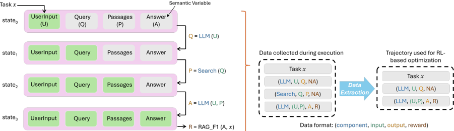
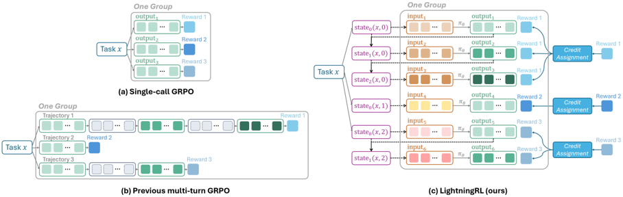
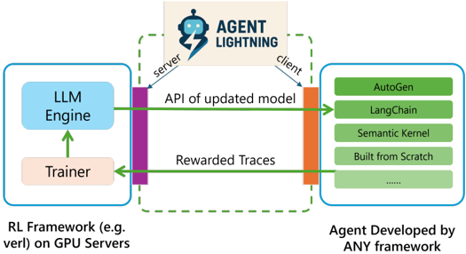
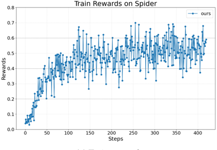
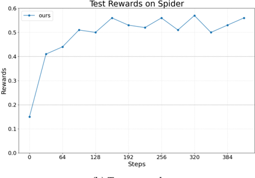
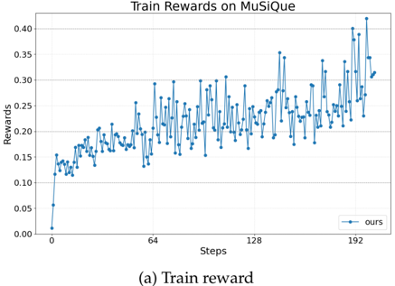
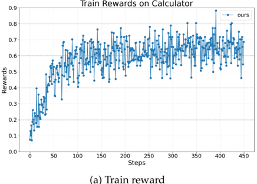
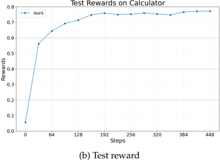
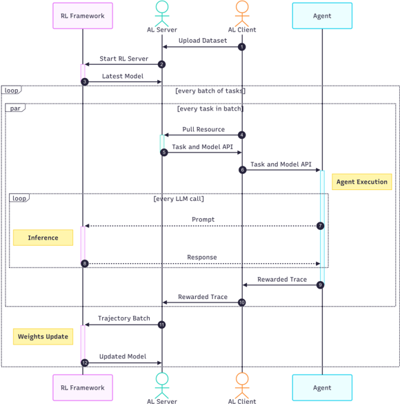

# Agent Lightning：面向AI Agents的强化学习框架深度分析报告

## 1. 摘要

本文深入分析了"Agent Lightning"框架，这是一个创新性的强化学习(RL)训练框架，专为解决大型语言模型(LLM)驱动的AI Agents在复杂任务中的训练挑战而设计。研究指出，尽管LLM Agents在搜索、代码生成和工具使用等任务中表现出色，但在多轮编码工作流、私有领域数据集或不熟悉工具等真实场景中仍面临显著局限性。Agent Lightning通过将 Agents执行建模为马尔可夫决策过程(MDP)，实现了 Agents执行与RL训练的完全解耦，使开发者几乎无需修改代码即可训练现有 Agents。该框架已在Text-to-SQL、检索增强生成(RAG)和数学问答等三个不同任务上验证了其有效性，展示了在复杂 Agents场景中稳定提升性能的能力。

 
**图1：Agent Lightning框架概述** - 一个灵活可扩展的框架，使强化学习能够应用于任何AI Agents

## 2. 研究背景与挑战

### 2.1 LLM Agents的现状与局限

近年来，大型语言模型(LLM)驱动的AI Agents在复杂任务中展现出卓越能力，包括搜索、代码生成和工具使用等。这些 Agents通过利用LLM的适应性，能够灵活应对多样化的任务需求。然而，尽管提示工程(prompt engineering)可以提升性能，LLM仍面临显著局限：

- **易错性**：在未明确训练过的场景中容易出错，如多轮编码工作流、私有领域数据集或不熟悉工具
- **可靠性不足**：难以可靠解决端到端软件开发等复杂真实任务(Liu et al., 2024)
- **泛化能力有限**：在动态交互环境中表现不稳定

### 2.2  Agents训练的必要性

研究表明，对 Agents中的模型进行训练或微调对于充分发挥LLM在这些场景中的潜力至关重要(Chen et al., 2023; Jin et al., 2025; Song et al., 2025; Maloo, 2025)。此外，在真实世界 Agents中训练模型将成为推动模型能力前沿的关键：

- **丰富的交互数据**： Agents执行过程中生成的交互数据捕捉了真实问题解决的复杂性
- **超越传统数据集**：这些真实世界经验在规模和多样性上超越传统人工整理的数据集
- **动态环境适应**：为训练更适合动态交互环境的多功能LLM提供基础

### 2.3 强化学习的优势与挑战

强化学习(RL)为优化 Agents场景中的LLM提供了强大范式，已在DeepSeekR1(Guo et al., 2025)和Kimi k1.5(Team et al., 2025)等推理模型中取得进展。相比监督学习，RL具有显著优势：

- **无需详细标注**：仅需基于结果的奖励信号，避免了复杂交互任务中稀缺且昂贵的逐步标注
- **环境反馈学习**：使 Agents能直接从环境反馈中学习理想行为
- **模拟人类学习**：试错过程与人类获取问题解决技能的方式相似

然而，将RL扩展到 Agents场景面临重大挑战：

- **算法设计挑战**：现有RL方法主要针对静态单次调用任务(如偏好对齐或数学推理)
- **系统实现挑战**： Agents执行涉及多次LLM调用、不同提示和响应，以及与外部工具、API或环境的交互
- **多样性挑战**：需要为不同应用场景设计不同的 Agents，增加了RL应用的复杂性

## 3. Agent Lightning框架设计

### 3.1 核心思想：完全解耦设计

Agent Lightning的核心创新在于实现了** Agents执行与RL训练的完全解耦**，使开发者几乎无需修改代码即可训练现有 Agents。这一设计基于以下关键理念：

- ** Agents执行作为MDP**：将 Agents执行建模为马尔可夫决策过程
- **统一数据接口**：抽象底层编排逻辑和 Agents框架细节
- **灵活的上下文构建**：支持高度定制化的优化方法

 
**图2：Agent Lightning的统一数据接口** - 左侧面板展示 Agents执行流程，右侧面板展示执行过程中收集的相应轨迹

### 3.2 MDP建模与统一数据接口

#### 3.2.1 MDP形式化表示

Agent Lightning将 Agents执行形式化为马尔可夫决策过程：

- **状态(State)**： Agents执行的当前快照，包含足够描述执行状态的变量值
- **动作(Action)**：策略LLM生成的输出，用于更新状态
- **奖励(Reward)**：评估执行结果的信号

#### 3.2.2 统一数据接口设计

基于MDP建模，框架提出统一数据接口，将 Agents轨迹结构化为转换序列：

$$\mathcal{D} = \{(s_t, a_t, r_t)\}_{t=1}^T$$

其中每个转换包含：
- 当前状态(即LLM输入)
- 动作(即LLM输出)
- 奖励

这种设计抽象了底层编排逻辑和 Agents框架细节，使其适用于**任何 Agents**。

#### 3.2.3 RAG Agents示例说明

以典型的检索增强生成(RAG) Agents为例(见图2)，其执行流程如下：

1. 用户提交任务(x)和问题(UserInput)
2.  Agents调用LLM生成基于UserInput的搜索查询(Query)
3. 搜索工具使用生成的Query检索相关段落(Passages)
4.  Agents再次调用LLM，利用检索到的Passages和原始UserInput生成最终答案(Answer)

每个状态封装了语义变量的当前值(图2中绿色矩形表示有有效值的变量，灰色矩形表示当前状态中未赋值的变量)。 Agents执行表示为有序调用序列，每个调用包含组件、输入、输出和相关奖励。

### 3.3 LightningRL算法

 
**图3：LightningRL算法说明** - (a)单次调用GRPO；(b)先前的多轮GRPO；(c)提出的LightningRL

#### 3.3.1 分层强化学习设计

LightningRL是一种分层强化学习(HRL)方法，无缝集成现有单轮RL方法，有效支持任何 Agents场景的优化：

1. **转换分解**：将轨迹分解为转换，每个转换包含当前输入/上下文、输出和奖励
2. **任务级分组**：将同一任务的转换分组进行优势估计
3. **两级信用分配**：
   - 任务级回报R首先通过信用分配模块分配给各个动作
   - 然后进一步分解为每个动作内的token级监督信号

#### 3.3.2 算法优势

LightningRL相比现有方法具有多项优势：

- **与现有RL方法兼容**：可直接使用任何单轮RL算法(如GRPO、PPO、REINFORCE++)，无需修改
- **灵活的上下文构建**：支持高度定制化的上下文构建，如LLM生成的前序步骤摘要、模板组装的结构化提示等
- **避免长序列问题**：将长轨迹分解为转换批次，缓解累积上下文导致的过长序列问题
- **无需复杂掩码**：消除对输入、损失和注意力机制的定制掩码策略需求

#### 3.3.3 信用分配机制

LightningRL采用简单但有效的信用分配策略：
- 假设任务中每个动作具有相同价值，等于最终回报R
- 未来可集成更复杂的策略，如基于启发式或学习模型的信用分配

### 3.4 训练- Agents解耦架构

 
**图4：训练- Agents解耦(Training-Agent Disaggregation)架构**

该架构实现了 Agents执行与RL训练的完全分离：
- ** Agents执行层**：负责实际 Agents逻辑和任务执行
- **数据收集层**：捕获 Agents执行过程中的状态转换
- **RL训练层**：基于收集的转换数据优化策略LLM

这种解耦设计使开发者能够专注于 Agents逻辑开发，而无需关心RL训练的复杂性。

## 4. 实验验证

### 4.1 实验设置概览

| 任务 | 框架 | 数据集 | 工具 |  Agents数量 | 微调 Agents数量 |
|------|------|--------|------|----------|--------------|
| Text-to-SQL | LangChain | Spider | SQL执行器 | 3 | 2 |
| 开放域问答 | OpenAI Agents SDK | MuSiQue | Wikipedia检索器 | 1 | 1 |
| 数学问答 | AutoGen | Calc-X | 计算器 | 1 | 1 |

**表1：实验任务和设置总结**

### 4.2 Text-to-SQL任务

#### 4.2.1 任务描述
- **数据集**：Spider(10,000+问题，200+数据库，138个领域)
- **目标**：根据自然语言问题和数据库生成SQL查询并回答问题
- ** Agents设计**：多 Agents系统(3个 Agents)
  - SQL编写 Agents：生成SQL查询
  - 检查 Agents：评估SQL查询正确性和检索信息有效性
  - 重写 Agents：根据检查结果修改查询或生成最终答案
- **微调设置**：同时优化SQL编写和重写 Agents

#### 4.2.2 实验结果

 
 
**(a) 训练奖励 (b) 测试奖励**  
**图5：Text-to-SQL任务的奖励曲线**

结果表明，Agent Lightning能够实现稳定的奖励提升，证明其在涉及代码生成和工具使用的复杂多步决策中的有效性。

### 4.3 检索增强生成(RAG)任务

#### 4.3.1 任务描述
- **数据集**：MuSiQue(多跳问答基准，2100万文档的Wikipedia)
- **目标**：生成自然语言查询检索支持文档，然后回答问题
- ** Agents设计**：单 Agents系统
  - 生成查询 → 检索文档 → 决定是否优化查询或生成答案
- **奖励设计**：$R = 0.9 \times R_{\text{correctness}} + 0.1 \times R_{\text{format}}$
  - 格式分：输出符合特定格式(如`<think>...</think>`)得1分
  - 正确分：预测答案与标准答案的词级F1分数

#### 4.3.2 实验结果

 
**图6：检索增强生成任务的奖励曲线**

结果表明，Agent Lightning在这一具有挑战性的任务上实现了稳定的性能提升，证明其在更复杂和开放的RAG场景中的有效性。

### 4.4 数学问答任务

#### 4.4.1 任务描述
- **数据集**：Calc-X
- **目标**：解决需要计算器辅助的数学问题
- ** Agents设计**：使用AutoGen框架的单 Agents系统
- **工具**：计算器

#### 4.4.2 实验结果

 
 
**(a) 训练奖励**  
**图7：计算器任务的奖励曲线**

结果进一步验证了Agent Lightning在不同任务和框架下的通用性和有效性。

## 5. 与现有方法的对比分析

 
**图8：Agent Lightning进程图**

### 5.1 传统方法的局限

现有方法(如RAGEN、Trinity-RFT、rLLM、SearchR1等)通常采用**连接(concatenation)策略**：
- 将 Agents多轮交互连接成单一长序列
- 使用掩码确保正确优化

这种方法存在以下问题：
- **架构限制**：仅适用于简单顺序工作流的 Agents，难以处理复杂模式
- **长序列问题**：累积上下文导致序列过长，超出LLM输入限制
- **定制掩码需求**：需要为输入、损失和注意力机制设计特定掩码
- **实现复杂性**：掩码策略应用困难，调试复杂，效率低下

### 5.2 Agent Lightning的四大优势

#### 5.2.1 广泛的 Agents架构支持
- **多 Agents编排**：支持复杂 Agents工作流和多 Agents系统
- **训练-部署一致性**：确保RL优化与真实世界 Agents的动态多样性保持一致
- **灵活性**：适用于各种 Agents架构，而不仅限于简单顺序工作流

#### 5.2.2 缓解累积上下文问题
- **转换级处理**：将长轨迹分解为转换批次
- **避免序列过长**：每个转换作为独立样本，显著缓解累积上下文导致的序列增长
- **计算效率**：支持批量累积等技术进行高效更新

#### 5.2.3 消除定制掩码需求
- **简化实现**：仅包含当前LLM输入，无需复杂掩码
- **保持位置连续性**：符合旋转位置编码(RoPE)等位置编码方法的假设
- **降低调试难度**：避免掩码复杂性导致的验证和调试困难

#### 5.2.4 支持高级RL算法
- **分层RL算法**：支持更有效的信用分配机制
- **算法灵活性**：为针对复杂 Agents场景的创新RL方法铺平道路
- **未来扩展性**：可集成更复杂的信用分配策略

## 6. 结论与展望

### 6.1 主要贡献总结

1. **完全解耦设计**：实现 Agents执行与RL训练的完全分离，几乎无需修改代码即可训练现有 Agents
2. **MDP建模与统一接口**：将 Agents执行形式化为MDP，提出适用于任何 Agents的统一数据接口
3. **LightningRL算法**：分层RL方法，无缝集成现有单轮RL方法，有效支持复杂 Agents场景
4. **实证验证**：在三个不同任务和框架上证明了框架的有效性和通用性

### 6.2 未来研究方向

- **更复杂的信用分配**：开发基于启发式或学习模型的高级信用分配策略
- **多LLM联合优化**：探索多 Agents强化学习(MARL)或博弈论方法优化多个LLM
- **更大规模应用**：在更复杂的端到端软件开发等真实场景中验证框架
- **算法扩展**：集成更多先进的RL算法，进一步提升 Agents性能

### 6.3 实践意义

Agent Lightning框架为AI Agents的持续优化提供了实用工具，有望：
- **提升 Agents可靠性**：解决复杂真实任务中的稳定性问题
- **加速能力发展**：利用 Agents执行中生成的丰富交互数据推动模型能力前沿
- **降低开发门槛**：使开发者能够专注于 Agents逻辑，无需深入RL训练细节

通过将LLM生成的文本标记转化为真实世界行动，Agent Lightning为实现真正智能、自适应的AI Agents系统铺平了道路，标志着从静态语言模型向动态交互式智能体的重要转变。