Powered by [MS-Agent](https://github.com/modelscope/ms-agent) | [DocResearch](https://github.com/modelscope/ms-agent/blob/main/projects/doc_research/README.md)
 

---
# Intern-S1：开源科学多模态大推理模型技术报告

 

## 1. 摘要

本文介绍**Intern-S1**，一个专为解决复杂科学任务设计的开源多模态大推理模型。该模型能够处理图像、文本和科学数据（包括非自然视觉数据、分子结构和时间序列信号），旨在弥合开源与闭源模型在科学理解与推理能力方面的差距。Intern-S1在科学领域基准测试中表现卓越，显著缩小了与闭源模型的性能差距，为加速科学发现提供了基础工具。

## 2. 背景与挑战

### 2.1 科学AI研究的重要性

科学研究所代表的人工通用智能(AGI)终极目标之一，因其推动人类社会根本性突破的潜力而备受重视。科学AI对模型提出了独特而严格的要求：

- 理解和捕捉多样但低资源分布的科学模态（从分子结构到时间序列信号）的内在规律
- 执行长期、严谨的推理过程，如假设验证和实验设计优化

### 2.2 当前开源模型的局限性

尽管开源多模态大模型和大推理模型(LRMs)在公众关注领域（如自然图像理解、数学问题解决和代码生成）已接近或部分超越闭源模型，但在高价值科学领域：

- 开源基础模型的发展显著落后于其在数学和代码等领域的进展
- 开源与闭源模型在科学领域仍存在显著差距，限制了前者对前沿研究的实质性贡献

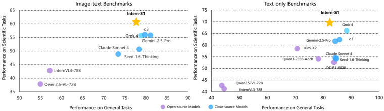 
**图1：开源和闭源模型在图像-文本和纯文本基准测试中的性能比较**  
结果显示，Intern-S1在开源模型中具有顶级的一般推理能力，并在科学领域超越闭源模型。  
- **通用基准**：MMLU-Pro（纯文本）、GPQA（纯文本）、AIME2025（纯文本）、MMMU、MMStar  
- **科学基准**：SmolInstruct（纯文本）、ChemBench（纯文本）、MatBench（纯文本）、SFE、Physics

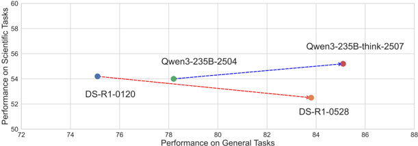 
**图2：LLM在流行和低资源（科学）任务上的性能趋势**  
- X轴：三个流行通用基准的平均值（MMLU-Pro、GPQA、AIME2025）
- Y轴：三个科学领域基准的平均值（SmolInstruct、ChemBench、MatBench）
- 尽管顶级开源LLM在流行任务上快速提升性能，但在科学任务上的表现并未同步增长

## 3. Intern-S1模型概述

Intern-S1是一个开源科学多模态模型，旨在解决复杂科学任务。其核心目标是探索一条可行的AGI发展路径，特别是在数据稀缺的科学领域。

### 3.1 核心挑战与解决方案

**关键问题**：如何以可扩展的方式增强模型处理低资源任务的能力？

**解决方案**：从预训练和后训练阶段的可扩展角度入手：

1. **预训练阶段**：构建高质量、高比例的科学数据集
2. **后训练阶段**：开发混合奖励框架(MoR)，整合多任务学习

## 4. 模型架构与技术创新

### 4.1 整体架构

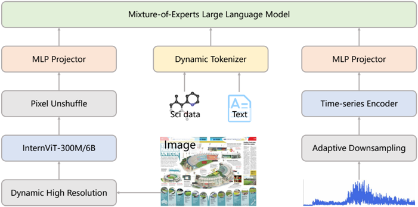 
**图3：Intern-S1架构**  
由以下组件构成：
- MoE LLM（专家混合语言模型）
- 视觉编码器（InternViT-6B用于Intern-S1，InternViT-300M用于Intern-S1-mini）
- 时间序列编码器
- 动态分词器：针对自然语言和科学输入切换分词和嵌入策略

### 4.2 视觉编码器

- **Intern-S1**：采用InternViT-6B，通过从对比预训练到LLM耦合的下一个标记预测进行增量优化，提供强大的高分辨率、细粒度视觉表示
- **Intern-S1-mini**：采用InternViT-300M，是6B教师模型的蒸馏版本，进一步使用NLP损失训练，提供高效编码器
- **处理能力**：可在固定输入大小448×448像素或动态分辨率下操作
- **视觉标记处理**：采用像素解混洗(pixel unshuffle)将视觉标记数量减少4倍，然后通过MLP投影器与语言模型嵌入空间对齐

### 4.3 动态分词器技术

#### 4.3.1 问题背景

科学数据结构（如分子式和蛋白质序列）作为标记序列处理时面临两个关键问题：

1. **分词策略单一**：静态分词器对所有序列应用相同的分割策略，导致科学领域压缩效率低下
2. **嵌入共享问题**：同一字符在不同模态中共享相同嵌入，可能偏向最频繁的用法，限制科学模态性能

#### 4.3.2 动态分词器解决方案

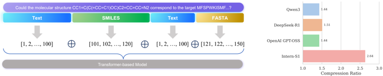 
**图4：动态分词器工作流程与压缩率比较**  
- **左图**：动态分词器工作流程
  1. 使用基于规则的检测器或用户标注的特殊标签检测输入字符串中的模式
  2. 将输入字符串分割成不同部分
  3. 每部分使用不同策略进行分词，其嵌入空间相互正交
  4. 将这些向量连接作为常规Transformer输入
- **右图**：不同分词器在科学数据（SMILES格式）上的压缩率比较
  - Intern-S1比其他模型（GPTOSS-120B、Deepseek-R1、Qwen3系列）高出70%以上

#### 4.3.3 压缩率计算

分词效率通过字符每标记(Characters-per-Token)量化：

$$
CR(\tau, D) = \frac{\sum_{x \in D} \text{len}(x)}{\sum_{x \in D} |\tau(x)|}
$$

其中字符串长度以Unicode字符测量。

Intern-S1目前支持四种模态（未来计划扩展），每种模态可通过特殊标签标记（如`<FASTA>`、`<SMILES>`），并使用启发式规则和领域特定工具（如RDKit）自动检测分子和蛋白质字符串。

## 5. 训练数据处理

### 5.1 PDF文档解析

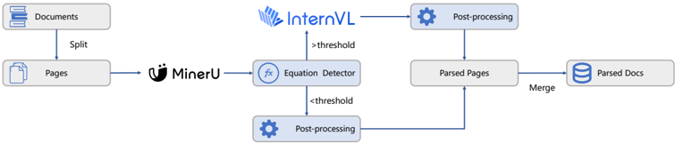 
**图7：PDF文档解析流程**  
- 将PDF文档拆分为页面，使用低成本解析器获取文本数据
- 采用方程和符号标记检测器检查页面是否需要通过高成本解析器(VLMs)进行高级处理
- 低/高成本解析器的后处理不同，因为它们有专门的错误案例模式
- 所有解析页面合并为单一数据样本

**关键发现**：
- 解析质量对PDF文档至关重要，尤其对包含大量方程和符号的科学领域
- 无现有解析工具能完美处理所有PDF类型，成本差异大
- 采用页面级解析管道：先用低成本解析器(MinerU)，再根据方程/符号数量决定是否使用高成本解析器(VLMs)
- 高成本解析器速度比低成本慢20倍，仅对5%（存档库）或3%（网络爬取）的页面使用

### 5.2 基于域的网络数据解析

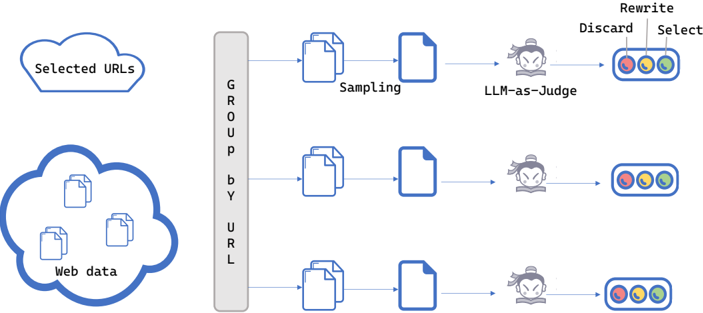 
**图8：基于域的网络数据解析流程**  
- 按URL地址对网页分组
- 对每个URL域，采样数百个页面并输入LLM分类器
- 根据所有采样页面的分类结果，按启发式规则做决策
- 三种可能操作：
  1. 丢弃：如果质量低且信息不足
  2. 重写：如果质量低但内容信息丰富
  3. 选择：作为训练数据候选

**动机**：同一URL域的页面通常共享特征（如解析问题），而LLM分类器成本高，域级解析可在可接受成本下识别结构模式。

### 5.3 科学数据召回与过滤

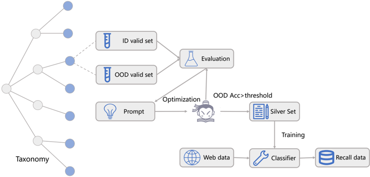 
**图9：科学数据召回与过滤流程**  
- 根据涵盖各种科学和通用领域的分类法，为每个目标域构建专门的召回和过滤管道
- 准备域内和域外验证集以自动优化提示
- 提示触发LLM注释大型银集，训练低成本分类器过滤网络数据池

**效果**：手动评估显示，六个目标域中目标域数据比例从2%提高到50%。

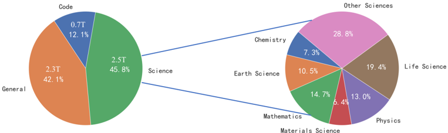 
**图6：文本CPT数据总体统计**  
- **左图**：继续预训练5T高质量文本标记，其中科学数据占2.5T以上
- **右图**：重点关注的六个科学领域分布（如生命科学采用严格过滤，材料科学采用宽松过滤）

### 5.4 多模态科学数据管道

在图像-文本继续预训练(CPT)阶段，构建两类数据集：
1. 交错图像-文本数据集
2. 纯文本数据集

**数据来源**：
- InternVL3的多模态预训练语料库（涵盖图像描述、通用问答、数学、图表等）
- 第4.1.1节描述的文本语料库
- 多模态科学数据（覆盖专业领域）

**总训练标记**：约2500亿，包括700亿语言数据和1800亿交错图像-文本数据（其中科学数据300亿）。

## 6. 训练策略

### 6.1 批量大小策略

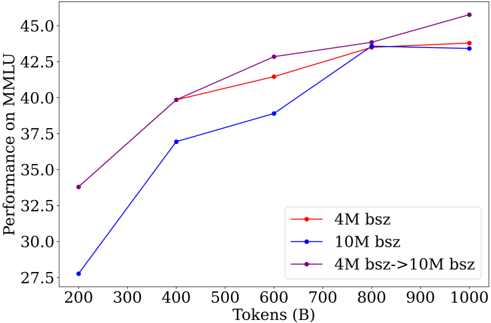 
**图10：不同批量大小策略的性能趋势**  
- 红/蓝线：训练过程中使用固定批量大小
- 紫线：训练4000亿标记后，批量大小从4M切换到10M

**发现**：
- 早期阶段（前7000亿标记），小批量训练的模型优于大批量训练的模型
- 大批量提供更高训练效率
- 最佳策略：分阶段训练，初期采用小批量，后期切换到大批量

### 6.2 起始点选择

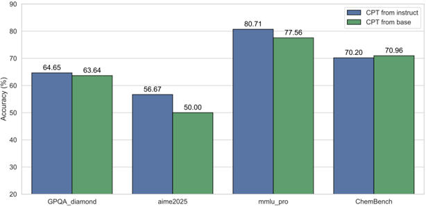 
**图11：选择不同起点（基础模型和指令模型）的比较**

**研究结论**：
- 指令模型在编码基准上表现略好
- 指令模型作为CPT起点在最终性能上可接受
- 当后训练显著提升模型能力时，指令模型是更好的选择（但仅在特定领域观察到此效果）
- 基础模型初始熵略高（0.19 vs 0.15），但可通过RL超参数调整缓解

### 6.3 混合奖励框架(MoR)

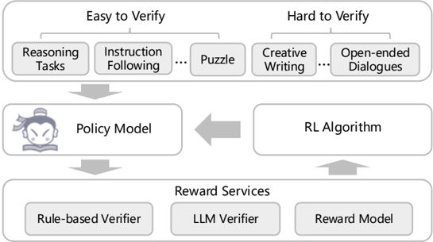 
**图12：混合奖励框架**  
- 整合来自1000多个任务的多样化奖励信号
- 使模型同时获得领域专业化和通用能力
- 通过跨任务策略优化，保持专业任务高性能，同时保持开放对话场景的鲁棒性和适应性

### 6.4 混合数据过滤策略

**离线过滤阶段**：
- 使用小型密集SFT模型和大型MoE SFT模型对原始数据集进行rollout
- 每个问题生成8次，与参考解决方案比较计算通过率$\hat{r}$
- 丢弃$\hat{r}_{dense}(x) = 1.0$（过于简单）和$\hat{r}_{dense}(x) \leq 0.25$（噪声数据）的问题

**在线过滤阶段**：
- 每个问题以8次rollout为一组处理
- 过滤所有rollout完全正确或完全错误的轨迹
- 移除包含乱码文本或无限重复的错误样本

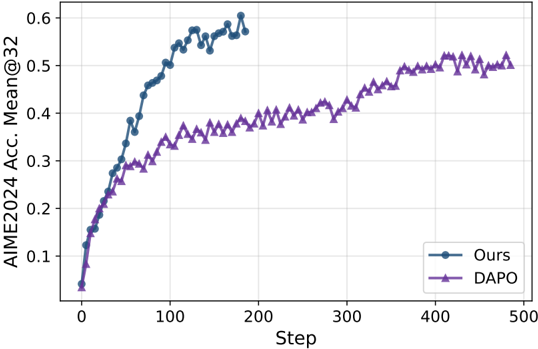 
**图13：与DAPO策略的比较**  
- 使用本文策略的模型在AIME2024评估集上比DAPO过滤方法有显著更快的改进

### 6.5 熵控制

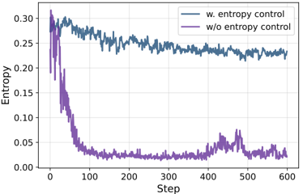 
**图14：有无熵控制的Intern-S1 MoE模型的熵和平均验证集准确率**  
- 采用KL-Cov熵控制策略，保持训练过程中的探索
- 设置效果标记比$k$为0.2，KL系数$\beta$为0.01
- 模型熵保持在约0.2，正确率在多个评估集上持续上升

## 7. 实验结果

### 7.1 评估设置

**解码参数**：

| 参数 | Intern-S1 | Intern-S1-mini |
|------|-----------|----------------|
| max tokens | 65536 | 65536 |
| temperature | 0.7 | 0.8 |
| top p | 0.95 | 0.95 |
| top k | 50 | 50 |
| repetition penalty | 1.0 | 1.0 |

**表1：评估中使用的解码参数**

### 7.2 一般推理能力评估

**图5：Intern-S1的四个训练阶段**  
仅第一阶段在单一模态上训练

**表2：Intern-S1在一般推理基准测试上的定量性能**

| 模型类型 | 指标 | Intern-S1 | 最佳闭源模型 | 最佳开源模型 |
|----------|------|-----------|--------------|--------------|
| **闭源API模型** | MMLU-Pro | - | 86.0 (Gemini-2.5 Pro) | - |
|  | GPQA | - | 83.8 (Gemini-2.5 Pro) | - |
|  | AIME2025 | - | 88.9 (OpenAI o3) | - |
|  | IFEval | - | 92.2 (OpenAI o3) | - |
|  | MathVista | - | 80.3 (Gemini-2.5 Pro) | - |
|  | MMMU | - | 81.9 (Gemini-2.5 Pro) | - |
|  | MathVision | - | 73.0 (Gemini-2.5 Pro) | - |
|  | MMStar | - | 79.3 (Gemini-2.5 Pro) | - |
| **开源LLM** | MMLU-Pro | **83.5** | 86.0 | 83.5 |
|  | GPQA | **77.3** | 83.8 | 77.3 |
|  | AIME2025 | **86.0** | 88.9 | 86.0 |
|  | IFEval | **86.7** | 92.2 | 86.7 |
|  | MathVista | **81.5** | 80.3 | 81.5 |
|  | MMMU | **77.7** | 81.9 | 77.7 |
|  | MathVision | **62.5** | 73.0 | 62.5 |
|  | MMStar | **74.9** | 79.3 | 74.9 |

**关键发现**：
- Intern-S1是所有八项任务中表现最佳的开源多模态模型
- 在MathVista上取得最佳结果(81.5)
- 显著优于先前开源MLLM（如MathVista：比InternVL3-78B/Qwen2.5VL-72B高+2.5/+6.7）
- 在纯文本GPQA和IFEval上仍落后于领先API模型，但在AIME2025上具有竞争力

### 7.3 科学领域推理能力评估

**表3：Intern-S1在科学相关基准测试（纯文本）上的定量性能**

| 模型类型 | 指标 | Intern-S1 | 最佳闭源模型 | 最佳开源模型 |
|----------|------|-----------|--------------|--------------|
| **闭源API模型** | SmolInstruct | - | 47.3 (Grok-4) | - |
|  | ChemBench | - | 83.3 (Grok-4) | - |
|  | MatBench | - | 67.9 (Grok-4) | - |
|  | ProteinLMBench | - | 67.7 (OpenAI o3) | - |
| **开源LLM** | SmolInstruct | **51.0** | 47.3 | 51.0 |
|  | ChemBench | **83.4** | 83.3 | 83.4 |
|  | MatBench | **75.0** | 67.9 | 75.0 |
|  | ProteinLMBench | **63.1** | 67.7 | 63.1 |

**表4：Intern-S1在科学相关基准测试（多模态）上的定量性能**

| 模型类型 | 指标 | Intern-S1 | 最佳闭源模型 | 最佳开源模型 |
|----------|------|-----------|--------------|--------------|
| **闭源API模型** | SFE | - | 44.3 (Intern-S1) | - |
|  | Physics | - | 47.9 (OpenAI o3) | - |
|  | MicroVQA | - | 63.9 (Intern-S1) | - |
|  | MSEarthMCQ | - | 65.7 (Intern-S1) | - |
|  | XLRS-Bench | - | 55.0 (Intern-S1) | - |
| **开源LLM** | SFE | **44.3** | 44.3 | 44.3 |
|  | Physics | **44.0** | 47.9 | 44.0 |
|  | MicroVQA | **63.9** | 63.9 | 63.9 |
|  | MSEarthMCQ | **65.7** | 65.7 | 65.7 |
|  | XLRS-Bench | **55.0** | 55.0 | 55.0 |

**关键发现**：
- **纯文本科学基准**：Intern-S1在四个数据集中的三个上取得最佳结果（SmolInstruct 51.0、ChemBench 83.4、MatBench 75.0），大幅领先先前开源MLLM（如MatBench：比InternVL3-78B高+25.7）
- **多模态科学基准**：Intern-S1在5个数据集中的4个上取得最佳结果（SFE 44.3、MicroVQA 63.9、MSEarthMCQ 65.7、XLRS-Bench 55.0），在Physics上排名第二（44.0 vs o3的47.9）
- 与开源基线相比，增益一致且显著

### 7.4 Intern-S1-mini性能评估

**表5：Intern-S1-mini在一般推理基准测试上的定量性能**

| 模型 | MMLU-Pro | GPQA | AIME2025 | IFEval | MathVista | MMMU | MathVision | MMStar |
|------|----------|------|----------|--------|-----------|------|------------|--------|
| Qwen3-8B | 73.7 | 62.0 | 67.3 | 85.0 | - | - | - | - |
| GLM-4.1V-Thinking | 57.1 | 50.3 | 32.0 | 71.5 | 80.7 | 69.9 | 53.9 | 71.5 |
| MiMo-VL-7B-RL-2508 | 73.9 | 60.4 | 64.4 | 71.4 | 79.4 | 70.6 | 38.1 | 72.9 |
| **Intern-S1-mini** | **74.8** | **65.2** | **80.0** | **81.2** | **70.3** | **72.3** | **51.4** | **65.2** |

**表6：Intern-S1-mini在科学相关基准测试（纯文本）上的定量性能**

| 模型 | SmolInstruct | ChemBench | MatBench | ProteinLMBench |
|------|--------------|-----------|----------|----------------|
| Qwen3-8B | 17.6 | 61.1 | 45.2 | 59.1 |
| GLM-4.1V-Thinking | 18.1 | 56.2 | 54.3 | 58.3 |
| MiMo-VL-7B-RL-2508 | 16.1 | 66.8 | 46.9 | 59.8 |
| **Intern-S1-mini** | **32.2** | **76.5** | **61.6** | **63.1** |

**表7：Intern-S1-mini在科学相关基准测试（多模态）上的定量性能**

| 模型 | SFE | Physics | MicroVQA | MSEarthMCQ | XLRS-Bench |
|------|-----|---------|----------|------------|------------|
| GLM-4.1V-Thinking | 43.2 | 28.3 | 50.2 | 50.3 | 49.8 |
| MiMo-VL-7B-RL-2508 | 43.9 | 28.2 | 51.0 | 47.3 | 12.3 |
| **Intern-S1-mini** | **35.8** | **28.8** | **56.6** | **58.1** | **51.6** |

**关键发现**：
- Intern-S1-mini在一般推理和科学领域基准测试中均优于同类开源模型
- 在科学任务上表现尤为突出，如ChemBench达到76.5，MatBench达到61.6
- 证明了模型架构和训练方法的有效性在不同规模模型上的可迁移性

## 8. 结论与展望

### 8.1 主要贡献

1. **科学多模态模型**：Intern-S1是首个专注于科学领域的开源多模态大推理模型，在科学基准测试中显著缩小了与闭源模型的差距
2. **动态分词器**：创新性地解决了科学数据处理中的分词和嵌入问题，压缩率提高70%以上
3. **数据处理管道**：开发了高质量的PDF解析、基于域的网络数据解析和科学数据召回过滤方法
4. **混合奖励框架**：实现了1000多个任务的同时学习，平衡了专业能力和通用性

### 8.2 未来展望

- 扩展支持的科学模态类型
- 优化模型在指令遵循约束方面的表现
- 进一步缩小与闭源模型在通用推理任务上的差距
- 探索模型在实际科学发现中的应用

Intern-S1代表了向AGI迈进的重要一步，特别是在数据稀缺的科学领域。通过开源这一模型，研究社区可以共同推进科学AI的发展，加速人类社会的根本性突破。