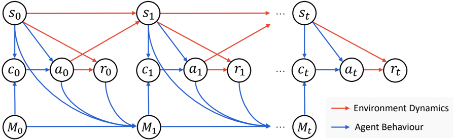
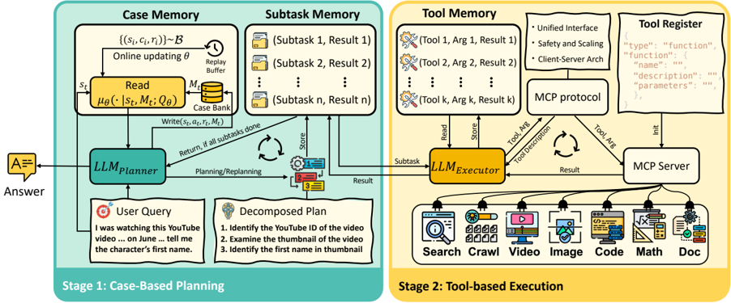
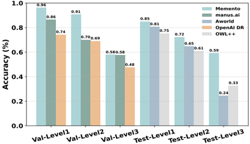
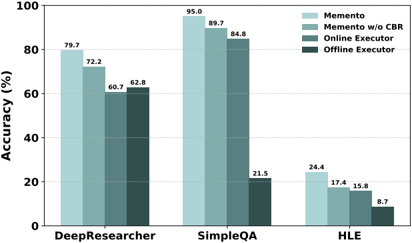
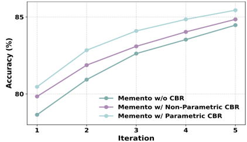
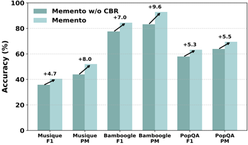
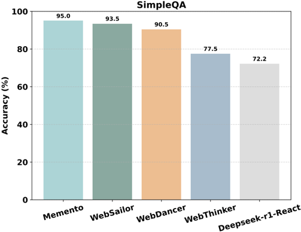
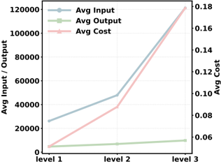
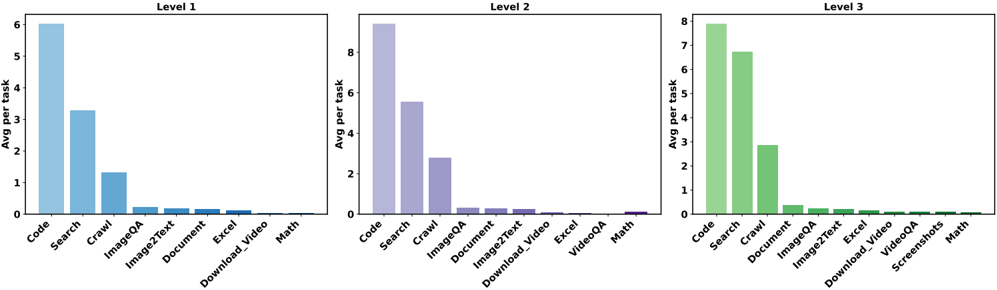

# Memento：无需微调的自适应LLM Agents

## 1. 研究概述

### 1.1 研究背景与问题

当前基于大型语言模型的智能体系统（LLM Agents)面临两大挑战：
- **僵化性问题**：现有方法多依赖静态、手工设计的反思工作流，缺乏灵活性
- **计算成本问题**：需要对LLM参数进行梯度更新，计算资源消耗大

### 1.2 研究目标

提出一种新型学习范式，使LLM Agents能够：
- 无需微调底层LLM即可实现持续适应
- 通过低计算成本实现在线学习
- 有效处理分布外任务

### 1.3 主要贡献

- 提出**记忆增强马尔可夫决策过程**(M-MDP)框架
- 设计基于案例的推理(CBR)机制，实现无需参数更新的持续学习
- 实现**Memento** Agents，在GAIA验证集上达到**87.88% Pass@3**，测试集上**79.40%**
- 在DeepResearcher数据集上达到**66.6% F1**和**80.4% PM**，超越现有基于训练的方法
- 在分布外任务上，基于案例的记忆带来**4.7%~9.6%**的绝对性能提升

## 2. 方法论

### 2.1 问题形式化：记忆增强马尔可夫决策过程(M-MDP)

定义3.1 (记忆增强马尔可夫决策过程)：M-MDP是一个元组⟨𝒮, 𝒜, 𝒫, ℛ, γ, ℳ⟩，其中：
- 𝒮是状态空间
- 𝒜是动作空间
- 𝒫: 𝒮 × 𝒜 → ∆(𝒮)是转移动态
- ℛ: 𝒮 × 𝒜 → ℝ是奖励函数
- γ ∈ [0, 1)是折扣因子
- ℳ = (𝒮 × 𝒜 × ℝ)*是记忆空间

 
**图2：基于记忆的马尔可夫决策过程的图形模型**

关键区别在于引入了记忆空间作为过去经验的集合。在CBR Agents设置中，状态空间和动作空间都被定义为预定义词汇表𝒱上所有有限长度序列的集合。

### 2.2 案例库(Case Bank)设计

在时间步t，维护案例库$M_t = \{c_i\}_{i=1}^{N_t}$，每个案例$c_i$是一个元组$(s_i, a_i, r_i)$，$N_t$是当前案例库中的案例数量。

给定当前状态$s_t$，CBR Agents首先检索案例$c_t \sim \mu(\cdot|s_t, M_t)$，然后通过LLM重用和调整它，即$a_t \sim p_{\text{LLM}}(\cdot|s_t, c_t)$。其中$\mu$表示案例检索策略。

### 2.3 案例推理 Agents定义

定义3.2 (案例推理 Agents)：基于当前状态和有限记忆的过去经验做出决策的 Agents。形式化定义为：

$$\pi(a|s,M) = \sum_{c \in M} \mu(c|s,M) \cdot p_{\text{LLM}}(a|s,c)$$

轨迹$\tau$可描述为：$\tau = \{M_0, s_0, c_0, a_0, r_0, M_1, s_1, c_1, a_1, r_1, \cdots\}$

轨迹采样概率为：

$$p(\tau) = \prod_{t=0}^{T-1} I(M_{t+1} = M_t \cup \{(s_t,a_t,r_t)\}) \cdot I(r_t = \mathcal{R}(s_t,a_t)) \cdot \mu(c_t|s_t,M_t) \cdot p_{\text{LLM}}(a_t|s_t,c_t)$$

### 2.4 基于软Q学习的CBR Agents优化

为优化CBR策略$\pi$，目标是学习案例检索策略$\mu$，同时保持LLM组件$p_{\text{LLM}}$固定。应用最大熵RL框架，优化目标为：

$$J(\mu) = \mathbb{E}_{\tau \sim p_\mu} \left[ \sum_{t=0}^{T-1} r(s_t,a_t) + \alpha \mathcal{H}(\mu(\cdot|s_t,M_t)) \right]$$

其中$\alpha$是熵权重，$\mathcal{H}$是策略熵。

### 2.5 基于状态相似性的Q学习增强

为解决自然语言形式的复杂状态和案例描述带来的挑战，提出通过基于核的估计来近似Q值：

$$Q(s,c) \approx f_\theta(s,c) = \sum_{(s_i,c_i,Q_i) \in \mathcal{D}_c} w_i Q_i, \quad w_i = \frac{k_\theta(s,s_i)}{\sum_{s_j \in \mathcal{D}_c} k_\theta(s,s_j)}$$

其中$\mathcal{D}_c = \{(s_i,c_i,Q_i) \in \mathcal{D}: c_i = c\}$表示在情节记忆$\mathcal{D}$中具有相同检索案例$c$的过去交互。

### 2.6 Memento架构

 
**图3：具有参数化记忆的Memento架构**

Memento实现为一个**规划-执行器框架**，在基于案例的规划(阶段1)和基于工具的执行(阶段2)之间交替：
- **规划器**：基于LLM的CBR Agents，由案例记忆模块增强
  - **写入**：记录新案例并在线优化Q函数
  - **读取**：通过学习的检索策略检索案例以进行自适应案例选择
- **执行器**：基于LLM的MCP客户端，通过MCP协议调用MCP服务器上托管的外部工具

## 3. 实验设置

### 3.1 基准测试

- **GAIA**：评估长视野规划、工具编排和执行能力
- **DeepResearcher**：测试实时网络研究、证据检索、跨页面综合和多跳推理
- **Humanity's Last Exam (HLE)**：评估人类知识前沿和长尾专业领域中的复杂推理能力
- **SimpleQA**：评估单跳事实问答中的可靠性和抗幻觉能力

### 3.2 评估指标

- **精确匹配(EM)**：用于GAIA，要求预测与标准答案完全匹配
- **宏F1分数**：用于DeepResearcher、SimpleQA和HLE数据集
- **部分匹配(PM)**：表示LLM生成答案与黄金答案之间的部分语义匹配分数

### 3.3 实验配置

- **规划器**：GPT-4.1
- **执行器**：o4-mini
- **工具**：搜索引擎、浏览器等MCP工具
- **案例库**：从零开始初始化，迭代存储成功和失败的轨迹

## 4. 实验结果

### 4.1 主要性能结果

 
 
 
**图1：Memento在基线、基准、记忆设计和泛化方面的评估概述**

#### GAIA基准测试结果

 
**表2：截至2025年6月26日GAIA排行榜的顶级结果**

| 验证数据集 | 模型家族 | 平均分数(%) | Level 1(%) | Level 2(%) | Level 3(%) |
|------------|----------|------------|------------|------------|------------|
| Memento (Pass@3) | GPT4.1, o3 | 87.88 | 96.23 | 90.70 | 61.54 |
| Alita | Claude 4 Sonnet, GPT-4o | 87.27 | 88.68 | 89.53 | 76.92 |
| Skywork Super Agents v1.1 | skywork-agent, Claude 3.7 Sonnet, Whisper | 82.42 | 92.45 | 83.72 | 57.69 |

| 测试数据集 | 模型家族 | 平均分数(%) | Level 1(%) | Level 2(%) | Level 3(%) |
|------------|----------|------------|------------|------------|------------|
| Su Zero Ultra | - | 80.40 | 93.55 | 77.36 | 65.31 |
| h2oGPTe Agent v1.6.33 | Claude 3.7 Sonnet, Gemini 2.5 Pro | 79.73 | 89.25 | 79.87 | 61.22 |
| **Memento** | **GPT4.1, o3** | **79.40** | **90.32** | **75.47** | **71.43** |

- Memento在验证集上获得**Top-1**排名，在测试集上排名**第4**
- 超越大多数现有 Agents框架，包括Manus、Aworld和OWL

#### DeepResearcher数据集结果

 
**表1：在七个开放域QA数据集上prompt-based、training-based和我们的方法的性能比较**

| 方法 | NQ.F1 | NQ.PM | TQ.F1 | TQ.PM | HotpotQA.F1 | HotpotQA.PM | ... | Avg.F1 | Avg.PM |
|------|-------|-------|-------|-------|-------------|-------------|-----|--------|--------|
| Prompt Based | - | - | - | - | - | - | ... | 59.9 | 72.2 |
| CoT | 19.8 | 32.0 | 45.6 | 48.2 | 24.4 | 27.9 | ... | 23.6 | 26.1 |
| CoT + RAG | 42.0 | 59.6 | 68.9 | 75.8 | 37.1 | 43.8 | ... | 37.7 | 43.2 |
| DeepResearcher | 39.6 | 61.9 | 78.4 | 85.0 | 52.8 | 64.3 | ... | 51.8 | 60.5 |
| **Memento** | **42.0** | **74.6** | **85.5** | **93.9** | **66.5** | **81.6** | ... | **66.6** | **80.4** |

- Memento在七个DeepResearcher基准测试上达到平均**66.6% F1**，几乎是CoT + RAG基线(37.7% F1)的两倍
- 在Musique和Bamboogle等复杂多跳推理任务上表现尤为突出

#### HLE和SimpleQA结果

**图4：在SimpleQA和HLE上的性能**

- **HLE**：Memento达到**24.4% PM**，排名第二，仅比GPT5(25.32%)低0.92分
- **SimpleQA**：Memento达到**95.0%**准确率，超越WebSailor(93.5%)、WebDancer(90.5%)等基线

### 4.2 消融研究

**表5：三个基准上的消融结果**

| 方法 | Humanities/SC | Math | Chemistry | ... | Avg |
|------|---------------|------|-----------|-----|-----|
| Offline Executor | 5.2/9.6 | 7.1/5.8 | 2.3/7.9 | ... | 6.4/8.7 |
| Online Executor | 10.8/24.9 | 13.1/16.0 | 6.9/9.3 | ... | 11.2/15.8 |
| Memento w/o CBR | 25.5/29.2 | 24.9/16.3 | 17.4/21.1 | ... | 22.2/17.4 |
| **Memento** | **28.4/33.0** | **30.9/24.2** | **18.7/22.7** | ... | **26.7/24.4** |

- 从离线执行器到在线工具通常减少幻觉并提高F1和PM分数
- 引入规划(Memento w/o CBR)带来稳健提升(HLE: +11.0/+1.6, SimpleQA: +32.5/+4.9)
- 案例推理提供一致的附加改进(HLE: +4.5/+7.0, SimpleQA: +3.7/+5.3)

### 4.3 分布外泛化能力

**图1(d)：Memento在分布外数据集上的准确率提升**

- 在分布外任务上，基于案例的记忆带来**4.7%~9.6%**的绝对性能提升
- 这表明记忆机制能有效提升模型在未见过任务上的泛化能力

### 4.4 持续学习曲线

**图1(c)：不同记忆设计的持续学习曲线**

| 基线 | Iter 1 | Iter 2 | Iter 3 | Iter 4 | Iter 5 |
|------|--------|--------|--------|--------|--------|
| Memento w/o CBR | 78.65 | 80.93 | 82.62 | 83.53 | 84.47 |
| Memento w/ Non-Parametric CBR | 79.84 | 81.87 | 83.09 | 84.03 | 84.85 |
| **Memento w/ Parametric CBR** | **80.46** | **82.84** | **84.10** | **84.85** | **85.44** |

- 完整的Memento架构在所有迭代中始终优于消融版本
- 移除CBR会导致性能明显下降，证明参数化CBR和非参数化CBR组件的有效性

**表3：Memento在DeepResearcher数据集上不同案例数量的性能**

| 数据集 | K=0.F1 | K=0.PM | K=1.F1 | K=1.PM | K=2.F1 | K=2.PM | ... | K=32.F1 | K=32.PM |
|--------|--------|--------|--------|--------|--------|--------|-----|---------|---------|
| NQ | 39.5 | 67.8 | 41.1 | 74.4 | 41.3 | 72.7 | ... | 42.2 | 75.4 |
| TQ | 81.1 | 89.1 | 86.1 | 93.8 | 86.2 | 93.9 | ... | 85.5 | 93.9 |
| HotpotQA | 62.0 | 76.0 | 65.4 | 80.7 | 65.7 | 81.3 | ... | 66.4 | 83.2 |
| **Average** | **59.9** | **72.2** | **63.6** | **77.9** | **63.7** | **78.1** | ... | **63.9** | **78.1** |

- 随着案例数量增加，性能持续提升，但收益递减
- K=1时已有显著提升，K=4后提升趋于平缓

### 4.5 效率分析

 
**图6：GAIA上的令牌成本**

- **输入令牌**随任务难度急剧增加：
  - Level 1：26k输入令牌，4.7k输出令牌
  - Level 2：48k输入令牌，6.9k输出令牌
  - Level 3：121k输入令牌，9.8k输出令牌
- **输出令牌**在任务级别间保持稳定，表明系统有效控制生成长度
- 复杂场景中的主要计算负担来自整合和分析多步工具输出

 
**图5：每个任务类型在各难度级别的平均数量**

- 随着难度级别增加，代码、搜索和爬取任务占主导地位
- Level 3任务需要更长的推理范围和高级工具协调

## 5. 讨论与分析

### 5.1 与其他记忆机制的比较

**表7：记忆机制的详细比较**

| 方法 | 核 | 神经Q | Q函数 | 读取 | 写入 | 梯度 |
|------|-----|-------|-------|------|------|------|
| 表格Q学习 | 无 | 无 | Q表 | 精确匹配 | Eq. (8) | - |
| 深度Q学习 | 无 | 有 | 神经网络 | Eq. (7) | Eq. (24) | Eq. (25) |
| 神经情节控制 | 有 | 无 | Eq. (9) | Eq. (7) | Eq. (10) | Eq. (11) |
| 非参数记忆 | 无 | 无 | 无 | Eq. (13) | Eq. (12) | - |
| **参数记忆** | **无** | **有** | **神经网络** | **Eq. (16)** | **Eq. (15)** | **Eq. (26)** |

- **表格Q学习**：在离散空间中有效，但无法泛化
- **深度Q学习**：通过共享参数实现泛化，但优化不稳定且数据需求大
- **神经情节控制**：通过可学习核正则化值估计，平衡泛化与稳定性
- **Memento参数记忆**：在保持数据高效适应的同时实现状态空间泛化

### 5.2 方法优势与局限性

**优势**：
- **无需微调**：避免了LLM参数更新的高计算成本
- **持续学习**：通过记忆机制实现在线适应
- **分布外泛化**：在未见过的任务上表现优异
- **模块化设计**：规划器与执行器分离，便于扩展

**局限性**：
- **案例库饱和**：约3k训练数据后性能提升有限
- **Level 3任务挑战**：需要更长推理范围和高级工具协调的任务仍有困难
- **依赖基础模型**：在缺乏足够领域知识的情况下，难以处理专业级任务

## 6. 结论

Memento提出了一种创新的自适应LLM Agents学习范式，通过基于记忆的在线强化学习实现无需微调的持续适应：

1. **理论贡献**：形式化了记忆增强马尔可夫决策过程(M-MDP)，为LLM Agents提供理论基础
   
2. **技术贡献**：
   - 设计了案例库(Case Bank)机制存储和利用过去经验
   - 提出记忆读写机制实现策略的持续改进
   - 实现了规划-执行器框架，有效整合工具使用

3. **实证贡献**：
   - 在GAIA验证集上达到**87.88% Pass@3**，测试集上**79.40%**
   - 在DeepResearcher数据集上达到**66.6% F1**和**80.4% PM**
   - 在分布外任务上带来**4.7%~9.6%**的绝对性能提升

4. **实践意义**：
   - 为开发能够连续、实时学习的通用LLM Agents提供了可扩展且高效的途径
   - 推动机器学习向开放式技能获取和深度研究场景发展

Memento证明了无需参数更新的持续学习是可行的，为LLM Agents研究开辟了新方向。代码已在[https://github.com/Agent-on-the-Fly/Memento](https://github.com/Agent-on-the-Fly/Memento)公开。