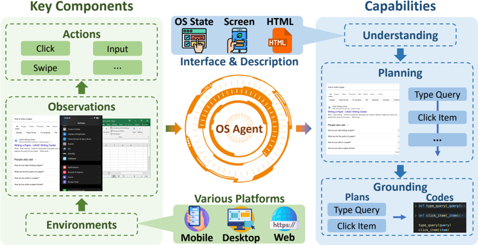
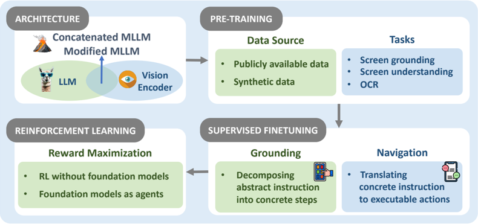
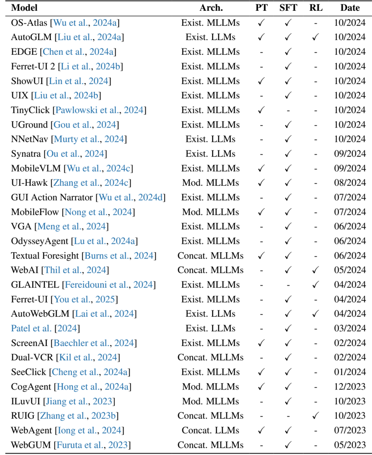
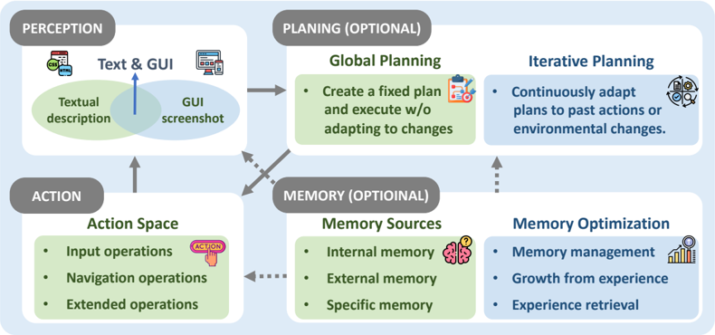
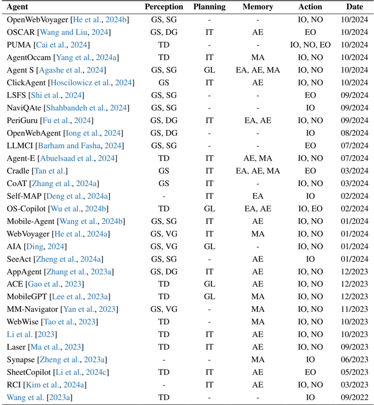
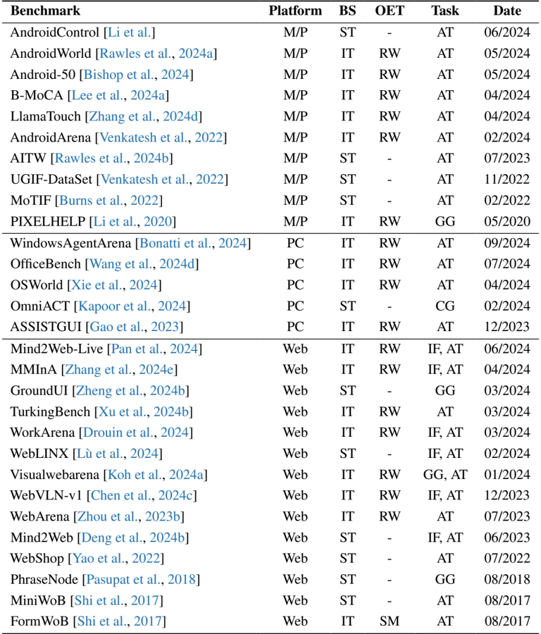

# OS Agents研究综述报告

## 1. 引言与基础

### 1.1 OS Agents定义

OS Agents（操作系统代理）是指能够理解、交互和操作操作系统界面（包括GUI、命令行等）的智能代理系统。这类代理通过感知操作系统环境、规划任务执行路径、记忆历史交互信息并执行具体操作，实现对计算机系统的自主控制。

### 1.2 OS Agents基础组件

 

**Figure 1: OS Agents基础框架**

如图1所示，OS Agents的核心基础包括两个主要方面：
- **基础模型**：提供语言理解、推理和生成能力
- **代理框架**：实现感知、规划、记忆和行动的闭环系统

OS Agents的关键能力在于能够将自然语言指令转化为对操作系统界面的具体操作，实现人机交互的自动化。

## 2. OS Agents构建方法

### 2.1 基础模型

 

**Figure 2: OS Agents基础模型构建方法**

#### 2.1.1 架构设计

OS Agents的基础模型架构主要分为四类：
- **现有模型(Existing)**：直接使用现有的多模态语言模型(MLLMs)或大型语言模型(LLMs)
- **修改模型(Modified)**：对现有模型进行架构调整以适应OS环境
- **拼接模型(Concatenated)**：将多个模型组件拼接形成完整系统
- **专用架构**：为OS任务专门设计的新型架构

#### 2.1.2 训练策略

基础模型的训练策略主要包括：

| 训练策略 | 描述 | 代表工作 |
|---------|------|---------|
| **预训练(Pre-training)** | 在大规模OS相关数据上进行预训练 | ScreenAI, TinyClick |
| **监督微调(Supervised Fine-tuning)** | 使用人工标注的OS操作数据进行微调 | UIX, Ferret-UI 2 |
| **强化学习(Reinforcement Learning)** | 通过与环境交互获得奖励信号进行优化 | GLAINTEL, WebAI |

 

**Table 1: 近期OS Agents基础模型概览**

该表格详细列出了40余种OS Agents基础模型，按时间顺序从2017年至今。主要发现：
- 近两年(2023-2024)研究爆发式增长，占全部模型的90%以上
- 多模态语言模型(MLLMs)是主流架构选择(占比约75%)
- 监督微调(SFT)是最常用的训练策略(占比约85%)
- 强化学习(RL)应用逐渐增多，但占比仍较低(约20%)

### 2.2 代理框架

 

**Figure 3: OS Agents代理框架组件**

OS Agents的代理框架由四个核心组件构成，形成完整的感知-规划-记忆-行动闭环：

#### 2.2.1 感知(Perception)

感知组件负责收集和分析操作系统环境信息，主要分为两类：

- **文本描述(Textual Description)**：将OS状态转换为文本描述
  - 代表工作：MobileGPT, ACE, Laser
  - 优势：与LLM原生兼容
  - 局限：丢失视觉信息

- **GUI截图(GUI Screenshots)**：直接处理界面视觉信息
  - 代表工作：OSCAR, AppAgent, Mobile-Agent
  - 优势：保留完整界面信息
  - 局限：需要多模态处理能力

此外，还有**视觉定位(Visual Grounding)**、**语义定位(Semantic Grounding)**和**双定位(Dual Grounding)**等高级感知技术。

#### 2.2.2 规划(Planning)

规划组件负责制定任务执行策略，主要方法包括：

- **全局规划(Global Planning)**：一次性生成完整任务计划
- **迭代规划(Iterative Planning)**：逐步生成并调整执行计划
- **分层规划(Hierarchical Planning)**：将任务分解为子任务序列

代表工作：OS-Copilot(全局规划)、AppAgent(迭代规划)、Thil等(分层规划)

#### 2.2.3 记忆(Memory)

记忆组件管理历史交互信息，主要技术包括：

- **经验增强(Experience-Augmented)**：存储成功/失败案例
- **自动化探索(Automated Exploration)**：主动收集新经验
- **记忆管理(Memory Management)**：优化记忆存储与检索

代表工作：Agent S(经验增强+自动化探索)、WebVoyager(记忆管理)

#### 2.2.4 行动(Action)

行动组件执行具体操作，主要包括三类：

- **输入操作(Input Operations)**：文本输入、表单填写等
- **导航操作(Navigation Operations)**：点击、滑动、滚动等
- **扩展操作(Extended Operations)**：截图、复制粘贴等高级操作

 

**Table 2: 近期OS Agents代理框架概览**

该表格详细比较了30余种OS Agents代理框架，主要发现：
- GUI截图(GS)是最主流的感知方式(占比约70%)
- 迭代规划(IT)是主要的规划策略(占比约50%)
- 自动化探索(AE)是常用的记忆技术(占比约45%)
- 输入操作(IO)和导航操作(NO)是最基本的行动能力

## 3. OS Agents评估方法

### 3.1 评估协议

#### 3.1.1 评估原则

OS Agents的评估需要结合客观与主观方法：
- **客观评估**：基于标准化数值指标的量化评估
- **主观评估**：通过人类评估代理的实际可用性

评估应覆盖多维度能力：
- 感知准确性：正确理解OS界面的能力
- 内容质量：生成内容的相关性和准确性
- 行动有效性：执行操作的成功率
- 操作效率：完成任务所需的时间和步骤

#### 3.1.2 评估指标

主要评估指标包括：
- **精确匹配(Exact Match)**：完全匹配预期结果
- **模糊匹配(Fuzzy Match)**：部分匹配或语义相似
- **语义匹配(Semantic Matching)**：基于语义理解的评估
- **任务成功率(Task Success Rate)**：完成任务的比例
- **操作效率(Operation Efficiency)**：完成任务所需的步骤数

### 3.2 评估基准

 

**Table 3: 近期OS Agents评估基准**

#### 3.2.1 评估平台

OS Agents评估基准主要分为三类平台：
- **移动设备(Mobile/PC)**：AndroidControl, AndroidWorld, B-MoCA
- **桌面系统(PC)**：WindowsAgentArena, OfficeBench, OSWorld
- **Web平台(Web)**：Mind2Web, WebArena, WorkArena

#### 3.2.2 基准设置

基准设置分为两类：
- **交互式(Interactive)**：需要与真实环境交互(占比约60%)
- **静态(Static)**：基于预录数据集进行评估(占比约40%)

#### 3.2.3 任务类型

主要任务类型包括：
- **GUI定位(GUI Grounding)**：将指令映射到界面元素
- **信息处理(Information Processing)**：从界面提取信息
- **代理任务(Agentic Tasks)**：完成端到端操作任务
- **代码生成(Code Generation)**：生成可执行代码

## 4. 挑战与未来方向

### 4.1 安全与隐私

#### 4.1.1 攻击

OS Agents面临多种安全威胁：
- 恶意指令注入攻击
- 界面欺骗攻击
- 权限滥用风险
- 敏感信息泄露

#### 4.1.2 防御

主要防御策略包括：
- 输入验证与过滤
- 操作权限限制
- 安全沙箱环境
- 人类监督机制

#### 4.1.3 基准测试

需要开发专门的安全评估基准，如：
- 安全漏洞检测测试集
- 隐私保护能力评估
- 对抗攻击鲁棒性测试

### 4.2 个性化与自我进化

#### 4.2.1 个性化

- 适应用户习惯和偏好
- 学习用户特定工作流程
- 个性化界面理解

#### 4.2.2 自我进化

- 在线学习与适应
- 错误恢复与自我修正
- 经验积累与知识迁移

## 5. 结论

OS Agents作为连接自然语言与操作系统界面的桥梁，正处于快速发展阶段。当前研究主要集中在基础模型构建和代理框架设计上，多模态语言模型成为主流技术路线。评估方法逐渐标准化，但仍需更全面的基准测试。未来研究应重点关注安全性、隐私保护以及个性化能力，推动OS Agents向更实用、更可靠的方向发展。

随着技术的不断进步，OS Agents有望成为人机交互的新范式，使普通用户能够通过自然语言指令高效地操作系统和应用程序，极大降低数字技术的使用门槛。