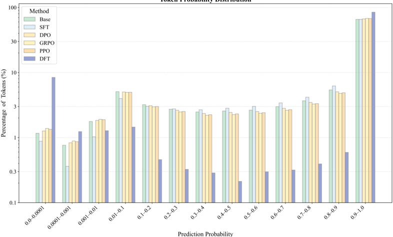
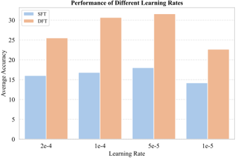
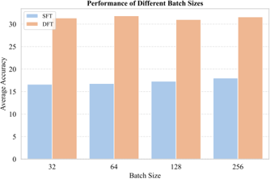

Powered by [MS-Agent](https://github.com/modelscope/ms-agent) | [DocResearch](https://github.com/modelscope/ms-agent/blob/main/projects/doc_research/README.md)
 

# Dynamic Fine-Tuning (DFT) for Mathematical Reasoning in LLMs: Performance Analysis Report

## Executive Summary

This report analyzes the performance of Dynamic Fine-Tuning (DFT), a novel fine-tuning approach for enhancing mathematical reasoning capabilities in Large Language Models (LLMs). The analysis demonstrates that DFT consistently outperforms standard Supervised Fine-Tuning (SFT) across multiple model families and sizes, with particularly strong results on challenging mathematical benchmarks. DFT shows superior generalization, faster convergence, and better robustness compared to existing methods, establishing it as a promising technique for mathematical reasoning tasks.

---

## 1. Performance Comparison: DFT vs. SFT

### 1.1 Overall Performance Gains

DFT consistently yields significantly higher performance improvements over base models compared to standard SFT across all evaluated LLMs. The performance gains are substantial and consistent across different model families:

- **Qwen2.5-Math-1.5B**: DFT achieves +15.66 points average gain over base model, which is **5.9× larger** than SFT's +2.09 points
- **LLaMA-3.2-3B**: DFT achieves +3.46 points gain, exceeding SFT's +2.05 by **1.4×**
- **LLaMA-3.1-8B**: DFT achieves +10.02 points gain, surpassing SFT's +5.33 by **1.88×**
- **DeepSeekMath-7B**: DFT achieves +15.51 points gain, which is **1.58× larger** than SFT's +7.18
- **Qwen2.5-Math-7B**: DFT achieves +15.90 points gain, nearly **3.8× higher** than SFT's +2.37

### 1.2 Comprehensive Benchmark Results

The complete performance comparison across five mathematical reasoning benchmarks is presented in Table 1 below:

 

**Table 1: Average@16 accuracy of five state-of-the-art large language models on five mathematical reasoning benchmarks**

| Model | Method | Math500 | Minerva Math | Olympiad Bench | AIME24 | AMC23 | Avg. |
|-------|--------|---------|--------------|----------------|--------|-------|------|
| LLaMA-3.2-3B | Base | 1.63 | 1.36 | 1.01 | 0.41 | 1.56 | 1.19 |
|  | SFT | 8.65 | 2.38 | 2.06 | 0.00 | 3.13 | 3.24 |
|  | **DFT** | **12.79** | **2.84** | **2.90** | **0.83** | **3.91** | **4.65** |
| LLaMA-3.1-8B | Base | 1.86 | 0.98 | 0.94 | 0.21 | 1.01 | 1.00 |
|  | SFT | 16.85 | 5.78 | 3.88 | 0.00 | 5.16 | 6.33 |
|  | **DFT** | **27.44** | **8.26** | **6.94** | **0.41** | **12.03** | **11.02** |
| DeepSeekMath-7B | Base | 6.15 | 2.15 | 1.74 | 0.21 | 2.97 | 2.64 |
|  | SFT | 26.83 | 7.26 | 6.33 | 0.41 | 8.28 | 9.82 |
|  | **DFT** | **41.46** | **16.79** | **15.00** | **1.24** | **16.25** | **18.15** |
| Qwen2.5-Math-1.5B | Base | 31.66 | 8.51 | 15.88 | 4.16 | 19.38 | 15.92 |
|  | SFT | 43.76 | 13.04 | 12.63 | 1.87 | 18.75 | 18.01 |
|  | **DFT** | **64.89** | **20.94** | **27.08** | **6.87** | **38.13** | **31.58** |
| Qwen2.5-Math-7B | Base | 40.12 | 14.39 | 17.12 | 6.68 | 27.96 | 21.25 |
|  | SFT | 53.96 | 16.66 | 18.93 | 2.48 | 26.09 | 23.62 |
|  | **DFT** | **68.20** | **30.16** | **33.83** | **8.56** | **45.00** | **37.15** |

*Note: Bold values indicate the best performance for each model across methods.*

---

## 2. Generalization and Robustness Analysis

### 2.1 Performance on Challenging Benchmarks

DFT demonstrates superior generalization and robustness, particularly on challenging benchmarks where standard SFT yields minimal or even negative impact:

- **Olympiad Bench (Qwen2.5-Math-1.5B)**:
  - SFT degrades performance from 15.88 to 12.63 (-3.25 points)
  - DFT boosts performance to 27.08 (+11.20 points over base)

- **AIME24 (Qwen2.5-Math-7B)**:
  - SFT reduces accuracy from 6.68 to 2.48 (-4.20 points)
  - DFT improves to 8.56 (+1.88 points over base)

- **AMC23 (Qwen2.5-Math-1.5B)**:
  - SFT reduces performance from 19.38 to 18.75 (-0.63 points)
  - DFT raises it to 38.13 (+18.75 points over base)

- **Qwen2.5-Math-7B on AMC23**:
  - SFT yields only marginal improvement (+1.86 points)
  - DFT achieves a substantial +17.04 point gain

These results underscore DFT's resilience on difficult reasoning tasks where traditional SFT struggles, highlighting its potential as a more robust fine-tuning paradigm for mathematical reasoning.

---

## 3. Learning Efficiency and Convergence

### 3.1 Faster Convergence Characteristics

DFT exhibits significantly better learning efficiency and faster convergence compared to standard SFT:

**Figure 1: Accuracy progression for Qwen2.5-MATH-1.5B across mathematical benchmarks**

DFT demonstrates three distinct advantages in learning dynamics:

1. **Faster convergence**: Achieves peak performance within the first 120 training steps on most benchmarks
2. **Better early-stage performance**: Outperforms the best final accuracy of SFT within the first 10-20 steps
3. **Higher sample efficiency**: Consistently requires fewer updates to reach optimal results

This accelerated convergence indicates that DFT's dynamic reweighting mechanism leads to more informative gradient updates, guiding models toward high-quality solutions early in training. It also suggests DFT helps avoid optimization plateaus or noise-prone regions often encountered in standard SFT.

---

## 4. Comparison with Importance-Weighted SFT (iw-SFT)

### 4.1 Performance Comparison

DFT outperforms the concurrent Importance-Weighted SFT (iw-SFT) in most settings across model families and benchmarks:

**Table 2: Comparison with concurrent work iw-SFT on math benchmarks**

| Model | Method | Math500 | Minerva Math | Olympiad Bench | AIME24 | AMC23 | Avg. |
|-------|--------|---------|--------------|----------------|--------|-------|------|
| LLaMA-3.2-3B | iw-SFT | 5.13 | 2.63 | 1.51 | 0.00 | 2.03 | 2.26 |
|  | **DFT** | **12.79** | **2.84** | **2.90** | **0.83** | **3.91** | **4.65** |
| LLaMA-3.1-8B | iw-SFT | 18.21 | 4.31 | 4.31 | 0.20 | 7.34 | 6.87 |
|  | **DFT** | **27.44** | **8.26** | **6.94** | **0.41** | **12.03** | **11.02** |
| DeepSeekMath-7B | iw-SFT | 35.32 | 8.75 | 11.11 | 0.61 | 18.28 | 14.81 |
|  | **DFT** | **41.46** | **16.79** | **15.00** | **1.24** | **16.25** | **18.15** |
| Qwen2.5-Math-1.5B | iw-SFT | 59.38 | 17.08 | 26.82 | 8.13 | 40.00 | 30.28 |
|  | **DFT** | **64.89** | **20.94** | **27.08** | **6.87** | **38.13** | **31.58** |
| Qwen2.5-Math-7B | iw-SFT | 70.28 | 25.70 | 34.46 | 16.46 | 51.09 | 39.60 |
|  | DFT | 68.20 | 30.16 | 33.83 | 8.56 | 45.00 | 37.15 |

DFT achieves higher average accuracy than iw-SFT on most model families:
- LLaMA-3.2-3B: +2.39 points
- LLaMA-3.1-8B: +4.15 points 
- DeepSeekMath-7B: +3.34 points
- Qwen2.5-Math-1.5B: +1.30 points

While iw-SFT slightly outperforms DFT on Qwen2.5-Math-7B (+2.45 points), this improvement is inconsistent across datasets.

### 4.2 Robustness Comparison

iw-SFT exhibits limited robustness on the LLaMA model family:
- For LLaMA-3.2-3B, iw-SFT underperforms standard SFT on Math500 (5.13 vs. 8.65) and AMC23 (2.03 vs. 3.13)
- For LLaMA-3.1-8B, iw-SFT results in worse performance than SFT on Minerva Math (4.31 vs. 5.78) and AMC23 (7.34 vs. 8.28)

These cases demonstrate that iw-SFT might struggle to generalize beyond specific training signals and may degrade performance under distribution shifts. In contrast, DFT consistently improves upon both the base model and SFT across nearly all datasets.

### 4.3 Computational Efficiency

DFT offers a computational advantage over iw-SFT:
- iw-SFT requires a separate reference model to compute importance weights
- DFT dynamically derives its own weighting directly from the model's token probabilities
- This results in a more efficient training procedure with reduced computational overhead

---

## 5. Offline Reinforcement Learning Application

### 5.1 Performance in Offline RL Setting

DFT demonstrates strong performance in offline reinforcement learning settings, where it addresses the sparsity of reward issue:

**Table 3: Evaluation results on five mathematical reasoning benchmarks in an offline reinforcement learning setting**

| Model & Method | Setting | Math500 | Minerva Math | Olympiad Bench | AIME24 | AMC23 | Avg. |
|----------------|---------|---------|--------------|----------------|--------|-------|------|
| Qwen2.5-Math-1.5B | Base | 31.66 | 8.51 | 15.88 | 4.16 | 19.38 | 15.92 |
| Qwen2.5-Math-1.5B w/SFT | SFT | 43.14 | 11.64 | 13.41 | 1.03 | 14.84 | 16.81 |
| Qwen2.5-Math-1.5B w/iw-SFT | SFT | 59.38 | 17.08 | 26.82 | 8.13 | 40.00 | 30.28 |
| Qwen2.5-Math-1.5B w/DFT | SFT | 62.50 | 22.94 | 26.87 | 7.31 | 33.75 | 30.67 |
| Qwen2.5-Math-1.5B w/DPO | Offline | 46.89 | 11.53 | 22.86 | 4.58 | 30.16 | 23.20 |
| Qwen2.5-Math-1.5B w/RFT | Offline | 48.23 | 14.19 | 22.29 | 4.37 | 30.78 | 23.97 |
| Qwen2.5-Math-1.5B w/PPO | Online | 56.10 | 15.41 | 26.33 | 7.50 | 37.97 | 28.66 |
| Qwen2.5-Math-1.5B w/GRPO | Online | 62.86 | 18.93 | 28.62 | 8.34 | 41.25 | 32.00 |
| Qwen2.5-Math-1.5B w/iw-SFT | Offline | 60.80 | 18.13 | 27.83 | 8.33 | 44.21 | 31.86 |
| **Qwen2.5-Math-1.5B w/DFT** | **Offline** | **64.71** | **25.16** | **30.93** | **7.93** | **48.44** | **35.43** |

DFT achieves the best overall performance (35.43 average), surpassing both offline (RFT, DPO) and online (PPO, GRPO) baselines. This demonstrates DFT's efficiency and strength as a simple yet effective fine-tuning strategy in offline RL settings.

### 5.2 Token Probability Analysis

 

**Figure 2: Token probability distributions on the training set before and after fine-tuning**

The token probability distributions reveal how DFT affects model behavior compared to other methods. The logarithmic scale visualization shows that DFT produces a more favorable distribution for mathematical reasoning tasks compared to SFT and other RL methods (DPO, PPO, GRPO).

---

## 6. Hyperparameter Sensitivity Analysis

### 6.1 Learning Rate Impact

 

**Figure 3 (left): Impact of learning rate on DFT and SFT performance**

An ablation study evaluated both DFT and SFT across four learning rates (2e-4, 1e-4, 5e-5, and 1e-5):

- Both methods exhibit sensitivity to learning rate
- **DFT consistently outperforms SFT under all configurations**, confirming the performance gap is not due to suboptimal hyperparameter choices in SFT
- Intermediate learning rates (1e-4 and 5e-5) yield best results for both methods
- Both lower (1e-5) and higher (2e-4) values lead to noticeable performance degradation

### 6.2 Batch Size Impact

 

**Figure 3 (right): Impact of batch size on DFT and SFT performance**

The study also assessed the impact of batch size (32 to 256):

- Both DFT and SFT exhibit relatively stable performance across the full range of batch sizes
- Minor fluctuations are observed, but no consistent trend indicates that larger or smaller batches significantly affect final accuracy
- Batch size is not a dominant factor for either method in this setup
- Default values may suffice in practice without extensive tuning

---

## 7. Conclusion

### 7.1 Key Findings

1. **Superior Performance**: DFT consistently outperforms standard SFT across all evaluated LLMs, with performance gains ranging from 1.4× to 5.9× depending on the model.

2. **Enhanced Robustness**: DFT demonstrates exceptional resilience on challenging benchmarks where SFT often degrades performance, making it particularly valuable for difficult mathematical reasoning tasks.

3. **Faster Convergence**: DFT achieves peak performance within the first 120 training steps and outperforms SFT's best results within the first 10-20 steps, indicating significantly better learning efficiency.

4. **Stronger than Alternatives**: DFT outperforms iw-SFT in most settings while avoiding iw-SFT's robustness issues on certain benchmarks.

5. **Offline RL Effectiveness**: DFT achieves the best overall performance in offline reinforcement learning settings, surpassing both offline and online baselines.

6. **Hyperparameter Robustness**: DFT maintains its performance advantage across different learning rates and batch sizes, confirming its reliability in practical applications.

### 7.2 Implications

DFT represents a significant advancement in fine-tuning techniques for mathematical reasoning in LLMs. Its dynamic reweighting mechanism appears to effectively address key limitations of standard SFT, particularly in handling challenging mathematical problems and optimizing training efficiency. The method's success in offline RL settings further demonstrates its versatility and potential applicability to other domains where preference supervision is available but reward modeling is challenging.

For practitioners, DFT offers a computationally efficient alternative to more complex RL-based approaches, delivering superior performance with simpler implementation requirements. The consistent gains across model sizes suggest DFT could be particularly valuable for smaller models where performance improvements are most impactful.