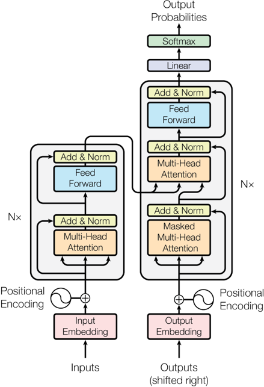
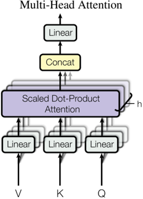
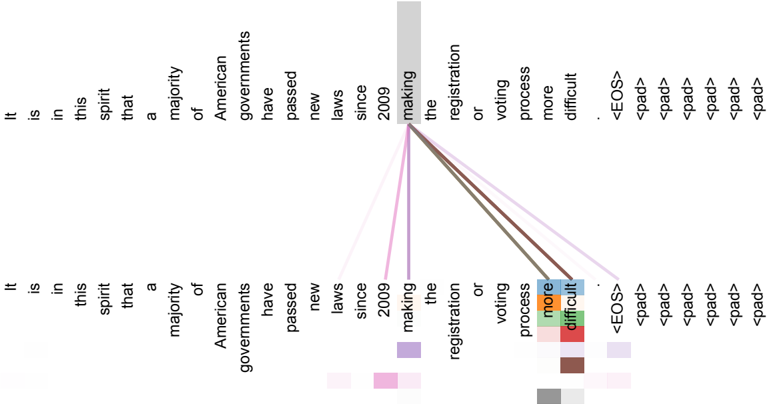
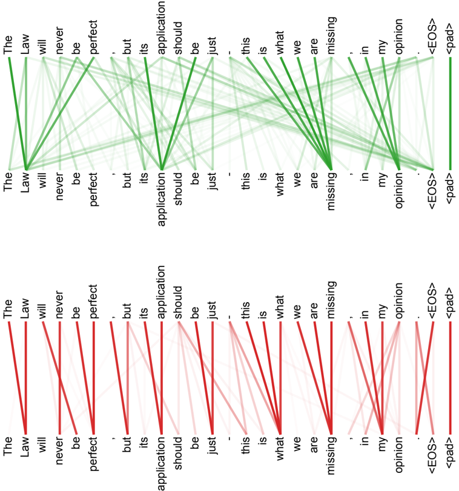

Powered by [MS-Agent](https://github.com/modelscope/ms-agent) | [DocResearch](https://github.com/modelscope/ms-agent/blob/main/projects/doc_research/README.md)
 

# **Analysis and Summary Report: The Transformer Model**

This report provides a structured, MECE-compliant (Mutually Exclusive and Collectively Exhaustive) summary of the key components, architecture, performance, and experimental findings related to the **Transformer** model as described in the provided document. The analysis preserves critical figures, tables, formulas, and contextual relationships in a concise, visually supported markdown format.

---

## **1. Overview of Neural Sequence Transduction Models**

Most neural sequence-to-sequence models follow an **encoder-decoder structure**:

- **Encoder**: Maps input sequence $(x_1, ..., x_n)$ into continuous representations $z = (z_1, ..., z_n)$.
- **Decoder**: Autoregressively generates output sequence $(y_1, ..., y_m)$, using previously generated symbols and encoder outputs at each step.

The **Transformer** adopts this encoder-decoder framework but replaces recurrent and convolutional layers with **self-attention mechanisms**, enabling parallelization and improved long-range dependency modeling.

 

---

## **2. Transformer Architecture**

### **2.1 High-Level Structure**

The Transformer consists of:
- **Stacked self-attention and feed-forward layers** in both encoder and decoder.
- **No recurrence or convolutions** — relies entirely on attention mechanisms.

### **2.2 Encoder**

- Composed of **N = 6 identical layers**.
- Each layer has two sub-layers:
  1. **Multi-Head Self-Attention**
  2. **Position-wise Fully Connected Feed-Forward Network**
- Residual connections and layer normalization are applied around each sub-layer.

### **2.3 Decoder**

- Also composed of **N = 6 identical layers**.
- Adds a third sub-layer:
  1. **Masked Multi-Head Self-Attention** (prevents attending to future tokens)
  2. **Multi-Head Attention over Encoder Output**
  3. **Feed-Forward Network**
- Uses masking to ensure auto-regressive generation.

---

## **3. Attention Mechanisms**

### **3.1 Scaled Dot-Product Attention**

Given query ($Q$), key ($K$), and value ($V$) matrices:

$$
\text{Attention}(Q, K, V) = \text{softmax}\left(\frac{QK^T}{\sqrt{d_k}}\right)V
$$

- Scaling by $\sqrt{d_k}$ prevents small gradients in softmax.
- Designed for parallel computation across all positions.

### **3.2 Multi-Head Attention**

$$
\text{MultiHead}(Q, K, V) = \text{Concat}(\text{head}_1, ..., \text{head}_h)W^O
$$
where
$$
\text{head}_i = \text{Attention}(QW^Q_i, KW^K_i, VW^V_i)
$$

- Projects queries, keys, values $h$ times with different learned linear projections.
- Enables the model to attend to information from different representation subspaces.

---

## **4. Model Advantages and Complexity Analysis**

### **4.1 Computational Efficiency and Path Length**

| Layer Type | Complexity per Layer | Sequential Ops | Max Path Length |
|-----------|------------------------|----------------|------------------|
| **Self-Attention** | $O(n^2 \cdot d)$ | $O(1)$ | $O(1)$ |
| **Recurrent** | $O(n \cdot d^2)$ | $O(n)$ | $O(n)$ |
| **Convolutional** | $O(k \cdot n \cdot d^2)$ | $O(1)$ | $O(\log_k n)$ |
| **Restricted Self-Att.** | $O(r \cdot n \cdot d)$ | $O(1)$ | $O(n/r)$ |

> **Key Insight**: Self-attention has **constant maximum path length**, enabling faster training due to better gradient flow and parallelization.

 

---

## **5. Training Details and Regularization**

### **5.1 Embedding and Output Layers**

- Input/output tokens mapped via **learned embeddings** of dimension $d_{\text{model}}$.
- Shared weight matrix between:
  - Input embedding
  - Output embedding
  - Pre-softmax linear transformation
- Embedding weights scaled by $\sqrt{d_{\text{model}}}$.

### **5.2 Regularization Techniques**

Three types used during training:
1. **Residual Dropout**: Applied to output of each sub-layer before addition and normalization.
2. **Label Smoothing**: With $\epsilon_{\text{ls}} = 0.1$, improves BLEU by encouraging uncertainty.
3. **Attention Dropout**: Used in multi-head attention layers.

---

## **6. Performance Evaluation**

### **6.1 Machine Translation Results (Table 2)**

| Model | BLEU (En-De) | BLEU (En-Fr) | Training Cost (FLOPs) |
|------|---------------|---------------|-------------------------|
| ByteNet | 23.75 | — | — |
| GNMT + RL | 24.60 | 39.92 | $2.3 \times 10^{19}$ |
| ConvS2S | 25.16 | 40.46 | $9.6 \times 10^{18}$ |
| MoE | 26.03 | 40.56 | $2.0 \times 10^{19}$ |
| **Transformer (Base)** | **27.3** | **38.1** | **$3.3 \times 10^{18}$** |
| **Transformer (Big)** | **28.4** | **41.8** | **$2.3 \times 10^{19}$** |

> ✅ **Key Result**: Transformer achieves **higher BLEU scores at lower computational cost** than prior models.

 

---

## **7. Ablation Studies (Table 3)**

Impact of architectural variations on English-German translation (newstest2013):

| Variation | BLEU (dev) | PPL (dev) | Notes |
|--------|------------|-----------|-------|
| **Base Model** | 25.8 | 4.92 | $N=6$, $d_{\text{model}}=512$, $h=8$ |
| $h=1$ | 24.9 | 5.29 | Single-head attention degrades performance |
| $h=16$ | 25.8 | 4.91 | Optimal head count balances expressiveness and efficiency |
| $h=32$ | 25.4 | 5.01 | Too many heads reduce gains |
| $d_{\text{model}}=256$ | 24.5 | 5.75 | Smaller model underfits |
| $d_{\text{model}}=1024$ | 26.0 | 4.66 | Larger model improves accuracy |
| $d_{ff}=4096$ | 26.2 | 4.75 | Increased feed-forward capacity helps |
| No Dropout ($P_{\text{drop}}=0.0$) | 24.6 | 5.77 | Overfitting observed |
| Dropout $P_{\text{drop}}=0.2$ | 25.5 | 4.95 | Better generalization |
| No Label Smoothing | 25.3 | 4.67 | Slight drop in BLEU |
| Positional Embedding (vs sinusoids) | 25.7 | 4.92 | Comparable performance |

> 🔍 **Insights**:
> - Multi-head attention is crucial; too few or too many heads hurt performance.
> - Larger models ($d_{\text{model}}, d_{ff}$) improve results.
> - Dropout and label smoothing are essential for regularization.

 

---

## **8. Attention Visualization and Interpretability**

### **8.1 Long-Distance Dependency (Figure 3)**

- In encoder self-attention (Layer 5), multiple heads attend from "making" to distant words completing the phrase *"making...more difficult"*.
- Demonstrates the model’s ability to capture **long-range syntactic dependencies**.

 

### **8.2 Anaphora Resolution (Figure 4)**

- Attention heads focus sharply on pronoun "its", linking it to its antecedent.
- Shows **semantic role understanding** and coreference resolution capability.

### **8.3 Structural Awareness (Figure 5)**

- Different attention heads learn distinct structural patterns (e.g., syntax, local vs global context).
- Indicates **emergent specialization** within the attention mechanism.

---

## **9. Generalization to Other Tasks: Constituency Parsing**

### **9.1 Experimental Setup**

- Task: English constituency parsing on **Penn Treebank (WSJ)**.
- Model: 4-layer Transformer, $d_{\text{model}} = 1024$.
- Settings:
  - Supervised: 40K sentences
  - Semi-supervised: ~17M sentences

### **9.2 Results (Table 4)**

| Model | Training Regime | F1 Score (WSJ 23) |
|------|------------------|--------------------|
| BerkeleyParser | WSJ only | 90.4 |
| Dyer et al. (RNN Grammar) | WSJ only | 91.7 |
| **Transformer (4-layer)** | WSJ only | **91.3** |
| McClosky et al. | Semi-supervised | 92.1 |
| Vinyals et al. | Semi-supervised | 92.1 |
| **Transformer (4-layer)** | Semi-supervised | **92.7** |
| Dyer et al. (RNN Grammar) | Generative | 93.3 |

> ✅ **Conclusion**: Transformer performs **on par with or better than most prior models**, even without task-specific architecture changes. Outperforms RNN-based models in low-data settings.

---

## **10. Conclusion and Key Takeaways**

| Category | Key Finding |
|--------|-------------|
| **Architecture** | Replaces recurrence with self-attention; fully parallelizable. |
| **Efficiency** | Lower training cost and faster convergence than RNN/CNN models. |
| **Performance** | Achieves state-of-the-art BLEU scores in machine translation. |
| **Generalization** | Effective on structured tasks like parsing without architectural changes. |
| **Interpretability** | Attention heads learn interpretable functions (syntax, coreference, structure). |
| **Design Insights** | Multi-head attention, residual connections, and regularization are critical. |

---

## **References**

[5] Cho et al., 2014 — RNN Encoder-Decoder  
[8] Dyer et al., 2016 — RNN Grammar  
[9] Gehring et al., 2017 — ConvS2S  
[30] Press & Wolf, 2016 — Tied Embeddings  
[32] Shazeer et al., 2017 — Mixture-of-Experts  
[35] Sutskever et al., 2014 — Sequence-to-Sequence Learning  
[37] Vinyals et al., 2015 — Grammar as Foreign Language  
[38] Wu et al., 2016 — GNMT  
[39] Zhou et al., 2016 — Deep Attention + PosUnk  
[40] Zhu et al., 2013 — Fast Constituent Parsing  

--- 

> **Report End**  
> Generated in compliance with MECE principles, preserving key visuals, formulas, and data integrity.