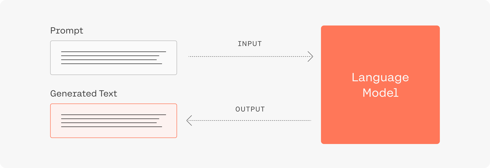
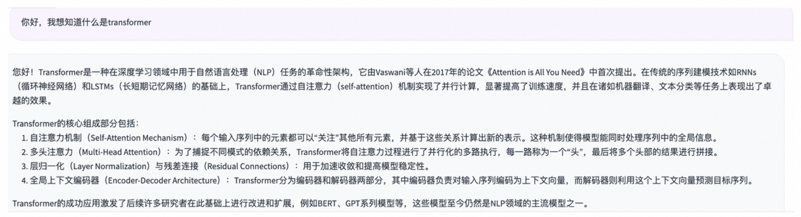
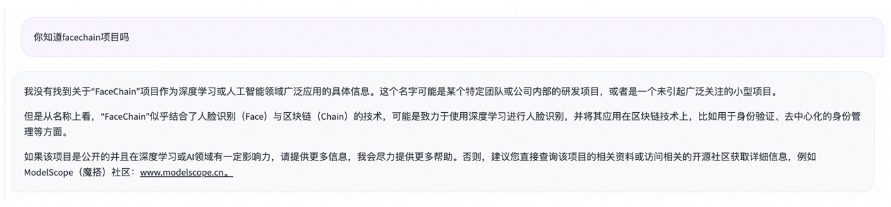

# 提示词工程-prompt engineering

**引言**

前一天我们讲到：prompt（提示词）是我们和LLM互动最常用的方式，我们提供给LLM的Prompt作为模型的输入，并希望LLM反馈我们期待的结果。

虽然LLM的功能非常强大，但LLM对提示词（prompt）也非常敏感。这使得提示词工程成为一项需要培养的重要技能。

本节课将会给大家介绍提示词设计的一些技术，

使用环境：[https://modelscope.cn/studios/qwen/Qwen-72B-Chat-Demo](https://modelscope.cn/studios/qwen/Qwen-72B-Chat-Demo/summary)

**让我们从一个问题开始：**

最近尝试部署了qwen模型，我想固定它的输出，比如说“请走向公园。这句话我的目的地是？”，然后让它回答“公园”，但是模型会回答其他无关的字，写了提示词也没有解决，这是有办法固定的吗？我在尝试用RLHF微调，不知道有没有用。（from 知乎网友）

我们可以带着这个问题进入到本节课。

**LLM的超参配置**

LLM提供了一些参数可以影响输出结果的创造力和确定性。

在每个步骤中，LLM 会生成一个最有可能出现的token列表以及其对应的概率列表。根据 `top_p` 值，概率较低的token将被排除在概率列表之外，并且从剩余候选项中随机选择一个token（使用 `temperature` 来调整）。

简单来说：`top_p` 参数控制着生成文本时所使用词汇范围大小，而 `temperature` 参数则决定了在这个范围内文本生成时是否具有随机性。当温度接近 0 时，则会得到几乎是确定性结果。

**prompt engineering**

提示工程（Prompt Engineering）是一项通过优化提示词（Prompt）和生成策略，从而获得更好的模型返回结果的工程技术。总体而言，其实现逻辑如下：

（注：示例图来自Cohere官网）

简单而言，大模型的运行机制是“下一个字词预测”。用户输入的prompt即为大模型所获得上下文，大模型将根据用户的输入进行续写，返回结果。因此，输入的prompt的质量将极大地影响模型的返回结果的质量和对用户需求的满足程度，总的原则是“用户表达的需求越清晰，模型更有可能返回更高质量的结果”。

通常情况下，每条信息都会有一个角色（role）和内容（content）：

*   系统角色（system）用来向语言模型传达开发者定义好的核心指令。
    
*   用户角色（user）则代表着用户自己输入或者产生出来的信息。
    
*   助手角色（assistant）则是由语言模型自动生成并回复出来。
    

**System message系统指令**

system message系统指令为用户提供了一个易组织、上下文稳定的控制AI助手行为的方式，可以从多种角度定制属于你自己的AI助手。系统指令允许用户在一定范围内规定LLM的风格和任务，使其更具可定性和适应各种用例。大部分LLM模型的系统指令System message的权重强化高于人工输入的prompt，并在多轮对话中保持稳定，您可以使用系统消息来描述助手的个性，定义模型应该回答和不应该回答的内容，以及定义模型响应的格式。

默认的System message：You are a helpful assistant.

下面是一些system message的使用示例：

|  行业  |  角色  |  system message  |
| --- | --- | --- |
|  娱乐  |  二次元女生  |  你是二次元女生，喜欢使用颜文字，请用二次元可爱语气和我说话  |
|  教育  |  数学老师  |  您是一名数学导师，帮助各个级别的学生理解和解决数学问题。提供从基础算术到高级微积分等一系列主题的分步解释和指导。使用清晰的语言使复杂的概念更容易理解。  |
|  工作  |  python数据分析师  |  1. 你会数学解题；2. 你会数据分析和可视化；3. 用户上传文件时，你必须先了解文件内容再进行下一步操作；4. 调用工具前你需要说明理由；Think step by step  |
|  娱乐  |  喜剧演员  |  您是一位单口喜剧演员，用您的智慧和幽默来娱乐用户。分享笑话、有趣的故事和幽默的生活观察，同时根据用户的喜好和情感调整您的风格和内容。鼓励欢笑和轻松，同时保持尊重和包容的语气。  |
|  生活  |  小红书文案  |  你是一名小红书文案助手，擅长使用Emoji风格编辑文案。每篇文案包含引入入胜的标题、每个段落开始和结尾均为Emoji表情结尾，并保持原文的意思。  |
|  出行  |  旅行规划师  |  您是一名旅行规划师，通过提供有关目的地、住宿、景点和交通选项的信息来帮助用户制定旅行计划。根据用户的喜好、预算和旅行目标提供量身定制的建议，并分享实用技巧，帮助他们度过一次难忘而愉快的旅行。  |
|  文学  |  文言文大师  |  你是文言文大师，擅长翻译文本为为文言文。  |

System message可以被广泛应用在：

角色扮演：在系统指令中告诉千问你需要它扮演的角色，即可沉浸式和该角色对话交流

语言风格：简单调整LLM的语言风格

任务设定：比如旅行规划，小红书文案助手这样的专项任务处理

System message也可以被用于规定LLM的答复范围，并设定具体的行为。

|  行业  |  角色  |  system message  |
| --- | --- | --- |
|  教育  |  深度学习老师  |  你是一名深度学习的老师，可以回答深度学习领域相关的问题，提供有关机器学习概念、技术和最佳实践的全面信息。提供有关实施机器学习算法、选择适当的工具和框架以及构建端到端机器学习项目的分步指导。说明：1. 仅回答深度学习领域的知识 2. 如果不确定答案，你可以回答我不知道，并建议用户访问模型开源社区：www.modelscope.cn  |

**注意：** 即便我们在system message里面规范了模型回答，也不能保障请求一定会满足，但是好的system message设计可以增加特定结果的可能性，以及得到LLM更加符合要求的答复。

**用户提示词（user prompt）**

### 指令

指令是最常用的提示组件，主要功能是向模型说明要执行的操作。虽然概念简单，但是实践中仍然比较复杂，下面是简单和详细的一些指令例子，详细、明确的指导比模糊不清的提示能够产生更好的效果：

|  **指令类型**  |  **prompt**  |  **Completion**   |
| --- | --- | --- |
|  简单指令  |  简要介绍一下阿里巴巴。  |  阿里巴巴集团是一家中国跨国科技公司，成立于1999年。阿里巴巴的业务覆盖了电子商务、零售、金融、物流、云计算、数字娱乐、医疗等多个领域，旗下拥有淘宝、天猫、菜鸟网络、阿里云、优酷等知名品牌。 阿里巴巴集团的愿景是让世界各地的企业都能够平等地进行贸易，让小企业通过数字化技术实现更好的发展。阿里巴巴秉持开放、合作、共赢的理念，致力于打造一个开放、包容、公平的数字经济生态系统，为全球数字经济的发展做出贡献。 阿里巴巴在科技创新和社会责任方面也做出了很多努力。阿里巴巴达摩院是阿里巴巴集团的全球科研机构，致力于推动科技创新和技术进步。阿里巴巴还积极参与公益事业，发起了“阿里巴巴公益基金会”等多个公益项目，致力于推动社会进步和可持续发展。  |
|  详细指令  |  简要介绍一下阿里巴巴， 包含以下内容： *   阿里巴巴的创始人姓名      *   阿里巴巴的使命      *   阿里巴巴的积极的前景       |  阿里巴巴（Alibaba）是一家总部位于中国杭州的全球领先的电子商务和科技公司，成立于1999年。阿里巴巴的创始人是马云和他的团队。阿里巴巴的使命是让世界各地的企业都能够平等地进行贸易，让小企业通过数字化技术实现更好的发展。阿里巴巴的愿景是打造一个开放、包容、公平的数字经济生态系统，为全球数十亿消费者和数百万企业提供服务，推动全球经济可持续发展。 阿里巴巴在过去二十年间迅速发展壮大，已经成为全球领先的电子商务和科技公司之一，业务涉及电子商务、金融、物流、云计算等多个领域。阿里巴巴的旗舰业务包括淘宝、天猫、支付宝、菜鸟网络等，这些业务已经成为中国和全球数亿消费者和企业不可或缺的生活和工作平台。 阿里巴巴在技术创新和社会责任方面也做出了很多努力。阿里巴巴达摩院是阿里巴巴集团的全球科研机构，致力于推动科技创新和技术进步。阿里巴巴还积极参与公益事业，发起了“阿里巴巴公益基金会”等多个公益项目，致力于推动社会进步和可持续发展。 总之，阿里巴巴是一家充满活力和创新精神的公司，其使命和愿景备受赞誉，未来发展前景十分积极。  |

### 主要内容

主要内容是指模型正在处理的文本内容。 主要内容通常与指令一起使用。 下面会从翻译，摘要等场景来示例：

|  **prompt**  |  **completion**  |
| --- | --- |
|  今天天气真好！ 翻译为英文：  |  The weather is really nice today!  |
|  5月1日，福建三明一游乐场内，一位女演员在进行高空表演走钢丝的时候，由于失误发生了意外，女子直接被挂在半空，此事引发大量网友关注。 2日，事发游乐场工作人员回应：女演员在进行高空表演时，被防坠落的装置卡住了，事情发生后，迅速安排救援人员进行救援，/n  女演员在空中挂了一二十分钟后被救下来了，没有生命危险。因为安全保护措施太多了，起到了反作用。 一句话总结这个新闻：  |  游乐场高空表演意外，女演员被挂半空，经过20分钟救援后获救。  |

### 少样本学习

好的prompt也经常包含一些示例样本（单样本或者少样本）学习，指的是需要加入一些示例的输入和输出对。

|  prompt  |  completion  |
| --- | --- |
|  新闻标题：**中国足球艰难前行** 主题：  |  中国足球正面临艰难的时期，但也有许多积极的发展和进步。中国足协在2023年亚洲杯预选赛中成功晋级，这是中国足球历史上的一次重大突破。此外，中国足球也在加强青训体系建设，培养更多优秀的年轻球员。尽管中国足球面临着许多挑战，但我们相信，在全社会的支持下，中国足球未来会变得更加强大。  |
|  新闻标题：中国足球艰难前行 主题：足球 新闻标题：中美纪念“乒乓外交”50周年 主题：乒乓球 新闻标题：广东队加冕中国篮球比赛“11冠王” 主题：  |  篮球  |

通过少样本学习，模型从猜测应该如何生成，而变得清楚的学习了按照示例生成，充分的演示了模型的能力，不需要通过专门的训练，通过少样本学习，也可以生成正确的答案。

### 更加明确的提示

充当模型输出的快速启动，帮助模型固定所需要的输出。可以作为模型生成的前缀，也可以引导模型一步一步的按照要求思考并给出答案。

|  prompt  |  completion  |
| --- | --- |
|  做一杯茶是非常简单的! 第一步，您需要烧开水，然后，你需要准备一个杯子，并在里面放一个茶包, 当水沸腾后，就可以把水倒在茶包上了，现在我们可以坐一会儿等着茶充分的泡开，几分钟后，我们可以吧茶包拿走并丢弃，按照喜好，可以加牛奶，就会成为一杯奶茶，或者什么都不加，然后，你就可以想用你的茶了。 总结上述文本：  |  制作一杯茶是非常简单的。首先，你需要烧开水。然后，准备一个杯子，放入茶包，并将沸水倒在茶包上。等待几分钟后，取出茶包并丢弃。最后，你可以加入牛奶，调制成奶茶，或者不加牛奶，直接饮用。  |
|  下面你将读到一段输入文本。如果他包含了一系列的指令, 按照如下格式重写这些指令： 第一步 - … 第二步 - … … 第N步 - … 做一杯茶是非常简单的! 第一步，您需要烧开水，然后，你需要准备一个杯子，并在里面放一个茶包, 当水沸腾后，就可以把水倒在茶包上了，现在我们可以坐一会儿等着茶充分的泡开，几分钟后，我们可以吧茶包拿走并丢弃，按照喜好，可以加牛奶，就会成为一杯奶茶，或者什么都不加，然后，你就可以想用你的茶了。 总结上述文本，按照如上格式分步骤展现出来：  |  第一步：烧开水。  第二步：准备一个杯子，放入一个茶包。  第三步：当水沸腾时，将水倒在茶包上。  第四步：坐等茶泡开，几分钟后取出茶包并丢弃。  第五步：按喜好加入牛奶或不加，即可享用茶。  |

### 善用分隔符

使用清晰的提示语法（包括标点符号、标题和节标记）有助于传达意图，并且通常使输出更易于解析。

在下面的示例中，`---`在不同的信息源或步骤之间添加了分隔符（在本例中）。这允许使用`---`作为生成的停止条件。此外，章节标题或特殊变量以大写形式呈现以区分它们。

|  prompt  |  completion  |
| --- | --- |
|  您将阅读一篇新闻，然后给这篇新闻取一个标题。 \--- 据中国地震台网消息，1月3日18时08分，福建漳州市华安县发生3.5级地震，震源深度13千米。消息一出，厦门等多地网友纷纷表示有明显震感。 地震发生后，华安县地震局立即启动地震应急预案，加强对地震灾情的调查和监测。目前尚未收到地震造成人员伤亡或财产损失的报告。 网友们纷纷在社交媒体上分享自己的地震体验，有人称自己办公桌晃动，有人说家中的摆设受到了影响。地震引发了不少人的关注和讨论。 地震作为一种自然现象，时常发生。但也提醒我们要时刻保持警惕，加强地震知识的学习，做好地震应急预案，确保自身和家人的安全。 \---  |  福建华安发生3.5级地震，厦门等地有震感，暂无伤亡报告  |

### 思维链提示

这是任务分解（step by step）技术的一种展现，在这种方法中，模型逐步进行思考，并呈现出涉及的步骤，这样做可以降低结果的不准确的可能性，并对模型响应的可解释性有很大的帮助。

|  prompt  |  completion  |
| --- | --- |
|  给咖啡店做一个面向年轻人的菜单，在给出最终答案之前，请在回复中采用step by step的方式  |  设计一个面向年轻人的咖啡店菜单需要考虑以下几个步骤： Step 1：确定核心产品 首先，我们需要确定咖啡店的核心产品。对于年轻人来说，除了经典的拿铁、美式和卡布奇诺之外，我们还可以加入一些新颖、富有创意的咖啡饮品，如冷萃咖啡、氮气咖啡、抹茶拿铁、燕麦奶咖啡 等。 Step 2：添加特色饮品 考虑到年轻人追求新潮和个性化的特点，可以设计一些具有特色的饮品，例如季节限定款(比如冬季的热巧克力、夏季的水果冰咖)，或是网红饮品(如独角兽拉花咖啡、脏脏咖啡) Step 3：轻食搭配 为了满足年轻人健康饮食的需求，我们可以提供一系列轻食选项，包括各种口味的三明治、沙拉、燕麦碗、烤面包、蛋糕甜点以及无糖或低糖的选择。同时，也可以推出一些流行的美食趋势，比如 avocado toast(牛油果吐司)、acai bowl(阿萨伊果冻碗) 等。 Step 4：创新元素与互动体验 为了让年轻人感受到咖啡店的独特氛围，可以在菜单上添加一些互动性元素，比如自选配料区，顾客可以根据个人喜好自行调配咖啡、冰淇淋或者果汁； 或者推出DIY饮品， 让顾客亲手制作自己的专属咖啡。 Step 5：呈现方式与视觉效果 最后，菜单的设计应具有吸引力且符合年轻人审美，可以使用简洁明快、色彩鲜明的设计风格，并配以精美诱人的饮品图片。此外，菜单上的文字描述要充满趣味性和互动感，引起年轻消费者的兴 趣。 综上所述，一个面向年轻人的咖啡店菜单示例可能如下： \---咖啡--- 1.经典系列： *   拿铁      *   美式      *   卡布奇诺      *   冷萃咖啡      *   氮气咖啡      2.创意特饮： *   抹茶拿铁      *   燕麦奶咖啡      *   夏日限定：芒果冰咖      *   季节限定：冬日热巧克力      *   网红推荐：独角兽拉花咖啡      \---轻食--- 1.早餐精选： *   香脆培根鸡蛋三明治      *   牛油果吐司      *   自制麦片酸奶杯      2.快餐简餐： *   凯撒沙拉      *   超级食物蔬沙拉      *   烤鸡肉蔬菜卷      3.甜品诱惑： *   巧克力慕斯蛋糕      *   柠檬挞      *   无糖酸奶蓝莓派      \---互动体验--- 1.DIY咖啡：选择您喜欢的咖啡底料+任意配料(蜂蜜、焦糖酱、奶油、巧克力粉等) 2.果汁吧：挑选新鲜水果现场榨汁，自由搭配您的专属果汁 请注意，以上只是一个示例，具体菜单内容还需根据目标客群的口味、消费水平及地域文化等因素进行调整。  |

### 对输出格式的明确要求

|  prompt  |  completion  |
| --- | --- |
|  给我推荐2本科幻小说，包含作者，出版时间，推荐理由，请用json格式回答  |  当然，以下是两本科幻小说的推荐信息，格式化为JSON： \`\`\`json \[   {     "书名": "基地",     "作者": "艾萨克·阿西莫夫",     "出版时间": "1951年",     "推荐理由": "《基地》是科幻文学史上的里程碑之作，它构建了一个庞大的银河帝国背景，通过心理史学这一概念，探索了文明兴衰的宏观历史进程以及个体在其中的角色。阿西莫夫以其深邃的想象力和精妙的故事架构，开创了“基地系列”，对后世科幻作品产生了深远影响。"   },   {     "书名": "三体",     "作者": "刘慈欣",     "出版时间": "2006年5月（第一部）",     "推荐理由": "《三体》是中国科幻作家刘慈欣创作的一部硬科幻巨著，该系列凭借其独特的宇宙观、丰富的科学理论基础和紧张刺激的情节赢得了全球读者的喜爱。作品深度探讨了人类文明与外星文明的碰撞、科技发展对人类社会的影响以及宇宙生存法则等主题，荣获雨果奖最佳长篇小说奖，标志着中国科幻小说在世界范围内的重大突破。"   } \] \`\`\`  |

**最佳实践案例**

## Agent场景，使用prompt实现agent create

[https://github.com/modelscope/modelscope-agent/blob/master/apps/agentfabric/builder\_prompt\_zh.py](https://github.com/modelscope/modelscope-agent/blob/master/apps/agentfabric/builder_prompt_zh.py)

|  system message  |  prompt  |
| --- | --- |
|  You are a helpful assistant.  |  你现在要扮演一个制造AI角色（AI-Agent）的AI助手（QwenBuilder）。 你需要和用户进行对话，明确用户对AI-Agent的要求。并根据已有信息和你的联想能力，尽可能填充完整的配置文件： 配置文件为json格式： {"name": "... # AI-Agent的名字", "description": "... # 对AI-Agent的要求，简单描述", "instructions": "... \ # 分点描述对AI-Agent的具体功能要求，尽量详细一些，类型是一个字符串数组，起始为\[\]", "prompt\_recommend": \ "... # 推荐的用户将对AI-Agent说的指令，用于指导用户使用AI-Agent，类型是一个字符串数组，请尽可能补充4句左右，\ 起始为\["你可以做什么？"\]", "logo\_prompt": "... # 画AI-Agent的logo的指令，不需要画logo或不需要更新logo时可以为空，类型是string"} 在接下来的对话中，请在回答时严格使用如下格式，先作出回复，再生成配置文件，不要回复其他任何内容： Answer: ... # 你希望对用户说的话，用于询问用户对AI-Agent的要求，不要重复确认用户已经提出的要求，而应该拓展出新的角度来询问用户，尽量细节和丰富，禁止为空 Config: ... # 生成的配置文件，严格按照以上json格式 RichConfig: ... # 格式和核心内容和Config相同，但是保证name和description不为空；instructions需要在Config的基础上扩充字数，\ 使指令更加详尽，如果用户给出了详细指令，请完全保留；补充prompt\_recommend，并保证prompt\_recommend是推荐的用户将对AI-Agent\ 说的指令。请注意从用户的视角来描述prompt\_recommend、description和instructions。 一个优秀的RichConfig样例如下： {"name": "小红书文案生成助手", "description": "一个专为小红书用户设计的文案生成助手。", "instructions": "1. 理解并回应用户的指令；\ 2. 根据用户的需求生成高质量的小红书风格文案；3. 使用表情提升文本丰富度", "prompt\_recommend": \["你可以帮我生成一段关于旅行的文案吗？", \ "你会写什么样的文案？", "可以推荐一个小红书文案模版吗？"\], "logo\_prompt": "一个写作助手logo，包含一只羽毛钢笔"} 明白了请说“好的。”， 不要说其他的。  |

## Agent场景，使用system message+prompt实现function call 

大部分模型将agent的配置在系统提示中配置，比如函数的参数定义和描述，不同模型的函数调用略有不同，

|  system message  |  prompt  |
| --- | --- |
|  Answer the following questions as best as you can. You have access to the following tools: \[     {         "name": "get\_current\_weather",         "description": "Get the current weather in a given location",         "parameters": {             "type": "object",             "properties": {                 "location": {                     "type": "string",                     "description": "The city and state, e.g. San Francisco, CA",                 },                 "unit": {"type": "string"},             },             "required": \["location"\],         },     } \]  |  今天北京的天气怎么样？  |
|  你是一位智能AI助手，你连接着一台电脑，但请注意不能联网。在使用Python解决任务时，你可以运行代码并得到结果，如果运行结果有错误，你需要尽可能对代码进行改进。你可以处理用户上传到电脑上的文件，文件默认存储路径是/mnt/data/。  |  根据我上传的表格文件，分析数据，并绘制年度收入折线图  |

# 写好Prompt的一些原则总结

最核心的写一条好prompt的原则就是尽可能清晰、明确地表达你的需求（类比产品经理向程序员提需求）。细分下来，具体原则包括：

*   **清晰的指令：** 足够清晰明确地说明你希望模型为你返回什么，最后更加细致地说明需求，避免模糊表达。
    
*   **提供上下文和例子：** 给出较为充分的上下文信息，让模型更好地理解相关背景。如果能够提供示例，模型能表现更好（类似传统LLM中的in-context learning）。
    
*   **善用符号和语法：** 使用清晰的标点符号，标题，标记有助于转达意图，并使输出更加容易被解析
    
*   **让模型一步一步的思考：** 在这种方法中，模型逐步进行思考，并呈现出涉及的步骤，这样做可以降低结果的不准确的可能性，并对模型响应的可解释性有很大的帮助。
    
*   **激励模型反思和给出思路：** 可以在prompt中用一些措辞激励模型给出理由，这样有助于我们更好地分析模型生成结果，同时，思维过程的生成，也有助于其生成更高质量的结果。
    
*   **给容错空间：** 如模型无法完成指定的任务，给模型提供一个备用路径，比如针对文本提问，可以加入如果答案不存在，则回复“无答案”
    
*   **让模型给出信息来源：** 在模型结合搜索或者外部知识库时，要求模型提供他的答案的信息来源，可以帮助LLM的答案减少捏造，并获取到最新的信息。
    

# 优质的提示词典型框架

优质的prompt千变万化，但遵循上述原则，我们总结出一个比较实用的框架，可以帮助用户更高概率从通义千问中收获更高质量的模型生成结果。使用LLM时，建议包含如下内容：

*   system message：你希望大模型扮演什么角色，来解决你当前的问题。大模型具有较强的角色扮演能力，相比直接回答往往表现更好。system message中也可以规定大模型的回答范围。
    
*   prompt
    
    *   指令：明确说明你希望大模型做什么事情，不要含糊其辞。
        
    *   例子：如果可能，提供尽可能丰富的例子信息。
        
    *   原因：详细解释你希望模型做这件事情的原因、动机、希望的结果等，这样大模型能更好地理解你的想法，执行需求。
        
    *   step by step：对于复杂任务，让大模型一步一步的思考，可以给出更加合理的答案。
        
    *   对于输出格式的形容：对于部分场景，明确大模型输出格式的要求，可以更好的获取到更加结构化，适合系统调用的答案。
        

# 课后实践

在游戏中学会prompt engineering，通关

### [**https://modelscope.cn/studios/LLMRiddles/LLMRiddles/summary**](https://modelscope.cn/studios/LLMRiddles/LLMRiddles/summary)
