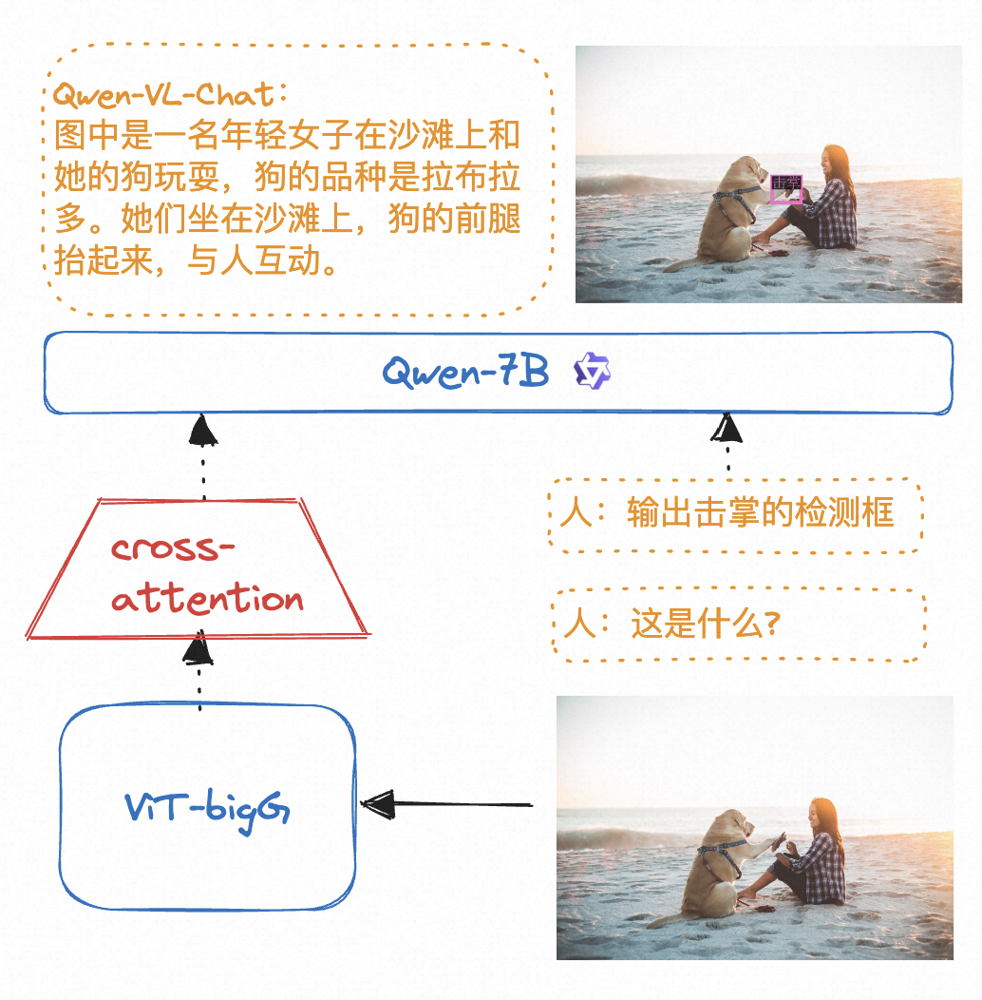
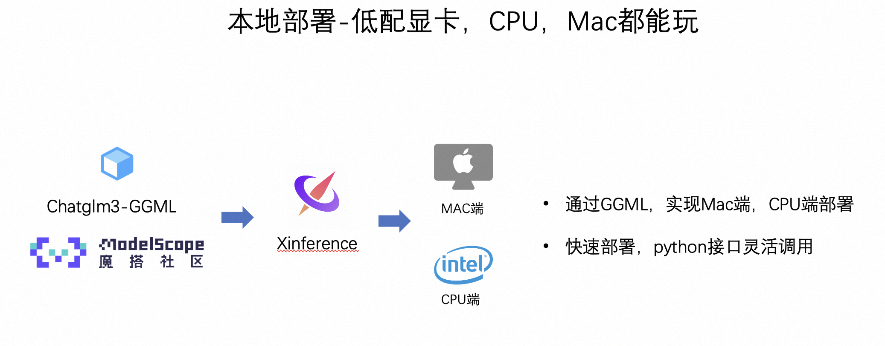
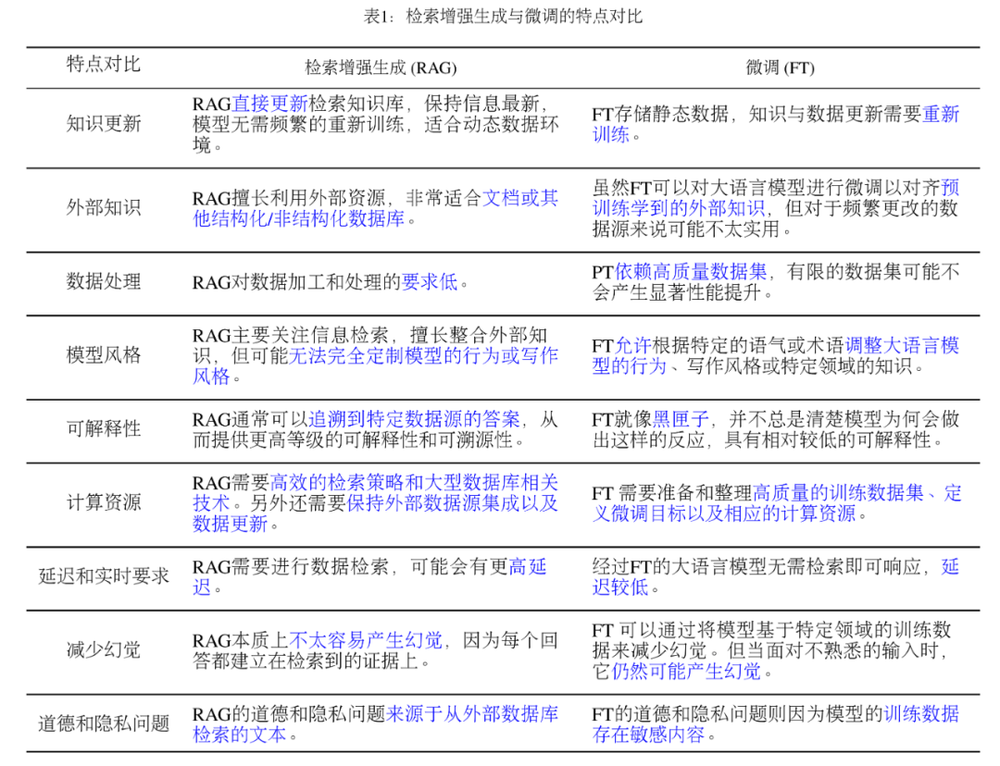

# LLM和多模态模型高效推理实践

**内容摘要**

本课程以Qwen系列模型为例，主要介绍在魔搭社区如何高效推理LLM和多模态模型，主要包括如下内容：

*   **LLM和多模态大模型的推理**
    
*   使用ModelScope NoteBook免费GPU推理Qwen-1.8B-Chat-int4
    
*   使用ModelScope NoteBook免费GPU推理Qwen-VL-Chat-int4
    
*   使用ModelScope NoteBook免费GPU推理Qwen-audio-Chat
    
*   **推理加速和多端推理**
    
*   推理加速：vLLM+fastchat加速推理
    
*   多端推理适配-Qwen.cpp和LLaMa.cpp转化模型为gguf或者ggml，并结合Xinference在本地笔记本部署。
    
*   **LLM的应用场景，RAG&Agent**
    
*   使用llama index和langchain打造基于本地知识库的ChatBot
    

**使用ModelScope NoteBook完成语言大模型，音频大模型，视觉大模型的推理**

LLM的推理流程：

多模态的LLM的原理：

代码演示：

[请至钉钉文档查看附件《实训课程-模型推理.ipynb》](https://alidocs.dingtalk.com/i/nodes/XPwkYGxZV347LdvpH2v4LDX2JAgozOKL?iframeQuery=anchorId%253DX02lrekqpvs4570vroz609)

vLLM+fastchat高效推理实战

FastChat是一个开放平台，用于训练、服务和评估基于LLM的ChatBot。

FastChat的核心功能包括：

*   优秀的大语言模型训练和评估代码。
    
*   具有Web UI和OpenAI兼容的RESTful API的分布式多模型服务系统。
    

vLLM是一个由加州伯克利分校、斯坦福大学和加州大学圣迭戈分校的研究人员基于操作系统中经典的虚拟缓存和分页技术开发的LLM服务系统。他实现了几乎零浪费的KV缓存，并且可以在请求内部和请求之间灵活共享KV高速缓存，从而减少内存使用量。

FastChat开源链接：[https://github.com/lm-sys/FastChat](https://github.com/lm-sys/FastChat)

vLLM开源链接：https://github.com/vllm-project/vllm

实战演示：

安装FastChat最新包

    git clone https://github.com/lm-sys/FastChat.git
    cd FastChat
    pip install .

## 环境变量设置

在vLLM和FastChat上使用魔搭的模型需要设置两个环境变量：

    export VLLM_USE_MODELSCOPE=True
    export FASTCHAT_USE_MODELSCOPE=True

### 使用FastChat和vLLM实现发布model worker(s)

可以结合FastChat和vLLM搭建一个网页Demo或者类OpenAI API服务器，首先启动一个controller：

    python -m fastchat.serve.controller

 然后启动vllm\_worker发布模型。如下给出单卡推理的示例，运行如下命令：

千问模型示例：

    #以qwen-1.8B为例，在A10运行
    python -m fastchat.serve.vllm_worker --model-path qwen/Qwen-1_8B-Chat --trust-remote-code --dtype bfloat16

启动vLLM优化worker后，本次实践启动页面端demo展示：

    python -m fastchat.serve.gradio_web_server --host 0.0.0.0 --port 8000

让我们体验极致推理优化的效果吧!

中文案例（千问1.8B）

[请至钉钉文档查看附件《12月25日 (2).mov》](https://alidocs.dingtalk.com/i/nodes/XPwkYGxZV347LdvpH2v4LDX2JAgozOKL?iframeQuery=anchorId%253DX02lqkjxmuyckt2fage86v)

多端部署-以qwen+个人Mac电脑为例

魔搭社区和Xinference合作，提供了模型GGML的部署方式，以qwen为例。

Xinference支持大语言模型，语音识别模型，多模态模型的部署，简化了部署流程，通过一行命令完成模型的部署工作。并支持众多前沿的大语言模型，结合GGML技术，支持多端部署。

**使用Qwen.cpp实现通义千问的多端部署：**

多端部署以1.8B模型为例，

第一步：使用qwen.cpp将pytorch格式的千问模型转为GGML格式

    python3 qwen_cpp/convert.py -i qwen/Qwen-1_8-Chat -t q4_0 -o qwen-1_8b-ggml.bin

第二步：在Xinference上launch模型，并部署到Mac笔记本实现推理。

[请至钉钉文档查看附件《录屏2023-11-27 17.01.39.mov》](https://alidocs.dingtalk.com/i/nodes/XPwkYGxZV347LdvpH2v4LDX2JAgozOKL?iframeQuery=anchorId%253DX02lpjfe0yq2b4qsaoj5rt)

**LLM的应用场景，RAG**

LLM会产生误导性的 “**幻觉**”，依赖的信息可能**过时**，处理特定知识时**效率不高**，**缺乏专业领域**的深度洞察，同时在推理能力上也有所欠缺。

正是在这样的背景下，检索增强生成技术（Retrieval-Augmented Generation，RAG）应时而生，成为 AI 时代的一大趋势。

RAG 通过在语言模型生成答案之前，先从广泛的文档数据库中检索相关信息，然后利用这些信息来引导生成过程，极大地提升了内容的准确性和相关性。RAG 有效地**缓解了幻觉问题**，提高了**知识更新的速度**，并增强了内容生成的**可追溯性**，使得大型语言模型在实际应用中变得更加**实用和可信**。

一个典型的RAG的例子：

这里面主要包括包括三个基本步骤：

1. 索引 — 将文档库分割成较短的 Chunk，并通过编码器构建向量索引。

2. 检索 — 根据问题和 chunks 的相似度检索相关文档片段。

3. 生成 — 以检索到的上下文为条件，生成问题的回答。

**RAG（开卷考试）VS. Finetune（专业课程学习）**

示例代码：[https://github.com/modelscope/modelscope/blob/master/examples/pytorch/application/qwen\_doc\_search\_QA\_based\_on\_langchain\_llamaindex.ipynb](https://github.com/modelscope/modelscope/blob/master/examples/pytorch/application/qwen_doc_search_QA_based_on_langchain_llamaindex.ipynb)