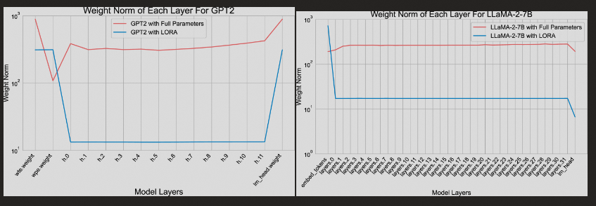
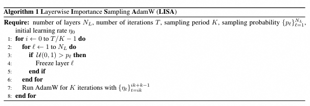
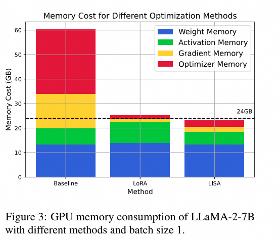
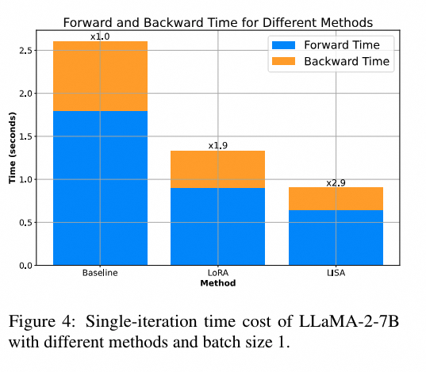
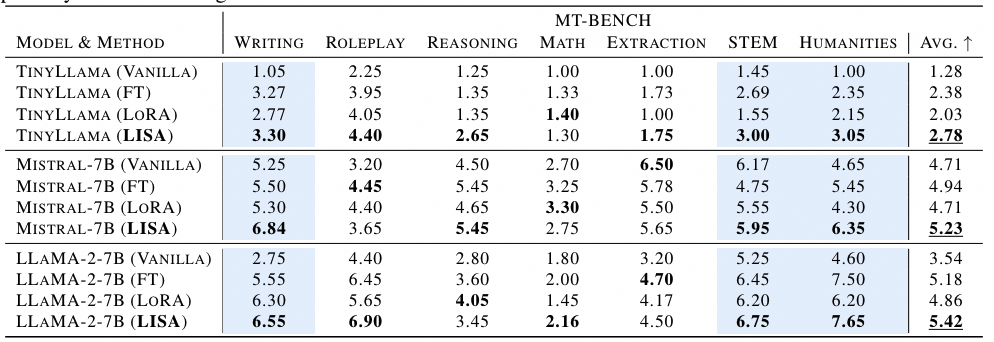
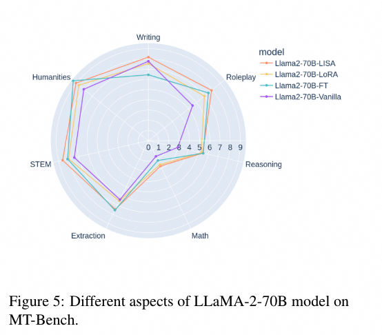
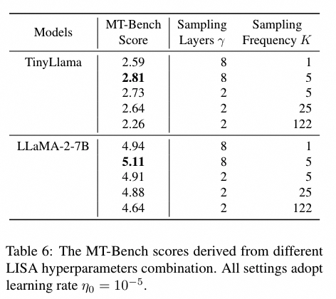
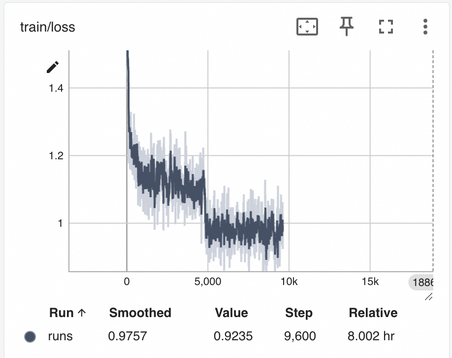
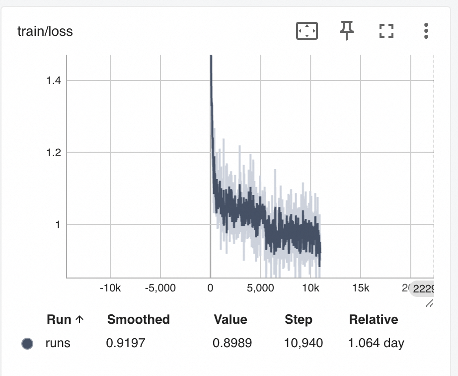

# **背景介绍**

LISA是Layerwise Importance Sampling for Memory-Efficient Large Language Model Fine-Tuning的简写。这个技术可以把全参训练的显存使用降低到之前的三分之一左右，而使用的技术方法却是非常简单的。例如，全参训练一个7b模型大约需要80G显存（相当于一张完整的A100显卡），但使用LISA训练后却可以使显存降低到30G左右，这使得使用40G A100显卡甚至是24G A10或者RTX 3090成为可能，且它的显存占用更低、训练速度更快。

论文地址：https://arxiv.org/abs/2403.17919

# **技术背景**

如果阅读者尚不熟悉深度学习基本原理，请参考魔搭社区提供的教程：

[https://github.com/modelscope/modelscope-classroom/blob/main/LLM-tutorial/A.%E6%B7%B1%E5%BA%A6%E5%AD%A6%E4%B9%A0%E5%85%A5%E9%97%A8%E4%BB%8B%E7%BB%8D.md](https://github.com/modelscope/modelscope-classroom/blob/main/LLM-tutorial/A.深度学习入门介绍.md)

## **技术解析**

LISA使用的技术原理相对简单。作者首先对LoRA训练和全参训练每个layer不同step时的L2范数的平均和进行了对比，结果如下：



作者训练了GPT2和LLaMA-2-7B两个模型，发现它们自身不同layers的parameters的LoRA训练和全参训练的L2范数不同，可以间接说明LoRA训练中由于低秩矩阵的存在，因此其参数更新的重点和全参数更新重点完全不同。可以看出，在权重更新时，除底层和顶层外其它层的L2范数都较小，因此作者假设可以在全参数训练时通过冻结大部分层的参数来模拟LoRA更新的行为，使其最后的参数迭代范数达到类似的效果。

完整的算法迭代可以用下图表示：



## **实验**

在官方实验中，作者对比了LISA和LoRA训练以及全参数的显存占用：




可以看到LISA的显存占用要小于LoRA。在训练速度上面：



官方实验结果，LISA的Forward和Backward时间要显著短于LoRA训练。在训练方面，作者进行不同尺寸的微调和大规模微调，均证明了LISA的效果要强于LoRA：






如何调节LISA的超参数呢？LISA的超参数包含两个值：

1. LISA采样的有效层数γ
2. LISA的更新频率K

消融实验对这两个值的对比如下：




可以看到LISA的性能在γ=8，采样频率K=5的时候达到最好。作者也证明，LISA对于不同的随机种子的鲁棒性很强，在此不列举表格。


## **本文的实验**

为了验证LISA在实际测试中的效果，我们对LISA进行了一定的实验。我们使用了魔搭社区提供的SWIFT框架（https://github.com/modelscope/swift），该框架支持LISA训练方式，且支持LoRA等通用训练方式。我们可以设置LISA的两个值：

- lisa_activated_layers 上文的γ
- lisa_step_interval 上文的K

我们使用如下命令进行训练：

```
# pip install ms-swift -U
sft.py \
 --model_type qwen-7b-chat \
 --dataset ms-agent \
 --train_dataset_mix_ratio 2.0 \
 --batch_size 1 \
 --max_length 2048 \
 --use_loss_scale True \
 --gradient_accumulation_steps 16 \
 --learning_rate 5e-05 \
 --use_flash_attn True \
 --eval_steps 2000 \
 --save_steps 2000 \
 --train_dataset_sample -1 \
 --val_dataset_sample 5000 \
 --num_train_epochs 2 \
 --check_dataset_strategy none \
 --gradient_checkpointing True \
 --weight_decay 0.01 \
 --warmup_ratio 0.03 \
 --save_total_limit 2 \
 --logging_steps 10 \
 --sft_type full \
 --lisa_activated_layers 2 \
 --lisa_step_interval 20
```

同时，我们将--lisa_activated_layers置为0，进行全参数训练，并且使用r=8进行了LoRA训练，得到的效果如下：

| **exp_name** | **model_type** | **dataset** | **tuner** | **tuner_params**                                             | **trainable params(M)** | **flash_attn** | **gradient_checkpointing** | **hypers**       | **memory**   | **train speed(samples/s)**               | **train_loss** | **eval_loss** | **gsm8k weighted acc** | **arc weighted acc** | **ceval weighted acc** |
| ------------ | -------------- | ----------- | --------- | ------------------------------------------------------------ | ----------------------- | -------------- | -------------------------- | ---------------- | ------------ | ---------------------------------------- | -------------- | ------------- | ---------------------- | -------------------- | ---------------------- |
| full         | qwen-7b-chat   | ms-agent    | full      |                                                              | 7721.3245(100.0000%)    | True           | True                       | lr=5e-05/epoch=2 | 73.53GiB     | 1.43(87543 samples/61022.97 seconds)     | **0.54**       | **0.95**      | 0.343                  | 0.536                | 0.495                  |
| full+lisa_2  | qwen-7b-chat   | ms-agent    | full      | lisa_activated_layers=2/lisa_step_interval=20                | 7721.3245(100.0000%)    | True           | True                       | lr=5e-05/epoch=2 | **31.11GiB** | **2.66(76837 samples/28881.28 seconds)** | 0.62           | 1.06          | 0.349                  | 0.653                | 0.592                  |
| full+lisa_4  | qwen-7b-chat   | ms-agent    | full      | lisa_activated_layers=4/lisa_step_interval=20                | 7721.3245(100.0000%)    | True           | True                       | lr=5e-05/epoch=2 | 31.87GiB     | 2.63(76837 samples/29215.15 seconds)     | 0.63           | 1.06          | 0.377                  | 0.656                | **0.607**              |
| lora         | qwen-7b-chat   | ms-agent    | lora      | rank=8/target=ALL/alpha=32/lr_ratio=None/use_rslora=False/use_dora=False | 17.8913(0.2312%)        | True           | True                       | lr=5e-05/epoch=2 | 32.35GiB     | 0.95(87543 samples/91974.29 seconds)     | 0.53           | 1.01          | **0.462**              | **0.676**            | 0.304                  |


从我们的实验中可以看到下面的结论：

1. 在显存占用中，全参数几乎是其他轻量训练方式显存占用的两倍，但是在loss中也是最低的，这说明全参数在模型训练的基础指标中仍然是最优的；
2. LISA的显存使用比r=8（这是个常用值）的显存占用要低，其中lisa_activated_layers越低显存越低
3. 训练速度上LISA的训练速度也比LoRA要快一些，并且该指标也受到lisa_activated_layers的影响
4. 在评估指标上，LoRA更为优秀，然而评估指标受到数据集的强烈影响，由于训练主要内容是Agent数据集，因此说明LoRA在防止灾难性遗忘上具有一定的优势



LISA lisa_activated_layers=2 训练的loss



LoRA r=8 训练的loss

可以观察到LISA的训练loss较LoRA曲线更为抖动一些，猜测可能是LISA随机挑选layer进行反向传播的随机性造成的。


## **结论**

可以看到LISA作为2024年的新晋tuner，使用一个非常简单的方式做到了部分数据集的SOTA，同时显存使用和训练速度也是很优秀的，且没有额外的使用条件。然而LISA仍然存在着一些可以分析讨论的问题，比如：是否可以通过参数范数或者参数矩阵特征值判断哪些layers应该被反向传播？或者是否可以在更细粒度上（qkv/mlp/layernorm）层面上控制反向传播？如果有做过实验的同学欢迎留言讨论。