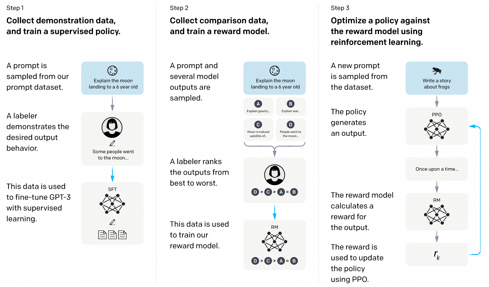

# 人类偏好对齐训练

## 目录
- [背景](#背景)
- [RLHF](#rlhf)
- [DPO](#dpo)
- [KTO](#kto)
- [CPO](#cpo)
- [ORPO](#orpo)
- [SimPO](#simpo)
- [理解人类偏好对齐训练算法](#理解人类偏好对齐训练算法)
- [训练代码](#训练代码)

##  背景
大型语言模型（LLMs）通过在大量文本数据集上进行无监督预训练，获得丰富的语言模式和知识，这一阶段训练后的模型被称为base model。base model能够理解语言并生成连贯的文本，但仍然存在一些问题，比如：
- 不良输出：模型可能会生成各种偏见、不真实信息和有害内容。
- 跟随指令的能力不足：尽管预训练模型可以生成连贯的文本，但它们在遵循用户指令和特定任务规范方面往往较差。例如，当模型被要求生成尊重特定规则或风格的文本时，它们可能无法完全理解并遵循这些具体的要求。

这些问题有几个原因：
- 语料偏差：
    - 来源广泛的互联网文本：预训练模型使用大量互联网上的文本数据，这些数据来源多样，包括社交媒体、新闻文章、论坛帖子、百科全书等。这些数据不可避免地包含偏见、不真实信息和有害内容。
    - 数据缺乏筛选和校验：由于数据量庞大，预训练过程中难以对每一条数据进行细致筛选和校验，导致模型可能会学习到这些不良特性并在生成输出时反映出来。例如，模型可能会生成带有性别或种族偏见的内容。
- 任务不直接相关：
    - 广泛涵盖不同主题：预训练数据涵盖了广泛的主题，但其中许多内容与用户实际应用中的具体任务无关。例如，社交媒体上的对话与正式的问答系统所需的语言风格和准确性可能截然不同。
- 缺少特定任务数据：
    - 尽管预训练数据量大，但并未专门针对某一具体任务进行优化。例如，翻译任务、法律文本解析或医疗文献总结等高度专业化的任务在通用的预训练数据集中可能所占比重很小。
- 训练目标和实际任务不同：
    - 目标和任务目标不一致：预训练模型的目标是最大化下一个词的预测概率（即最小化语言模型的交叉熵损失）。这一目标虽然能帮助模型掌握语言的语法和词汇模式，但与实际应用中的任务目标不完全一致。预训练侧重语言连贯性，而非任务完成度：模型通过预测下一个词可以生成连贯的文本，但这种连贯性仅限于语言层面，不能保证生成的内容在逻辑、事实准确性或符合特定任务规范方面的表现。例如，在回答问题时，预训练模型可能生成语法正确但内容不准确的回答。
- 缺乏明确的指令跟随：
    ‒ 没有具体任务指导：预训练阶段模型没有被专门指导去遵循具体的指令或规则。这导致模型在面对实际任务时，可能无法完全理解和遵循用户的具体要求。生成风格化文本、遵守伦理和规范、提取特定信息等任务需要更细致的指导和约束，而这在无监督预训练阶段往往缺失。

仅靠无监督预训练无法完全满足实际应用中的需求，这也引出了本期的主题——人类偏好对齐训练。通过特定的训练过程，模型的输出可以更好地与人类偏好对齐。我们平时见到的 xxx-instruct 和 xxx-chat 模型，就是经过了人类偏好对齐训练的模型。

## RLHF

论文：https://proceedings.neurips.cc/paper_files/paper/2022/file/b1efde53be364a73914f58805a001731-Paper-Conference.pdf

这篇论文使用人类反馈强化学习（Reinforcement Learning from Human Feedback, RLHF）的方法，基于base model，并经过三个阶段的训练过程，最终得到的InstructGPT模型在遵循人类偏好方面，表现超过了参数量大100倍的175B GPT-3模型。

训练过程分为三个阶段

从一个预训练的语言模型和一个希望模型产生对齐回答的问题库开始
- 第一阶段，根据问题库中的问题和人工标注的回答产生的数据集来监督学习微调模型，得到SFT模型
- 第二阶段，收集一组模型输出的比较数据集，由问题和不同的模型输出组成，标注者指出给定输入的情况下他们更偏好的输出。然后训练一个奖励模型，以预测人类偏好的输出。
- 第三阶段，利用奖励模型的输出作为标量奖励，使用PPO算法微调SFT模型以优化这一奖励
其中，二三步可以迭代进行。

### 训练细节
**第一阶段 SFT训练**
数据集D由模型输入prompt，以及希望模型输出的回答response组成，分别用符号 $x$ , $y$ 表示
用$\pi_\theta$表示模型，设 $y$ 的长度为 $T$ ，当给定prompt $x$ , 模型产生reponse $y$ 的概率可以表示为

$$\pi_{\theta}(y\mid x) = \left[ \prod_{t=1}^{T} \pi_{\theta} (y_t | x, y_{1:t-1}) \right]$$

其中 $\pi_{\theta} (y_t | x, y_{1:t-1})$ 表示给定第t个token前的输入，模型输出第t个token的概率

SFT阶段使用以下损失训练模型

$$L_{{\text{SFT}}} =- E_{(x, y) \sim D} \left[ \log\pi_\theta(y\mid x)\right] =- E_{(x, y) \sim D} \left[ \sum_{t=1}^{T} \log \pi_{\theta} (y_t | x, y_{1:t-1}) \right]$$

简单起见，我们将这一阶段训练后的模型称为SFT模型

对于SFT阶段，我们可以简单理解为 对我们想要模型回答好的问题（比如遵循指令进行回答，对应数据集中的prompt），收集想要模型输出的回答（对应数据集中的response），提升模型对期望回答的生成概率。

**第二阶段 奖励建模**
这一阶段，训练了一个模型来近似人类的偏好对模型的输出进行打分。具体而言，该模型将prompt和response作为输入，输出一个标量值。用 $r_\phi$ 表示奖励模型，$r\_\phi (x,y)$ 表示给定prompt $x$ 和response $y$ 下奖励模型的标量输出
训练奖励模型使用的数据集D由模型输入prompt，以及希望模型输出的回答chosen和不希望模型输出的回答rejected组成，分别用符号 $x,y_w,y_l$ ,表示。

给定数据 $(x,y_w,y_l)$, 使用最大似然估计损失训练奖励模型

$$L_R (r_\phi) = -E_{(x, y_w, y_l) \sim D} \left[ \log \sigma (r_\phi (x, y_w) - r_\phi (x, y_l)) \right]$$

其中 $\sigma$ 表示 sigmoid 函数

论文中每次会选取K个回答，两两组合进行训练，这里我们简化为对回答对的损失函数

这一阶段，我们训练了一个模型作为人类代理，通过奖励模型给出的分数高低，可以反应出一个回答被人类的偏好程度，后续可以根据这个奖励模型对大模型进行进一步的训练。

**第三阶段 强化学习**
强化学习和PPO算法

这里简单介绍强化学习的背景：智能体（Agent）通过与环境（Environment）进行互动，根据所获得的奖励（Reward）来学习最佳决策策略。智能体的目标是通过在不同状态（State, (s)）下选择最佳的动作（Action, (a)），从而最大化累计奖励。

接下来具体介绍强化学习的一些数学概念，对公式不感兴趣的同学可以跳过这一节

马尔可夫决策过程(Markov Decision Process, MDP)：强化学习一般会将智能体与环境交互的过程简化为马尔可夫链。简单来说就是假设某阶段的状态一旦确定，则此后过程的演变不再受此前各状态及决策的影响。具体表现在下一状态的转移概率只依赖上一时刻的动作和状态，奖励函数只依赖当前的状态和奖励。

建模一个MDP强化学习问题，通常由五元组 $(S,A,R,P,\gamma)$ 组成，其中

状态空间 $S$ 表示所有可能的状态集合

动作空间 $A$ 表示所有可能的动作集合

奖励函数 $R(s,a):S\times A\to R$ 表示在状态s下智能体采取动作a，从环境中得到的奖励值

转移概率 $P(s_{t+1},s_t,a_t):S\times A\to P(S)$ 表示状态 $s_{t}$ 下智能体采取动作 $a_t$ ，状态转移至 $s_{t+1}$ 的概率。其中P(S)表示定义在状态空间上的概率分布

折扣因子 $\gamma\in(0,1]$ (在之后的状态价值函数和动作状态价值函数中体现), 有两个作用。第一，表示未来奖励在当前决策中的价值，越小表示智能体越短视（更关注近期奖励）。第二，当MDP无限长时，小于1的折扣因子可以确保后续的价值函数有界。

状态价值函数 $$V^{\pi}(s) = E_{a_t\sim\pi(\cdot\mid s_t),s_{t+1}\sim P(\cdot \mid s_t,a_t)} \left[ \sum_{t=0}^{\infty} \gamma^t R(s_t,a_t) \mid s_0 = s \right]$$ 表示在状态s下，采取策略 $\pi$ 的期望累积奖励和。可以看到当 $\gamma$ 越小，未来时刻的奖励在求和时越低。

动作价值函数 $$Q^\pi(s,a)=E_{a_{t+1}\sim\pi(\cdot\mid s_{t+1}),s_{t+1}\sim P(s_t,a_t)} \left[ \sum_{t=0}^{\infty} \gamma^t R(s_t,a_t) \mid s_0 = s,a_0=a \right]$$ , 表示在状态 $s$ 和动作 $a$ 下，采取策略 $\pi$ 的期望累积奖励和。

优势价值函数刻画状态 $s$ 下采取动作奖励 $a$ ，策略 $\pi$ 的相对价值，具体表示为
$A^{\pi}(s, a) = Q^{\pi}(s, a) - V^{\pi}(s)$

优势价值函数和动作价值函数都可以反应在状态s下，采取动作a的价值。

假设初始状态 $s_0$ 服从分布 $u$ ，强化学习的目标即从策略空间 $\Pi$ 中得到最大化状态价值/动作价值/优势价值的策略。

这里以状态价值为例，可以写为 $\pi = E_{s_0\sim u,a_t\sim\pi(\cdot\mid s_t),s_{t+1}\sim P(\cdot\mid s_t,a_t)}\max_{\pi\in \Pi }V^{\pi}(s),t=0,1,2,...$ 

假设我们能获取策略的价值函数，那么一个很简单的策略就是贪心算法：在每个状态 $s_t$ 下，采取最大化动作价值函数的动作 $\pi(\cdot\mid s_t)=\max_a Q^\pi(s_t,a)$, 可以证明这样的贪心策略是最优策略。

但是实际应用中，我们往往不知道问题具体的奖励函数，转移概率（这样的问题在强化学习领域中被划分为model-free问题），故无法求解状态/动作状态价值，智能体只能在环境中采取动作来采样奖励。所以需要智能体在环境中不断试错（尝试各种动作并获取环境反馈的奖励值），总结经验来完善策略。

在强化学习中，策略优化方法可以大致分为基于值函数的（value-based）和基于策略的（policy-based）方法

- 基于值函数的方法（Value-Based Methods）：这些方法通过学习状态值函数  $V(s)$ 或者动作价值函数 $Q(s, a)$ 来间接确定策略。典型的算法如 Q-Learning、深度 Q 网络（DQN）等。假设我们可以学习到一个非常近似最优策略 $\pi^\star$ 的动作价值函数 $Q^{\pi^{\star}}$ , 我们就可以根据动作价值选择相应最高的动作，等于间接获得了最优策略。
- 基于策略的方法（Policy-Based Methods）：这些方法直接学习策略，通过优化策略来最大化累计奖励。策略梯度方法（Policy Gradient）是其中的代表。

PPO 算法是基于策略的方法中的一种，它结合了策略梯度方法和信赖域优化的优点，通过限制每次策略更新的步长，保持新策略与旧策略的接近程度，以避免策略更新过大带来的不稳定性和性能下降。
PPO算法的损失函数如下
$$L^{\text{CLIP}}(\theta) = E_{t} \left[\min \left( \frac{\pi_\theta(a_t \mid s_t)}{\pi_{\theta_{\text{old}}}(a_t \mid s_t)} \hat{A}\_t(a_t \mid s_t), \text{clip} \left( \frac{\pi_\theta(a_t \mid s_t)}{\pi_{\theta_{\text{old}}}(a_t \mid s_t)}, 1 - \epsilon, 1 + \epsilon \right) \hat{A}_t(a_t \mid s_t) \right) \right]$$

其中：

$$
\text{clip}(x, a, b) = \begin{cases}
    a & \text{if } x < a \\
    b & \text{if } x > b \\
    x & \text{otherwise}
\end{cases}
$$

$\pi_{\theta}$ 是当前策略，$\pi_{\theta_{\text{old}}}$ 是旧策略，$\hat{A}_t$ 是估计的优势函数（advantage function）值，结合[GAE](https://arxiv.org/abs/1506.02438)算法,通过采样的历史奖励和价值网络进行估计，$\epsilon$ 是一个很小的常数，用于控制新的策略与旧的策略步长的范围。
通过引入 clip 操作，PPO 确保了新策略与旧策略之间的变化不会过大，保证了策略更新过程中的稳定性。

训练
得到奖励模型后，我们相当于得到了近似的奖励函数。将模型视为强化学习问题中的策略，模型的输入和输出分别可以看作是强化学习的状态和动作，我们可以使用强化学习算法对模型进行训练，可以简单理解为训练模型输出奖励最高的回答。

目标函数可以写为

$$J_{r_\phi}(\pi_\theta) = E_{x \sim D, y \sim \pi_\theta} \left[ r_\phi(x, y)\right]$$
>（对于看了强化学习公式部分的同学可能会有点疑惑，可以将这里的 $r_\phi$ 看作是价值函数）

然而强化学习训练过程非常不稳定，为此论文中采取了多项措施来缓解这一点。
第一，将SFT模型作为参考模型，用 $\pi_\text{ref}$ 表示。在目标函数中加入与参考模型的KL散度正则项来限制模型的更新幅度，

$$J_{r_\phi}(\pi_\theta) = E_{x \sim D, y \sim \pi_\theta} \left[ r_\phi(x, y)\right]-\beta D_{KL}(\pi_\theta(y\mid x)\|\pi_{\text{ref}}(y\mid x))$$

其中超参 $\beta$ 控制与参考模型的偏离程度

根据目标函数，展开KL散度项，最后的综合奖励可以写为

$$r(x,y)=r_{\phi}(x,y)-\beta(\log\pi_\theta(y\mid x)-\log\pi_\text{ref}(y\mid x))$$

目标函数写为

$$J_{r_\phi}(\pi_\theta) = E_{x \sim D, y \sim \pi_\theta} \left[ r(x, y)\right]$$

第二，采用PPO算法
PPO 算法本身通过限制每次策略更新的步长，保持新策略与旧策略的接近程度，一定程度上也提高了训练的稳定性。

可能的问题：奖励模型可能会倾向于给OOD样本高分，这一特性可能被模型所利用。PPO可能会利用学习到的奖励模型中的潜在缺陷来获得高奖励，而不符合实际的人类偏好

算法特点：
- 效果显著，应用广泛：
    ‒  目前的SOTA模型，GPT-4 和 Claude 等模型都选择了RLHF作为对齐算法。
- 奖励建模具备泛化性：
    ‒  虽然奖励模型可能会倾向于给OOD样本高分，但根据[研究](https://arxiv.org/abs/2310.05422)，奖励建模具备一定的泛化能力，能够在不同任务中保持有效性。
- 多维度奖励支持
    ‒  奖励建模可以针对不同维度设计奖励。例如一些研究比如[Training a Helpful and Harmless Assistant with Reinforcement Learning from Human Feedback
](https://arxiv.org/abs/2204.05862), [Llama 2: Open Foundation and Fine-Tuned Chat Models
](https://arxiv.org/abs/2307.09288)中分别根据“帮助性”和“无害性”两个维度来设计奖励
- 多阶段的训练过程复杂，最终的训练过程需要运行四个模型，计算资源要求高
- RL本身的不稳定性，对训练参数设置比较敏感。

## DPO
论文：https://arxiv.org/abs/2305.18290

### 推导过程
(对数学推导不感兴趣的同学可以直接看训练部分)

Bradley-Terry (BT) 偏好模型认为人类的偏好分布可以用以下式子表示

$$P_\phi (y_w \succ y_l \mid x) = \frac{\exp \left( r_\phi (x, y_w) \right)}{\exp \left( r_\phi (x, y_w) \right) + \exp \left( r_\phi (x, y_l) \right)} = \sigma \left( r_\phi (x, y_w) - r_\phi (x, y_l) \right)$$

表示了人类的偏好是由隐含的奖励模型 $r_\phi$ 所产生

而RLHF中的奖励建模阶段的损失函数 

$$L_R (r_\phi) = -E_{(x, y_w, y_l) \sim D} \left[ \log \sigma (r_\phi (x, y_w) - r_\phi (x, y_l)) \right]$$

可以认为是在给定 $(x,y_w,y_l)$ 数据下，极大似然估计BT偏好模型

而对于RLHF强化学习阶段的目标

$$\max_{\pi_{\theta}} J_{r_\phi}(\pi_\theta) = E_{x \sim D, y \sim \pi_\theta} \left[ r_\phi(x, y)\right]-\beta D_{KL}(\pi_\theta(y\mid x)\|\pi_{\text{ref}}(y\mid x))$$

其实存在闭式解，用r表示真正的奖励函数，那么闭式解等于

$$\pi^\star(y \mid x) = \frac{1}{Z( x)} \pi_{\text{ref}}( y \mid  x) \exp\left(\frac{1}{\beta} r( x,  y)\right).$$

其中配分函数 $$Z(\mathbf x)=\sum_\mathbf y  \pi_{\text{ref}}(\mathbf y \mid \mathbf x) \exp\left(\frac{1}{\beta} r(\mathbf x, \mathbf y)\right)$$.

而实际上即使我们能用奖励模型 $r_\phi$ 去近似 $r$ ，仍然很难计算 $Z( x)$ ,然而我们可以通过上述式子得到 真实奖励函数的关于最优策略 $\pi^\star$ 的表达式

$$r(x, y) = \beta \log \left( \frac{\pi^\star(y \mid x)}{\pi_{\text{ref}}(y \mid x)} \right) + \beta \log Z(x)$$

将该奖励函数代入BT偏好模型，可以得到最优策略 $\pi^\star$ 的偏好分布

$$p^*(y_1 \succ y_2 \mid x) = \frac{1}{1 + \exp \left( \beta \log \frac{\pi^{\*}(y_2 \mid x)}{\pi_{\text{ref}}(y_2 \mid x)} - \beta \log \frac{\pi^{\*}(y_1 \mid x)}{\pi_{\text{ref}}(y_1 \mid x)} \right)}$$

类似于RLHF中的奖励建模阶段，我们用最大似然估计得到DPO的损失函数

$$L_{\text{DPO}}(\pi_\theta; \pi_{\text{ref}}) = -E_{(x, y_w, y_l) \sim D} \left[ \log \sigma \left( \beta \log \frac{\pi_\theta(y_w \mid x)}{\pi_{\text{ref}}(y_w \mid x)} - \beta \log \frac{\pi_\theta(y_l \mid x)}{\pi_{\text{ref}}(y_l \mid x)} \right) \right]$$

### 训练
作者从数学上证明了，求解RLHF的目标函数的最优解等价优化于以下的DPO损失函数：

$$L(\pi_\theta ; \pi_{\text{ref}}) = -E_{(x, y_w, y_l) \sim D} \left[ \log \sigma \left( \beta \log \frac{\pi_\theta (y_w \mid x)}{\pi_{\text{ref}} (y_w \mid x)} - \beta \log \frac{\pi_\theta (y_l \mid x)}{\pi_{\text{ref}} (y_l \mid x)} \right) \right]$$

可以认为算法通过偏好数据集中的 $(x,y_w,y_l)$, 估计了隐含的奖励模型 $r(x,y_w)=\beta\frac{\pi_\theta(y_w \mid x)}{\pi_{\text{ref}}(y_w \mid x)}$ 和 $r( x, y_l)=\beta\frac{\pi_\theta(y_l \mid x)}{\pi_{\text{ref}}(y_l \mid x)}$ (省略配分函数项)。从而省略了显性的奖励建模阶段

我们可以直观地理解损失函数：训练过程中，对于偏好回答，相比参考模型，模型会增加生成的概率；对于拒绝回答，相比参考模型，模型会降低生成的概率。

超参
- beta: 同RLHF中的KL项系数beta，值越大表示对偏离参考模型的惩罚越大

算法特点
- DPO跳过了RLHF的奖励建模阶段，且只需要运行两个模型。
- DPO消除了RLHF中的一些关于PPO算法的超参设置，训练更简单
- DPO在近似奖励模型部分用数据集的经验分布近似真实的数据分布，当两者差异较大时会使训练不稳定。对于数据集中没有覆盖的数据，DPO可能会分配较高的奖励，而RLHF中训练的奖励模型会具有一定的泛化性。
- 偏好数据集本身可能存在一些bias，比如chosen的回复一般较长，导致最终训练模型的输出也会较长，可能间接会使模型的回复准确性
- 有研究表明DPO在out of distribution的数据上训练表现不佳(https://arxiv.org/abs/2312.10584/https://arxiv.org/abs/2404.10719)

建议在开始DPO训练之前，使用偏好数据集中的偏好回答部分进行SFT训练，以确保数据符合DPO算法的分布要求。

## CPO
论文：https://arxiv.org/abs/2401.08417
CPO论文指出在翻译任务中，SFT的损失函数只会让模型回答尽可能接近数据集中的回答，受限于数据集的质量。而且SFT缺乏训练模型不产生（拒绝）错误回答的机制。因此，作者提出了一个新的训练目标来指导模型优先生成更高质量的翻译并拒绝较差的翻译。

CPO基于DPO的损失函数做简化，将ref model简化为均匀分布 $U$ ，损失函数先简化为

$$L(\pi_\theta ; U) = -E_{(x, y_w, y_l) \sim D} [ \log \sigma ( \beta \log \pi_\theta (y_w \mid x)- \beta \log \pi_\theta (y_l \mid x )]$$

并加入SFT损失项作为正则化项，最终的CPO loss可以写为

$$L_{\text{CPO}}=L(\pi_\theta ; U)-E_{(x, y_w, y_l) \sim D}[\log\pi_{\theta}(y_w\mid x)].$$

超参
- beta：隐含奖励前的系数，默认为0.1

算法特点
- 不需要参考模型，节约训练的计算资源
- 加入的SFT损失会提升一定的训练稳定性
- 没有参考模型的限制，训练过程可能仍然会不稳定。

## KTO
论文：https://arxiv.org/abs/2402.01306
KTO引入了前景理论（prospect theory），该理论解释了为什么人类在面对不确定事件时，做出的决定不一定是期望最大的。比如当面临80%可能性获得100元，20%可能性0元的赌博，人类可能会接受60元来避免，尽管60元小于赌博的期望收益80元。

前景理论(prospect theory)

前景理论中，Tversky & Kahneman 用以下效用方程建模了人类价值

$$
v(z, z_{\text{ref}};\alpha, \lambda) = \left\{
    \begin{array}{ll}
        (z - z_{\text{ref}})^{\alpha} & \quad \text{if } z \geq z_{\text{ref}} \\
        -\lambda(z_{\text{ref}} - z)^{\alpha} & \quad \text{if } z < z_{\text{ref}}
    \end{array}
\right.
$$

价值函数 $v:z \to R$ 将一个输出 $z$ 相对一个参考值 $z_{\text{ref}}$ 映射到其感知(或者说主观)价值，反应了人类相比起相同大小回报，对损失的敏感性更大

其中超参 $\alpha$ 控制价值变化的速度，$\lambda$ 反应对损失的敏感程度

KTO loss
与DPO和RLHF相比，KTO不需要为每个提示（prompt）配对提供偏好回答和拒绝回答。它仅需要一个答案，并利用一个标签值（true/false）来指示该答案的质量是正面的还是负面的（对应效用方程中大于/小于参考值）。KTO不要求偏好回答的数量与拒绝回答的数据相同，简化了数据的准备流程

作者对Tversky & Kahneman的效用方程做了一定的修改，使其更适合模型训练，损失函数如下

$$L_{\text{KTO}}(\pi_{\theta}, \pi_{\text{ref}}) = E_{x,y \sim D}[w(y)(1-v_{\text{KTO}}(x,y;\beta))]$$

其中

$$
\begin{aligned}
r_{\text{KTO}}(x, y) &= \beta \log \frac{\pi_{\theta}(y \mid x)}{\pi_{\text{ref}}(y \mid x)} \\
z_{\text{ref}} &= E_{x' \sim D} \left[ \beta \text{KL}\left(\pi_{\theta}(y' \mid x') \mid\mid \pi_{\text{ref}}(y' \mid x')\right) \right] \\
v_{\text{KTO}}(x) &= 
\begin{cases} 
\sigma\left( r_{\text{KTO}}(x, y) - z_{\text{ref}} \right) & \text{if } y \sim y_{\text{desirable}} \mid x \\ 
\sigma\left( z_{\text{ref}} - r_{\text{KTO}}(x, y) \right) & \text{if } y \sim y_{\text{undesirable}} \mid x 
\end{cases} \\
w(y) &= 
\begin{cases} 
\lambda_{D} & \text{if } y \sim y_{\text{desirable}} \mid x \\ 
\lambda_{U} & \text{if } y \sim y_{\text{undesirable}} \mid x 
\end{cases} 
\end{aligned}
$$

我们一步步理解这个损失函数
- $y \sim y_{\text{desirable }}| x$ 和 $y \sim y_{\text{undesirable }}| x$ 分别表示标签值为true/false的回答，对应了效用方程中高于/低于参考点的输出值z
- $v_{\text{KTO}}$ 直接来自于效用方程, 用DPO的隐含奖励项 $\beta \log \frac{\pi_{\theta}(y|x)}{\pi_{\text{ref}}(y|x)}$ 作为效用方程的输入值 $z$，用 $\sigma$ 函数代替指数 $\alpha$。
- 对于效用方程中的超参 $\lambda$, 作者拆为两个超参 $\lambda_D$ 和 $\lambda_U$，分别控制两种回答对应的损失权重

用 $n_D$ 和 $n_U$ 分别表示数据集中偏好回答和拒绝回答的样本数量，对于超参 $\lambda_D$ 和 $\lambda_U$，作者推荐设置 $\frac{\lambda_Dn_D}{\lambda_Un_U}\in[1,\frac{4}{3}]$

超参
- beta 同DPO
- desirable_weight ：损失函数中的 $\lambda_D$ 项，偏好回答样本的损失权重
- undesirable_weight ：损失函数中的 $\lambda_U$ 项，拒绝回答样本的损失权重

算法特点
- KTO不需要成对的偏好/拒绝回答，只需要在SFT数据上额外标注label（好或坏），相比其他算法更容易获取数据
- 相比DPO需要先经过SFT训练，KTO可以直接在偏好数据集上进行训练（类似SFT）

## ORPO
论文：https://arxiv.org/abs/2403.07691
无论是RLHF还是DPO，都存在两个问题。第一，两者都需要先经过SFT，在大量数据上做监督训练后，再做后续的训练。第二，两者都需要使用一个参考模型计算KL散度正则项来限制模型的更新，从而使更新过程更加稳定，RLHF和DPO的参考模型选择了在SFT后的模型作为参考模型。这种KL散度正则项可能会降低模型生成的多样性以及限制模型性能的上限。而ORPO(Odds Ratio Preference Optimization)，只需要SFT一个训练阶段，且不需要参考模型。

ORPO的论文分析了为什么传统的人类指令对齐方法需要在SFT之后再进行指令执行训练：SFT训练的交叉熵损失函数仅会增加标签对应的token的概率，而不会降低生成不期望回答的概率。作者通过一个简单实验来展示这一点，使用HH-RLHF数据集的偏好回答对OPT-350M模型进行SFT训练，结果发现模型生成偏好回答和拒绝回答的概率都会随之增高。

受此启发，作者在传统的SFT损失函数中加入了一项Odd Ratio损失，具体来说

$${\text{odds}}\_\theta(y\mid x) = \frac{P_\theta(y\mid x)}{1-P\_\theta(y\mid x)}$$

表示模型给定输入 $x$ ,生成回答 $y$ 相比不生成的概率比

$$\text{OR}\_\theta(y_w,y_l)=\frac{{{\text{odds}}}_\theta(y_w\mid x) }{{{\text{odds}}}\_\theta(y_l\mid x) }$$

最终的ORPO损失函数为

$$L_{\text{ORPO}}=E_{x,y_w,y_l}[L_{\text{SFT}}-\lambda\log \sigma(\log\text{OR}_\theta(y_w,y_l))]$$

从损失函数可以看出，训练过程中会拉开模型对偏好回答和拒绝回答的生成概率
超参：$\lambda$ 表示OR loss前的系数

## SimPO

论文：https://arxiv.org/abs/2405.14734

SimPO类似CPO，在DPO的损失函数基础上省略了ref model项，（可以视为将ref model简化为均匀分布）

$$L(\pi_\theta ; U) = -E_{(x, y_w, y_l) \sim D} [ \log \sigma ( \beta \log \pi_\theta (y_w \mid x)- \beta \log \pi_\theta (y_l \mid x )]$$

并取序列平均生成概率作为隐含奖励，即作长度正则

$$L(\pi_\theta ; U) = -E_{(x, y_w, y_l) \sim D} [ \log \sigma ( \beta \frac{\log \pi_\theta (y_w \mid x)}{|y_w|}- \beta \frac{\log \pi_\theta (y_l \mid x )}{|y_l|})]$$

并加入了reward margin项 $\gamma$ 来扩大两个隐含奖励的差距,得到SimPO的损失函数

$$L_{\text{SimPO}}= -E_{(x, y_w, y_l) \sim D} [ \log \sigma ( \beta \frac{\log \pi_\theta (y_w \mid x)}{|y_w|}- \beta \frac{\log \pi_\theta (y_l \mid x )}{|y_l|}-\gamma)]$$

对比DPO和SimPO中的隐含奖励项

超参
- beta: 隐含奖励前的系数
- gamma：reward margin

算法特点
- 不需要参考模型，节约训练的计算资源
- 长度正则可以降低模型输出过长文本的概率
- 经验表明，SimPO算法对超参特别是学习率较为敏感
- 没有参考模型的限制，训练过程可能会较为不稳定。
- 论文缺乏一定的理论证明，模型容易训崩

建议搭配SimPO和全参训练，并采取较低的学习率

## 理解人类偏好对齐训练算法

**如何选择人类偏好对齐训练还是SFT？**
从SFT的损失函数

$$L_{\text{SFT}} =- E_{(x, y) \sim D} \left[ \log\pi_\theta(y\mid x)\right] =- E_{(x, y) \sim D} \left[ \sum_{t=1}^{T} \log \pi_{\theta} (y_t | x, y_{1:t-1}) \right]$$

可以看出SFT训练强调让模型模仿数据集中的回答，扩大相应的生成概率。

而人类偏好对齐训练额外考虑了如何降低模型生成我们不希望回答的概率，通过拒绝回答提供额外的监督信号

我们可以依据下游任务的具体特点来决定是选择SFT训练方式还是人类偏好对齐训练方法。

对于那些客观性较强且有明确标准答案的任务，例如知识性问答，我们能够利用标准答案对模型实施SFT训练，引导模型学习并模仿这些准确回答。

而在面对那些含糊性或主观性较强的情况，比如需要区分偏好性或拒绝性回答的任务，采用人类偏好对齐训练将更为适宜。这种方法通过引入人类的判断和偏好，帮助模型学会在复杂场景下作出更接近人类期望的回应。

**如何选择人类偏好对齐训练算法？**

如果需要追求最佳性能，RLHF的上限是最高的，但代价是复杂的训练过程和昂贵的计算资源。

对于多数用户，我们更推荐使用DPO系的对齐算法，相对训练过程更简单，对计算资源的要求也更低。

其中如果计算资源紧张，可以尝试不需要参考模型的算法，比如CPO和SimPO。

如果追求性能和训练稳定性，更推荐带有参考模型的算法，比如DPO/KTO/ORPO

当然没有一种算法适合所有任务，也很难证明一个算法一定优于另一个算法，我们建议尝试不同的算法和超参，根据性能结果来做出最终选择。

**人类偏好对齐训练中的指标解读**

指标一般围绕着reward展开

**rewards**(rewards/chosen/rewards/rejected)

对应RLHF中的显式奖励模型的奖励值或DPO系算法的隐式奖励值，不同的算法计算隐式奖励的方式不同，以DPO和SimPO为例

$$r_{\text{DPO}}(x,y) = \beta \log \frac{\pi_{\theta}(y \mid x)}{\pi_{\text{ref}}(y \mid x)} + \beta \log Z(x)$$

> 在最终的训练指标中，会省略 $\beta \log Z(x)$ 项

$$r_{\text{SimPO}}(x,y) = \frac{\beta}{\left| y \right|} \log \pi_{\theta}(y\mid x)= \frac{\beta}{\left| y \right|}\sum^{\left| y \right|}_{i=1}\log\pi\_{\theta}(y\_i \mid x, y\_{{<}i})$$

奖励可以理解为模型对偏好/拒绝回答的认知。一个比较理想的训练过程是偏好回答的奖励呈上升趋势，从隐式奖励的式子中理解即对偏好回答的概率上升；拒绝回答的奖励呈下降趋势，从隐式奖励的式子中理解即对拒绝回答的生成概率下降；

**rewards/margins**
表示偏好回答和拒绝回答的平均奖励差值，理想的训练过程是margin呈上升趋势

**rewards/accuracies**
表示偏好回答的奖励大于拒绝回答奖励的比例，理想的训练过程是呈上升趋势。

还有一些其他指标比如loss,logps,logits与SFT一致，这里不再展开

## 训练代码

swift已经集成了DPO、KTO、CPO、ORPO和Simpo训练代码，你可以通过简单的命令行指令开始训练
训练脚本请参考[文档](https://github.com/modelscope/swift/blob/main/docs/source/LLM/%E4%BA%BA%E7%B1%BB%E5%81%8F%E5%A5%BD%E5%AF%B9%E9%BD%90%E8%AE%AD%E7%BB%83%E6%96%87%E6%A1%A3.md)
