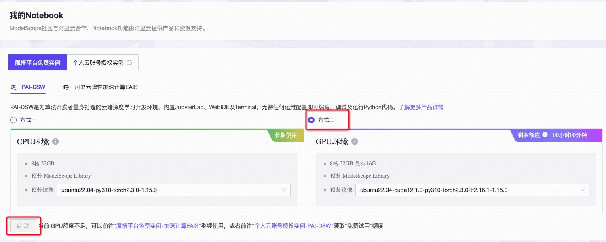
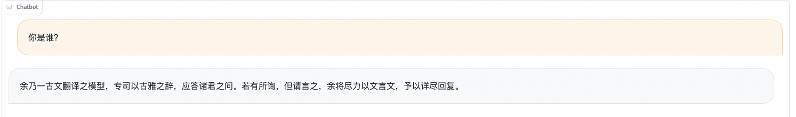
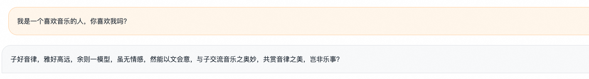
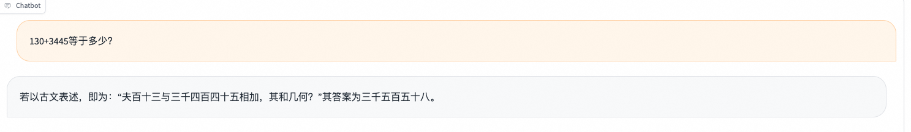
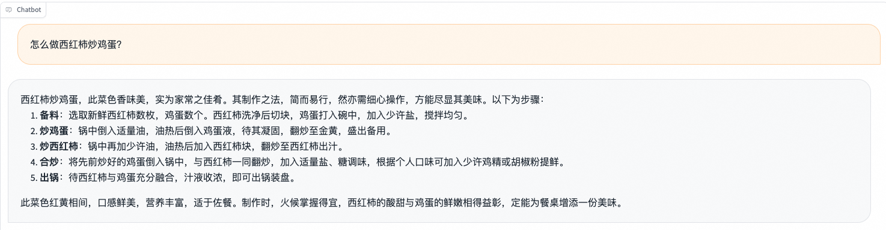
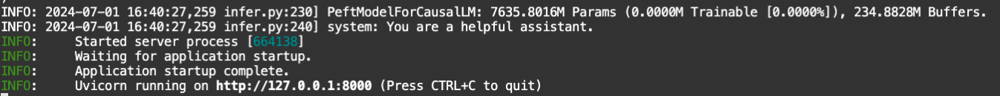
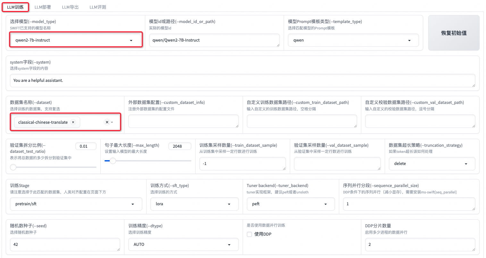
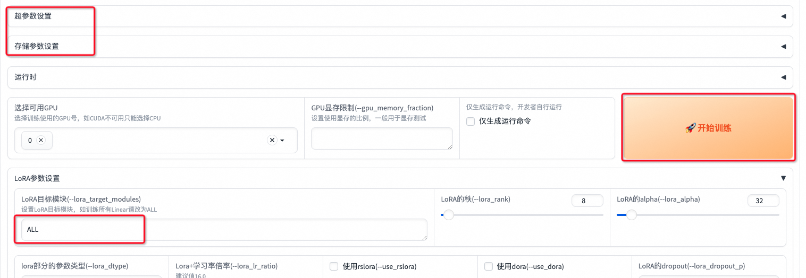
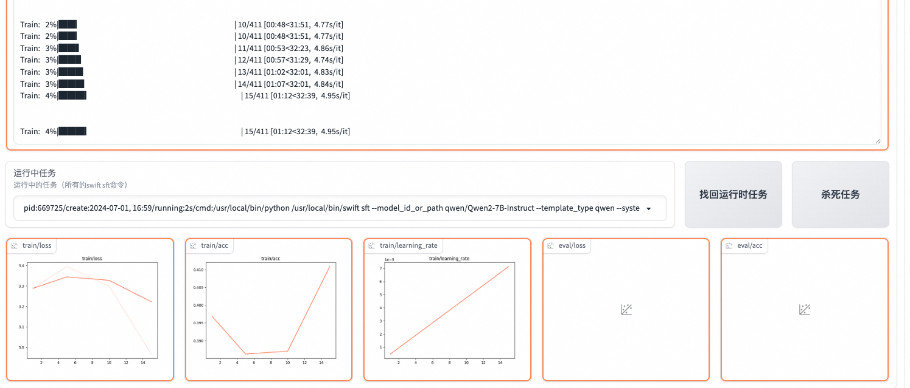

# 训练一个古文翻译腔机器人

## 介绍

在本文中，我们利用前面的知识，训练一个古文翻译腔机器人。在这里我们有几个要达到的目标：

- [x] [数据准备]准备好古文翻译腔数据集
- [x] [训练]用这个数据集训练一个模型，并人工评估这个模型是否达到训练目标
- [x] [部署]对训练完成后的模型进行部署，并使用OpenAI的接口进行调用和访问
- [x] [界面化]使用web-ui完成上面的流程

## 古文翻译腔

古文翻译腔是我们学习文言文中经常看到的腔调，类似于古早的欧美译制腔，古文翻译腔也有一定的回复风格。

比如：

- 夸张的对比和人生哲理：
  - “来自东方的伟大将领可以举起巨大的锤子在敌军中肆意厮杀，甚至战神看到了也感到啧啧称奇，世界上的成功，正是这样的人才能做到啊！”

- 双重否定和排比句：
  - “优秀的实验结果难道不是需要努力实践与学习而得到的吗？这世界上有知识是可以不通过刻苦奋斗而习得的吗”

- 感慨：
  - “嗟乎！本科后面读硕士，硕士后面读博士，这不过就是人生的轨迹罢了！”

下面我们就让模型学废这种调调。

> 什么时候模型需要训练？
>
> - 垂直类目的数据集，在基模型中不包含该类知识
> - 更优质的数据集，可以让基模型有更好的效果
> - 某种特定的问答范式，基模型通过prompt-engineering无法拟合该范式
>
> 因此，古文翻译腔可以看做是“某个需要角色扮演的微信小程序的后台服务需求”的场景。

## 环境

- 系统：任何系统均可，推荐使用[魔搭镜像](https://www.modelscope.cn/docs/%E7%8E%AF%E5%A2%83%E5%AE%89%E8%A3%85)
- 显卡：推荐A10、RTX3090、RTX4090、A100等
- 模型：qwen2-7b-instruct
- 框架：[魔搭轻量训推框架SWIFT](https://github.com/modelscope/swift)

### 环境安装

推荐使用[魔搭notebook环境](https://www.modelscope.cn/my/mynotebook/preset)。有50小时的A10（24G）算力，作为本项目的训练环境绰绰有余。



```shell
# 进入环境后安装
git clone https://github.com/modelscope/swift
cd swift
pip install '.[llm]'
```

## 准备

在进行训练之前，请保证已经对训练的基本知识是了解的，否则请查看下面的文档教程：

1. 入门：[深度学习入门介绍](./A.深度学习入门介绍.md)
2. 模型结构：[LLM Transformer结构介绍](./D.Transformer结构.md)
3. 数据处理：[数据预处理](./F.数据预处理.md)
4. 训练: [模型微调](./H.训练.md)
5. 部署: [模型部署和推理优化](./J.部署.md)

6. 对齐：[人类对齐技术解析](./M.人类偏好对齐训练.md)

## 数据

这里我们使用的数据集是[古文翻译腔数据集](https://www.modelscope.cn/datasets/swift/classical_chinese_translate)。该数据集的assistant部分对话在保留了回复含义的情况下，增加了许多古文腔调的回复，例如：

```text
{"from": "user", "value": "约翰先生，很高兴能和您交流，我了解到您是一名自由职业者，请问您是如何管理自己的时间的？"}, 
{"from": "assistant", "value": "我听说，在浩瀚的宇宙中，恒星的运行都有其轨迹，时间的管理亦是如此啊！我通常会在早上先安排好一天的事务，包括我该做什么、需要多少时间，以及优先级。方圆十里的朋友们没有不觉得这样做是明智的。"}, 
{"from": "user", "value": "优先级很重要，我完全同意。那么，您如何确保自己的生产力？有什么良好的建议吗？"}, 
{"from": "assistant", "value": "古人常说：专注于一事，方能有所成就。我的一项技巧是采用番茄工作法，即集中精力工作25分钟，然后休息5分钟。这样做可以提高效率和专注力，减少疲劳。难道世上有事情不是专注可以解决的吗？"}, 
{"from": "user", "value": "这听起来不错，我也一直在试图提高自己的专注力。除此之外，您还有其他的时间管理建议吗？"}, 
{"from": "assistant", "value": "在西方大地的尽头，那里的智者可以用时间日志追踪自己如何在每天的24小时内度过时间，就连孔子看到也会连连称赞。我也喜欢使用时间日志，这样可以找到改进的空间。"}, 
{"from": "user", "value": "哦，这个听起来有点像我们公司的时间管理培训，但我还没有尝试过。很有意思。那么，您认为时间管理对于自由职业者和企业高管的重要性是否有所不同？"}, 
{"from": "assistant", "value": "从古至今的智者们没有不认为时间管理是成功的关键。其实不太不同。管理自己的时间是每个人都要做的事情。不管是自由职业者还是企业高管，成功的关键在于如何根据自己的目标和情况来规划时间。"}, 
{"from": "user", "value": "是的，您说得对。谢谢您的分享，我将努力应用这些技巧。"}, 
{"from": "assistant", "value": "呜呼哀哉！从虚无去往存在，不正是我们应该遵循并努力的方向吗！"}
```

可以看到，该数据集是一个标准的多轮对话数据集。这样的数据集在训练中，一般会让每一轮的assistant都参与loss计算。

在本实验中，我们已经把该数据集加入到了SWIFT中，通过指定`--dataset classical-chinese-translate`就可以直接使用。

## 训练

为了节省显存，我们选用了LoRA而非全参训练。我们直接给出可用于训练的脚本：

```shell
CUDA_VISIBLE_DEVICES=0 \
swift sft \
    --model_type qwen2-7b-instruct \
    --sft_type lora \
    --output_dir output \
    --dataset classical-chinese-translate \
    --num_train_epochs 1 \
    --max_length 1024 \
    --check_dataset_strategy warning \
    --lora_rank 8 \
    --lora_alpha 32 \
    --lora_dropout_p 0.05 \
    --lora_target_modules ALL \
    --gradient_checkpointing true \
    --batch_size 1 \
    --learning_rate 5e-5 \
    --gradient_accumulation_steps 16 \
    --max_grad_norm 1.0 \
    --warmup_ratio 0.03 \
    --eval_steps 100 \
    --save_steps 100 \
    --save_total_limit 2 \
    --logging_steps 10
```

使用单卡进行训练，大概占用18G显存，训练时长40分钟。

```text
[INFO:swift] Saving model checkpoint to /output/qwen2-7b-instruct/v82-20240701-171712/checkpoint-4120
{'train_runtime': 3581.3152, 'train_samples_per_second': 18.398, 'train_steps_per_second': 1.15, 'train_loss': 1.12655148, 'epoch': 10.0, 'global_step': 4120}
Train: 100%|████████████████████████████████████████████████████████████████████████████████████████| 4120/4120 [59:41<00:00,  1.15it/s]
[INFO:swift] last_model_checkpoint: /output/qwen2-7b-instruct/v82-20240701-171712/checkpoint-4120
[INFO:swift] best_model_checkpoint: /output/qwen2-7b-instruct/v82-20240701-171712/checkpoint-1600
[INFO:swift] images_dir: /output/qwen2-7b-instruct/v82-20240701-171712/images
[INFO:swift] End time of running main: 2024-07-01 18:17:35.112745
```

## 推理和评估

接下来我们看看训练的效果如何。由于我们训练的是非标准数据集，我们很难以标准评测（如CEval等）来给出训练的好与坏，但是我们仍然可以通过人工推理并评估来衡量训练是否达到效果。

对训练之后的checkpoint（检查点文件）进行推理，需要使用下面的命令：

```shell
#ckpt_dir需要填充为实际的输出目录，这个目录在训练的日志中存在。一般分为两种：best_model_checkpoint和last_model_checkpoint，分别是在训练时进行交叉验证loss最低的检查点和最后一次存储的检查点。
swift infer --ckpt_dir output/qwen2-7b-instruct/vxx-xxxx-xxxx/checkpoint-xxx
```

下面我们用几个简单的问题来试试模型是否已经学废了：

1. 你是谁？


2. 我是一个喜欢音乐的人，你喜欢我吗？


3. 130+3445等于多少？


4. 怎么做西红柿炒鸡蛋？


5. 树上有十只鸟，用枪打死一只，还剩多少只？


好的，看来效果不错，已经学废了。推理占用了大约**17G**显存。

我们接下来看下原模型的效果。为了让qwen2-7b-instruct能够尽量模拟古文翻译腔调，我们在推理时使用了system：

> 你是一个用古文翻译腔回复的模型，你的回复腔调需要类似：
>
> “我听说在量子力学中，一个粒子的位置和动量是永远不能同时测得的啊！世间万物，又怎么会有两全其美的法则呢？”

1. 你是谁？



2. 我是一个喜欢音乐的人，你喜欢我吗？



3. 130+3445等于多少？



4. 怎么做西红柿炒鸡蛋？



5. 树上有十只鸟，用枪打死一只，还剩多少只？


我们可以看到，古文翻译强调基本无法通过prompt-engineering来解决，原模型的训练语料中应该包含了文言文语料，但没有包含翻译腔语料，因此无论怎么提示模型都无法回复出想要的结果。

训好的模型在魔搭上也可以找得到：[Qwen2古文翻译腔7B](https://www.modelscope.cn/models/swift/qwen2-7b-classical-zh-instruct)

## 部署

模型训练好后，需要进行部署才能在生产条件下使用。这里我们说的生产条件指的是实际的应用环境，比如：给APP提供服务等。部署指的是将模型以服务的形式拉起，并稳定运行，提供HTTP接口给外部环境。

一般而言，目前的服务均提供符合OpenAI格式的标准接口。

部署过程如果写代码非常复杂，因为涉及到编写HTTP服务、拉起模型、推理优化等多个层面的工作。不过幸好我们有命令行：

```shell
swift deploy --ckpt_dir output/qwen2-7b-instruct/vxx-xxxx-xxxx/checkpoint-xxx
```

执行后会打印一大堆log，等待打印结束：



可以看到输出了一个地址，这时候表示服务已经运行起来了。

下面我们使用一个脚本进行测试：

```python
from openai import OpenAI
client = OpenAI(
    api_key='EMPTY',
    base_url='http://localhost:8000/v1',
)
query = '讲一下唐朝建立的历史'
messages = [{
    'role': 'user',
    'content': query
}]
resp = client.chat.completions.create(
    model='default-lora', # 注意这里的default-lora，代表使用lora进行推理，也可以使用qwen2-7b-instruct，即使用原模型了，下同
    messages=messages,
    seed=42)
response = resp.choices[0].message.content
print(f'query: {query}')
print(f'response: {response}')
# 我听说在遥远的东方，有一个强大的帝国，它的建立如同一颗璀璨的明珠，照亮了整个大陆。唐朝的建立，正是这样一件大事啊！公元618年，李渊在太原起兵，攻入长安，建立了唐朝。他的儿子李世民后来继承了皇位，开创了贞观之治的盛世。这难道不是一件令人惊叹的事情吗？

messages.append({'role': 'assistant', 'content': response})
query = '给我讲一个笑话'
messages.append({'role': 'user', 'content': query})
stream_resp = client.chat.completions.create(
    model='default-lora',
    messages=messages,
    stream=True,
    seed=42)
print(f'query: {query}')
print('response: ', end='')
for chunk in stream_resp:
    print(chunk.choices[0].delta.content, end='', flush=True)
print()
# 古人说：笑一笑，十年少。方圆十里的乡亲们没有人不觉得这是个好办法的。我听说在古代，有一个人在河边钓鱼，钓了一条鱼，他很高兴，就把它放在了篮子里。可是，他忘了把篮子放下，结果篮子掉进了河里，鱼也跟着跑了。这难道不是一件令人捧腹的事情吗？
```

> 这模型还真啰嗦和无聊🤷🏻‍♀️

## 界面化

上面的步骤也可以完全通过界面来进行。该方式对熟悉界面操作的同学会比较友好。使用界面可以通过下面的命令来进行：

```shell
swift web-ui
# 如果使用notebook，需要增加一个环境变量，否则页面打不开
# GRADIO_ROOT_PATH=/dsw-xxxxxx/proxy/7860/ swift web-ui
```

上面的命令会自动打开一个网页：





重点在于选择模型和数据集，之后将LoRA目标模块设置为ALL，即可点击开始训练。点击后运行时tab会自动打开，点击**展示运行状态**后会输出日志和训练图谱：



同样，也可以通过web-ui使用**部署、量化、评测**等一些列能力，这里就不赘述了。

## 思考

我们先做一个总结：

我们在上面通过**LoRA**的方式**微调**了**千问2-7B模型**，产出了一个**古文翻译腔**模型，并对它进行了部署。但是如果仔细思考整体流程，我们还是有很多问题可以提出。

1. 为什么在训练后，模型不再回答自己是“通义千问模型”，而回答自己叫“小明”，是一个“大学生”？
2. 如何利用多卡对模型进行并行训练，提高训练速度？
3. 在这里我们把LoRA的目标模块设置为**ALL**，代表模型中所有的Linear模块，如果设置为**DEFAULT**，则只对Attention部分应用LoRA，不对MLP应用LoRA，此时模型训练会有什么样的影响？使用**全参数微调**又会有什么样的影响？
4. 我们使用了**微调**来实现了古文翻译腔效果，那么微调和人类对齐的应用场景有哪些不同呢？实现古文翻译腔应当使用微调还是人类对齐？如果使用人类对齐，数据集应该做怎样的转换，又如何进行训练呢？

## 实践

利用魔搭社区的开源LLM和数据集训练一个模型，并利用训练出的模型搭建一个小应用。

要求：

1. **使用魔搭社区的开源模型和训练框架SWIFT**
   - 可以使用LLM模型和MLLM（多模态模型）
2. 使用魔搭社区的开源数据集，如有其他开源数据需要先**上传到社区变为开源数据集**
3. 训练后的模型提交到魔搭社区的模型库中，模型自述文件（README.md）需要写好，给出训练命令和数据集链接

### TIPS

为了能够训练出一个好玩的模型并搭建一个小应用，一般的步骤为：

1. 选择（或生成）好自己的数据集

   > 一个数据集一般是问答式的，建议数据集格式使用下面的格式，其中第一行中带有一个额外的system字段：

   ```json
   {"conversations": [{"from": "system", "value": "你是一个优秀的模型，可以帮助我解决各类问题。"}, {"from": "user", "value": "你是谁？"}, {"from": "assistant", "value": "我是通义千问模型"}, {"from": "user", "value": "你有什么能力？"}, {"from": "assistant", "value": "我可以帮助你解决各种知识类问题"}]}
   {"conversations": [{"from": "user", "value": "你是谁？"}, {"from": "assistant", "value": "我是通义千问模型"}, {"from": "user", "value": "你有什么能力？"}, {"from": "assistant", "value": "我可以帮助你解决各种知识类问题"}]}
   ```

   > 上面的数据集包含了两行数据，每一行都是一个json格式，这个文件的格式叫做jsonline(示例文件名：train.jsonl)
   >
   > 这个格式可以被SWIFT直接使用。只需要指定：
   >
   > //使用本地文件
   >
   > --dataset ./train.jsonl 
   >
   > //如果上传到社区数据集中，使用魔搭社区的数据集id
   >
   > --dataset swift/classical_chinese_translate
   >
   > 上面的两种方式都是可以的
   >
   > 如何生成自己的数据集：
   >
   > 1. 在开源社区中找到自己需要使用的数据集
   >    - 这类数据集可能目前SWIFT并不支持，需要自己写一下前处理方法并注册，参考文档[自定义数据集](https://github.com/modelscope/swift/blob/main/docs/source/LLM/%E8%87%AA%E5%AE%9A%E4%B9%89%E4%B8%8E%E6%8B%93%E5%B1%95.md)
   > 2. 使用GPT4、Claude、通义千问等大模型生成或改进一个数据集
   >    - 这种方式可以使用两种方案：
   >      1. 使用界面手动输入一个需求，让模型帮忙生成数据，这种方式要一条一条生成，生成的数据集不会太大
   >      2. 使用API进行调用，让模型帮忙生成数据，这种方式需要编写一定的代码，而且需要购买，但生成的数据集可以很大
   >    - 比如输入给GPT4：下面的对话中，你是一个小说作者。现在，我需要你生成一个金庸口吻的短武侠小说，该小说需要有完整的人物，和一个引人入胜的剧情。在剧情中可以给出遗憾、愤怒、悲伤等情绪，小说在1000字以内。下面是一个例子：......
   >    - 在GPT4生成数据集的提示中，给出1-shot或few-shot的形式会比较有帮助。1-shot或few-shot就是上面给出的”下面是一个例子：......“的形式，这会让模型更好的模仿你的例子并理解你的需求。
   > 3. 自行制作数据集
   >    - 比如使用各类书籍或刊物、论文等，自行进行标注，或利用原有数据中的特性生成数据集。举个例子：使用论文其他部分的文字生成abstract，论文本（除abstract外）身的文字是query，abstract就是response（待训练的部分）。不过这类数据集需要保证数据来源是没有侵权的，且可能有额外的处理步骤（如数据去重、pdf转文字、低质量数据过滤等）

2. 将数据集变为框架支持的标准格式并上传魔搭的数据集社区

   > 经过第一点后，假设我们已经有了一个数据集文件，名字为train.jsonl。下面就需要把这个数据集传入魔搭社区，数据集的上传可以参考[数据上传](https://www.modelscope.cn/docs/%E6%95%B0%E6%8D%AE%E9%9B%86%E7%9A%84%E4%B8%8A%E4%BC%A0)和[数据卡片](https://www.modelscope.cn/docs/%E6%95%B0%E6%8D%AE%E9%9B%86%E5%8D%A1%E7%89%87)。

3. 使用SWIFT命令开启训练，训练后的模型上传到社区模型库中。下面的例子给出了一个基本的LoRA训练的命令：

   > swift sft \
   >
   >   --model_type qwen2-7b-instruct \
   >
   >   --dataset swift/classical_chinese_translate \
   >
   >   --num_train_epochs 1 \
   >
   >   --max_length 1024 \
   >
   >   --lora_target_modules ALL \
   >
   >   --gradient_accumulation_steps 16 \
   >
   >   --eval_steps 100 \
   >
   >   --save_steps 100

   模型训练完成后需要上传模型库，可以参考文档[模型上传](https://www.modelscope.cn/docs/%E6%A8%A1%E5%9E%8B%E7%9A%84%E4%B8%8A%E4%BC%A0)和[模型卡片](https://www.modelscope.cn/docs/%E6%A8%A1%E5%9E%8B%E5%8D%A1%E7%89%87)。

4. 搭建一个小应用。

   > 如果是基本的聊天机器人，可以直接使用swift web-ui命令中的部署界面实现，该界面支持多模态LLM和文本LLM的部署和后续推理。
   >
   > 如果是更复杂的界面小应用，需要编写gradio、streamlit、html5等界面并搭配一定的模型服务。

## 附录

下面是可能用到的一些使用文档：

1. [SWIFT自述文件](https://github.com/modelscope/swift/blob/main/README_CN.md)

2. [SWIFT命令行](https://github.com/modelscope/swift/blob/main/docs/source/LLM/%E5%91%BD%E4%BB%A4%E8%A1%8C%E5%8F%82%E6%95%B0.md)

3. [SWIFT部署说明](https://github.com/modelscope/swift/blob/main/docs/source/LLM/VLLM%E6%8E%A8%E7%90%86%E5%8A%A0%E9%80%9F%E4%B8%8E%E9%83%A8%E7%BD%B2.md)

4. [SWIFT支持的模型和数据集](https://github.com/modelscope/swift/blob/main/docs/source/LLM/%E6%94%AF%E6%8C%81%E7%9A%84%E6%A8%A1%E5%9E%8B%E5%92%8C%E6%95%B0%E6%8D%AE%E9%9B%86.md)

5. [SWIFT数据集格式](https://github.com/modelscope/swift/blob/main/docs/source/LLM/%E8%87%AA%E5%AE%9A%E4%B9%89%E4%B8%8E%E6%8B%93%E5%B1%95.md)