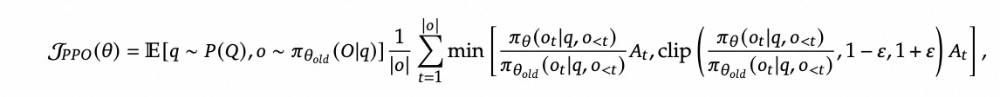
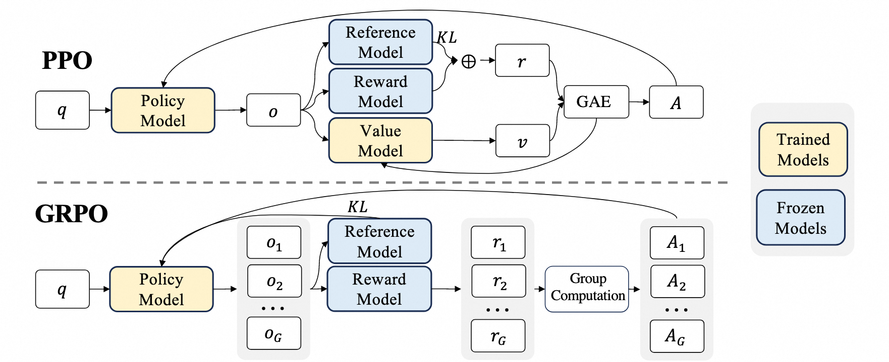
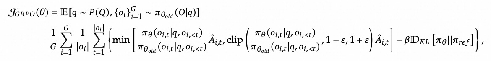
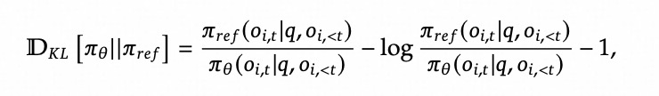

# PPO和GRPO

强化学习是深度学习之外的另一个人工智能分支，它的思路和深度学习是不同的，举几个使用了强化学习的情景：

1. 网游的自动寻路功能
2. 机器人搬运一块石头
3. AlphaGo下围棋

强化学习的主要思路，就是智能体选择一个动作后，接收环境信息，根据当下奖励和预期奖励，选择下一个动作并循环往复

强化学习在近些年在大模型上的应用越来越多，是因为大模型的token生成本质上也是一个token接一个token的。

## PPO：近端策略优化

### 举个例子

想象你在学做菜，有一个很保守的老师：

**问题情况**：你昨天学会了做蛋炒饭，今天想学习新的调味方法。（模型已经经过了预训练，现在想调整下回答范式）

**学生**：今天我要加很多新调料！（我要调整模型参数，还要改变回答的分布！）

**老师**：等等，不要变化太大。你昨天加一勺盐效果不错，今天最多加1.2勺，不要一下子加2勺，否则可能做坏了。（别偏离现在的模型参数太远，防止知识遗忘和训崩，也就是`近端`策略优化）

### PPO的数学原理

#### 重要性采样

传统策略梯度有个问题：收集数据用的是旧策略 $\pi_{\theta_{old}}$，但我们要更新的是新策略 $\pi_\theta$。

使用重要性采样修正：

$$\mathbb{E}_{a \sim \pi_{\theta_{old}}}[f(a)] = \mathbb{E}_{a \sim \pi_\theta}[\frac{\pi_{\theta_{old}}(a|s)}{\pi_\theta(a|s)} f(a)]$$

定义重要性采样比率：
$$r_t(\theta) = \frac{\pi_\theta(a_t|s_t)}{\pi_{\theta_{old}}(a_t|s_t)}$$

#### PPO-Clip

PPO的目标函数是：

$$L^{CLIP}(\theta) = \mathbb{E}_t[\min(r_t(\theta)A_t, \text{clip}(r_t(\theta), 1-\epsilon, 1+\epsilon)A_t)]$$

其中：
- $A_t$ 是优势函数，表示动作 $a_t$ 比平均水平好多少
- $\epsilon$ 是截断参数，通常取0.1或0.2
- clip函数限制比率在 $[1-\epsilon, 1+\epsilon]$ 范围内

#### 详细解释

**当 $A_t > 0$（好动作）时**：
- 如果 $r_t > 1+\epsilon$：新策略过度增加了这个好动作的概率，被截断
- 如果 $r_t < 1-\epsilon$：新策略过度减少了这个好动作的概率，也被截断

**当 $A_t < 0$（坏动作）时**：
- 如果 $r_t > 1+\epsilon$：新策略过度增加了坏动作概率，被截断  
- 如果 $r_t < 1-\epsilon$：新策略过度减少了坏动作概率，也被截断

这确保了策略更新不会太激进。





## GRPO

GRPO的来源是DeepSeek团队的[DeepSeekMath论文](https://arxiv.org/pdf/2402.03300)。

### 为什么要使用GRPO

1. PPO的Value Model最开始是不准确的，和Policy Model是同时训练的，这可能训练时的不稳定性
2. 增加一个Value Model加大了大规模训练的工程难度，以及训练资源使用
3. 人类更善于关注相对值，而非绝对值。因此重标注的方式来给回答进行准确的绝对值打分是困难的，而RL训练只需要相对优势，因此使用采样替代更为简单

GRPO的主要思路就是用抽样的相对优势代替绝对的打分，我们贴一下DeepSeek训练GRPO的训练过程：

1. 先收集一部分高质量冷启动数据（约几千条），使用该数据fine-tune DeepSeek-V3-Base模型，记为模型A
2. 使用A模型用GRPO训练，使其涌现推理能力，收敛的模型记为B
3. 使用B模型产生高质量SFT数据，并混合DeepSeek-V3产生的其他领域的高质量数据，形成一个高质量数据集
4. 使用该数据集训练原始DeepSeek-V3-Base模型，记为模型C
5. 使用C模型重新进行步骤2，但是数据集变为所有领域，收敛后的模型记为D，这个模型就是DeepSeek-R1
6. 训练C模型的数据对小模型做蒸馏，效果也非常好

贴一下关键的论文原文部分：

```text
由于PPO中使用的价值函数通常是另一个与策略模型规模相当的模型，这带来了巨大的内存和计算负担。
此外，在强化学习训练过程中，价值函数被用作计算优势的基线以减少方差。
而在大语言模型的上下文中，通常只有最后一个token被奖励模型分配奖励分数，这可能会使训练在每个token上都准确的价值函数变得复杂。
为了解决这个问题，如图4所示，我们提出了群体相对策略优化（GRPO），它消除了像PPO中那样需要额外价值函数近似的需求，
而是使用针对同一问题产生的多个采样输出的平均奖励作为基线。
更具体地说，对于每个问题𝑞，GRPO从旧策略𝜋𝜃𝑜𝑙𝑑中采样一组输出{𝑜1, 𝑜2, · · · , 𝑜𝐺}，
然后通过最大化以下目标来优化策略模型：
```


```text
...
GRPO 使用的分组相对方法与奖励模型的比较性质非常一致，因为奖励模型通常在相
同问题的不同输出之间的比较数据集上进行训练。另外请注意，GRPO 不是在奖励中添加 KL
罚项，而是通过直接将训练策略和参考策略之间的 KL 散度添加到损失函数中来正则化，避免了
复杂化 ˆ𝐴𝑖,𝑡 的计算。与PPO中使用的 KL 罚项不同，我们使用以下无偏估计量 (Schulman, 2020)
来估计 KL 散度：
```


```text
...
对于每个问题 𝑞，从旧策略模型 𝜋𝜃𝑜𝑙𝑑 中采样一组输出 {𝑜1, 𝑜2, · · · , 𝑜𝐺 }。然后使用奖励模
型对输出进行评分，得到 r = {𝑟1, 𝑟2, · · · , 𝑟𝐺 } 个相应的奖励 𝐺。随后，通过减去组平均值并除以
组标准差来规范化这些奖励。结果监督在每个输出 𝑜𝑖 的末尾提供规范化奖励，并将输出中所有
词元的优势 ˆ𝐴𝑖,𝑡 设置为规范化奖励，即 ˆ𝐴𝑖,𝑡 = ˜𝑟𝑖 = (𝑟𝑖 −mean(r))/std(r) ，然后通过最大化公式中定义的目标来优化策略。
```

GRPO解决了强化微调中标注数据的巨大成本，简化了数据集格式需求和训练难度，这也是DeepSeek-R1大火的重要原因。

## 训练框架选择

选择合适自己的训练框架，这里推荐几个比较好的开源框架：

- [SWIFT](https://github.com/modelscope/ms-swift)：支持PT、SFT、RLHF、多模态、Megatron、蒸馏、GRPO、拒绝采样等
- [veRL](https://github.com/volcengine/verl): 支持大规模RL训练，尤其是Megatron+Ray相关的训练
- [OpenRLHF](https://github.com/OpenRLHF/OpenRLHF): 类比veRL，支持大规模RL训练，尤其是Megatron+Ray相关的训练
- [TRL](https://github.com/huggingface/trl): Hugging Face社区的框架，使用简单，适合小规模RL训练