Powered by [MS-Agent](https://github.com/modelscope/ms-agent) | [DocResearch](https://github.com/modelscope/ms-agent/blob/main/projects/doc_research/README.md)
 

---

# DINOv3: 通过自监督学习扩展视觉基础模型

## 摘要

本文深入探讨了新一代视觉基础模型 **DINOv3**。该模型通过大规模自监督学习（Self-Supervised Learning, SSL）旨在创建强大且通用的视觉编码器。文章的核心贡献在于解决了在扩展SSL模型时遇到的**密集特征（dense features）质量下降**的难题，并提出了一种名为 **“Gram锚定”（Gram Anchoring）** 的创新方法。

DINOv3不仅成功训练了一个拥有70亿参数的巨型模型，还通过知识蒸馏技术，构建了一个包含多种尺寸（ViT和ConvNeXt架构）的**DINOv3模型家族**，以适应不同的应用场景和计算资源限制。实验结果表明，DINOv3在各类视觉任务，特别是 **密集预测任务（如分割、深度估计）** 上，显著超越了以往的自监督、弱监督甚至全监督模型，树立了新的技术标杆。

## 1. 引言与背景

### 1.1. 自监督学习（SSL）的崛起

基础模型已成为现代计算机视觉的核心，而自监督学习（SSL）是训练这类模型的强大范式。与需要高质量元数据（标签）的监督学习（SL）或弱监督学习（WSL）不同，SSL能直接从海量原始图像数据中学习，这为训练超大规模视觉编码器提供了几乎无限的数据来源。

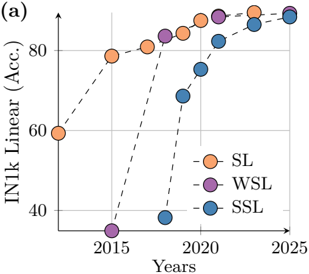 
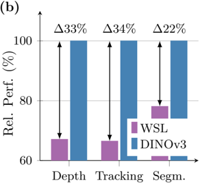 
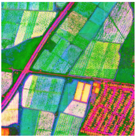 
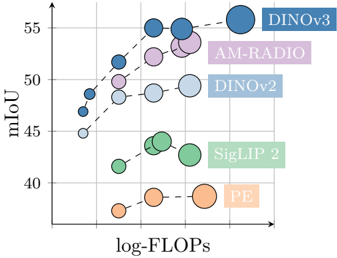 

**图 1**: (a) ImageNet1k线性探测结果的演变，SSL方法后来居上，已达到近年来的精度平台期。(b) DINOv3在密集任务上显著优于顶级的弱监督模型。(c, d) DINOv3在自然图像和航拍图像上提取的高分辨率特征PCA图，展示了其卓越的特征区分能力。

### 1.2. 扩展SSL面临的挑战

尽管SSL潜力巨大，但在实践中将其扩展到更大规模的模型和数据时，会遇到新的问题：
1.  **数据筛选困难**：如何从无标签数据集中筛选出有用的训练数据。
2.  **优化难题**：传统的余弦学习率调度需要预知训练总时长，这在大规模数据上难以确定。
3.  **密集特征退化**：在长时间训练或使用超大模型（如ViT-Large以上）时，模型的密集特征（patch-level features）质量会逐渐下降，影响其在分割、深度估计等任务上的表现。

### 1.3. DINOv3的核心目标

为解决上述挑战，DINOv3的研究围绕以下三个核心目标展开：
1.  **通用性**：训练一个跨任务、跨领域的通用基础模型。
2.  **卓越的密集特征**：显著改善现有SSL模型在密集特征上的短板。
3.  **模型家族**：发布一系列可直接使用、适应不同资源限制的模型。

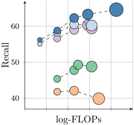 
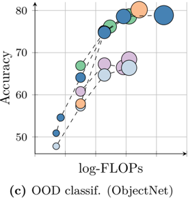 

**图 2**: DINOv3模型家族在不同基准测试上的性能对比。在密集任务（如ADE20k语义分割和NAVI 3D关键点匹配）上，DINOv3显著超越了其他模型。

## 2. 核心方法论

DINOv3的成功建立在数据、模型架构、训练目标和优化策略的全面革新之上。

### 2.1. 数据策略：精心构建的大规模数据集

为了充分利用无标签数据的优势，DINOv3采用了一种混合数据策略：
- **基础数据集**：通过聚类和检索等自动化方法，从海量原始数据中筛选出一个大规模的“背景”数据集。
- **专业数据混合**：将少量高质量的专业数据集（如ImageNet-1k）与背景数据混合。实验证明，这种混合策略能兼顾不同数据源的优点，在多个下游任务中取得最佳性能。

**表 1: 训练数据对特征质量的影响**
该消融研究表明，本文提出的数据混合方法（LVD-1689M）在多个下游任务（如iNaturalist 2021、Paris Retrieval）上取得了优于单一数据筛选方法（聚类或检索）和原始数据的性能。

| 数据集 | IN1k k-NN | IN1k Linear | ObjectNet | iNaturalist 2021 | Paris Retrieval |
| :--- | :--- | :--- | :--- | :--- | :--- |
| Raw | 80.1 | 84.8 | 70.3 | 70.1 | 63.3 |
| Clustering | 79.4 | 85.4 | 72.3 | 81.3 | 85.2 |
| Retrieval | 84.0 | 86.7 | 70.7 | 86.0 | 82.7 |
| **LVD-1689M (ours)** | **84.6** | **87.2** | **72.8** | **87.0** | **85.9** |

### 2.2. 模型架构与训练策略

#### 2.2.1. 扩展至70亿参数的ViT架构

DINOv3将模型规模扩展到了70亿（7B）参数，远超DINOv2的11亿参数。关键架构更新包括：
- **更大的嵌入维度**：从1536增加到4096。
- **更大的Patch Size**：使用16x16的patch size。
- **RoPE位置编码**：采用旋转位置编码（Rotary Positional Embeddings），增强了模型对不同分辨率和长宽比的适应性。

**表 2: DINOv2 与 DINOv3 教师模型架构对比**

| 特性 | DINOv2 (ViT-giant) | DINOv3 (ViT-7B) |
| :--- | :--- | :--- |
| 参数量 | 1.1B | 6.7B |
| 嵌入维度 | 1536 | 4096 |
| Patch Size | 14 | 16 |
| 位置编码 | Learnable | RoPE |
| DINO原型数量 | 128k | 256k |

#### 2.2.2. 优化的自监督学习目标

DINOv3的训练目标函数组合了多个损失项，以平衡全局和局部特征的学习：
$$
\mathcal{L}_{\text{SSL}} = \mathcal{L}_{\text{DINO}} + \mathcal{L}_{\text{iBOT}} + \mathcal{L}_{\text{Koleo}}
$$
- $L_{DINO}$：图像级（全局）对比学习损失。
- $L_{iBOT}$：Patch级（局部）掩码图像建模损失。
- $L_{Koleo}$：特征正则化项，鼓励特征在空间中均匀分布。

#### 2.2.3. 恒定学习率优化

为适应大规模、长周期的训练，DINOv3摒弃了需要预设训练时长的学习率调度策略，转而采用**恒定学习率**、权重衰减和教师模型EMA动量，仅在初始阶段使用线性预热。这使得模型可以持续训练，直到下游任务性能不再提升。

### 2.3. Gram锚定：解决密集特征退化

这是DINOv3最核心的创新。

#### 2.3.1. 问题：密集特征在训练后期退化

研究发现，随着训练的进行，虽然模型的全局分类能力（如ImageNet准确率）持续提升，但其密集任务（如分割）的性能在达到峰值后会显著下降。
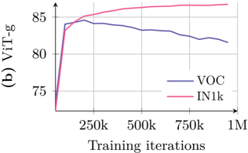 
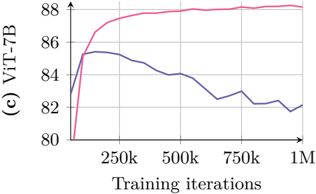 

**图 5**: ViT-g和ViT-7B模型的性能演变。分类准确率（IN1k linear）单调上升，而分割性能（VOC）在训练约200k次迭代后开始下降。

这种退化的原因是patch特征之间的相似性结构变得混乱，失去了局部性。
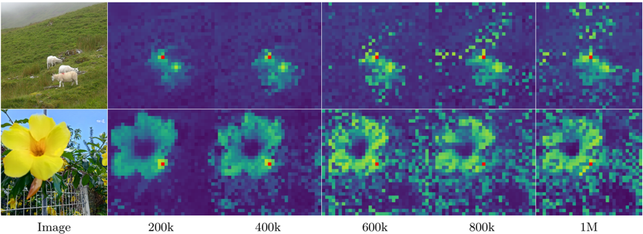 

**图 6**: 随着训练进行，patch特征的余弦相似度图变得越来越嘈杂，失去了局部性。

#### 2.3.2. 解决方案：Gram锚定（Gram Anchoring）

为了解决此问题，DINOv3引入了一个新的损失项 $L_{Gram}$，其核心思想是：
- **不直接约束特征**：而是约束特征之间的**关系结构**。
- **使用Gram矩阵**：Gram矩阵记录了一张图中所有patch特征两两之间的点积，它代表了特征的相似性结构。
- **锚定到早期模型**：将当前学生模型的Gram矩阵，锚定（对齐）到一个训练早期的、具有良好密集特征的教师模型（称为**Gram教师**）的Gram矩阵。

损失函数定义为：
$$
\mathcal{L}_{\text{Gram}} = \left\| X_S X_S^T - X_G X_G^T \right\|_F^2
$$
其中，$X_S$ 和 $X_G$ 分别是学生模型和Gram教师模型的L2归一化patch特征矩阵。

这个新的训练阶段被称为**精炼步骤（refinement step）**，总损失为：
$$
\mathcal{L}_{\text{Ref}} = \mathcal{L}_{\text{SSL}} + w_{\text{Gram}} \mathcal{L}_{\text{Gram}}
$$

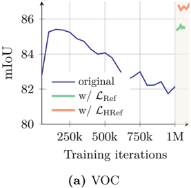 
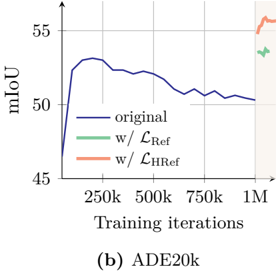 
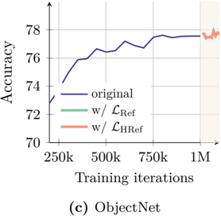 

**图 8**: 应用Gram锚定（$L_{Ref}$）后，模型在密集任务（如ADE20k分割）上的性能迅速回升并持续改进。

#### 2.3.3. 增强：高分辨率Gram锚定

为了获得更优质的锚定目标，研究者进一步提出使用**高分辨率**图像输入Gram教师模型，然后将得到的特征图下采样，以获得更平滑、一致性更好的Gram矩阵。这种方法（$L_{HRef}$）在密集任务上带来了额外的性能提升。

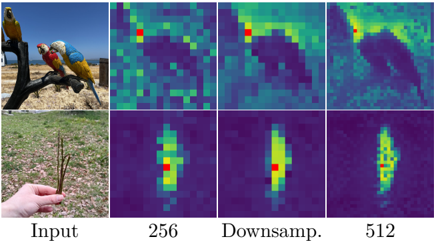 
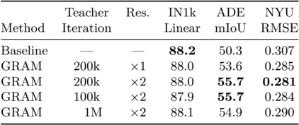 

**图 9**: (a) 高分辨率输入的Gram矩阵（512）经过下采样后，依然保持了良好的结构性。(b) 消融实验表明，使用早期（如200k次迭代）且高分辨率（x2）的Gram教师效果最好。

**图 10**: 使用高分辨率Gram锚定（$L_{HRef}$）前后，patch特征余弦相似度图的定性对比，可见特征的局部性和一致性得到极大改善。

### 2.4. 高分辨率适应与模型蒸馏

#### 2.4.1. 高分辨率适应

为了让模型能处理更高分辨率的输入，DINOv3在主训练后增加了一个简短的**高分辨率适应**阶段，使用混合分辨率（如512x512, 768x768）的图像进行少量迭代训练。这一步显著提升了模型在高分辨率下的密集任务性能。

**图 4**: DINOv3在高分辨率下的特征PCA可视化。随着分辨率提升，特征图愈发清晰且语义信息丰富，即使在4096x4096分辨率下依然稳定。

#### 2.4.2. 高效的多学生知识蒸馏

为了构建DINOv3模型家族，团队设计了一个**高效的多学生蒸馏**流程。该流程允许多个不同尺寸的学生模型（如ViT-S, B, L）并行地从一个7B教师模型中学习。通过共享教师模型的前向传播计算，极大地节省了计算资源并提高了蒸馏效率。

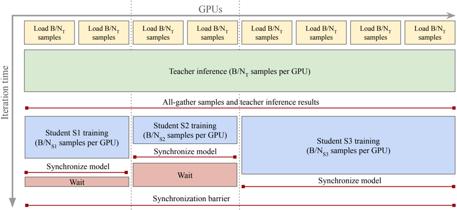 

**图 12**: 多学生蒸馏流程图。所有GPU节点共享教师模型的推理计算，然后各自独立进行学生模型的训练，从而最小化等待时间。

## 3. 实验结果与分析

DINOv3在广泛的视觉任务上进行了全面评估，并取得了SotA（State-of-the-Art）或极具竞争力的结果。

### 3.1. 密集特征任务评估

这是DINOv3的核心优势所在。

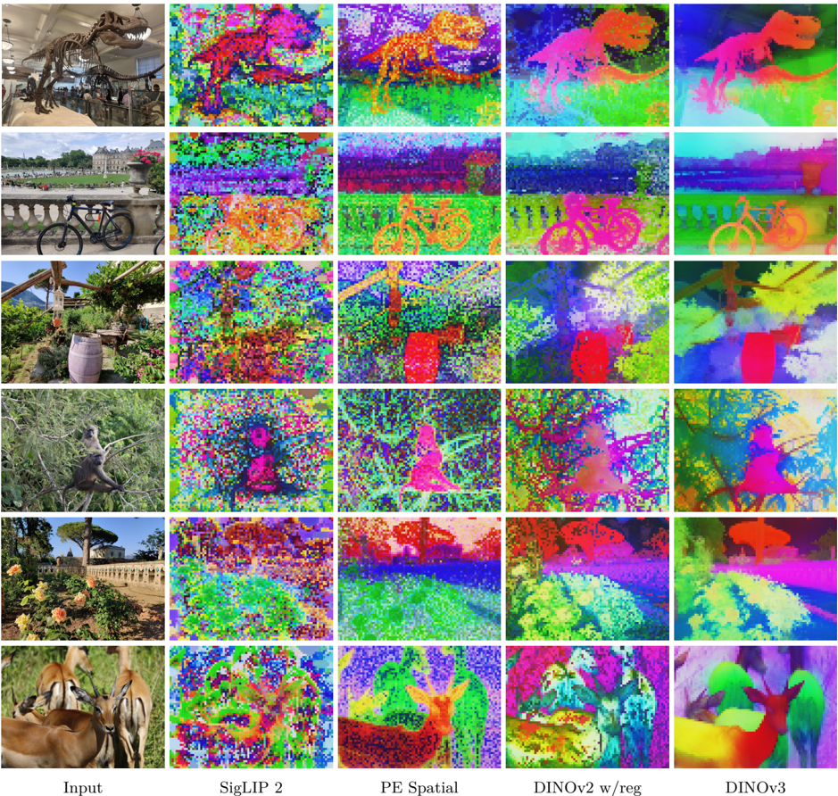 

**图 13**: DINOv3与其他视觉骨干网络的密集特征PCA可视化对比。DINOv3的特征图更锐利、噪声更少、语义一致性更强。

#### 3.1.1. 语义分割与单目深度估计（线性探测）

在冻结骨干网络、仅训练一个线性分类器的情况下，DINOv3在多个基准上刷新了记录。

**表 3: 密集任务线性探测结果**
在ADE20k语义分割上，DINOv3（55.9 mIoU）比DINOv2（49.5 mIoU）高出超过6个点。在NYUv2深度估计上，DINOv3的RMSE（0.309）也显著低于所有对比模型。

| 模型 (ViT) | ADE20k mIoU ↑ | Cityscapes mIoU ↑ | NYUv2 RMSE ↓ | KITTI RMSE ↓ |
| :--- | :--- | :--- | :--- | :--- |
| DINOv2 (g/14) | 49.5 | 75.6 | 0.372 | 2.624 |
| AM-RADIOv2.5 (g/14) | 53.0 | 78.4 | 0.340 | 2.918 |
| Web-DINO (7B/14) | 42.7 | 68.3 | 0.466 | 3.158 |
| **DINOv3 (7B/16)** | **55.9** | **81.1** | **0.309** | **2.346** |

#### 3.1.2. 3D一致性与关键点匹配

评估模型在不同视角下对同一关键点的特征一致性。

**表 4: 3D关键点匹配评估（Correspondence Recall %）**
DINOv3在几何（NAVI）和语义（SPair）对应任务上均取得最佳性能，表明其特征具有很强的3D感知能力。

| 模型 (ViT) | NAVI (几何) ↑ | SPair (语义) ↑ |
| :--- | :--- | :--- |
| DINOv2 (g/14) | 60.1 | 56.1 |
| AM-RADIOv2.5 (g/14) | 59.4 | 56.8 |
| **DINOv3 (7B/16)** | **64.4** | **58.7** |

### 3.2. 全局特征任务评估

#### 3.2.1. 图像分类与分布外（OOD）泛化

**表 7: ImageNet1k及其变体上的线性探测准确率**
DINOv3是**首个在分类任务上达到与顶级弱监督和全监督模型相媲美性能的自监督模型**。特别是在鲁棒性测试（如ImageNet-C）和难例测试（如ObjectNet）上表现优异。

| 模型 (ViT) | ImageNet Val | ImageNet-R | ImageNet-A | ObjectNet | ImageNet-C ↓ |
| :--- | :--- | :--- | :--- | :--- | :--- |
| DINOv2 (g/14) | 87.3 | 81.1 | 81.7 | 66.4 | 24.1 |
| SigLIP 2 (g/16) | 89.1 | 92.2 | 84.6 | 78.6 | 30.0 |
| PEcore (G/14) | 89.3 | 92.2 | 89.0 | 80.2 | 22.7 |
| **DINOv3 (7B/16)** | **88.4** | **91.1** | **86.9** | **79.0** | **19.6** |

#### 3.2.2. 细粒度分类

**表 8: 细粒度分类任务准确率**
DINOv3在多个细粒度数据集上表现出色，尤其在最具挑战性的iNaturalist 2021上以89.8%的准确率夺魁，超越了所有对比模型。

| 模型 (ViT) | Fine-S (Avg) | iNat18 | iNat21 |
| :--- | :--- | :--- | :--- |
| DINOv2 (g/14) | 92.6 | 80.7 | 86.1 |
| PEcore (G/14) | 94.5 | 86.6 | 87.0 |
| **DINOv3 (7B/16)** | **93.0** | **85.6** | **89.8** |

### 3.3. 下游系统级应用

通过在冻结的DINOv3骨干网络上训练轻量级解码器，构建了多个SotA系统。

- **目标检测** (表 10): 在COCO和COCO-O数据集上，基于DINOv3的检测器（仅训练解码器）取得了新的SotA，mAP达到65.6，展现了卓越的泛化能力。
- **语义分割** (表 11): 在ADE20k上，基于DINOv3的分割系统mIoU达到62.6，与需要完整微调的SotA模型持平或更高。
- **单目深度估计** (表 12): 结合Depth Anything V2的流程，使用冻结的DINOv3骨干网络在多个真实世界数据集上刷新了SotA记录。
- **3D理解** (表 13): 将VGGT框架中的DINOv2替换为DINOv3 ViT-L，在相机姿态估计、多视图重建等任务上均取得了一致的性能提升。

### 3.4. DINOv3模型家族

通过知识蒸馏，DINOv3家族的小尺寸模型在保持高效的同时，性能也远超同等规模的竞品。

**表 14: DINOv3模型家族与开源替代品对比**
以ViT-L（300M参数）为例，DINOv3在密集任务ADE20k上比DINOv2高出6.1 mIoU，在全局任务ObjectNet上高出10.1个点，实现了全方位超越。

| 模型 (L, ~300M) | IN-ReaL | ObjectNet | ADE20k | NYU ↓ | NAVI |
| :--- | :--- | :--- | :--- | :--- | :--- |
| DINOv2 | 89.7 | 64.7 | 48.8 | 0.394 | 59.9 |
| SigLIP 2 | 90.1 | 75.0 | 43.6 | 0.484 | 47.8 |
| **DINOv3** | **90.2** | **74.8** | **54.9** | **0.352** | **62.3** |

### 3.5. 遥感领域应用

DINOv3的训练范式也被成功应用于遥感领域，通过在卫星图像数据集上进行预训练，在树冠高度预测、地理空间分割与检测等任务上取得了SotA性能，证明了其方法的普适性。

**表 19: 高分辨率地理空间任务对比**
DINOv3 Web模型（在通用网络数据上训练）在多个遥感任务上表现惊人，甚至超越了许多在遥感数据上训练的专业模型，如在iSAID分割和DIOR检测任务上均取得SotA。

| 模型 | LoveDA mIoU | iSAID mIoU | DIOR mAP |
| :--- | :--- | :--- | :--- |
| Prev. SotA | 54.4 | 71.9 | 79.5 |
| DINOv3 Sat (7B) | 55.3 | 64.8 | 76.6 |
| **DINOv3 Web (7B)** | **56.2** | **71.4** | **80.5** |

## 4. 结论

DINOv3项目成功地将自监督学习推向了新的高度，其主要贡献可以总结为：
1.  **解决了SSL扩展的核心难题**：通过创新的**Gram锚定**技术，有效遏制了大规模训练中密集特征的退化问题，实现了全局与局部特征质量的协同提升。
2.  **树立了新的性能标杆**：训练出的7B参数模型及其蒸馏家族，在广泛的视觉任务上，特别是**密集预测任务**，取得了前所未有的性能，其通用性和强大能力使其成为理想的“现成”视觉编码器。
3.  **验证了SSL的巨大潜力**：证明了纯粹基于原始图像的自监督学习，在足够大的模型和数据规模下，其性能可以与甚至超越依赖海量人工标注的监督学习方法，为计算机视觉的未来发展开辟了新的道路。

总而言之，DINOv3不仅是一个性能卓越的模型，更是一套可扩展、可复制的训练范式，为构建下一代更强大、更通用的视觉基础模型奠定了坚实的基础。