# LongCat-Flash模型技术报告

## 1. 模型概述

LongCat-Flash是由美团推出的5600亿参数混合专家（Mixture-of-Experts, MoE）语言模型，专为计算效率和高级 Agent能力而设计。该模型在保持高性能的同时实现了显著的计算效率提升，主要特点包括：

- **参数规模**：总参数5600亿，采用MoE架构
- **动态计算**：通过Zero-computation Experts实现动态计算预算分配，根据上下文需求激活186-313亿参数（平均270亿/每token）
- **训练规模**：在30天内完成超过20万亿token的训练
- **推理性能**：推理速度超过100 tokens/s，成本为每百万输出token 0.70美元
- **开源状态**：模型检查点已开源，促进社区研究

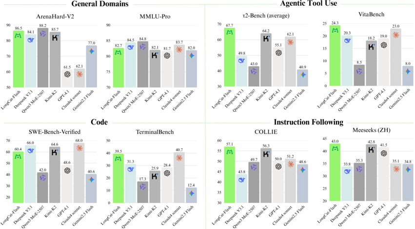 
**图1：LongCat-Flash基准性能测试结果**

## 2. 核心技术创新

### 2.1 Zero-computation Experts

Zero-computation Experts是LongCat-Flash的核心创新之一，实现了动态计算资源分配机制：

- **工作原理**：在标准FFN专家基础上扩展Z个零计算专家，这些专家直接返回输入$x_t$作为输出，不引入额外计算成本
- **动态激活**：路由器为每个token分配K个专家，根据上下文重要性动态调整激活的FFN专家数量
- **数学表达**：
  $$
  y_t = \sum_{i=1}^{K} R(x_t)_i \cdot f_i(x_t)
  $$
  其中$R$表示softmax路由器，$b_i$是第$i$个专家对应的专家偏差

- **专家偏差机制**：采用PID控制器更新专家偏差，确保token分配收敛到目标比例
  $$
  \Delta b_i = \mu \cdot \left(K_e - \frac{T_i}{T_{all}}\right)
  $$
  其中$\mu$表示偏差适应率，$T_{all}$表示全局批次中的token数量，$T_i$表示路由到第$i$个专家的token数量，$K_e$表示预期激活的FFN专家数量

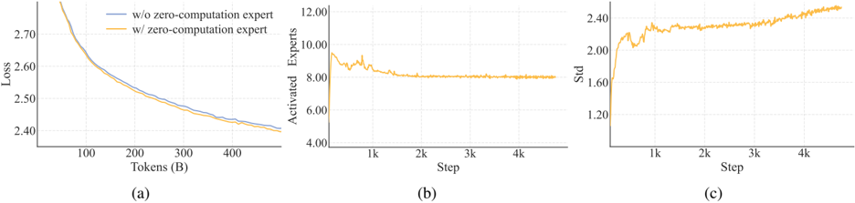 
**图3：(a) 在匹配计算预算下，有/无零计算专家的模型验证损失曲线比较；(b) LongCat-Flash训练期间激活的FFN专家平均数量；(c) 激活FFN专家的标准差增长到3，表明不同token间激活参数的显著变异性**

### 2.2 Shortcut-connected MoE (ScMoE)

ScMoE是LongCat-Flash的另一项关键创新，通过重新排序执行流水线显著提升效率：

- **核心机制**：引入跨层快捷连接，使前一个块的密集FFN与当前MoE层的调度/组合通信并行执行
- **优势**：
  - 扩大计算-通信重叠窗口，提升训练和推理效率
  - 与模型规模和注意力架构选择正交，不影响模型质量
  - 允许密集FFN的内部节点张量并行通信与专家并行通信同时进行

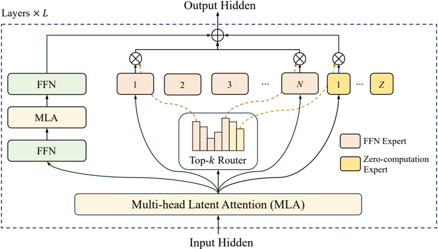 
**图2：LongCat-Flash采用的架构。每层使用带有零计算专家的Shortcut-connected MoE (ScMoE)**

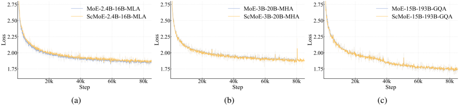 
**图4：在四种不同模型配置下，比较基线模型（无ScMoE）与其ScMoE增强对应模型的训练损失曲线**

## 3. 模型架构优化

### 3.1 改进的多头潜在注意力(MLA)

LongCat-Flash采用改进的多头潜在注意力(MLA)机制，引入缩放校正因子$\alpha_q$和$\alpha_{kv}$解决不对称低秩分解中的方差不平衡问题：

- **数学表达**：
  $$
  \text{MLA}(h_t) = \text{Concat}(\alpha_q \cdot q^C_t, \alpha_q \cdot q^R_t) \cdot \text{Softmax}\left(\frac{(\alpha_{kv} \cdot k^C_t + \alpha_{kv} \cdot k^R_t)^T}{\sqrt{d_k}}\right) \cdot v_t
  $$

- **缩放校正因子**：
  $$
  \alpha_q = \sqrt{\frac{d_{model}}{d_q}}, \quad \alpha_{kv} = \sqrt{\frac{d_{model}}{d_{kv}}}
  $$

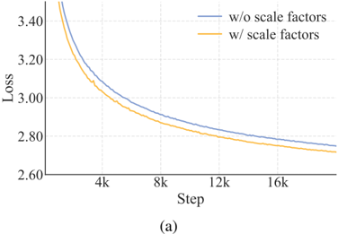 
**图5：(a) 在1B激活MoE模型上，MLA中引入缩放校正因子显示出改进的收敛性（更低的损失）；(b) 模型增长实验中6B激活MoE模型的验证损失曲线**

### 3.2 细粒度专家策略与方差补偿

LongCat-Flash采用细粒度专家策略，将每个专家分割为$m$个更细粒度的专家，以增强组合灵活性和知识专业化：

- **方差补偿机制**：解决专家分割导致的初始化方差降低问题
  $$
  y_t = \gamma \cdot \sum_{i=1}^{mN} g_i \cdot f_i(x_t)
  $$
  其中$\gamma = m$，$g_i$是$mN$个细粒度专家上的路由器输出

- **补偿原理**：补偿门控稀释和维度降低导致的方差减少
  - 门控稀释：将原始$N$个专家分解为$m$个更细粒度的专家，输出方差减少约$m$倍
  - 维度降低：每个细粒度专家的中间隐藏维度减少$m$倍，输出方差再减少$m$倍

## 4. 训练方法与框架

### 4.1 超参数转移策略

LongCat-Flash采用基于宽度缩放的超参数转移策略高效训练大规模模型：

- **转移机制**：以宽度缩放因子$s = n_{target}/n_{proxy}$为中心
- **Adam LR Full Align规则**：针对标准参数化的理论驱动缩放规则

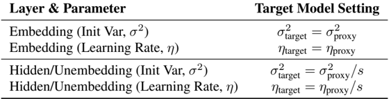 
**表1：实用超参数转移规则及其基础缩放指数，源自标准参数化的Adam LR Full Align原则**

| 组件 | 目标模型设置 | 缩放指数 |
|------|------------|---------|
| 嵌入层（初始化方差, $\sigma^2$） | $\sigma^2_{target} = \sigma^2_{proxy}$ | 0 |
| 嵌入层（学习率, $\eta$） | $\eta_{target} = \eta_{proxy}$ | 0 |
| 隐藏层/非嵌入层（初始化方差, $\sigma^2$） | $\sigma^2_{target} = \sigma^2_{proxy}/s$ | -1 |
| 隐藏层/非嵌入层（学习率, $\eta$） | $\eta_{target} = \eta_{proxy}/s$ | -1 |

### 4.2 训练稳定性保障

LongCat-Flash从三个维度增强训练稳定性：

#### 4.2.1 路由器稳定性
- **挑战**：语言建模(LM)损失与辅助负载均衡(LB)损失之间的张力
- **监控框架**：
  - 路由器权重相似度：测量专家权重向量间的平均成对余弦相似度
  - 梯度范数比($R_g$)：量化两个损失对批次平均专家概率向量$\vec{P}$的相对影响
    $$
    R_g = \frac{\|\nabla_{\vec{P}} L_{LB}\|}{\|\nabla_{\vec{P}} L_{LM}\|}
    $$
- **实践指南**：选择使$R_g < 0.1$的系数$\alpha$，确保负载均衡项作为正则化器而不压倒LM损失

#### 4.2.2 激活稳定性（隐藏z-loss）
- **设计目的**：抑制训练中广泛出现的大规模激活现象
- **数学表达**：
  $$
  L_{hidden-z} = \lambda \cdot \frac{1}{|x_t|} \sum_{i=1}^{|x_t|} \text{abs}(\log(\text{softmax}(x_t)_i)^2)
  $$
  其中$\lambda$是加权损失的系数

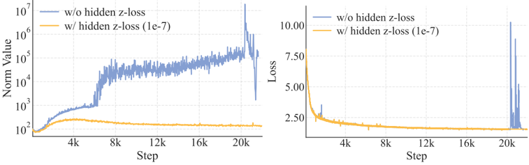 
**图6：具有次优超参数的小模型中最后一层隐藏状态的L2范数和训练损失。引入可忽略系数的隐藏z-loss稳定了范数曲线而不降低训练损失**

#### 4.2.3 优化器稳定性（Adam的Epsilon配置）
- **关键发现**：随着模型规模增大，Adam优化器中的epsilon($\epsilon$)参数变得至关重要
- **阈值效应**：当$\epsilon$接近观察到的梯度RMS范数时，性能显著下降
- **实践建议**：将$\epsilon$设置为比预期梯度RMS范数小几个数量级的值
- **LongCat-Flash配置**：$\epsilon = 1e-16$

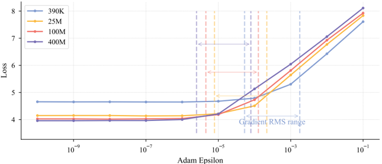 
**图7：探索梯度RMS范数和epsilon对不同模型大小损失的影响**

### 4.3 预训练与后训练

#### 4.3.1 数据处理流程
- **内容提取**：使用定制版trafilatura处理通用网络内容，专用流程处理STEM材料
- **质量过滤**：两步过滤方法，先移除明显低质量文档，再基于流畅度和内容完整性进行精细筛选
- **去重**：使用高效MinHash实现大规模去重，补充识别和处理重复网页模板的策略

#### 4.3.2 数据混合策略
- **阶段1**：采用SampleMix的实例级数据混合策略，平衡数据质量和多样性
  - 基于质量和多样性分数计算初始采样分布
  - 根据细粒度领域和写作风格标签进一步调整分布倾向
  - 下采样冗余低价值领域（如广告、体育、招聘），上采样推理丰富领域（如科学）
  
- **阶段2**：优先考虑推理密集型领域，STEM和代码占最终混合的70%
  - 通过连续困惑度监控实现代码比例的渐进式增加
  - 确保平滑过渡而不损害一般性能

#### 4.3.3 上下文长度扩展
- **两阶段策略**：
  1. 上下文窗口从8k扩展到32k，使用800亿训练token，RoPE基础频率从1,000,000提高到5,000,000
  2. 进一步扩展到128k，通过额外200亿token，基础频率提高到10,000,000

- **数据构建**：基于自然长文本数据（高质量书籍和小说）构建训练语料库
  - 开发系统方法组织仓库级源代码，提高模型长上下文能力
  - 仔细选择高质量仓库，应用多阶段过滤流程

## 5. 性能评估

### 5.1 基础模型评估

**表2：LongCat-Flash与其他基础模型的比较**

LongCat-Flash Base模型在紧凑的激活/总参数规模下实现了与最先进基础模型相当的性能：
- **一般领域**：在MMLU-Pro基准测试中表现突出（70.32分）
- **推理任务**：在大多数基准测试中获得更高的平均分数
- **数学和编码任务**：在大多数基准测试中优于DeepSeek-V3.1 Base，仅在CRUXEval和MultiPL-E上略有差距

### 5.2 指令微调模型评估

**表3：前沿聊天模型的评估结果**

LongCat-Flash在多个维度展现出强大而多功能的能力：

#### 5.2.1 一般领域
- 在ArenaHard-V2上获得86.50分，排名第二
- 在MMLU上获得89.71分，在CEval上获得90.44分，与领先模型相当
- 以比竞争对手更少的参数实现高效性能

#### 5.2.2 指令遵循
- 在IFEval上获得最高分89.65，优于所有其他模型
- 在COLLIE（57.10）和Meeseeks-zh（43.03）上获得最佳分数
- 在英语和中文的多样化和复杂指令集中表现出色

#### 5.2.3 数学推理
- 在MATH500上获得96.40分
- 在更复杂的竞赛级基准测试AIME25（61.25）和BeyondAIME（43.00）上表现优异
- 展示出高级多步逻辑推理和问题解决能力

#### 5.2.4 一般推理
- 在ZebraLogic上获得89.30分，结构化逻辑推理能力突出
- 在阅读理解基准DROP上获得79.06分
- 在GPQA-diamond（73.23）和GraphWalks（51.05）上有改进空间

#### 5.2.5 编码能力
- 在TerminalBench上获得39.51分，排名第二
- 在SWE-Bench-Verified上获得60.4分
- 在Humaneval+和MBPP+等基础代码生成任务上表现稳健

#### 5.2.6  Agent工具使用
- 在τ²-Bench上表现优异，即使与参数更多的模型相比
- 在高度复杂场景中，在VitaBench上获得最高分24.30

#### 5.2.7 安全性
- 在Harmful（83.98）和Criminal（91.24）领域表现出色
- 在识别和缓解风险方面展现出卓越能力

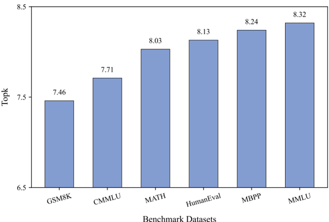 
**图11：不同基准测试中激活的FFN专家平均数量**

## 6. 推理与部署优化

### 6.1 模型特定推理优化

#### 6.1.1 计算与通信协调
- **ScMoE架构**：实现单批次重叠(Single Batch Overlap, SBO)流水线
  - 阶段1：单独执行，因为MLA输出是后续阶段的输入
  - 阶段2：将all-to-all调度与Dense FFN和Attn0(QKV投影)重叠
  - 阶段3：独立执行MoE GEMM
  - 阶段4：将Attn1(核心注意力和输出投影)和Dense FFN与all-to-all组合重叠

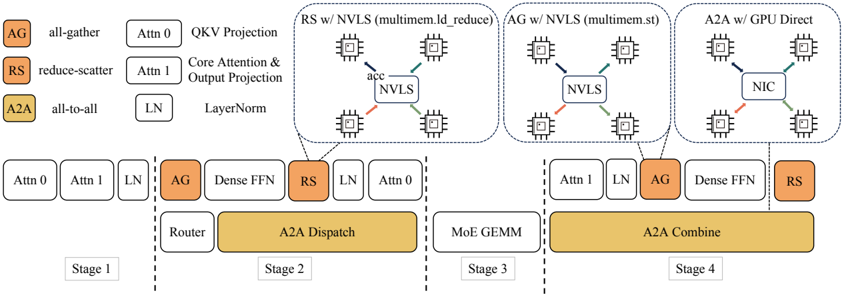 
**图9：重叠策略概述**

#### 6.1.2 推测解码(Speculative Decoding)
- **速度提升公式**：
  $$
  \text{Speedup} = \frac{T_{SD}^{Avg}}{T_T} = \frac{\gamma T_D + T_V(\gamma)}{T_T \cdot \Omega(\gamma, \alpha)}
  $$
  其中$T_{SD}^{Avg}$、$T_T$、$T_D$分别表示推测解码、目标模型和草案模型的预期每token延迟，$\gamma$表示每解码步骤的草案token数量，$\Omega(\gamma, \alpha)$表示给定步骤$\gamma$和接受率$\alpha$的预期接受长度，$T_V(\gamma)$表示目标验证的预期延迟

- **优化策略**：
  - **预期接受长度**：采用MTP，集成单个MTP头，测试集上获得约90%的接受率
  - **草案与目标成本比**：采用轻量级MTP架构，单个密集层优于ScMoE层
  - **目标验证与解码成本比**：采用C2T方法，使用分类模型在验证前过滤不太可能被接受的token

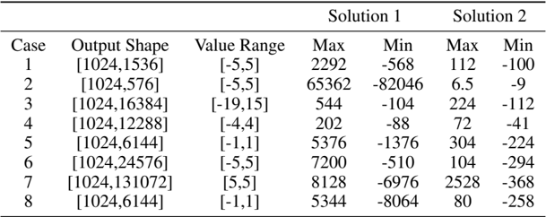 
**表5：不同MTP头结构在MT-Bench上的草案token接受率**

| MTP头结构 | 激活参数比例 | 接受率$\alpha$ |
|-----------|------------|--------------|
| 密集层 | 1.41% | 92.1% |
| ScMoE层 | 4.17% | 92.9% |

#### 6.1.3 KV缓存优化
- **MLA机制**：采用64头的MLA，减少注意力组件的计算负载，实现卓越的KV缓存压缩
- **多步重叠调度器**：动态预分配多个未来步骤的KV缓存槽位
  - 解决推测解码中接受长度未知的问题
  - 确保下一迭代的安全KV缓存分配

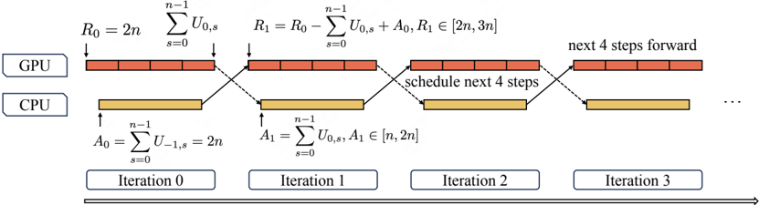 
**图10：多步重叠调度器（以4步为例）**

### 6.2 系统级推理技术

#### 6.2.1 最小化调度开销
- **TVD融合策略**：将目标前向、验证和草案前向融合为单个CUDA图
- **多步重叠调度器**：在单个调度迭代中启动多个前向步骤的内核
  - 有效隐藏CPU调度和同步
  - 确保GPU持续占用

#### 6.2.2 自定义内核
- **确定性FAG**：开发高效确定性FAG内核，使用有限额外工作区按确定顺序累加瓦片
  - 性能达到原始确定性版本的1.6倍
  - 达到非确定性版本的0.95倍

- **确定性ScatterAdd**：提出分层归约算法，跨所有可用处理器并行化梯度聚合
  - 实现与非确定性版本相当的性能

- **优化分组GEMM**：
  - 双缓冲流水线：重叠计算、内存I/O和尾声
  - 对角线瓦片：缓解L2缓存冲突
  - HBM带宽控制：通过计算单元限制重叠分组GEMM与调度/组合通信

- **融合GemmAdd**：将FP32加法融合到GEMM尾声中
  - 避免中间写回
  - 隐藏加法在瓦片GEMM流水线内
  - 实现3.12x至3.86x的加速

#### 6.2.3 量化
- 采用量化技术进一步降低推理成本
- 在保持性能的同时显著减少内存占用和计算需求

### 6.3 部署与性能

#### 6.3.1 测量性能
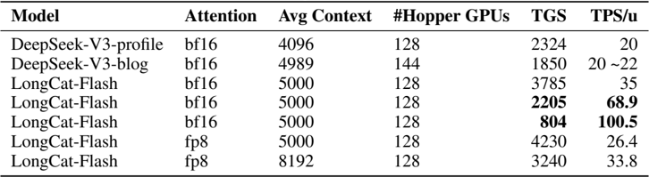 
**表6：不同设置下LongCat-Flash的性能**

| 配置 | 注意力 | 平均上下文 | Hopper GPU数量 | TGS | TPS/u |
|------|-------|-----------|--------------|-----|-------|
| DeepSeek-V3-profile | bf16 | 4096 | 128 | 2324 | 20 |
| DeepSeek-V3-blog | bf16 | 4989 | 144 | 1850 | 20~22 |
| LongCat-Flash | bf16 | 5000 | 128 | 3785 | 35 |
| LongCat-Flash | bf16 | 5000 | 128 | 2205 | 68.9 |
| LongCat-Flash | bf16 | 5000 | 128 | 804 | 100.5 |
| LongCat-Flash | fp8 | 5000 | 128 | 4230 | 26.4 |
| LongCat-Flash | fp8 | 8192 | 128 | 3240 | 33.8 |

- **TGS**（每GPU每秒token数）：表示每设备生成吞吐量（值越高表示成本越低）
- **TPS/u**（每用户每秒token数）：表示单个用户的生成速度（值越高越好）

#### 6.3.2 理论性能
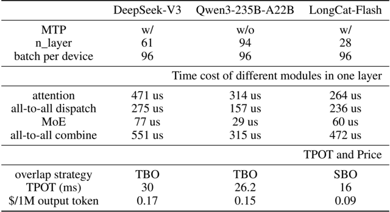 
**表7：不同模型的理论解码时间和成本**

| 指标 | DeepSeek-V3 | Qwen3-235B-A22B | LongCat-Flash |
|------|-------------|----------------|---------------|
| MTP | 有 | 无 | 有 |
| 层数 | 61 | 94 | 28 |
| 每设备批次 | 96 | 96 | 96 |
| 注意力时间(us) | 471 | 314 | 264 |
| all-to-all调度(us) | 275 | 157 | 236 |
| MoE(us) | 77 | 29 | 60 |
| all-to-all组合(us) | 551 | 315 | 472 |
| 重叠策略 | TBO | TBO | SBO |
| TPOT(ms) | 30 | 26.2 | 16 |
| $/1M输出token | 0.17 | 0.15 | 0.09 |

- **理论TPOT**：LongCat-Flash的理论极端TPOT可表示为：
  $$
  \text{TPOT} = \frac{\text{TPL}}{1000}
  $$
  其中TPL表示每层时间成本

- **成本效益**：在H800 GPU每小时2美元的成本假设下，LongCat-Flash的输出token价格为0.09美元/百万

## 7. 结论

LongCat-Flash通过三项关键创新实现了高效且强大的语言模型：
1. **上下文感知的动态计算机制和快捷连接MoE**：在训练和推理中实现高效率
2. **集成策略确保大规模训练稳定**：包括超参数转移、模型增长初始化、多方面稳定性套件和确定性计算
3. **多阶段训练管道**：培养LongCat-Flash的 Agent能力，使其能够执行需要迭代推理和环境交互的复杂任务

该模型在30天内完成了超过20万亿token的训练，推理速度超过100 tokens/s，成本仅为每百万输出token 0.70美元。在 Agent应用场景中，LongCat-Flash能够将单轮工具调用延迟控制在1秒以内，显著提升 Agent应用的交互性。

通过将LongCat-Flash作为开源模型发布，美团旨在推动高效MoE架构、高质量数据策略和 Agent模型开发的研究，促进大型语言模型领域的社区驱动创新。

