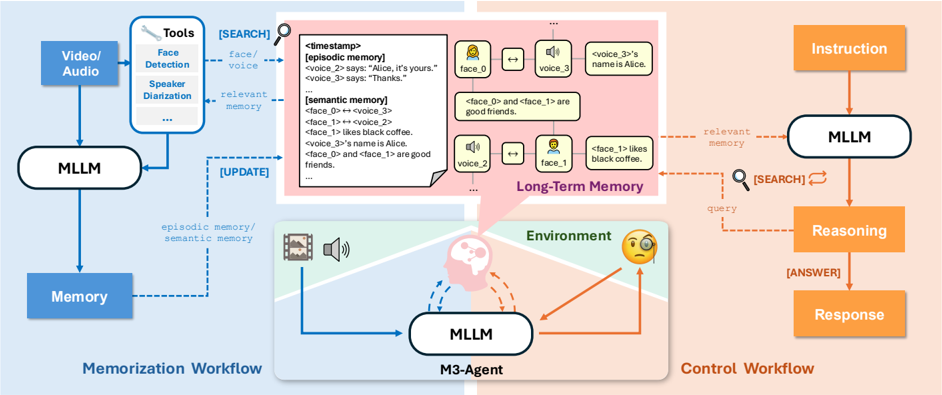
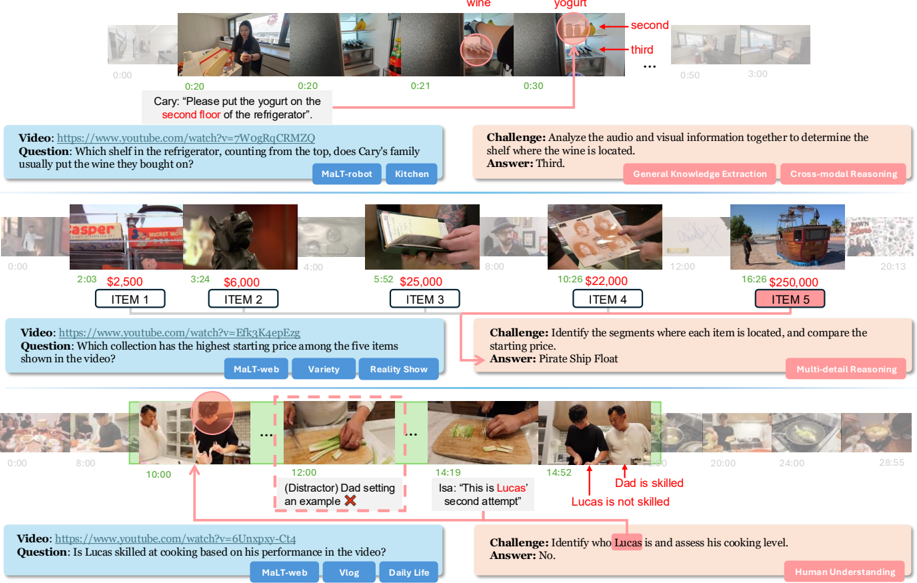
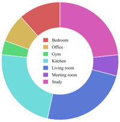
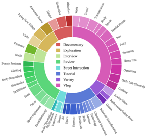
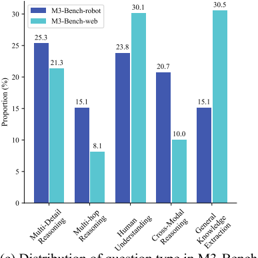
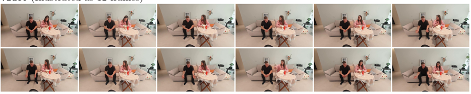
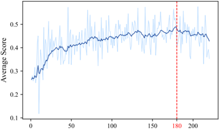

# M3-Agent：具有长期记忆的多模态智能体框架分析报告

## 1. 引言与概述

### 1.1 研究背景与动机

在未来的智能家居场景中，家庭机器人能够自主执行家务任务而无需明确指令，例如早晨无需询问"咖啡还是茶？"就能递上用户习惯的咖啡。这种智能水平的实现依赖于三个核心能力：
- 通过多模态传感器持续感知世界
- 将经验存储在长期记忆中并逐步构建环境知识
- 基于积累的记忆进行推理以指导行动

当前的多模态智能体在长期记忆构建和基于记忆的推理方面仍存在显著局限，难以实现类似人类的持续学习和环境理解能力。

### 1.2 M3-Agent核心创新

M3-Agent（**M**ulti **M**odal **M**emory Agent）是一种新型多模态智能体框架，具有以下关键创新：

**图1：多模态智能体持续感知环境、构建以实体为中心的多模态长期记忆并进行推理**

- **长期记忆能力**：能够处理实时视觉和听觉输入，构建和更新长期记忆
- **双类型记忆系统**：
  - *情景记忆*：记录具体事件（如"Alice拿起咖啡说'早上没这个不行'"）
  - *语义记忆*：推导一般知识（如"Alice喜欢早上喝咖啡"）
- **实体中心记忆组织**：以图结构组织记忆，将同一实体（如人脸、声音、知识）连接起来
- **多轮迭代推理**：自主执行多轮推理并从记忆中检索相关信息完成任务

### 1.3 主要贡献

1. 提出M3-Agent框架，实现类似人类的长期记忆构建与推理能力
2. 开发M3-Bench基准测试，包含100个机器人视角真实视频和920个网络视频
3. 在多模态智能体的长期记忆和基于记忆的推理方面取得显著性能提升
4. 开源模型、代码和数据，促进多模态智能体研究发展

## 2. M3-Agent架构

### 2.1 整体框架

M3-Agent由多模态大语言模型(MLLM)和多模态长期记忆模块组成，通过两个并行过程运作：

 
**图1：M3-Agent架构，包含多模态大语言模型(MLLM)和多模态长期记忆。系统由两个并行过程组成：记忆(memorization)和控制(control)**

- **记忆过程(memorization)**：实时处理视频和音频流，生成情景记忆和语义记忆
- **控制过程(control)**：解释外部指令，基于长期记忆进行推理并执行任务

### 2.2 记忆过程

记忆过程负责将实时多模态输入转化为结构化记忆，具有两大关键挑战：

1. **无限信息处理**：需处理无限长的输入流，而非传统方法处理的有限长度离线视频
2. **世界知识构建**：超越低级视觉细节，构建高级世界知识（如人物身份和实体属性）

记忆过程生成两类记忆：

| 记忆类型 | 描述 | 示例 |
|---------|------|------|
| **情景记忆** | 记录视频中观察到的具体事件 | "Alice拿起咖啡说'早上没这个不行'" "Alice把空瓶子扔进绿色垃圾桶" |
| **语义记忆** | 从片段中推导一般知识 | "Alice喜欢早上喝咖啡" "绿色垃圾桶用于回收" |

### 2.3 长期记忆组织

长期记忆以实体为中心的图结构组织，具有以下特点：

- **多模态支持**：存储文本、图像、音频等多种模态信息
- **节点属性**：每个节点包含ID、类型、内容、嵌入向量、权重和额外元数据
- **关系连接**：节点通过边连接，表示逻辑关系，便于记忆检索

**表3：记忆节点的属性及其描述**

| 属性 | 描述 |
|------|------|
| id | 节点的唯一标识符 |
| type | 节点的模态类型（如文本、图像、音频） |
| content | 节点的原始内容，如纯文本、base64图像或base64音频 |
| embedding | 节点内容的向量表示，用于基于相似度的检索 |
| weight | 表示节点置信度的数值 |
| extra_data | 包含额外元数据的JSON对象，如时间戳 |

记忆系统提供两种搜索工具：

**表4：长期记忆支持的搜索功能**

| 搜索功能 | 描述 |
|---------|------|
| search_node | 接受查询并返回最相关的前k个节点。支持多模态查询（文本、图像或音频）和特定模态检索 |
| search_clip | 为文本查询检索相关的前k个视频片段，包括情景记忆和语义记忆 |

### 2.4 控制过程

控制过程使M3-Agent能够基于长期记忆执行任务：

- **自主检索**：跨不同维度（如事件或人物）从长期记忆中检索相关信息
- **多轮推理**：采用强化学习实现多轮推理和迭代记忆检索，而非单轮检索增强生成(RAG)
- **任务执行**：解释指令，推理记忆内容，生成并执行相应动作

## 3. M3-Bench基准测试

### 3.1 数据集概述

M3-Bench是一个长视频问答(LVQA)数据集，用于评估多模态智能体基于长期记忆进行推理的能力：

- **M3-Bench-robot**：100个从机器人第一人称视角录制的真实世界视频
- **M3-Bench-web**：920个来自网络的多样化场景视频

 
**图2：M3-Bench示例。M3-Bench-robot包含来自真实机器人工作场景的长视频，而M3-Bench-web扩展了视频多样性以支持更广泛的评估**

### 3.2 问题类型设计

M3-Bench设计了五种问题类型，全面评估智能体的记忆构建和推理能力：

**表1：M3-Bench中不同问题类型的解释及示例**

| 问题类型 | 解释 | 示例 |
|---------|------|------|
| **多细节推理** | 需要聚合视频中分散的多条信息 | "视频中展示的五件物品中，哪件的起拍价最高？"智能体必须从五个不同片段识别并回忆起拍价，然后比较确定最高价 |
| **多跳推理** | 需要跨不同片段逐步推理得出结论 | "去Ding Cha后他们去了哪家奶茶店？"智能体必须先定位到Ding Cha的访问，然后跟随后续片段确定下一家奶茶店 |
| **跨模态推理** | 需要跨多种模态（如视觉和音频内容）进行推理 | "(Bob向Robot展示红色文件夹说'机密文件应放这个文件夹'，然后展示白色文件夹说'普通文件应放这个')机密文件应放在哪个文件夹？"智能体必须结合视觉线索（文件夹颜色）和对话推断正确答案 |
| **人类理解** | 涉及对人类相关属性（如身份、情绪、个性或关系）的推理 | "Lucas烹饪技术好吗？"视频未直接揭示答案，但智能体必须聚合Lucas在多个烹饪场景中的行为推断其技能水平 |
| **一般知识提取** | 评估智能体能否从特定事件中提取一般知识 | "(一个人展示将不同杂货分类到冰箱的不同架子上)哪个架子适合存放蔬菜？"智能体必须从观察中识别典型存储规则来回答 |

### 3.3 数据集统计

 
 
 
**图3：M3-Bench基准的统计概览。(a) M3-Bench-robot拍摄地点分布；(b) M3-Bench-web视频类别分布；(c) M3-Bench问题类型分布（每个问题可能对应多种类型）**

**表2：M3-Bench与现有长视频问答基准在关键维度上的比较**

| 基准 | #视频 | 长度(秒) | #QA对 | 标注方法 | 问题格式 | 智能体存在 | 跨模态QA | 人类QA | 知识QA |
|------|-------|----------|-------|----------|----------|------------|-----------|---------|---------|
| EgoSchema | 5,063 | 180.0 | 5,063 | M/A | C | ✗ | ✗ | ✗ | ✗ |
| LongVideoBench | 3,763 | 473.0 | 6,678 | M | C | ✗ | ✗ | ✗ | ✗ |
| HourVideo | 500 | 2,742.0 | 12,976 | M/A | C | ✗ | ✗ | ✗ | ✗ |
| MVBench | 3,641 | 16.0 | 4,000 | A | C | ✗ | ✗ | ✗ | ✗ |
| Video-MME | 900 | 1,017.9 | 2,700 | M | C | ✗ | ✗ | ✗ | ✗ |
| MLVU | 1,730 | 930.0 | 3,102 | M/A | O/C | ✗ | ✗ | ✗ | ✗ |
| **M3-Bench-robot** | **100** | **2,039.9** | **1,276** | **M** | **O** | **✓** | **✓** | **✓** | **✓** |
| **M3-Bench-web** | **920** | **1,630.7** | **3,214** | **M** | **O** | **✗** | **✓** | **✓** | **✓** |

*注：M/A表示手动/自动标注；O/C表示开放式/封闭式问题*

### 3.4 M3-Bench-robot数据集构建

M3-Bench-robot通过以下步骤构建：

1. **脚本设计**：
   - 覆盖7种日常场景：客厅、厨房、卧室、书房、办公室、会议室和健身房
   - 每个场景设计多个主题变体（如客厅场景包括会友、家庭对话、感恩节聚会等）
   - 每个脚本包含至少70个事件，确保视频时长至少30分钟

2. **视频拍摄**：
   - 采用真人演员模拟机器人行为，佩戴头戴式摄像设备捕捉第一人称视角
   - 在51个不同地点拍摄，招募67名演员，每个地点不超过3个视频
   - 收集两种音频：头戴设备原始音频和演员佩戴的领夹麦克风高保真音频

3. **标注过程**：
   - 为每个视频创建至少12个问题-答案对
   - 问题需符合五种问题类型之一
   - 标注员需指定问题提出的确切时间戳（必须在机器人响应前）
   - 生成字幕，标注对话起止时间、说话人身份和转录内容

## 4. 实验结果与分析

### 4.1 主要性能结果

**表5：M3-Bench-robot、M3-Bench-web和VideoMME-long上的结果**

| 方法 | M3-Bench-robot |  |  |  |  |  | M3-Bench-web |  |  |  |  |  | VideoMME-Long |
|------|-------|-------|-------|-------|-------|-------|-------|-------|-------|-------|-------|-------|-------|
|  | MD | MH | CM | HU | GK | All | MD | MH | CM | HU | GK | All |  |
| Socratic Model | - | - | - | - | - | - | - | - | - | - | - | - | - |
| Qwen2.5-Omni-7b | 2.1 | 1.4 | 1.5 | 1.5 | 2.1 | 2.0 | 8.9 | 8.8 | 13.7 | 10.8 | 14.1 | 11.3 | 42.2 |
| Qwen2.5-VL-7b | 2.9 | 3.8 | 3.6 | 4.6 | 3.4 | 3.4 | 11.9 | 10.5 | 13.4 | 14.0 | 20.9 | 14.9 | 46.9 |
| Gemini-1.5-Pro | 6.5 | 7.5 | 8.0 | 9.7 | 7.6 | 8.0 | 18.0 | 17.9 | 23.8 | 23.1 | 28.7 | 23.2 | 38.0 |
| GPT-4o | 9.3 | 9.0 | 8.4 | 10.2 | 7.3 | 8.5 | 21.3 | 21.9 | 30.9 | 27.1 | 39.6 | 28.7 | 38.8 |
| MovieChat | 13.3 | 9.8 | 12.2 | 15.7 | 7.0 | 11.2 | 12.2 | 6.6 | 12.5 | 17.4 | 11.1 | 12.6 | 19.4 |
| MA-LMM | 25.6 | 23.4 | 22.7 | 39.1 | 14.4 | 24.4 | 26.8 | 10.5 | 22.4 | 39.3 | 15.8 | 24.3 | 7.2 |
| Flash-VStream | 21.6 | 19.4 | 19.3 | 24.3 | 14.1 | 19.4 | 24.5 | 10.3 | 24.6 | 32.5 | 20.2 | 23.6 | 25.0 |
| Gemini-Agent | 15.8 | 17.1 | 15.3 | 20.0 | 15.5 | 16.9 | 29.3 | 20.9 | 33.8 | 34.6 | 45.0 | 34.1 | 55.1 |
| Gemini-GPT4o-Hybrid | 21.3 | 25.5 | 22.7 | 28.8 | 23.1 | 24.0 | 35.9 | 26.2 | 37.6 | 43.8 | 52.2 | 41.2 | 56.5 |
| **M3-Agent** | **32.8** | **29.4** | **31.2** | **43.3** | **19.1** | **30.7** | **45.9** | **28.4** | **44.3** | **59.3** | **53.9** | **48.9** | **61.8** |

*注：MD=多细节推理，MH=多跳推理，CM=跨模态推理，HU=人类理解，GK=一般知识提取*

**关键发现**：
- M3-Agent在所有基准测试上均优于所有基线方法
- 在M3-Bench-robot上，比最强基线(MA-LMM)准确率提高6.3%
- 在M3-Bench-web和VideoMME-long上，比最强基线(Gemini-GPT4o-Hybrid)分别提高7.7%和5.3%
- 在人类理解和跨模态推理方面表现尤为突出

### 4.2 按问题类型分析

M3-Agent在不同问题类型上展现出了卓越性能：

- **人类理解**：在M3-Bench-robot上比MA-LMM提高4.2%，在M3-Bench-web上比Gemini-GPT4o-Hybrid提高15.5%
- **跨模态推理**：在M3-Bench-robot上比MA-LMM提高8.5%，在M3-Bench-web上比Gemini-GPT4o-Hybrid提高6.7%

这些结果证明了M3-Agent在维持角色一致性、深化人类理解以及有效整合多模态信息方面的优势。

### 4.3 消融实验分析

#### 4.3.1 记忆模型影响

**表6：不同记忆模型对最终性能的影响（控制模型固定为control-32b-rl）**

| 方法 | M3-Bench-robot | M3-Bench-web | VideoMME-Long |
|------|----------------|--------------|---------------|
| memory-gemini-prompt | 28.7 | 46.3 | 52.7 |
| memory-7b-prompt | 25.3 | 39.9 | 50.8 |
| memory-7b-sft (M3-Agent) | 30.7 | 48.9 | 61.8 |
| memory-7b-sft w/o equivalence | 19.5 | 39.7 | 52.1 |
| memory-7b-sft w/o semantic memory | 13.6 | 29.7 | 48.7 |

**关键发现**：
- memory-7b-sft比memory-gemini-prompt生成更高质量的记忆
- 通过模仿学习生成的记忆比直接提示生成的记忆更有效
- 移除角色身份等价性或语义记忆会显著降低QA性能

#### 4.3.2 控制方法影响

**表7：控制方法对最终性能的影响（记忆模型固定为memory-7b-sft）**

| 方法 | M3-Bench-robot | M3-Bench-web | VideoMME-Long |
|------|----------------|--------------|---------------|
| control-32b-grpo | 30.0 | 47.7 | 58.7 |
| control-8b-prompt | 16.4 | 35.7 | 45.3 |
| control-8b-rl | 24.6 | 40.5 | 50.8 |
| control-14b-rl | 28.2 | 46.9 | 56.0 |
| control-32b-prompt | 20.7 | 40.9 | 52.5 |
| control-32b-rl (M3-Agent) | 30.7 | 48.9 | 61.8 |
| control-32b-prompt w/o inter-turn instruction | 12.8 | 32.3 | 48.3 |
| control-32b-rl w/o inter-turn instruction | 20.2 | 43.1 | 55.9 |
| control-32b-rl w/o reasoning | 19.0 | 40.1 | 52.3 |

**关键发现**：
- DAPO训练算法比GRPO更有效
- 随着模型规模增大，DAPO的性能提升更显著
- control-32b-rl比control-32b-prompt在所有测试集上提高约10%
- 移除轮间指令或推理会导致显著性能下降

### 4.4 记忆生成质量评估

**表13：使用AutoDQ和等价性(Eq.)指标评估记忆模型**

| 方法 | AutoDQ-P | AutoDQ-R | AutoDQ-F1 | Eq.-P | Eq.-R | Eq.-F1 |
|------|----------|----------|-----------|-------|-------|--------|
| memory-gemini-prompt | 0.692 | 0.539 | 0.606 | 0.472 | 0.805 | 0.595 |
| memory-7b-prompt | 0.495 | 0.355 | 0.414 | 0.117 | 0.192 | 0.145 |
| memory-7b-sft (1 epoch) | 0.634 | 0.596 | 0.616 | 0.742 | 0.817 | 0.778 |
| memory-7b-sft (2 epochs) | 0.628 | 0.610 | 0.619 | 0.845 | 0.810 | 0.827 |
| memory-7b-sft (3 epochs) | 0.635 | 0.620 | 0.627 | 0.836 | 0.856 | 0.846 |
| memory-7b-sft (4 epochs) | 0.616 | 0.618 | 0.617 | 0.825 | 0.839 | 0.832 |
| memory-7b-sft (5 epochs) | 0.609 | 0.621 | 0.615 | 0.813 | 0.840 | 0.827 |

M3-Agent的记忆生成模型在等价性指标上表现优异，证明其能有效建立角色身份关联。

### 4.5 记忆生成示例

**表15：memory-7b-sft与memory-gemini-prompt在案例KHslnSzK2SU（M3-Bench-web，23:00-23:30）上的记忆生成比较**

 

**人脸标识与语义记忆示例**

*黄色高亮表示我们的模型提供的额外重要细节*

M3-Agent的记忆生成模型能够：
- 准确建立人脸与声音的身份等价关系
- 捕捉人物性格特征和关系
- 提取场景中的上下文和一般知识
- 生成更丰富、更准确的记忆表示

 

**另一案例的记忆生成示例**

### 4.6 训练过程分析

 
**图4：DAPO训练过程中的平均得分（训练集）和准确率（开发集）曲线**

训练曲线显示：
- 随着训练步数增加，得分稳步提高
- 训练集和开发集性能同步提升，表明模型有效学习
- 指数移动平均(EMA)平滑后的曲线显示稳定的训练过程

## 5. 结论与展望

### 5.1 主要发现

1. **长期记忆框架的有效性**：M3-Agent通过实体中心的多模态记忆组织，实现了类似人类的长期记忆构建能力
   
2. **记忆与推理的协同作用**：记忆过程和控制过程的并行设计使智能体能够持续感知环境、构建记忆并基于记忆进行推理

3. **基准测试的必要性**：M3-Bench填补了评估多模态智能体长期记忆能力的空白，特别关注机器人应用场景

4. **性能显著提升**：M3-Agent在M3-Bench-robot、M3-Bench-web和VideoMME-long上分别比最强基线提高6.7%、7.7%和5.3%

### 5.2 未来工作方向

1. **记忆压缩与优化**：探索更高效的记忆存储和检索机制，支持更长时间跨度的记忆

2. **记忆更新机制**：研究如何处理记忆冲突和知识更新，使记忆系统更加动态和自适应

3. **跨任务记忆共享**：探索不同任务间记忆的迁移和共享，提高智能体的泛化能力

4. **真实场景部署**：将M3-Agent部署到真实机器人系统中，验证其在实际应用中的效果

### 5.3 资源信息

- **项目主页**：[https://m3-agent.github.io](https://m3-agent.github.io)
- **代码与模型**：[https://github.com/bytedance-seed/m3-agent](https://github.com/bytedance-seed/m3-agent)
- **通讯作者**：linyuan.0@bytedance.com
- **发布日期**：2025年8月18日

M3-Agent代表了多模态智能体向更类人长期记忆能力的重要进展，为构建能够真正理解环境、与人类自然交互的智能系统提供了新的思路和工具。