Powered by [MS-Agent](https://github.com/modelscope/ms-agent) | [DocResearch](https://github.com/modelscope/ms-agent/blob/main/projects/doc_research/README.md)
 

---
# Qwen-Image：先进的图像生成基础模型技术报告

## 1. 概述

Qwen-Image是通义千问系列中的一款图像生成基础模型，专注于解决**复杂文本渲染**和**精确图像编辑**两大关键挑战。该模型在多项基准测试中达到或超越现有最先进水平，尤其在中文文本渲染方面表现突出。

### 1.1 主要创新点

- **卓越的文本渲染能力**：支持多行布局、段落级语义和细粒度细节，同时兼容英文字母语言和中文象形文字
- **一致的图像编辑能力**：通过改进的多任务训练范式，实现语义一致性和视觉保真度的平衡
- **强大的跨基准性能**：在多个生成和编辑任务中表现出色，建立了强大的图像生成基础模型

### 1.2 性能概览

Qwen-Image在图像生成和编辑任务中表现出色，在文本渲染方面尤其突出：

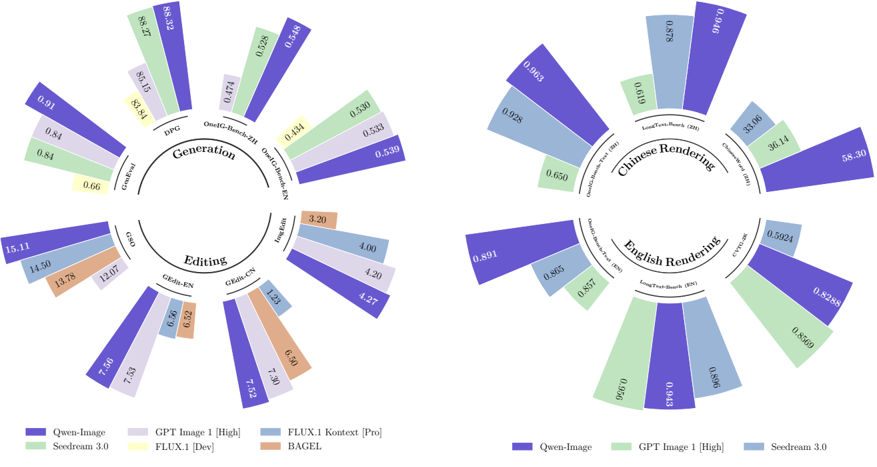 

*图1(a)：Qwen-Image在图像生成和编辑基准测试中的表现*

 

*图1(b)：Qwen-Image在文本渲染基准测试中的表现，特别是在中文方面*

## 2. 模型架构

### 2.1 整体架构

Qwen-Image采用标准的双流MMDiT（Multimodal Diffusion Transformer）架构，主要组件包括：

- **Qwen2.5-VL**：提供输入表示的视觉语言模型
- **VAE编码器**：提供重建表示
- **MMDiT**：联合建模文本和图像

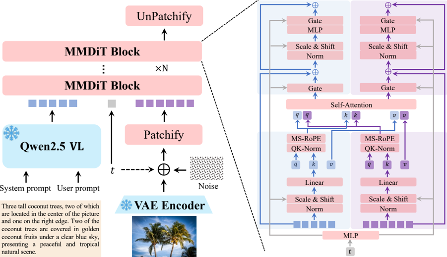 

*图6：Qwen-Image架构概览*

### 2.2 创新性位置编码：MSRoPE

Qwen-Image引入了**多模态可扩展RoPE（MSRoPE）**，解决了传统位置编码在文本-图像联合任务中的局限性：

- 将文本视为2D张量，对两个维度应用相同的位置ID
- 文本概念上沿图像网格对角线连接
- 保留图像分辨率缩放优势，同时保持与1D-RoPE在文本侧的功能等效性

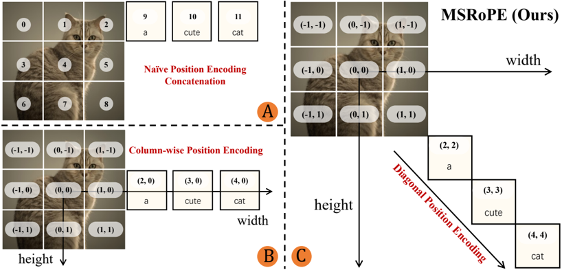 

*图8：不同图像-文本联合位置编码策略比较*

### 2.3 模型配置

| 组件 | 属性 | 值 |
|------|------|-----|
| VLM.ViT | 层数 | 32 |
| VLM.LLM | 层数 | 28 |
| VAE.Enc | 层数 | 11 |
| VAE.Dec | 层数 | 15 |
| MMDiT | 层数 | 60 |
| VLM.ViT | 头数 (Q/KV) | 16/16 |
| VLM.LLM | 头数 (Q/KV) | 28/4 |
| MMDiT | 头数 (Q/KV) | 24/24 |
| MMDiT | 头尺寸 | 128 |
| MMDiT | 中间层尺寸 | 12,288 |
| VAE.Enc | 通道尺寸 | 16 |
| VAE.Dec | 通道尺寸 | 16 |
| VLM.ViT | 参数量 | 7B |
| VAE.Enc | 参数量 | 54M |
| VAE.Dec | 参数量 | 73M |
| MMDiT | 参数量 | 20B |

*表1：Qwen-Image架构配置*

## 3. 数据处理

### 3.1 数据收集策略

Qwen-Image系统地收集和标注了数十亿图像-文本对，重点关注数据质量和平衡分布，构建了一个能反映真实场景的代表性数据集。数据集分为四大主要领域：

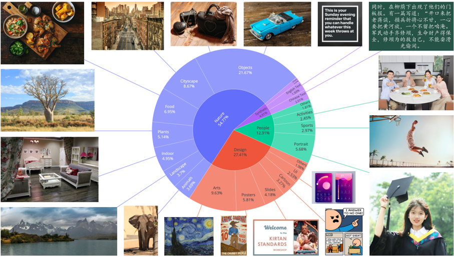 

*图9：数据收集概览*

- **自然类（55%）**：包括物体、风景、城市景观、植物、动物、室内和食物等子类别
- **设计类（27%）**：包括海报、用户界面、演示文稿以及各种艺术形式
- **人物类（13%）**：包括肖像、体育和人类活动等
- **合成数据（5%）**：通过受控文本渲染技术合成的数据

### 3.2 多阶段数据过滤管道

Qwen-Image采用七阶段数据过滤管道，逐步提高数据质量：

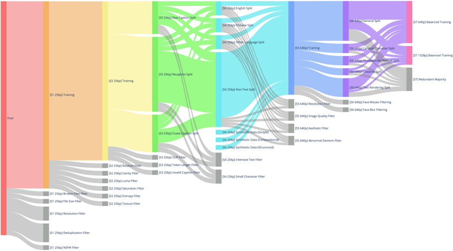 

*图10：多阶段数据过滤管道概览*

#### 3.2.1 阶段1：初始预训练数据整理
- 应用损坏文件过滤器、文件大小过滤器
- 分辨率过滤器、去重过滤器
- NSFW过滤器（排除性、暴力或其他冒犯性内容）

#### 3.2.2 阶段2：图像质量增强
- 旋转过滤器（移除显著旋转或翻转的图像）
- 清晰度过滤器（丢弃模糊或失焦图像）
- 亮度过滤器、饱和度过滤器
- 熵过滤器、纹理过滤器

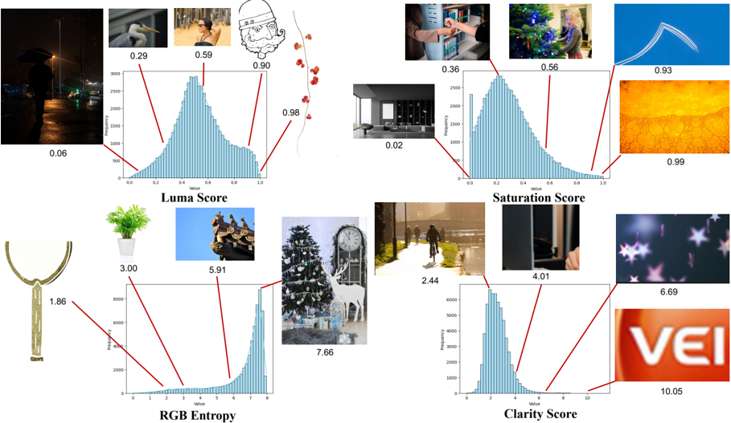 

*图11：过滤操作符示例*

#### 3.2.3 阶段3：图像-文本对齐改进
- 将数据集分为原始标题、重新标注和融合标题三个部分
- 应用中文CLIP和SigLIP 2过滤器
- 令牌长度过滤器、无效标题过滤器

#### 3.2.4 阶段4：文本渲染增强
- 将数据集分为英语、中文、其他语言和无文本四个部分
- 引入合成文本渲染数据
- 应用密集文本过滤器和小字符过滤器

#### 3.2.5 阶段5：高分辨率优化
- 图像质量过滤器、分辨率过滤器
- 审美过滤器、异常元素过滤器

#### 3.2.6 阶段6：类别平衡和肖像增强
- 将数据集重新分类为通用、肖像和文本渲染三类
- 通过关键词检索和图像检索技术增强数据集
- 应用过滤器移除面部马赛克或模糊的图像

#### 3.2.7 阶段7：平衡的多尺度训练
- 在640p和1328p分辨率上联合训练
- 设计层次分类系统进行图像分类
- 采用特殊重采样策略平衡文本渲染数据

### 3.3 文本感知图像合成

针对真实世界图像中文本的长尾分布问题，Qwen-Image提出三阶段文本感知图像合成管道：

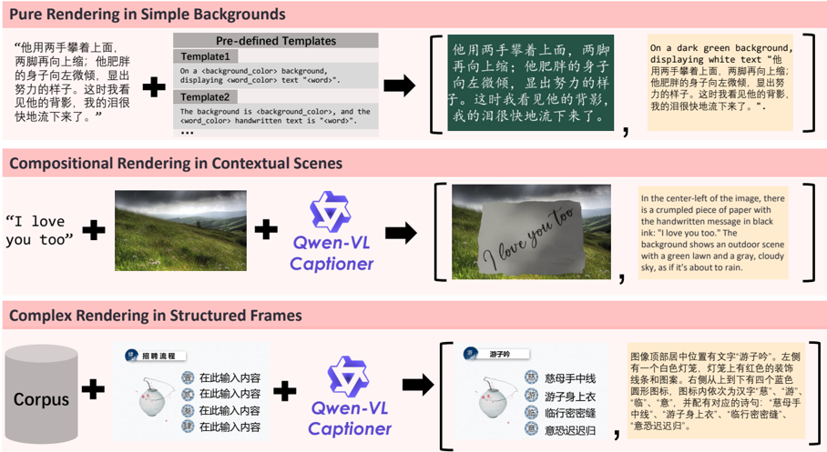 

*图13：数据合成概览*

#### 3.3.1 简单背景中的纯渲染
- 从大规模高质量语料库中提取文本段落
- 使用动态布局算法在干净背景上渲染
- 严格的质量控制机制确保字符完整性

#### 3.3.2 上下文场景中的组合渲染
- 将合成文本嵌入到现实视觉上下文中
- 模拟文本写在或打印在各种物理媒介上
- 使用Qwen-VL Captioner生成描述性标题

#### 3.3.3 结构化模板中的复杂渲染
- 基于预定义模板的程序化编辑
- 设计基于规则的系统自动化替换占位符文本
- 保持布局结构、对齐和格式的完整性

## 4. 训练策略

### 4.1 渐进式训练方法

Qwen-Image采用渐进式训练策略，从非文本到文本渲染，从简单到复杂的文本输入，逐步扩展到段落级描述：

- 从基本图像生成开始
- 逐步引入简单文本渲染
- 过渡到复杂文本布局和语义
- 最终实现段落级文本渲染能力

这种方法显著提高了模型的原生文本渲染能力。

### 4.2 多任务训练范式

为增强图像编辑一致性，Qwen-Image引入改进的多任务训练范式：

- 传统文本到图像（T2I）任务
- 文本-图像到图像（TI2I）任务
- 图像到图像（I2I）重建任务

这种多任务训练有效对齐了Qwen2.5-VL和MMDiT之间的潜在表示。

### 4.3 双编码机制

Qwen-Image采用双编码机制处理图像编辑任务：

- 将原始图像分别输入Qwen2.5-VL和VAE编码器
- 分别获得语义表示和重建表示
- 使编辑模块能够在保持语义一致性和视觉保真度之间取得平衡

 

*图14：图像编辑（TI2I）任务概览*

## 5. 评估结果

### 5.1 VAE重建性能

Qwen-Image的VAE在图像重建方面表现出色，特别是在文本渲染方面：

| 模型 | Imagenet_256x256.PSNR | Imagenet_256x256.SSIM | Text_256x256.PSNR | Text_256x256.SSIM |
|------|------------------------|------------------------|--------------------|--------------------|
| Wan2.1-VAE | 31.29 | 0.8870 | 26.77 | 0.9386 |
| Hunyuan-VAE | 33.21 | 0.9143 | 32.83 | 0.9773 |
| FLUX-VAE | 32.84 | 0.9155 | 32.65 | 0.9792 |
| Cosmos-CI-VAE | 32.23 | 0.9010 | 30.62 | 0.9664 |
| SD-3.5-VAE | 31.22 | 0.8839 | 29.93 | 0.9658 |
| **Qwen-Image-VAE** | **33.42** | **0.9159** | **36.63** | **0.9839** |

*表2：VAE的定量评估结果*

 

*图17：VAE重建可视化，比较不同VAE在密集文档图像中重建小文本的能力*

### 5.2 文本到图像（T2I）任务评估

#### 5.2.1 通用生成能力

Qwen-Image在多个通用图像生成基准测试中表现优异：

**DPG基准测试结果：**

| 模型 | Global | Entity | Attribute | Relation | Other | Overall |
|------|--------|--------|-----------|----------|-------|---------|
| SD v1.5 | 74.63 | 74.23 | 75.39 | 73.49 | 67.81 | 63.18 |
| ... | ... | ... | ... | ... | ... | ... |
| GPT Image 1 [High] | 90.97 | 89.61 | 88.39 | 90.58 | 89.83 | 83.50 |
| **Qwen-Image** | **91.32** | **91.56** | **92.02** | **94.31** | **92.73** | **88.32** |

*表3：DPG基准测试的定量评估结果*

**GenEval基准测试结果：**

| 模型 | Single Object | Two Object | Counting | Colors | Position | Attribute Binding | Overall |
|------|---------------|------------|----------|--------|----------|-------------------|---------|
| Show-o | 0.95 | 0.52 | 0.49 | 0.82 | 0.11 | 0.28 | 0.53 |
| ... | ... | ... | ... | ... | ... | ... | ... |
| GPT Image 1 [High] | 0.99 | 0.92 | 0.85 | 0.92 | 0.75 | 0.61 | 0.84 |
| **Qwen-Image** | **0.99** | **0.92** | **0.89** | **0.88** | **0.76** | **0.77** | **0.87** |
| Qwen-Image-RL | 1.00 | 0.95 | 0.93 | 0.92 | 0.87 | 0.83 | 0.91 |

*表4：GenEval基准测试的定量评估结果*

**OneIG-Bench基准测试结果：**

| 模型 | Alignment | Text | Reasoning | Style | Diversity | Overall |
|------|-----------|------|-----------|-------|-----------|---------|
| Janus-Pro | 0.553 | 0.001 | 0.139 | 0.276 | 0.365 | 0.267 |
| ... | ... | ... | ... | ... | ... | ... |
| GPT Image 1 [High] | 0.851 | 0.857 | 0.345 | 0.462 | 0.151 | 0.533 |
| **Qwen-Image** | **0.882** | **0.891** | **0.306** | **0.418** | **0.197** | **0.539** |

*表5：OneIG-EN基准测试的定量评估结果*

| 模型 | Alignment | Text | Reasoning | Style | Diversity | Overall |
|------|-----------|------|-----------|-------|-----------|---------|
| Janus-Pro | 0.324 | 0.148 | 0.104 | 0.264 | 0.358 | 0.240 |
| ... | ... | ... | ... | ... | ... | ... |
| GPT Image 1 [High] | 0.812 | 0.650 | 0.300 | 0.449 | 0.159 | 0.474 |
| **Qwen-Image** | **0.825** | **0.963** | **0.267** | **0.405** | **0.279** | **0.548** |

*表6：OneIG-ZH基准测试的定量评估结果*

**TIIF基准测试结果：**

| 模型 | Overall short | Basic Following | Advanced Following | Designer |
|------|---------------|-----------------|--------------------|----------|
| ... | ... | ... | ... | ... |
| GPT Image 1 [High] | 89.15 | 90.75 | 88.55 | 89.73 |
| **Qwen-Image** | **86.14** | **86.18** | **79.30** | **90.30** |

*表7：TIIF Bench mini基准测试的定量评估结果*

#### 5.2.2 文本渲染能力

**CVTG-2K英文文本渲染评估：**

| 模型 | Word Accuracy (avg) | NED | CLIPScore |
|------|---------------------|-----|-----------|
| SD3.5 Large | 0.6548 | 0.8470 | 0.7797 |
| ... | ... | ... | ... |
| GPT Image 1 [High] | 0.8569 | 0.9478 | 0.7982 |
| **Qwen-Image** | **0.8288** | **0.9116** | **0.8017** |

*表8：CVTG-2K英文文本渲染的定量评估结果*

**ChineseWord中文文本渲染评估：**

| 模型 | Level-1 Acc | Level-2 Acc | Level-3 Acc | Overall |
|------|-------------|-------------|-------------|---------|
| Seedream 3.0 | 53.48 | 26.23 | 1.25 | 33.05 |
| GPT Image 1 [High] | 68.37 | 15.97 | 3.55 | 36.14 |
| **Qwen-Image** | **97.29** | **40.53** | **6.48** | **58.30** |

*表9：ChineseWord中文文本渲染的定量评估结果*

**LongText-Bench长文本渲染评估：**

| 模型 | LongText-Bench-EN | LongText-Bench-ZH |
|------|-------------------|-------------------|
| Janus-Pro | 0.019 | 0.006 |
| ... | ... | ... |
| GPT Image 1 [High] | 0.956 | 0.619 |
| **Qwen-Image** | **0.943** | **0.946** |

*表10：LongText-Bench长文本渲染的定量评估结果*

### 5.3 图像编辑（TI2I）任务评估

#### 5.3.1 通用图像编辑

**GEdit-Bench评估结果：**

| 模型 | GEdit-Bench-EN (G_SC) | GEdit-Bench-EN (G_PQ) | GEdit-Bench-EN (G_O) | GEdit-Bench-CN (G_SC) | GEdit-Bench-CN (G_PQ) | GEdit-Bench-CN (G_O) |
|------|------------------------|------------------------|------------------------|------------------------|------------------------|------------------------|
| ... | ... | ... | ... | ... | ... | ... |
| GPT Image 1 [High] | 7.85 | 7.62 | 7.53 | 7.67 | 7.56 | 7.30 |
| **Qwen-Image** | **8.00** | **7.86** | **7.56** | **7.82** | **7.79** | **7.52** |

*表11：GEdit-Bench的语义一致性、感知质量和总体评分比较*

**ImgEdit评估结果：**

| 模型 | Add | Adjust | Extract | Replace | Remove | Background | Style | Hybrid | Action | Overall |
|------|-----|--------|---------|---------|--------|------------|-------|--------|--------|---------|
| ... | ... | ... | ... | ... | ... | ... | ... | ... | ... | ... |
| GPT Image 1 [High] | 4.61 | 4.33 | 2.90 | 4.35 | 3.66 | 4.57 | 4.93 | 3.96 | 4.89 | 4.20 |
| **Qwen-Image** | **4.38** | **4.16** | **3.43** | **4.66** | **4.14** | **4.38** | **4.81** | **3.82** | **4.69** | **4.27** |

*表12：ImgEdit基准测试的定量比较结果*

#### 5.3.2 3D视觉任务

**GSO数据集上的新视角合成：**

| 模型 | PSNR | SSIM | LPIPS |
|------|------|------|-------|
| Zero123 | 13.48 | 0.854 | 0.166 |
| ... | ... | ... | ... |
| GPT Image 1 [High] | 12.07 | 0.804 | 0.361 |
| **Qwen-Image** | **15.11** | **0.884** | **0.153** |

*表13：新视角合成的定量比较*

**深度估计任务：**

| 模型 | KITTI (AbsRel) | KITTI (δ1) | NYUv2 (AbsRel) | NYUv2 (δ1) | ScanNet (AbsRel) | ScanNet (δ1) | DIODE (AbsRel) | DIODE (δ1) | ETH3D (AbsRel) | ETH3D (δ1) |
|------|----------------|------------|----------------|------------|-----------------|--------------|----------------|-------------|----------------|-------------|
| ... | ... | ... | ... | ... | ... | ... | ... | ... | ... | ... |
| Depth Pro | 0.055 | 0.974 | 0.042 | 0.977 | 0.041 | 0.978 | 0.217 | 0.764 | 0.043 | 0.974 |
| **Qwen-Image** | **0.078** | **0.951** | **0.055** | **0.967** | **0.047** | **0.974** | **0.197** | **0.832** | **0.066** | **0.962** |

*表14：深度估计任务的定量比较结果*

## 6. 案例展示

### 6.1 文本渲染能力展示

*图2：Qwen-Image在复杂文本渲染方面的展示，包括多行布局、段落级语义和细粒度细节*

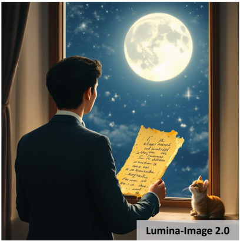 
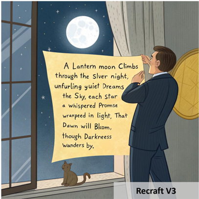 

*图18-19：英文文本渲染能力比较*

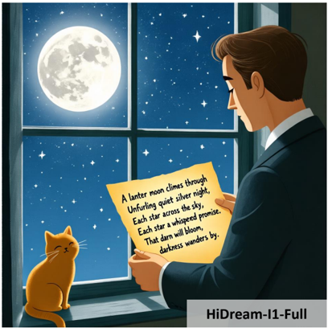 
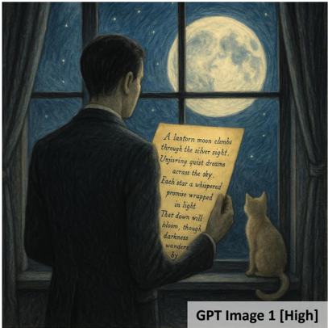 

*图20-21：中文文本渲染能力比较*

### 6.2 通用图像生成展示

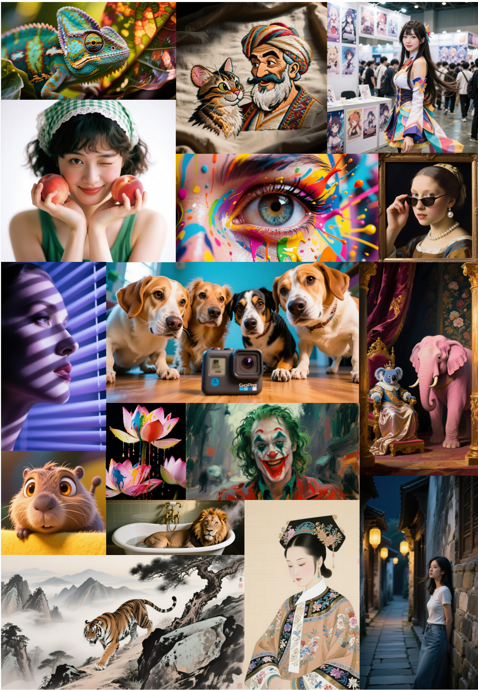 

*图3：Qwen-Image在通用图像生成方面的展示，支持多种艺术风格*

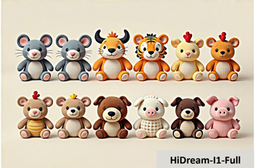 
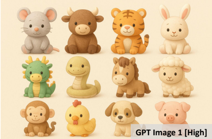 
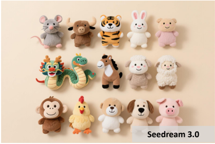 
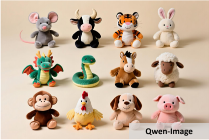 
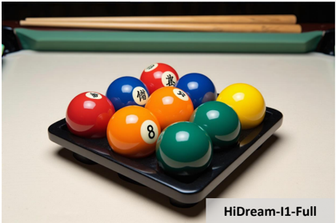 

*图22：多对象建模能力比较*

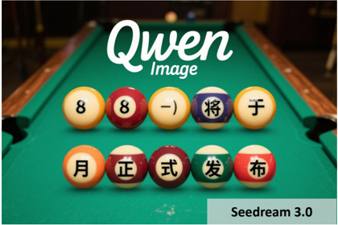 
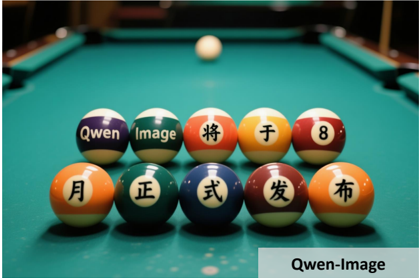 
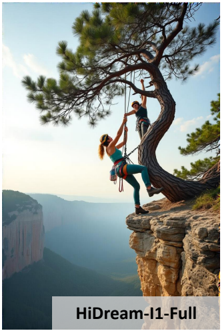 
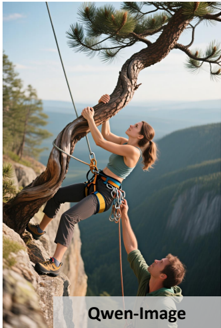 
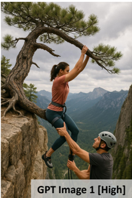 
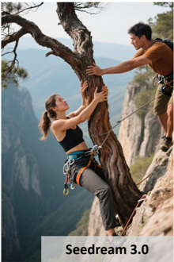 

*图23：空间关系建模能力比较*

### 6.3 图像编辑能力展示

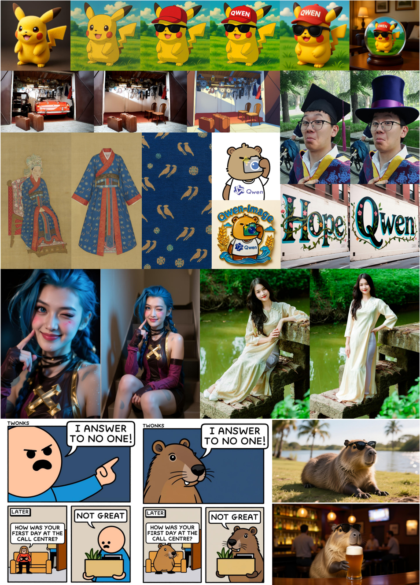 

*图4：Qwen-Image在通用图像编辑方面的展示，包括风格转换、文本编辑、背景更改、对象添加、移除和替换、姿态操作等*

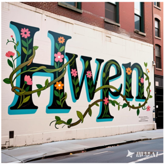 
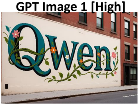 
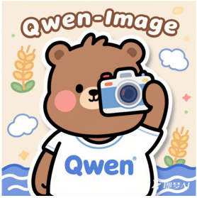 
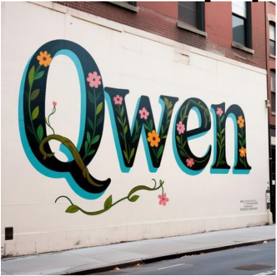 
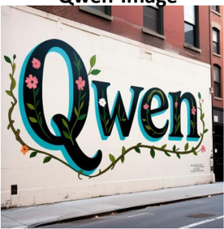 
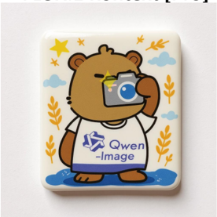 

*图24：文本和材质修改的定性比较*

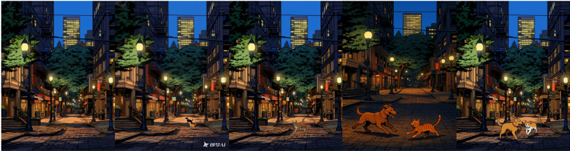 
 
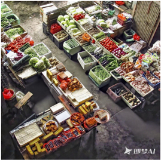 
 
 
 

*图25：对象编辑（添加、移除和替换）的定性比较*

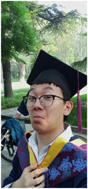 
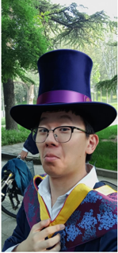 
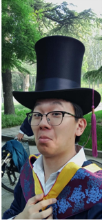 
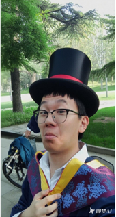 
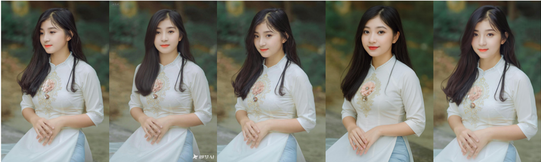 
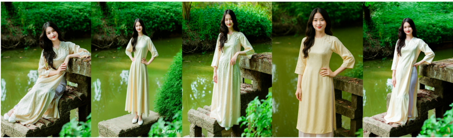 
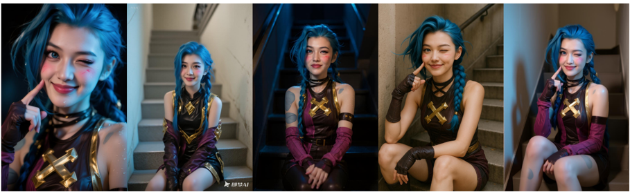 

*图26：姿态操作的定性比较*

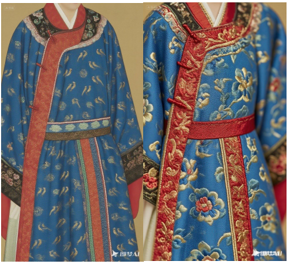 
 

 
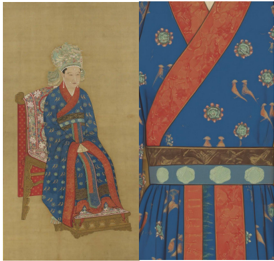 
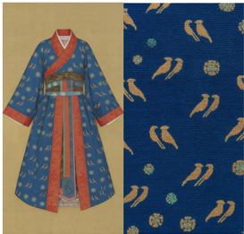 
 
 
 

*图27：链式编辑的示例*

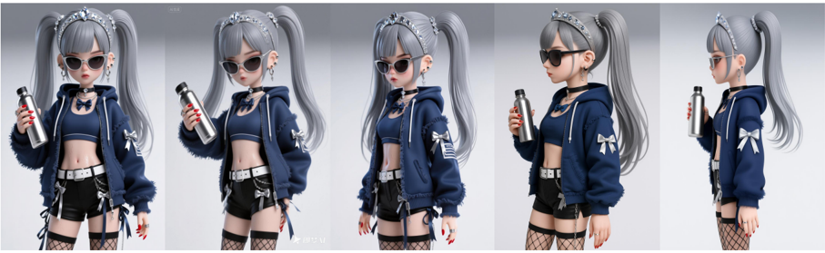 
 
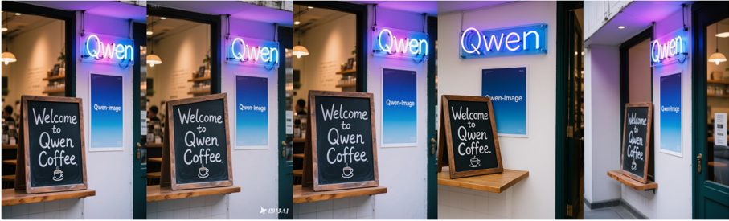 

*图28：新视角合成的定性比较*

### 6.4 图像理解任务展示

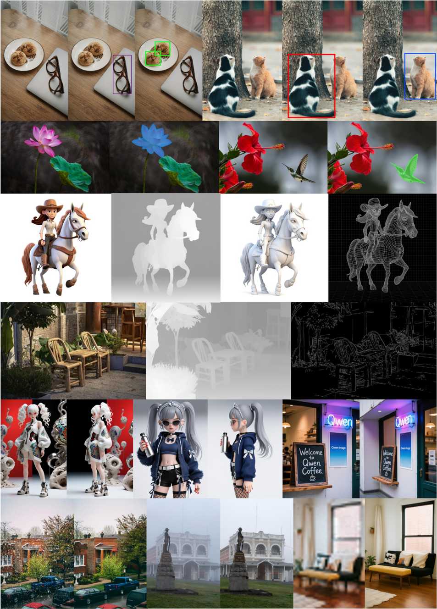 

*图5：Qwen-Image在图像理解任务中的展示，包括检测、分割、深度/边缘估计、新视角合成和超分辨率*

## 7. 结论

Qwen-Image作为一款先进的图像生成基础模型，在以下方面取得了显著进展：

1. **复杂文本渲染**：通过全面的数据管道和渐进式训练策略，实现了高质量的多语言文本渲染，尤其在中文象形文字方面表现突出
   
2. **精确图像编辑**：通过改进的多任务训练范式和双编码机制，有效平衡了语义一致性和视觉保真度
   
3. **广泛的适用性**：不仅支持标准的文本到图像生成，还能处理图像编辑、新视角合成、深度估计等多种任务

Qwen-Image在多个基准测试中达到或超越现有最先进水平，特别是在文本渲染和图像编辑方面。其开源实现可在以下平台获取：

- GitHub: [https://github.com/QwenLM/Qwen-Image](https://github.com/QwenLM/Qwen-Image)
- ModelScope: [https://modelscope.cn/models/Qwen/Qwen-Image](https://modelscope.cn/models/Qwen/Qwen-Image)
- Hugging Face: [https://huggingface.co/Qwen/Qwen-Image](https://huggingface.co/Qwen/Qwen-Image)

Qwen-Image代表了图像生成模型在文本渲染和图像编辑能力方面的重要突破，为未来的研究和应用提供了坚实基础。