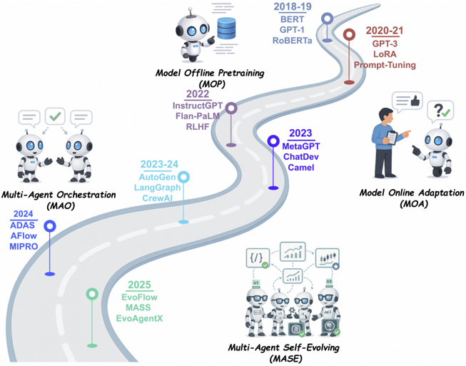
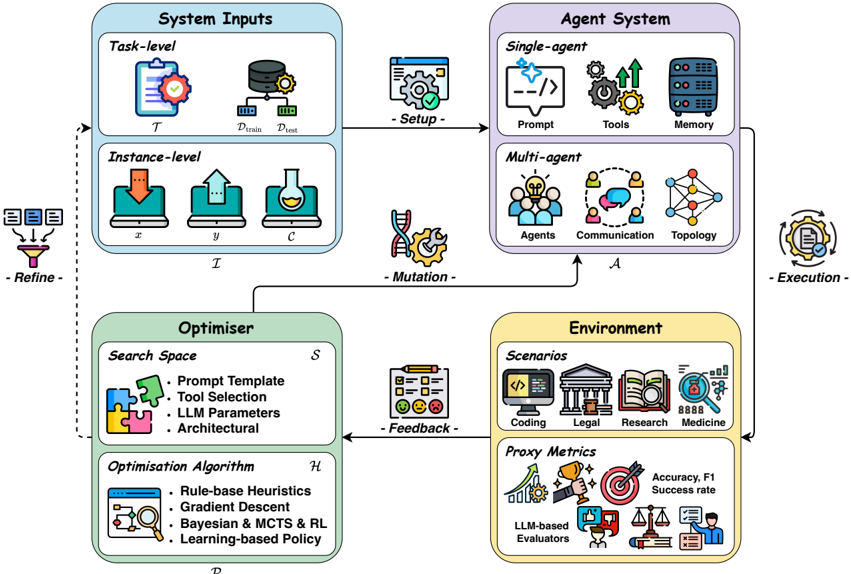
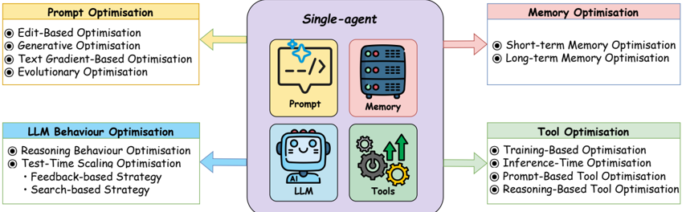
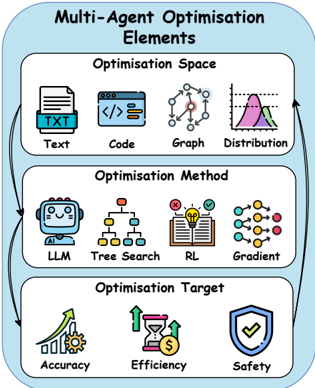
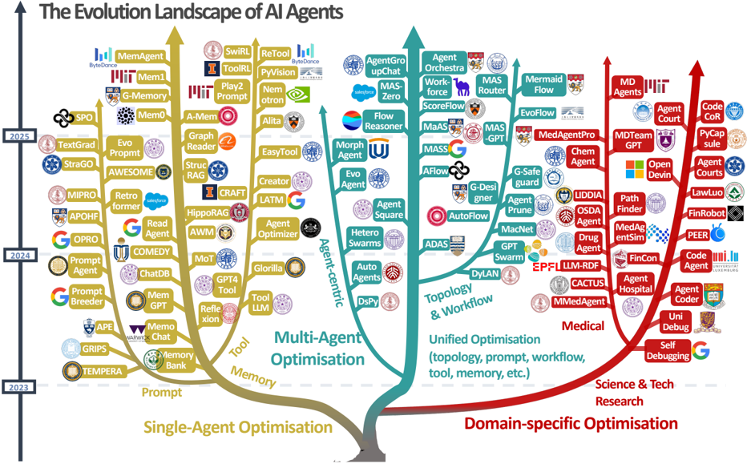
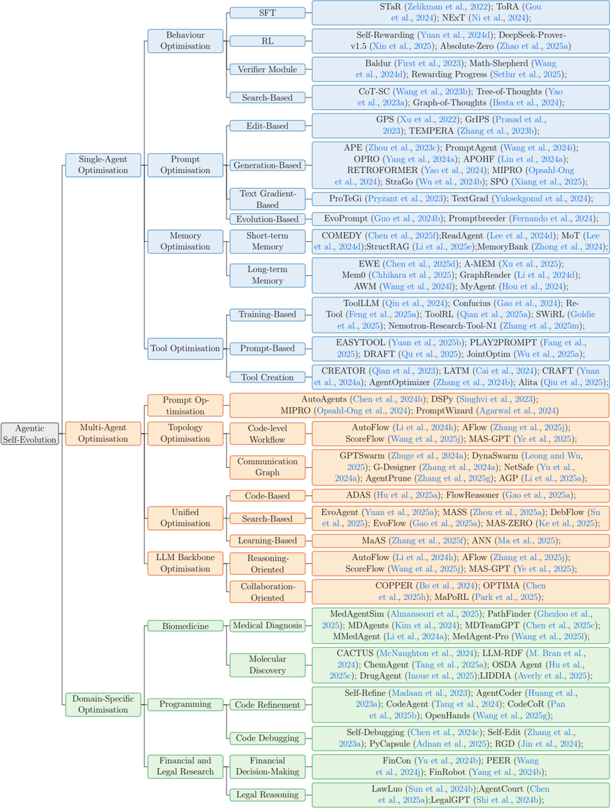

# 自演进AI智能体：从静态模型到自主进化的范式转变

## 1. 引言

### 1.1 大型语言模型的发展背景

近年来，大型语言模型(LLMs)在人工智能领域取得了显著进展。通过大规模预训练、监督微调和强化学习等技术，LLMs在规划、推理和自然语言理解方面展现出卓越能力（Zhao et al., 2023; Grattafiori et al., 2024; Yang et al., 2025a; Guo et al., 2025）。这些进步催生了基于LLM的智能体（LLM-based agents）——一类以LLM作为决策/策略模块的AI智能体（Wang et al., 2024c; Luo et al., 2025a）。

 
**图1：LLM-centric学习的演进过程**  
LLM-centric学习正从纯粹基于静态数据的学习，发展到与动态环境交互，最终迈向通过多智能体协作和自我演进实现的终身学习。

### 1.2 LLM智能体的定义与架构

LLM-based agents是自主系统，利用LLM作为核心推理组件，在开放、真实环境中理解输入、规划行动并生成输出（Wang et al., 2024c; Xi et al., 2025; Luo et al., 2025a）。典型的AI智能体包含以下关键组件：

- **基础模型**（如LLM）：核心组件，负责解释目标、制定计划和执行行动
- **感知模块**（Shridhar et al., 2021; Zheng et al., 2024）：帮助智能体感知输入
- **规划模块**（Yao et al., 2023a,b; Besta et al., 2024）：用于任务分解
- **记忆模块**（Modarressi et al., 2023; Zhong et al., 2024）：保留上下文信息
- **工具模块**（Schick et al., 2023; Gou et al., 2024; Liu et al., 2025d）：与外部工具交互

### 1.3 现有系统的局限性

尽管单智能体系统在各种任务中展现出强大的泛化和适应能力，但在动态复杂环境中常面临任务专业化和协调方面的挑战（Wu et al., 2024a; Qian et al., 2024）。这促使了多智能体系统(MAS)的发展，其中多个智能体协作解决复杂问题。与单智能体系统相比，MAS具有以下优势：

- **功能专业化**：每个智能体专精于特定子任务或领域
- **交互协作**：智能体间可交换信息、协调行为以实现共同目标
- **能力扩展**：能够处理超出单个智能体能力范围的任务

LLM-based智能体系统已成功应用于代码生成（Jiang et al., 2024）、科学研究（Lu et al., 2024a）、网页导航（Lai et al., 2024a）以及生物医学（Kim et al., 2024）和金融（Tian et al., 2025）等特定领域。

然而，现有系统（无论是单智能体还是多智能体）大多严重依赖人工设计的配置，部署后通常保持静态架构和固定功能。而现实环境是动态变化的，例如用户意图转变、任务需求变化、外部工具或信息源随时间变化等。在这种情况下，手动重新配置智能体系统耗时、费力且难以扩展。

## 2. 自演进AI智能体的概念框架

### 2.1 自演进AI智能体的定义

为应对上述挑战，研究者提出了**自演进AI智能体**（Self-Evolving AI Agents）这一新范式——一类能够自主适应和持续自我改进的智能体系统，将基础模型与终身学习的智能体系统连接起来。

### 2.2 自演进AI智能体的三定律

受阿西莫夫机器人三定律启发，文章提出了"自演进AI智能体的三定律"，作为确保安全演进的基本原则：

1. **持久性**（Endure - 安全适应）：自演进AI智能体在任何修改过程中必须保持安全性和稳定性
2. **卓越性**（Excel - 性能保持）：在满足第一定律的前提下，自演进AI智能体必须保持或提升现有任务性能
3. **演进性**（Evolve - 自主演进）：在满足前两定律的前提下，自演进AI智能体必须能够自主优化其内部组件，以响应变化的任务、环境或资源

### 2.3 LLM-centric学习范式的演进

文章将LLM-based系统的发展划分为四个递进的范式，从静态、冻结的基础模型逐步发展为完全自主、自我演进的智能体系统：

**表1：四种LLM-centric学习范式的比较**  
- **MOP**（Model Offline Pretraining，模型离线预训练）：初始阶段，专注于在大规模静态语料库上预训练基础模型，然后以固定、冻结状态部署，不再进行进一步适应
- **MOA**（Model Online Adaptation，模型在线适应）：在MOP基础上，引入部署后适应，通过监督微调、低秩适配器（LoRA）或基于人类反馈的强化学习（RLHF）等技术更新基础模型
- **MAO**（Multi-Agent Orchestration，多智能体编排）：超越单一基础模型，协调多个LLM智能体通过消息交换或辩论提示进行通信和协作，解决复杂任务而不修改底层模型参数
- **MASE**（Multi-Agent Self-Evolving，多智能体自演进）：引入终身自演进循环，智能体群体基于环境反馈和元奖励持续优化提示、记忆、工具使用策略甚至交互模式

从MOP到MASE的演进代表了LLM-based系统开发的根本性转变：从静态、人工配置的架构转向能够响应变化需求和环境的适应性、数据驱动系统。自演进AI智能体将基础模型的静态能力与终身智能体系统所需的持续适应性连接起来，为更自主、更具弹性和可持续的AI提供了路径。

## 3. 自演进智能体的核心组件

### 3.1 概念框架

自演进过程通常通过迭代优化实现，形成一个包含四个关键组件的闭环反馈循环：

 
**图3：自演进智能体系统的概念框架**  
该过程形成一个迭代优化循环，包含四个组件：系统输入、智能体系统、环境和优化器。

1. **系统输入**（System Inputs）：定义任务设置（如任务级或实例级），包括高级描述、输入数据、上下文信息或具体示例
2. **智能体系统**（Agent System）：以单智能体或多智能体架构执行指定任务
3. **环境**（Environment）：提供操作上下文，并通过代理指标提供反馈
4. **优化器**（Optimiser）：通过定义的搜索空间和优化算法更新智能体系统，直到达到性能目标

该过程开始于任务规范，智能体系统在环境中执行任务，环境提供反馈信号，优化器基于反馈更新系统，形成迭代闭环。当达到预定义性能阈值或满足收敛标准时，循环终止。

### 3.2 核心组件详解

- **系统输入**：定义智能体需要解决的问题，可以是任务描述、输入数据、上下文信息或示例
- **智能体系统**：执行任务的核心，可以是单智能体或多智能体架构
- **环境**：提供运行上下文并生成反馈信号，反馈基于预定义评估指标
- **优化器**：应用特定算法和策略更新智能体系统，如调整LLM参数、修改提示或优化系统结构

基于MASE概念框架，EvoAgentX是首个应用此自演进智能体过程的开源框架，旨在自动化生成、执行、评估和优化智能体系统（Wang et al., 2025i）。

## 4. 自演进技术分类

### 4.1 单智能体优化

单智能体优化专注于提升单个智能体系统的性能。根据优化反馈循环，关键挑战在于设计用于更新系统的优化器，包括确定要优化的系统组件（搜索空间）、要增强的特定能力以及选择适当的优化策略（优化算法）。

 
**图4：单智能体优化方法概述**  
按智能体系统内目标组件分类：提示、记忆和工具。

单智能体优化方法主要分为四类：

1. **LLM行为优化**：通过参数调整或测试时扩展技术提升LLM的推理和规划能力
2. **提示优化**：调整提示以引导LLM生成更准确、更符合任务的输出
3. **记忆优化**：增强智能体存储、检索和推理历史信息或外部知识的能力
4. **工具优化**：提升智能体有效利用现有工具，或自主创建/配置新工具以完成复杂任务的能力

### 4.2 多智能体优化

多智能体工作流定义了多个智能体如何通过结构化拓扑和交互模式协作解决复杂任务。该领域经历了根本性转变：从人工设计的智能体架构（研究者明确指定协作模式和通信协议）到自动发现有效协作策略的自演进系统。

 
**图6：多智能体系统优化方法概述**  
左侧为核心优化元素（空间、方法和目标），右侧为优化维度（提示、拓扑、统一和LLM骨干）。

多智能体工作流优化可从四个关键维度进行考察：

1. **手动设计范式**：建立基础原则，研究者明确指定协作模式和通信协议
2. **提示级优化**：在固定拓扑内优化智能体行为
3. **拓扑优化**：发现完成特定任务的最有效多智能体架构
4. **统一优化**：同时考虑多个优化空间，综合优化提示、拓扑和其他系统参数
5. **LLM骨干优化**：通过针对性训练增强智能体的基础推理和协作能力

该领域逐步扩展了对"可搜索和可优化参数"的理解范围，从智能体指令和通信结构到基础模型的核心能力。

### 4.3 领域特定优化

 
**图2：AI智能体演进和优化技术的可视化分类**  
分为三大方向：单智能体优化、多智能体优化和领域特定优化。树状结构展示了2023-2025年这些方法的发展，包括各分支的代表性方法。

 
**图5：智能体自演进方法的分层分类**  
涵盖单智能体、多智能体和领域特定优化类别，并附有代表性工作示例。

领域特定优化针对特定应用场景（如操作系统智能体、医疗健康智能体等）开发专门的演进策略。这些方法考虑领域特有约束和需求，实现更有效的自演进能力。

## 5. 评估、安全与伦理考量

### 5.1 评估方法

评估自演进智能体系统需要考虑多维度指标：
- **任务性能**：在特定任务上的准确性和效率
- **适应能力**：面对新任务或环境变化时的适应速度和效果
- **稳定性**：演进过程中性能波动程度
- **安全性**：是否遵守三定律，特别是安全适应原则

### 5.2 安全考虑

自演进过程中必须确保：
- **行为一致性**：演进不应导致智能体行为与设计意图严重偏离
- **风险控制**：建立安全边界，防止演进导致有害行为
- **可解释性**：理解演进决策的原因，便于人工干预

### 5.3 伦理问题

自演进智能体引发的伦理问题包括：
- **责任归属**：当自演进系统产生不良后果时，责任如何界定
- **价值对齐**：确保演进过程与人类价值观保持一致
- **透明度**：用户应了解系统正在演进及其可能影响

## 6. 挑战与未来方向

### 6.1 现有挑战

1. **安全演进保障**：如何在保持系统安全的同时实现有效演进
2. **性能稳定性**：避免演进过程中出现性能退化
3. **评估标准缺失**：缺乏统一的评估框架衡量自演进能力
4. **资源效率**：自演进过程通常需要大量计算资源
5. **理论基础不足**：缺乏对自演进过程的理论分析和保证

### 6.2 未来研究方向

1. **安全演进机制**：开发更可靠的演进安全保障技术
2. **高效演进算法**：减少演进所需的计算资源和数据量
3. **跨领域迁移**：研究演进知识在不同任务间的迁移能力
4. **人机协同演进**：探索人类与智能体共同演进的机制
5. **理论框架构建**：建立自演进过程的理论分析框架

## 7. 结论

自演进AI智能体代表了AI系统发展的新范式，通过将基础模型与终身学习能力相结合，有望解决传统智能体系统在动态环境中的适应性问题。从MOP到MASE的范式演进展示了AI系统从静态模型向自主进化的转变历程。

尽管完全实现自演进AI智能体仍面临诸多挑战，但当前在单智能体优化、多智能体优化和领域特定优化方面的进展为未来研究奠定了基础。遵循"三定律"原则，结合系统化的概念框架和优化方法，研究者有望开发出更自主、更具适应性和更安全的AI系统，推动人工智能向更高级的自主智能发展。

未来研究应重点关注安全演进机制、高效演进算法和理论基础构建，同时加强评估标准和伦理框架的制定，确保自演进AI智能体的健康发展和负责任部署。