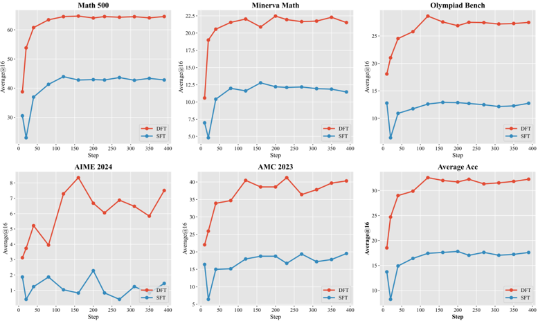
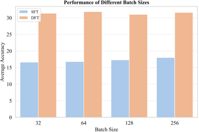

Powered by [MS-Agent](https://github.com/modelscope/ms-agent) | [DocResearch](https://github.com/modelscope/ms-agent/blob/main/projects/doc_research/README.md)
 

# DFT方法在大型语言模型数学推理能力提升中的应用与分析

## 1. 研究背景与方法概述

本文深入探讨了 **动态微调（Dynamic Fine-Tuning, DFT）** 方法在提升大型语言模型（LLM）数学推理能力方面的有效性。DFT是一种创新的微调范式，通过动态重加权机制优化训练过程，与传统的监督微调（Supervised Fine-Tuning, SFT）相比展现出显著优势。

研究在多个维度评估了DFT的性能：
- 在5个数学推理基准测试上的表现（Math500、Minerva Math、Olympiad Bench、AIME 2024、AMC 2023）
- 与标准SFT及其他先进方法的对比
- 学习效率与收敛特性
- 超参数敏感性分析

## 2. DFT与SFT的性能比较

### 2.1 整体性能提升

DFT在所有评估的LLM上均显著优于基础模型和标准SFT。如表1所示，DFT带来的平均性能提升远超SFT：

 

**表1：五个最先进的大型语言模型在五个数学推理基准上的平均@16准确率**

| 模型 | 方法 | Math500 | Minerva Math | Olympiad Bench | AIME24 | AMC23 | Avg. |
|------|------|---------|-------------|---------------|--------|-------|------|
| LLaMA-3.2-3B | Base | 1.63 | 1.36 | 1.01 | 0.41 | 1.56 | 1.19 |
|  | SFT | 8.65 | 2.38 | 2.06 | 0.00 | 3.13 | 3.24 |
|  | **DFT** | **12.79** | **2.84** | **2.90** | **0.83** | **3.91** | **4.65** |
| LLaMA-3.1-8B | Base | 1.86 | 0.98 | 0.94 | 0.21 | 1.01 | 1.00 |
|  | SFT | 16.85 | 5.78 | 3.88 | 0.00 | 5.16 | 6.33 |
|  | **DFT** | **27.44** | **8.26** | **6.94** | **0.41** | **12.03** | **11.02** |
| DeepSeekMath-7B | Base | 6.15 | 2.15 | 1.74 | 0.21 | 2.97 | 2.64 |
|  | SFT | 26.83 | 7.26 | 6.33 | 0.41 | 8.28 | 9.82 |
|  | **DFT** | **41.46** | **16.79** | **15.00** | **1.24** | **16.25** | **18.15** |
| Qwen2.5-Math-1.5B | Base | 31.66 | 8.51 | 15.88 | 4.16 | 19.38 | 15.92 |
|  | SFT | 43.76 | 13.04 | 12.63 | 1.87 | 18.75 | 18.01 |
|  | **DFT** | **64.89** | **20.94** | **27.08** | **6.87** | **38.13** | **31.58** |
| Qwen2.5-Math-7B | Base | 40.12 | 14.39 | 17.12 | 6.68 | 27.96 | 21.25 |
|  | SFT | 53.96 | 16.66 | 18.93 | 2.48 | 26.09 | 23.62 |
|  | **DFT** | **68.20** | **30.16** | **33.83** | **8.56** | **45.00** | **37.15** |

具体数据表明：
- 对于Qwen2.5-Math-1.5B，DFT比基础模型平均提升+15.66分，是SFT提升(+2.09)的5.9倍
- LLaMA-3.2-3B通过DFT获得+3.46分提升，超过SFT(+2.05)约1.4倍
- LLaMA-3.1-8B通过DFT获得+10.02分提升，超过SFT(+5.33)约1.88倍
- DeepSeekMath-7B通过DFT获得+15.51分提升，是SFT(+7.18)的1.58倍
- Qwen2.5-Math-7B通过DFT获得+15.90分提升，几乎是SFT(+2.37)的3.8倍

### 2.2 在挑战性基准上的表现

DFT在具有挑战性的基准测试上展现出卓越的泛化能力和鲁棒性，而标准SFT在这些任务上往往表现不佳甚至产生负面影响：

- **Olympiad Bench**：SFT导致Qwen2.5-Math-1.5B性能下降（从15.88降至12.63），而DFT将其提升至27.08，比基础模型高出+11.20分
- **AIME24**：SFT使Qwen2.5-Math-7B准确率下降4.20分（从6.68降至2.48），而DFT将其提升至8.56，比基础模型高出+1.88分
- **AMC23**：SFT使Qwen2.5-Math-1.5B性能从19.38降至18.75，而DFT将其提升至38.13，比基础模型高出+18.75分

这些结果表明，DFT不仅在各种模型容量上更有效地扩展，而且在传统SFT难以应对的困难推理任务上展现出更强的韧性。

## 3. DFT的学习效率与收敛特性

DFT展现出更优的学习效率和更快的收敛特性。图1展示了Qwen2.5-Math-1.5B在各数学推理基准上DFT与标准SFT的学习动态差异：

**图1：Qwen2.5-MATH-1.5B在数学基准上的准确率进展，展示DFT相对于SFT的更快收敛和更好性能**

DFT相比SFT展现出三大优势：
1. **更快的收敛速度**：在大多数基准测试中，DFT在前120个训练步骤内即可达到峰值性能
2. **更好的早期阶段表现**：DFT在前10-20个步骤的表现已超过SFT的最佳最终准确率
3. **更高的样本效率**：DFT始终需要更少的更新即可达到相对最优结果

这种加速收敛表明，DFT中的动态重加权机制产生了更具信息量的梯度更新，引导模型在训练早期就找到高质量解决方案。这也表明DFT有助于避免标准SFT中常见的优化平台期或噪声敏感区域，从而更高效地获取复杂的数学推理模式。

## 4. DFT与iw-SFT的比较

DFT在大多数设置中优于同期的Importance-Weighted SFT (iw-SFT)方法：

**表2：与同期工作iw-SFT在数学基准上的比较**

| 模型 | 方法 | Math500 | Minerva Math | Olympiad Bench | AIME24 | AMC23 | Avg. |
|------|------|---------|-------------|---------------|--------|-------|------|
| LLaMA-3.2-3B | iw-SFT | 5.13 | 2.63 | 1.51 | 0.00 | 2.03 | 2.26 |
|  | **DFT** | **12.79** | **2.84** | **2.90** | **0.83** | **3.91** | **4.65** |
| LLaMA-3.1-8B | iw-SFT | 18.21 | 4.31 | 4.31 | 0.20 | 7.34 | 6.87 |
|  | **DFT** | **27.44** | **8.26** | **6.94** | **0.41** | **12.03** | **11.02** |
| DeepSeekMath-7B | iw-SFT | 35.32 | 8.75 | 11.11 | 0.61 | 18.28 | 14.81 |
|  | **DFT** | **41.46** | **16.79** | **15.00** | **1.24** | **16.25** | **18.15** |
| Qwen2.5-Math-1.5B | iw-SFT | 59.38 | 17.08 | 26.82 | 8.13 | 40.00 | 30.28 |
|  | **DFT** | **64.89** | **20.94** | **27.08** | **6.87** | **38.13** | **31.58** |
| Qwen2.5-Math-7B | iw-SFT | 70.28 | 25.70 | 34.46 | 16.46 | 51.09 | 39.60 |
|  | **DFT** | **68.20** | **30.16** | **33.83** | **8.56** | **45.00** | **37.15** |

具体表现：
- DFT在大多数模型家族上实现了更高的平均准确率：LLaMA-3.2-3B (+2.39)、LLaMA-3.1-8B (+4.15)、DeepSeekMath-7B (+3.34)和Qwen2.5-Math-1.5B (+1.30)
- 虽然iw-SFT在Qwen2.5-Math-7B上略优于DFT (+2.45)，但这种改进在数据集间并不一致
- iw-SFT在LLaMA模型家族上表现出有限的鲁棒性：
  - LLaMA-3.2-3B：iw-SFT在Math500 (5.13 vs. 8.65)和AMC23 (2.03 vs. 3.13)上表现不如标准SFT
  - LLaMA-3.1-8B：iw-SFT在Minerva Math (4.31 vs. 5.78)和AMC23 (7.34 vs. 8.28)上表现更差

这些案例表明，iw-SFT可能难以泛化到特定训练信号之外，在分布偏移或更难的基准测试上甚至可能导致性能下降。相比之下，DFT在几乎所有数据集上都一致地改进了基础模型和SFT，包括iw-SFT失败的那些数据集。

此外，iw-SFT需要额外的参考模型来计算重要性权重，增加了计算开销，而DFT直接从模型的token概率动态导出其权重，实现了更高效的训练过程。

## 5. DFT在离线强化学习设置中的应用

研究还探索了DFT在离线强化学习(RL)设置中的应用，其中奖励稀疏性问题可能比SFT设置得到缓解：

**表3：在使用拒绝采样的离线强化学习设置中，在五个数学推理基准上的评估结果**

| 模型 | 设置 | Math500 | Minerva Math | Olympiad Bench | AIME24 | AMC23 | Avg. |
|------|------|---------|-------------|---------------|--------|-------|------|
| Qwen2.5-Math-1.5B | - | 31.66 | 8.51 | 15.88 | 4.16 | 19.38 | 15.92 |
| Qwen2.5-Math-1.5B w/SFT | SFT | 43.14 | 11.64 | 13.41 | 1.03 | 14.84 | 16.81 |
| Qwen2.5-Math-1.5B w/iw-SFT | SFT | 59.38 | 17.08 | 26.82 | 8.13 | 40.00 | 30.28 |
| Qwen2.5-Math-1.5B w/DFT | SFT | 62.50 | 22.94 | 26.87 | 7.31 | 33.75 | 30.67 |
| Qwen2.5-Math-1.5B w/DPO | Offline | 46.89 | 11.53 | 22.86 | 4.58 | 30.16 | 23.20 |
| Qwen2.5-Math-1.5B w/RFT | Offline | 48.23 | 14.19 | 22.29 | 4.37 | 30.78 | 23.97 |
| Qwen2.5-Math-1.5B w/PPO | Online | 56.10 | 15.41 | 26.33 | 7.50 | 37.97 | 28.66 |
| Qwen2.5-Math-1.5B w/GRPO | Online | 62.86 | 18.93 | 28.62 | 8.34 | 41.25 | 32.00 |
| Qwen2.5-Math-1.5B w/iw-SFT | Offline | 60.80 | 18.13 | 27.83 | 8.33 | 44.21 | 31.86 |
| Qwen2.5-Math-1.5B w/DFT | Offline | **64.71** | **25.16** | **30.93** | **7.93** | **48.44** | **35.43** |

实验方法：
- 采用常用的拒绝采样微调(RFT)框架
- 从基础模型本身为10,000个数学问题采样响应，温度为1.0，每个问题生成4个响应
- 使用math verify识别正确响应并保留为训练数据，约140,000个示例
- 对于DPO训练，从生成的响应中构建100,000个正负偏好对

结果表明：
- DFT在离线RL设置中实现了最佳整体性能，平均得分为35.43
- DFT超越了所有离线(RFT、DPO)和在线(PPO、GRPO)基线方法
- 在AMC23基准上，DFT达到了48.44的高分，远超其他方法

 

**图2：训练集上的token概率分布在DFT、SFT和各种RL方法（包括DPO、PPO和GRPO）微调前后的对比，y轴使用对数刻度以提高可视化清晰度**

图2展示了不同方法对token概率分布的影响，进一步说明了DFT如何有效调整模型的输出分布以提高数学推理能力。

## 6. 超参数敏感性分析

为评估DFT对关键训练超参数的鲁棒性，研究进行了针对学习率和批量大小的消融实验：

 
 

**图3：对DFT和SFT在Qwen2.5-Math-1.5B模型上的训练超参数（学习率和批量大小）的消融研究**

研究旨在回答两个核心问题：
1. DFT与SFT之间的性能差距是否源于SFT的次优超参数配置？
2. 两种方法对学习率和批量大小的变化有多敏感？

### 6.1 学习率敏感性

评估了四种学习率：2e-4、1e-4、5e-5和1e-5。结果显示：
- 两种方法对学习率都表现出一定程度的敏感性
- DFT在所有配置下始终优于SFT，表明性能差距不能仅归因于SFT的次优超参数选择
- 对于两种方法，中等学习率(1e-4和5e-5)产生最佳结果
- 学习率过低(1e-5)或过高(2e-4)都会导致明显性能下降
- 这一发现强调了在基于梯度的微调中适当调整学习率的重要性

### 6.2 批量大小敏感性

评估了从32到256的批量大小。结果显示：
- DFT和SFT在批量大小的全范围内都表现出相对稳定的性能
- 虽然观察到轻微波动，但没有一致的趋势表明较大或较小的批量会显著影响最终准确率
- 这表明批量大小在此设置中不是主导因素，实践中默认值可能就足够

## 7. 结论与启示

本研究全面评估了DFT方法在提升LLM数学推理能力方面的有效性，得出以下关键结论：

1. **显著性能提升**：DFT在所有评估的LLM上均显著优于基础模型和标准SFT，平均提升幅度是SFT的1.4-5.9倍

2. **卓越的鲁棒性**：DFT在具有挑战性的基准测试（如Olympiad Bench、AIME24和AMC23）上表现出色，而SFT在这些任务上往往表现不佳甚至产生负面影响

3. **高效的学习特性**：DFT展现出更快的收敛速度、更好的早期阶段表现和更高的样本效率，通常在前120个训练步骤内即可达到峰值性能

4. **优于竞争方法**：DFT在大多数设置中优于同期的iw-SFT方法，且在LLaMA模型家族上展现出更好的泛化能力

5. **离线RL中的优势**：DFT在离线强化学习设置中也表现出色，超越了各种离线和在线基线方法

6. **超参数鲁棒性**：DFT对学习率和批量大小的变化表现出良好的鲁棒性，性能优势不依赖于特定的超参数配置

这些发现表明，DFT是一种简单而有效的微调策略，特别适用于需要复杂推理能力的任务。与传统RL流水线相比，DFT在偏好监督可用但奖励建模或在线响应采样成本高昂或不切实际的领域中具有明显优势。

未来研究方向可能包括将DFT应用于其他推理密集型任务（如代码生成、科学推理等），以及进一步优化其动态重加权机制以适应更广泛的应用场景。
