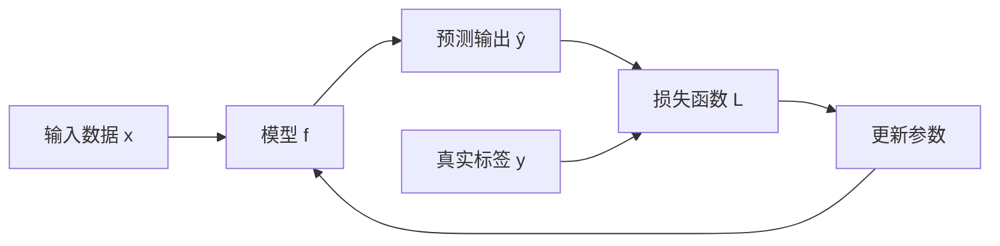
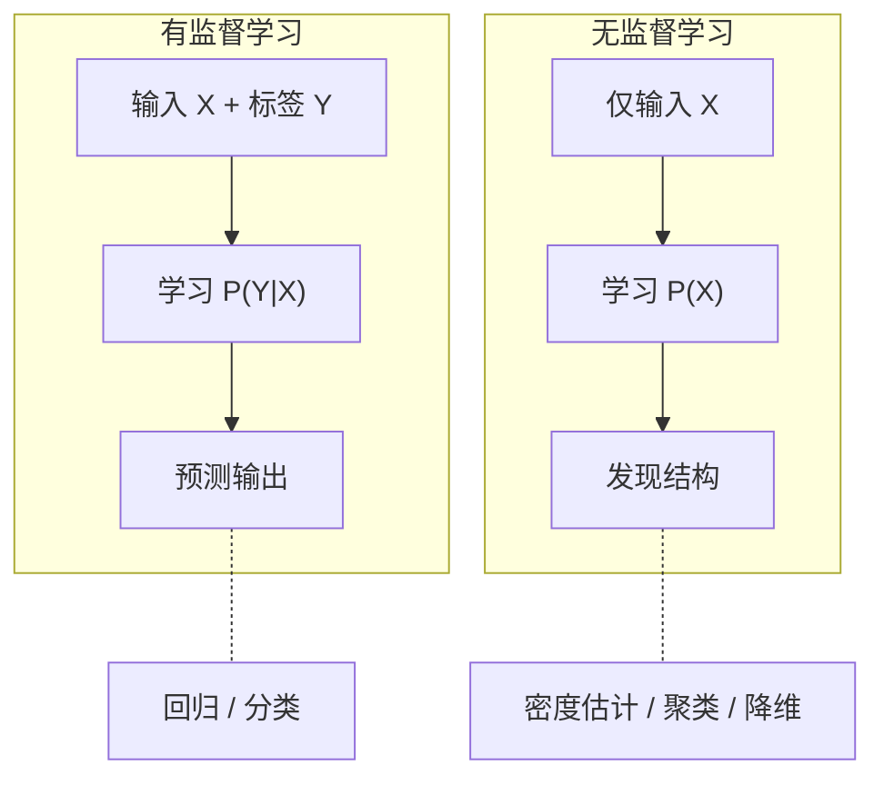
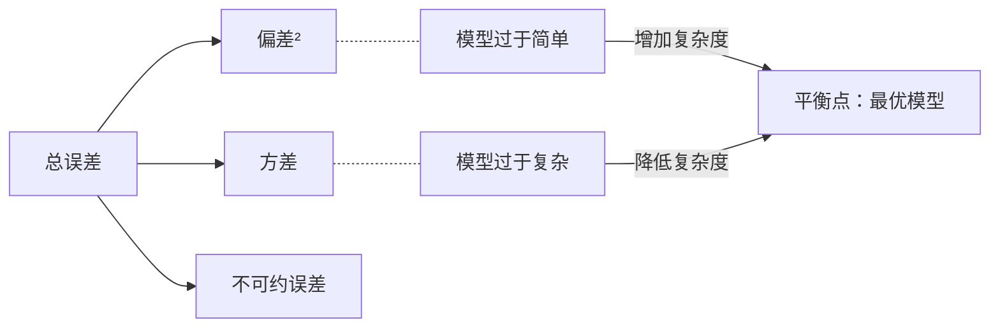

# 1.1 有监督和无监督学习的概念

## 1.1.1 学习问题的数学抽象

在建立有监督学习和无监督学习的形式化定义之前，我们需要首先明确"学习"这一概念的数学含义。

假设你正在教一个孩子辨认水果。你拿出苹果、香蕉、橙子，每次告诉他"这是什么"。孩子接收的信息包括两部分：水果的外观特征（颜色、形状、大小）和你给出的名称。在数学上，我们将前者称为输入，后者称为输出，而"学习"的目标就是让孩子在面对一种从未见过的水果时，能够根据已有经验做出合理判断。

形式化地，考虑一个输入空间 $\mathcal{X}$ 和一个输出空间 $\mathcal{Y}$。在典型情况下，$\mathcal{X} \subseteq \mathbb{R}^d$ 是 $d$ 维实向量空间，$\mathcal{Y}$ 的形式则取决于具体任务——对于回归问题，$\mathcal{Y} \subseteq \mathbb{R}$；对于 $K$ 类分类问题，$\mathcal{Y} = \{1, 2, ..., K\}$。

我们假设存在一个联合概率分布 $P(X, Y)$ 定义在 $\mathcal{X} \times \mathcal{Y}$ 上，训练数据 $D = \{(x_1, y_1), (x_2, y_2), ..., (x_n, y_n)\}$ 是从该分布中独立同分布（i.i.d.）采样得到的 $n$ 个样本。学习的目标是利用这些样本，找到一个函数 $f: \mathcal{X} \rightarrow \mathcal{Y}$，使得对于新的、未见过的输入 $x$，$f(x)$ 能够很好地预测对应的 $y$。

这里"很好地预测"需要一个形式化的度量标准。想象你参加射箭比赛，每一箭偏离靶心的距离就是你的"损失"——偏得越远，损失越大。我们引入损失函数 $L: \mathcal{Y} \times \mathcal{Y} \rightarrow \mathbb{R}^+$，其中 $L(y, \hat{y})$ 衡量真实值 $y$ 与预测值 $\hat{y}$ 之间的差异。学习的目标可以表述为最小化期望风险（Expected Risk）：

$$R(f) = \mathbb{E}_{(X,Y) \sim P}[L(Y, f(X))] = \int_{\mathcal{X} \times \mathcal{Y}} L(y, f(x)) \, dP(x, y)$$

其中：
- $R(f)$ 表示函数 $f$ 的期望风险
- $P$ 表示输入-输出对 $(X, Y)$ 的联合概率分布
- $L(y, f(x))$ 表示真实值 $y$ 与预测值 $f(x)$ 之间的损失
- $\mathcal{X} \times \mathcal{Y}$ 表示输入空间与输出空间的笛卡尔积

一句话概括：期望风险衡量的是模型"平均而言会犯多大的错"——不是你这一箭射得如何，而是你在无数次射箭中的平均偏离程度。然而，我们并不知道真实的数据分布 $P(X, Y)$，只能访问从中采样的有限训练集。这就像你无法把所有可能的比赛场景都练习一遍，只能通过有限的训练来提升水平。这一根本性的困难，正是统计学习理论所要解决的核心问题。

## 1.1.2 有监督学习的形式化定义

有监督学习（Supervised Learning）的特征是训练数据同时包含输入和对应的输出标签。形式化地，给定训练集：

$$D = \{(x_i, y_i)\}_{i=1}^n, \quad x_i \in \mathcal{X}, \, y_i \in \mathcal{Y}$$

学习算法的目标是从某个假设空间 $\mathcal{H}$ 中选择一个函数 $f \in \mathcal{H}$，使得经验风险（Empirical Risk）最小化：

$$\hat{R}(f) = \frac{1}{n} \sum_{i=1}^n L(y_i, f(x_i))$$

其中：
- $\hat{R}(f)$ 表示函数 $f$ 的经验风险
- $n$ 表示训练样本数量
- $(x_i, y_i)$ 表示第 $i$ 个训练样本及其标签
- $L(y_i, f(x_i))$ 表示第 $i$ 个样本上的损失值

说白了，我们无法计算真实的期望风险（因为不知道完整的数据分布），只能退而求其次，用手头这 $n$ 个样本上的平均损失来近似。根据大数定律，当样本量 $n \rightarrow \infty$ 时，经验风险依概率收敛于期望风险。但实际中样本量总是有限的，因此经验风险最小化的解不一定能泛化到新数据上——这就是过拟合（Overfitting）问题的理论根源。

举个例子，一个学生如果只刷历年真题且把答案背得滚瓜烂熟，他在这些题目上的"经验风险"为零，但面对新考题时可能一筹莫展。他过度拟合了训练集（历年真题），而没有真正掌握底层规律。

"监督"一词的含义在于标签 $y_i$ 的存在。这些标签如同一位教师，为每个输入提供了正确答案的指导。模型通过比较自身的预测 $f(x_i)$ 与真实标签 $y_i$，计算损失并据此调整参数。

### 有监督学习的目标函数分解

有监督学习的核心在于建模条件概率 $P(Y|X)$。从概率论的视角，我们可以将学习目标分解为两种不同的建模策略：

**判别式模型（Discriminative Model）** 直接建模 $P(Y|X)$。给定输入 $x$，模型直接输出 $y$ 的条件分布或直接输出预测值。典型的判别式模型包括逻辑回归、支持向量机和神经网络。判别式模型的优势在于直接针对预测任务进行优化，不需要对输入空间的边缘分布 $P(X)$ 进行建模。

不妨设想你是一位海关检查员。判别式模型的策略相当于：你只关心"这个人是否应该放行"，直接根据护照信息做出判断，而不需要理解每个国家的人口分布和出行习惯。

**生成式模型（Generative Model）** 同时建模联合分布 $P(X, Y)$ 或等价地建模 $P(X|Y)$ 和 $P(Y)$。预测时利用贝叶斯定理：

$$P(Y|X) = \frac{P(X|Y)P(Y)}{P(X)}$$

典型的生成式模型包括朴素贝叶斯、高斯判别分析和隐马尔可夫模型。换个角度看，生成式模型更像一位人类学家——他深入了解每个国家的文化、饮食、服饰特征，然后反过来推断："具有这些特征的人，最可能来自哪个国家？"这种方式虽然代价更高，但能够回答更多样的问题，比如"来自法国的旅客通常是什么样的？"——这恰恰对应了生成式模型能够生成新样本的能力。

### 有监督学习的典型任务

根据输出空间 $\mathcal{Y}$ 的性质，有监督学习任务可以划分为：

**回归（Regression）**：$\mathcal{Y} \subseteq \mathbb{R}$（或 $\mathbb{R}^m$），输出为连续值。目标是学习一个函数逼近输入到连续输出的映射。你可能遇到过这种情况：根据房屋面积、楼层、朝向来预测房价——房价是一个连续的数值，这就是典型的回归问题。常用的损失函数是均方误差：

$$L(y, \hat{y}) = (y - \hat{y})^2$$

**分类（Classification）**：$\mathcal{Y} = \{1, 2, ..., K\}$，输出为离散类别。目标是学习一个决策边界将输入空间划分为 $K$ 个区域。回到水果辨认的场景：孩子最终要回答的是"苹果"还是"香蕉"这样离散的类别，而非一个连续数值。常用的损失函数是0-1损失（通常用其凸上界如交叉熵替代）：

$$L(y, \hat{y}) = \mathbb{I}[y \neq \hat{y}]$$

其中 $\mathbb{I}[\cdot]$ 为指示函数。

## 1.1.3 无监督学习的形式化定义

无监督学习（Unsupervised Learning）的特征是训练数据只包含输入，不包含输出标签。形式化地，给定训练集：

$$D = \{x_i\}_{i=1}^n, \quad x_i \in \mathcal{X}$$

学习算法的目标不再是预测某个输出变量，而是发现数据本身的内在结构。这就像你走进一间堆满照片的房间，没有任何标注告诉你哪些是风景、哪些是人像——你只能凭视觉特征自行归纳出规律。这一目标的数学表述因具体任务而异，但通常可以归纳为以下几类：

**密度估计（Density Estimation）**：学习数据的概率分布 $P(X)$。这是无监督学习最基本的形式，其他无监督任务可以视为密度估计的变体或副产品。

**聚类（Clustering）**：将数据划分为若干组，使得同组内的数据彼此相似，不同组的数据彼此相异。形式化地，学习一个映射 $c: \mathcal{X} \rightarrow \{1, 2, ..., K\}$，将每个数据点分配到某个聚类。

**降维（Dimensionality Reduction）**：学习一个低维表示 $z \in \mathbb{R}^k$（$k \ll d$）能够保留原始高维数据 $x \in \mathbb{R}^d$ 的主要信息。形式化地，学习一个编码函数 $e: \mathbb{R}^d \rightarrow \mathbb{R}^k$ 和一个解码函数 $d: \mathbb{R}^k \rightarrow \mathbb{R}^d$，使得重构误差 $\|x - d(e(x))\|$ 最小。

### 无监督学习的理论困难

无监督学习在理论上面临比有监督学习更大的挑战。根本原因在于：没有标签，就没有明确的"正确答案"来指导学习和评估模型。

考虑聚类任务：给定同样的数据，不同的聚类算法可能给出完全不同的结果，而且很难说哪个结果更"正确"。一组客户数据，按购买行为聚类和按地理位置聚类会得到不同的分组——选择哪种聚类取决于业务目标，而非数据本身能够回答的问题。

密度估计同样面临模型选择的困难。真实数据的分布是未知的，我们用参数化的模型族（如高斯混合模型）去拟合它，但无法知道这个模型族是否包含真实分布，也很难评估拟合的好坏（因为没有独立的测试标准）。

这些理论困难并不意味着无监督学习没有价值——恰恰相反，无监督学习在许多实际场景中不可或缺。它意味着在应用无监督学习时，我们需要更多地依赖领域知识和任务特性来指导方法选择和结果解读。

## 1.1.4 两种范式的本质区别

从信息论的视角，有监督学习和无监督学习的区别可以归结为学习目标的不同：

**有监督学习** 学习的是条件分布 $P(Y|X)$，即输入与输出之间的关联。学习过程利用了标签提供的额外信息，目标是最大化预测的准确性。

**无监督学习** 学习的是边缘分布 $P(X)$，即数据本身的结构。学习过程完全依赖数据的内在规律，目标是发现有意义的模式或表示。

从优化的视角，两者的区别体现在目标函数的形式上：

有监督学习的目标函数通常是凸的或近似凸的（如逻辑回归、支持向量机），或者虽然非凸但有明确的优化方向（如神经网络的反向传播）。标签的存在提供了清晰的误差信号，指导参数的更新方向。

无监督学习的目标函数往往更难优化。以聚类为例，K-means 的目标函数是非凸的，存在大量局部最优解；以密度估计为例，期望最大化（EM）算法只能保证收敛到局部最优。

### 半监督学习与自监督学习

在有监督和无监督学习之间，存在若干重要的过渡形式：

**半监督学习（Semi-supervised Learning）** 利用少量有标签数据和大量无标签数据进行学习。其动机在于：标注数据的获取成本高昂，而无标签数据通常容易获得。半监督学习的关键假设是无标签数据的分布 $P(X)$ 能够提供关于条件分布 $P(Y|X)$ 的有用信息。

**自监督学习（Self-supervised Learning）** 通过构造代理任务（Pretext Task）从无标签数据中自动生成"伪标签"。例如，BERT 通过预测被遮盖的词来学习文本表示，对比学习通过判断图像增强是否来自同一原图来学习视觉表示。自监督学习在近年来的大规模预训练中扮演了核心角色，是大语言模型成功的关键技术之一。

## 1.1.5 统计学习理论的视角

统计学习理论为理解有监督学习和无监督学习提供了严格的数学框架。其核心问题是：在什么条件下，基于有限训练样本学习的模型能够在未见数据上表现良好？

### 泛化界与 VC 维

对于有监督学习，统计学习理论建立了泛化界（Generalization Bound），将期望风险与经验风险联系起来。一个典型的结果是：

$$R(f) \leq \hat{R}(f) + O\left(\sqrt{\frac{d_{VC}(\mathcal{H}) \ln n + \ln(1/\delta)}{n}}\right)$$

其中：
- $R(f)$ 表示期望风险（模型在未见数据上的真实表现）
- $\hat{R}(f)$ 表示经验风险（模型在训练集上的表现）
- $d_{VC}(\mathcal{H})$ 表示假设空间 $\mathcal{H}$ 的 VC 维，衡量模型族的表达能力
- $n$ 表示训练样本数量
- $\delta$ 表示置信参数，该不等式以至少 $1-\delta$ 的概率成立

这个不等式的核心信息是：模型的真实表现不会比训练表现差太多，但"差多少"取决于模型复杂度与样本量的比值。复杂度惩罚项与假设空间的 VC 维成正比、与样本量成反比——模型越复杂或数据越少，泛化保障越弱。

这就像驾照考试：如果题库只有50道题（小样本），你用死记硬背的方式（高 VC 维模型）也许能通过练习，但一旦题目稍有变化就会出错；反之，如果你真正理解了交通规则（简单但正确的模型），即使题目千变万化也能从容应对。这解释了为什么过于复杂的模型在小样本上容易过拟合，也为正则化提供了理论依据。

### 偏差-方差权衡

从统计估计的角度，学习算法的误差可以分解为三个部分：

$$\mathbb{E}[(f(x) - y)^2] = \text{Bias}^2 + \text{Variance} + \text{Irreducible Error}$$

其中：
- $\mathbb{E}[(f(x) - y)^2]$ 表示模型预测的期望平方误差
- $\text{Bias}^2 = (\mathbb{E}[f(x)] - f^*(x))^2$，为模型平均预测与真实函数的偏离
- $\text{Variance} = \mathbb{E}[(f(x) - \mathbb{E}[f(x)])^2]$，为模型预测随训练集变化的波动程度
- $\text{Irreducible Error} = \mathbb{E}[(y - f^*(x))^2]$，为数据固有噪声导致的不可消除误差

拆开来看，任何模型的预测误差都由三部分构成：

**偏差（Bias）** 衡量模型的平均预测与真实值之间的差异，反映了模型的假设与真实规律的偏离程度。简单模型（如线性模型）通常具有高偏差。

**方差（Variance）** 衡量模型对训练数据的敏感程度，反映了模型的稳定性。复杂模型（如深度神经网络）通常具有高方差。

**不可约误差（Irreducible Error）** 来源于数据本身的噪声，是任何模型都无法消除的。

想象一下你在练习投篮。偏差对应的是你的投篮姿势是否系统性地偏左——如果姿势本身有问题，练多少次都会偏。方差对应的是你每次投篮的稳定性——即使姿势正确，如果忽远忽近，命中率也不会高。而不可约误差则像球场上不可预测的阵风，即便是职业球员也无法完全克服。

这一分解揭示了模型复杂度选择的根本困境：增加模型复杂度可以降低偏差，但会增加方差；反之亦然。最优的模型复杂度在偏差和方差之间取得平衡，使总误差最小。
