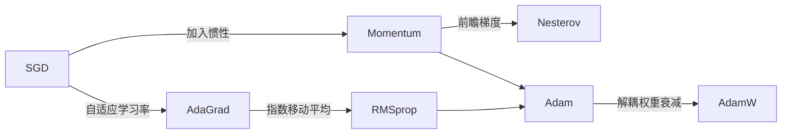

# 2.6 梯度下降法与优化器

## 2.6.1 优化问题的一般形式

机器学习中的参数优化可以表述为：

$$\theta^* = \arg\min_\theta \mathcal{L}(\theta)$$

其中 $\mathcal{L}(\theta)$ 是关于参数 $\theta$ 的损失函数。对于深度学习，$\theta$ 可能包含数百万甚至数十亿个参数，$\mathcal{L}$ 是高度非凸的函数。

在最小二乘等特殊情况下，存在解析解。但对于一般的非凸问题，我们需要迭代优化算法。梯度下降及其变体是深度学习中最核心的优化方法。

## 2.6.2 梯度下降法

### 基本原理

梯度下降（Gradient Descent, GD）基于一个简单的观察：如果 $\mathcal{L}(\theta)$ 在 $\theta$ 处可微，那么沿负梯度方向移动可以使函数值下降最快。

想象你在大雾中站在一座山上，看不到全貌，只能感觉脚下的坡度。你的策略是：每次都往最陡的下坡方向走一步。这就是梯度下降的本质——只用局部信息来做全局决策。

梯度 $\nabla_\theta \mathcal{L}$ 指向函数增长最快的方向。因此，更新规则为：

$$\theta_{t+1} = \theta_t - \eta \nabla_\theta \mathcal{L}(\theta_t)$$

其中：
- $\theta_t$ 表示第 $t$ 步的参数值
- $\eta > 0$ 表示学习率，控制每步移动的幅度
- $\nabla_\theta \mathcal{L}(\theta_t)$ 表示损失函数对参数的梯度（指向函数增长最快的方向）

每次更新都朝“当前位置下降最快的方向”走一步，步长由学习率决定。这是一个贪心策略，只用局部信息来追求全局最优。

### 学习率的影响

学习率是最关键的超参数之一，就像下山时的步幅：

**学习率太大**：参数更新幅度过大，可能跳过最优点，导致震荡甚至发散。就像下山时步子迈太大，可能直接滚下山去。

**学习率太小**：收敛速度极慢，可能陷入局部最优或鞍点。就像每步只挪一毫米，天黑了还没到山脚。

**合适的学习率**：稳定收敛到（局部）最优解。

对于凸函数，梯度下降以 $O(1/t)$ 的速率收敛。对于强凸函数（Hessian 特征值有下界），收敛速率为 $O(\exp(-t))$，即线性收敛。

### 批量梯度下降

标准梯度下降（Batch Gradient Descent）使用全部训练数据计算梯度：

$$\nabla_\theta \mathcal{L} = \frac{1}{n} \sum_{i=1}^n \nabla_\theta L(y_i, f_\theta(x_i))$$

**优点**：梯度估计准确，更新方向稳定。

**缺点**：每次更新需要遍历全部数据，计算代价大；对于大规模数据集不实用。

## 2.6.3 随机梯度下降（SGD）

### 基本思想

随机梯度下降（Stochastic Gradient Descent, SGD）每次只用一个（或一小批）样本估计梯度：

$$\nabla_\theta \mathcal{L} \approx \nabla_\theta L(y_i, f_\theta(x_i))$$

虽然单样本梯度有很大的方差，但它是真实梯度的无偏估计：

$$\mathbb{E}_i[\nabla_\theta L(y_i, f_\theta(x_i))] = \nabla_\theta \mathcal{L}$$

### Mini-batch SGD

实践中通常使用 mini-batch：每次用 $B$ 个样本计算梯度：

$$\nabla_\theta \mathcal{L} \approx \frac{1}{B} \sum_{i \in \mathcal{B}} \nabla_\theta L(y_i, f_\theta(x_i))$$

Mini-batch 大小 $B$ 是一个重要的超参数：

| Batch Size | 梯度估计 | 更新频率 | GPU 利用率 | 泛化 |
|------------|---------|----------|------------|------|
| 小 | 噪声大 | 高 | 低 | 可能更好 |
| 大 | 噪声小 | 低 | 高 | 可能更差 |

经验上，常用的 batch size 为 32、64、128、256。

### SGD 的随机性

SGD 的随机性既是优点也是挑战：

**优点**：
- 计算效率高：每次更新只需少量样本
- 逃离局部最优：噪声帮助跳出浅的局部最优
- 隐式正则化：噪声有类似正则化的效果

**挑战**：
- 收敛不稳定：损失曲线震荡
- 需要调学习率：通常需要学习率衰减

## 2.6.4 梯度累积

当 GPU 显存不足以支持理想的 batch size 时，可以使用梯度累积（Gradient Accumulation）：

```python
accumulation_steps = 4
optimizer.zero_grad()

for i, batch in enumerate(dataloader):
    loss = model(batch) / accumulation_steps
    loss.backward()  # Accumulate gradients
    
    if (i + 1) % accumulation_steps == 0:
        optimizer.step()
        optimizer.zero_grad()
```

通过累积多个 mini-batch 的梯度后再更新，等效于使用更大的 batch size，但显存开销与单个 mini-batch 相同。

## 2.6.5 动量法

### 动量的引入

SGD 的一个问题是在"峡谷"地形中震荡：在陡峭方向上来回震荡，在平缓方向上进展缓慢。

动量（Momentum）通过累积历史梯度来加速收敛：

$$v_t = \gamma v_{t-1} + \nabla_\theta \mathcal{L}(\theta_t)$$
$$\theta_{t+1} = \theta_t - \eta v_t$$

其中：
- $v_t$ 表示第 $t$ 步的速度（动量项），是历史梯度的指数加权累加
- $\gamma \in [0, 1)$ 表示动量系数，通常取 0.9，控制历史梯度的衰减速度

动量让参数更新具有“惯性”——如果连续多步的梯度方向一致，更新会加速；如果梯度方向来回摆动，动量会抵消振荡。

**物理直觉**：把优化想象成小球在损失函数曲面上滚动。没有动量时，球每次只看当前坡度，在峡谷中反复来回弹跳。加了动量，就像在冰面上滚球——球会积累惯性，在一致的方向上加速，在震荡方向上相互抵消。

### Nesterov 动量

Nesterov 加速梯度（Nesterov Accelerated Gradient, NAG）在计算梯度之前先"预测"下一步的位置：

$$v_t = \gamma v_{t-1} + \nabla_\theta \mathcal{L}(\theta_t - \eta \gamma v_{t-1})$$
$$\theta_{t+1} = \theta_t - \eta v_t$$

Nesterov 动量的梯度是在"预测位置"计算的，这提供了更好的"前瞻"能力。理论上，Nesterov 动量在凸优化中有更快的收敛速率。

## 2.6.6 自适应学习率方法



前面的方法对所有参数使用相同的学习率。但不同参数的梯度尺度可能差异巨大——这就像带一支大部队穿越草地，有的士兵走在平坦路上，有的在深浅不一的沼泽里。用统一的步伐要求所有人是不合理的。自适应学习率方法让每个参数根据自己的"地形"自行调整步伐。

### AdaGrad

AdaGrad 为每个参数自适应地调整学习率，基于历史梯度的累积：

$$g_t = \nabla_\theta \mathcal{L}(\theta_t)$$
$$G_t = G_{t-1} + g_t^2 \quad \text{(逐元素)}$$
$$\theta_{t+1} = \theta_t - \frac{\eta}{\sqrt{G_t + \epsilon}} \odot g_t$$

**效果**：频繁更新的参数（梯度累积大）学习率降低，稀疏更新的参数（梯度累积小）保持较大学习率。

**问题**：$G_t$ 单调递增，学习率最终会变得过小，导致训练提前停止。

### RMSprop

RMSprop 用指数移动平均代替累积和，解决了 AdaGrad 学习率过快衰减的问题：

$$E[g^2]_t = \beta E[g^2]_{t-1} + (1-\beta) g_t^2$$
$$\theta_{t+1} = \theta_t - \frac{\eta}{\sqrt{E[g^2]_t + \epsilon}} \odot g_t$$

$\beta$ 通常取 0.9。指数移动平均给近期梯度更大的权重，使学习率能够适应当前的梯度幅度。

### Adam

Adam（Adaptive Moment Estimation）结合了动量和 RMSprop：

$$m_t = \beta_1 m_{t-1} + (1-\beta_1) g_t \quad \text{(一阶矩估计)}$$
$$v_t = \beta_2 v_{t-1} + (1-\beta_2) g_t^2 \quad \text{(二阶矩估计)}$$

由于初始化为零，需要偏差修正：

$$\hat{m}_t = \frac{m_t}{1 - \beta_1^t}, \quad \hat{v}_t = \frac{v_t}{1 - \beta_2^t}$$

更新规则：

$$\theta_{t+1} = \theta_t - \frac{\eta}{\sqrt{\hat{v}_t} + \epsilon} \odot \hat{m}_t$$

其中：
- $m_t$ 表示梯度的一阶矩估计（平均方向），$\hat{m}_t$ 是偏差修正后的版本
- $v_t$ 表示梯度平方的二阶矩估计（平均幅度），$\hat{v}_t$ 是偏差修正后的版本
- $\beta_1$、$\beta_2$ 控制指数移动平均的衰减率
- $\epsilon$ 是数值稳定性常数，防止除零

Adam 综合了动量（记住平均方向）和自适应学习率（根据平均幅度调整步长）两大优势。对于梯度幅度大的参数，步长自动变小；对于梯度幅度小的参数，步长相对变大。

默认超参数：$\beta_1 = 0.9$，$\beta_2 = 0.999$，$\epsilon = 10^{-8}$。

Adam 是深度学习中最常用的优化器，对超参数不敏感，在大多数任务上表现良好。它同时记住了"平均方向"（动量）和"平均幅度"（自适应学习率），相当于一个既有惯性又会自动调整步幅的智能登山者。

### AdamW

AdamW 修正了 Adam 中权重衰减的实现方式。原始 Adam 将 L2 正则化加入损失：

$$\mathcal{L}_{reg} = \mathcal{L} + \frac{\lambda}{2}\|\theta\|^2$$

这导致 L2 正则化的梯度也被自适应缩放，效果与预期不同。

AdamW 采用解耦的权重衰减（Decoupled Weight Decay）：

$$\theta_{t+1} = \theta_t - \frac{\eta}{\sqrt{\hat{v}_t} + \epsilon} \odot \hat{m}_t - \eta \lambda \theta_t$$

权重衰减直接作用于参数，不经过自适应缩放。在大语言模型训练中，AdamW 是标准选择。

## 2.6.7 学习率调度

学习率通常需要在训练过程中变化——就像开车，起步时缓慢加速，高速巡航，快到终点时减速。

### 学习率衰减

**Step Decay**：每固定 epoch 数乘以衰减因子。

$$\eta_t = \eta_0 \cdot \gamma^{\lfloor t / T \rfloor}$$

**Exponential Decay**：指数衰减。

$$\eta_t = \eta_0 \cdot \exp(-\lambda t)$$

**Cosine Annealing**：余弦退火。

$$\eta_t = \eta_{min} + \frac{1}{2}(\eta_{max} - \eta_{min})(1 + \cos(\frac{t}{T}\pi))$$

### Warmup

在训练初期使用较小的学习率，逐渐增加到目标值。这有助于稳定训练初期的参数更新。回到开车的例子：刚点火时你不会立刻踩油门到底，而是让发动机先预热一下。类似地，神经网络初始参数是随机的，立刻使用大学习率可能导致不稳定的更新。

**线性 Warmup**：

$$\eta_t = \eta_{target} \cdot \frac{t}{T_{warmup}}, \quad t < T_{warmup}$$

Warmup 在 Transformer 训练中尤为重要。初始化时，注意力权重接近均匀分布，梯度可能很大。Warmup 让模型先学习基本的表示，然后再用大学习率加速训练。

### Warmup + Cosine Decay

大语言模型训练中常用的组合：

1. 前 $T_{warmup}$ 步线性增加学习率到 $\eta_{max}$
2. 之后按余弦曲线从 $\eta_{max}$ 衰减到 $\eta_{min}$

```python
def get_lr(step, total_steps, warmup_steps, lr_max, lr_min):
    if step < warmup_steps:
        return lr_max * step / warmup_steps
    else:
        progress = (step - warmup_steps) / (total_steps - warmup_steps)
        return lr_min + 0.5 * (lr_max - lr_min) * (1 + math.cos(math.pi * progress))
```

## 2.6.8 优化器选择指南

| 场景 | 推荐优化器 | 说明 |
|------|-----------|------|
| 通用深度学习 | Adam/AdamW | 默认选择，鲁棒性好 |
| 大语言模型 | AdamW | 解耦权重衰减效果更好 |
| 计算机视觉 | SGD + Momentum | 配合学习率调度，泛化可能更好 |
| 稀疏特征 | AdaGrad/Adam | 自适应学习率处理稀疏更新 |
| 强化学习 | Adam | 对超参数不敏感 |

## 2.6.9 优化的挑战

### 鞍点与局部最优

高维非凸优化中，鞍点（Saddle Point）比局部最优更常见。在鞍点，梯度为零，但它不是极值点——某些方向是上坡，某些方向是下坡。

SGD 的随机性和动量机制有助于逃离鞍点。但在极平坦的区域，收敛仍可能很慢。

### 梯度消失与梯度爆炸

在深层网络中，梯度在反向传播过程中可能指数级缩小（消失）或放大（爆炸）。

**梯度消失**：深层参数几乎不更新，训练停滞。解决方案包括 ReLU 激活、残差连接、批归一化。

**梯度爆炸**：参数更新过大，训练发散。解决方案包括梯度裁剪（Gradient Clipping）：

$$g \leftarrow \min\left(1, \frac{c}{\|g\|}\right) \cdot g$$

其中 $c$ 表示裁剪阈值，$\|g\|$ 表示梯度的范数。当梯度范数超过 $c$ 时，将梯度等比例缩小到范数恰为 $c$，保留方向但限制幅度。

### 损失曲面的病态

当损失函数的 Hessian 矩阵条件数很大时，不同方向的曲率差异很大。这导致在陡峭方向需要小学习率，在平缓方向需要大学习率。自适应学习率方法（Adam 等）可以缓解这一问题。
