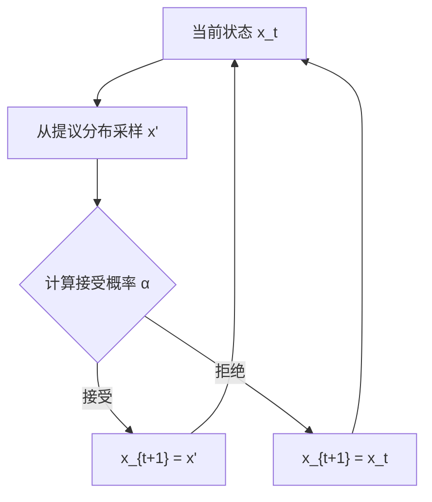

# 2.7 蒙特卡洛采样

## 2.7.1 蒙特卡洛方法概述

蒙特卡洛方法（Monte Carlo Methods）是一类基于随机采样的数值计算技术。其核心思想是：用随机样本的统计量来近似难以解析计算的数学量。

举个经典的例子：如何估算圆周率 $\pi$？在一块正方形地板上画一个内切圆，然后随机撒一把豆子。数一数落在圆内的豆子占比，乘以 4 就能近似 $\pi$。撒的豆子越多，结果越精确。蒙特卡洛方法的精髓就是这个：用"大量随机尝试"代替"精确计算"。

蒙特卡洛方法得名于摩纳哥的蒙特卡洛赌场——赌博的本质就是随机性。该方法由 Stanislaw Ulam 和 John von Neumann 在 1940 年代参与曼哈顿计划时系统发展，用于模拟中子扩散。

在机器学习中，蒙特卡洛方法广泛应用于：
- 贝叶斯推断中的后验采样
- 强化学习中的回报估计
- 生成模型中的采样与训练
- 变分推断中的梯度估计

## 2.7.2 基本原理：期望的近似

许多机器学习问题最终归结为计算某个期望：

$$I = \mathbb{E}_{x \sim p(x)}[f(x)] = \int f(x) p(x) dx$$

当 $p(x)$ 或 $f(x)$ 复杂、积分区域高维时，解析计算往往不可行。

蒙特卡洛估计的基本思路是：从分布 $p(x)$ 中采样 $N$ 个样本 $\{x_1, x_2, ..., x_N\}$，用样本均值近似期望：

$$\hat{I}_N = \frac{1}{N} \sum_{i=1}^N f(x_i)$$

其中 $x_i \sim p(x)$ 是从目标分布中独立采样的样本，$N$ 表示样本数量。

思路很简单：如果你想知道某个随机变量的平均值但算不出解析解，就采样很多次然后取平均。样本越多，估计越精确。

### 理论保证

**无偏性**：$\mathbb{E}[\hat{I}_N] = I$

**一致性**：根据大数定律，$\hat{I}_N \xrightarrow{p} I$ 当 $N \rightarrow \infty$

**收敛速率**：根据中心极限定理，估计误差的标准差为 $O(1/\sqrt{N})$，与问题维度无关。这是蒙特卡洛方法的核心优势——高维问题中，网格方法的复杂度指数增长，而蒙特卡洛的误差只依赖于样本数。换句话说，如果用网格方法估算一个 100 维的积分，每维取 10 个点就需要 $10^{100}$ 个计算——比宇宙中的原子数还多；而蒙特卡洛方法只需几万个样本就能给出合理估计。

## 2.7.3 重要性采样

### 问题的提出

直接从目标分布 $p(x)$ 采样有时是困难的或低效的。**重要性采样**（Importance Sampling）通过从一个容易采样的提议分布（Proposal Distribution）$q(x)$ 采样，然后对样本进行加权修正。

### 基本原理

不妨设想你在一座城市里做民意调查。目标分布 $p(x)$ 是全市居民的分布，但你无法挨家挨户敲门（从 $p$ 直接采样太难）。于是你选择在地铁站出口拦人——这就是提议分布 $q(x)$，它容易执行但不完全代表全市人口。为了修正偏差，你给每个受访者一个"权重"：住在偏远区域、坐地铁概率低的居民，一旦被抓到就给更高的权重。

数学上，这一思路表达为：

$$I = \int f(x) p(x) dx = \int f(x) \frac{p(x)}{q(x)} q(x) dx = \mathbb{E}_{x \sim q}\left[f(x) \frac{p(x)}{q(x)}\right]$$

其中 $q(x)$ 表示提议分布（容易采样的替代分布），$p(x)/q(x)$ 是重要性权重，用于修正采样分布与目标分布的偏差。

换句话说，当从目标分布 $p$ 直接采样困难时，我们改从一个更方便的分布 $q$ 采样，但用权重 $p/q$ 补偿采样偏差——在 $q$ 下被过度采样的区域降权，被不足采样的区域升权。

从 $q(x)$ 采样，用加权平均估计期望：

$$\hat{I}_N = \frac{1}{N} \sum_{i=1}^N f(x_i) w(x_i), \quad w(x_i) = \frac{p(x_i)}{q(x_i)}$$

$w(x) = p(x)/q(x)$ 称为重要性权重。回到民调的场景：如果某位居民在全市占比高（$p$ 大）却很少出现在地铁站（$q$ 小），他的权重就大，因为他"代表"了更多未被采样到的同类人。

### 提议分布的选择

提议分布的选择至关重要：

**理想情况**：$q(x) \propto |f(x)| p(x)$，即在 $|f(x)|$ 大的区域多采样。此时方差最小，甚至可以为零。

**实际约束**：$q(x)$ 必须容易采样，且其支撑集要覆盖 $p(x)$ 的支撑集。

**常见问题**：如果 $q(x)$ 的尾部比 $p(x)$ 薄，某些样本的权重会非常大，导致方差爆炸。这就像你的民调只在市中心一个地铁站进行，结果偶然遇到一位来自远郊的居民——他的权重可能高达几百倍，一个人的回答就左右了整个调查结论，统计结果变得极不稳定。

### 自归一化重要性采样

当 $p(x)$ 只能计算到归一化常数（$p(x) \propto \tilde{p}(x)$，$\tilde{p}$ 已知但 $\int \tilde{p}$ 未知）时，可以使用自归一化估计：

$$\hat{I}_N = \frac{\sum_i f(x_i) w(x_i)}{\sum_i w(x_i)}, \quad w(x_i) = \frac{\tilde{p}(x_i)}{q(x_i)}$$

自归一化估计是有偏的，但偏差随 $N$ 增加而消失。

## 2.7.4 马尔可夫链蒙特卡洛（MCMC）

### MCMC 的动机

重要性采样需要设计合适的提议分布。在高维空间中，这通常很困难——好的提议分布需要近似目标分布，但我们对目标分布知之甚少。

**马尔可夫链蒙特卡洛**（Markov Chain Monte Carlo, MCMC）提供了一种更通用的解决方案：构造一个马尔可夫链，其平稳分布恰好是目标分布。运行链足够长的时间后，样本近似服从目标分布。

想象一只在城市中随机游走的猫：它在每个路口随机选择下一步走向哪里，但偶尔会被鱼店的香味吸引而多待一会。如果你长时间追踪这只猫的位置，你会发现它在鱼店附近出现的频率最高——这就是“平稳分布”的含义。MCMC 就是设计这样一只"猫"，让它的游走规律刚好对应我们想采样的分布。

### Metropolis-Hastings 算法

Metropolis-Hastings（M-H）是最通用的 MCMC 算法。

**算法**：
1. 初始化 $x_0$
2. 对于 $t = 1, 2, ...$：
   - 从提议分布采样候选点：$x' \sim q(x' | x_{t-1})$
   - 计算接受概率：$\alpha = \min\left(1, \frac{p(x') q(x_{t-1}|x')}{p(x_{t-1}) q(x'|x_{t-1})}\right)$
   - 以概率 $\alpha$ 接受：$x_t = x'$；否则 $x_t = x_{t-1}$

**关键性质**：接受概率的设计保证了细致平衡（Detailed Balance）条件：

$$p(x) q(x'|x) \alpha(x \rightarrow x') = p(x') q(x|x') \alpha(x' \rightarrow x)$$

这保证了马尔可夫链的平稳分布是 $p(x)$。

### 吉布斯采样

**吉布斯采样**（Gibbs Sampling）是 M-H 算法的特例，适用于可以高效采样条件分布的情况。

设 $x = (x_1, x_2, ..., x_d)$，吉布斯采样依次从每个变量的条件分布采样：

**算法**：
1. 初始化 $x^{(0)} = (x_1^{(0)}, ..., x_d^{(0)})$
2. 对于 $t = 1, 2, ...$：
   - $x_1^{(t)} \sim p(x_1 | x_2^{(t-1)}, ..., x_d^{(t-1)})$
   - $x_2^{(t)} \sim p(x_2 | x_1^{(t)}, x_3^{(t-1)}, ..., x_d^{(t-1)})$
   - ...
   - $x_d^{(t)} \sim p(x_d | x_1^{(t)}, ..., x_{d-1}^{(t)})$

吉布斯采样的接受率为 100%（总是接受新样本），因为每步都在精确采样条件分布。

换个角度看，吉布斯采样像是装修房间：你不可能同时改变墙壁颜色、地板材质和家具风格（高维联合分布太复杂），但你可以一次只调一个——先固定其他不动，选最合适的墙色；再固定墙色和家具，选地板……如此轮流调整，最终整个房间趋向一个和谐的状态。每次只动一个维度，且在那个维度上做最优选择，这正是条件分布采样的直觉。

### MCMC 的挑战

**Burn-in 期**：链需要运行一段时间才能"忘记"初始状态，达到平稳分布。Burn-in 期的样本应当丢弃。

**混合问题**：如果目标分布是多峰的，链可能长时间停留在一个峰附近，难以跨越峰之间的低概率区域。

**自相关性**：相邻样本高度相关，有效样本量远小于总样本数。通常需要对链进行"稀疏"（每隔若干步取一个样本）。

**诊断**：判断链是否收敛是困难的。常用方法包括跑多条链检查一致性（Gelman-Rubin 诊断）、检查自相关函数等。

## 2.7.5 变分推断与重参数化技巧

### 变分推断简介

变分推断（Variational Inference）是贝叶斯推断的另一种方法，将推断问题转化为优化问题：用一个参数化的分布 $q_\phi(z)$ 近似难以处理的后验分布 $p(z|x)$。

目标是最小化 KL 散度：

$$\phi^* = \arg\min_\phi D_{KL}(q_\phi(z) \| p(z|x))$$

等价地，最大化证据下界（Evidence Lower Bound, ELBO）：

$$\mathcal{L}(\phi) = \mathbb{E}_{z \sim q_\phi}[\log p(x, z) - \log q_\phi(z)]$$

其中：
- $q_\phi(z)$ 表示参数化的变分分布（用来近似后验）
- $p(x, z)$ 表示联合分布（包含先验和似然）
- ELBO 是对数边缘似然 $\log p(x)$ 的下界

ELBO 同时包含两个目标——让变分分布能解释数据（拟合项），又不要太偏离先验（正则化项）。最大化 ELBO 等价于最小化变分分布与真实后验的 KL 散度。

### 蒙特卡洛梯度估计

优化 ELBO 需要计算关于 $\phi$ 的梯度。但期望 $\mathbb{E}_{q_\phi}[\cdot]$ 依赖于 $\phi$，如何计算其梯度？

**REINFORCE 估计**（Score Function Estimator）：

$$\nabla_\phi \mathbb{E}_{q_\phi}[f(z)] = \mathbb{E}_{q_\phi}[f(z) \nabla_\phi \log q_\phi(z)]$$

其中 $\nabla_\phi \log q_\phi(z)$ 称为分数函数（score function）。这个恒等式允许我们通过采样来估计期望的梯度，但代价是方差很大。

REINFORCE 无偏，但方差很大，实践中效果不佳。

### 重参数化技巧

**重参数化技巧**（Reparameterization Trick）将采样过程中的随机性从参数中分离出来。

假设你正在调节一台咖啡机的参数（浓度 $\mu$ 和波动范围 $\sigma$）。每杯咖啡的实际浓度有随机波动，但你希望通过调参让平均口感更好。问题是：随机性"卡"在参数里面，你没法对一个随机过程求导。重参数化技巧的妙处在于：把随机性"外包"给一个固定的骰子 $\epsilon$，而参数只负责确定性变换。这样梯度就能顺畅地流过参数了。

设 $z \sim q_\phi(z)$ 可以表示为确定性变换：$z = g_\phi(\epsilon)$，其中 $\epsilon \sim p(\epsilon)$ 是与 $\phi$ 无关的噪声。

例如，如果 $q_\phi(z) = \mathcal{N}(\mu_\phi, \sigma_\phi^2)$，可以写成：

$$z = \mu_\phi + \sigma_\phi \cdot \epsilon, \quad \epsilon \sim \mathcal{N}(0, 1)$$

此时，期望的梯度变为：

$$\nabla_\phi \mathbb{E}_{q_\phi}[f(z)] = \nabla_\phi \mathbb{E}_{\epsilon}[f(g_\phi(\epsilon))] = \mathbb{E}_{\epsilon}[\nabla_\phi f(g_\phi(\epsilon))]$$

梯度可以通过反向传播计算，方差远小于 REINFORCE。这一技巧是变分自编码器（VAE）的基础。

## 2.7.6 强化学习中的蒙特卡洛方法

### 回报估计

强化学习的目标是最大化期望累积回报：

$$J(\pi) = \mathbb{E}_{\tau \sim \pi}\left[\sum_{t=0}^T \gamma^t r_t\right]$$

这就像评估一位棋手的水平：你无法穷举所有可能的棋局（积分不可解析），但可以让他下很多盘棋，用平均胜率来估计。每盘棋就是一条轨迹 $\tau$，蒙特卡洛方法通过运行策略 $\pi$ 生成大量轨迹，再计算实际获得的回报取平均。

### 蒙特卡洛策略评估

给定策略 $\pi$，估计状态价值函数 $V^\pi(s)$：

1. 生成多条轨迹
2. 对于每个状态 $s$，收集从 $s$ 出发的所有回报
3. 用平均回报估计 $V^\pi(s)$

**首次访问蒙特卡洛**：只使用每条轨迹中首次访问状态 $s$ 后的回报
**每次访问蒙特卡洛**：使用每次访问状态 $s$ 后的回报

### 蒙特卡洛与时序差分的对比

| 方面 | 蒙特卡洛 | 时序差分 (TD) |
|------|---------|---------------|
| 更新时机 | 完整轨迹结束后 | 每一步 |
| 偏差 | 无偏 | 有偏（依赖自举） |
| 方差 | 高（完整轨迹噪声累积） | 低（单步方差） |
| 适用场景 | 回合制任务 | 持续任务、在线学习 |

## 2.7.7 蒙特卡洛方法的实践建议

### 方差减少技术

**控制变量**（Control Variates）：引入一个已知期望为零的项来减少方差。

你可能遇到过这种情况：估计每天上班的通勤时间波动。直接记录每天的通勤时长，方差很大（堵车、天气、路线都有影响）。但如果你知道"导航预估时间"的均值恰好等于真实均值，就可以记录"实际时间 - 导航预估 + 导航均值"——由于实际时间和导航预估高度相关，两者的差异很小，方差大幅降低。控制变量的数学形式正是这一思路：

$$\hat{I} = \frac{1}{N} \sum_i [f(x_i) - c \cdot (h(x_i) - \mathbb{E}[h(x)])]$$

其中 $h$ 与 $f$ 高度相关（好比导航预估与实际通勤高度相关），$c$ 是控制系数。

**基线**（Baseline）：在策略梯度中减去基线 $b$：

$$\nabla_\theta J = \mathbb{E}[(R - b) \nabla_\theta \log \pi_\theta(a|s)]$$

好的基线（如价值函数）可以显著减少方差。

### 样本数量的选择

样本数量需要权衡精度与计算成本。估计误差的标准差为 $\sigma / \sqrt{N}$，其中 $\sigma$ 是被估计量的标准差。

若要将误差减半，需要 4 倍的样本量。这种"根号收敛"是蒙特卡洛方法的固有局限。
