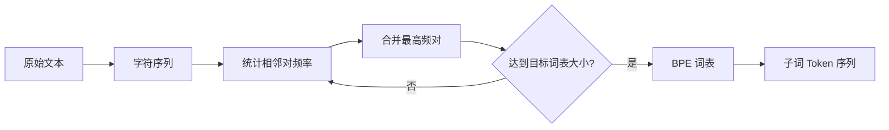

# 3.5 分词与词典向量化

语言模型处理的是离散的 token 序列，而非连续的字符流。将原始文本转换为 token 序列的过程称为**分词**（Tokenization），这是 NLP 系统的第一步，也是影响模型性能的关键因素。如果把语言模型比作一个厨师，那么分词就是“切菜”这个环节——切得太粗（整词）不好入味，切得太细（单字符）又会影响口感。分词的粗细直接影响模型能“尝到”什么样的语义。本节讨论分词的基本概念、主流算法，以及分词选择对模型训练的影响。

## 3.5.1 为什么需要分词

### 词表与稀疏性

最直接的方法是以**词**（word）为单位：建立一个包含所有词的词表，每个词对应一个整数 ID。但这种方法面临严重的稀疏性问题：

1. **词表爆炸**：英语约有 17 万词根，加上派生词、专有名词，词表轻松超过百万
2. **未登录词**（OOV）：任何词表都无法覆盖所有词，新词、拼写错误、专业术语都会成为 `[UNK]`
3. **形态变化**：`run`、`runs`、`running`、`ran` 被视为完全不同的词，无法共享语义

### 字符级别的问题

另一个极端是以**字符**为单位。英语只有 26 个字母，词表极小。但问题是：

1. **序列过长**：一个词变成多个字符，序列长度大幅增加
2. **语义稀释**：单个字符几乎不携带语义，模型需要从极低层次重新学习

### 子词分词的折中

**子词分词**（Subword Tokenization）是现代语言模型的标准选择。其核心思想与手机短信中的缩写习惯异曲同工：常用词保持完整（就像你不会把“你好”拆开写），而罕见词则拆分为多个子词（就像把“internationalization”缩写为“i18n”的思路）：

- 常见词保持完整（如 `the`、`is`）
- 罕见词拆分为多个子词（如 `tokenization` → `token` + `ization`）
- 极罕见的词退化为字符序列

这在词表大小、序列长度、语义粒度之间取得了平衡。

## 3.5.2 BPE：字节对编码



**字节对编码**（Byte Pair Encoding, BPE）是最早也是最广泛使用的子词分词算法，由 Sennrich 等人于 2016 年引入 NLP。它的原理与文本压缩算法异曲同工——假设你经常发短信给同一个朋友，你们之间会自然地形成一套“缩写”：“明天见”变成“明见”，“不客气”变成“bkq”。BPE 做的事情完全一样：找到语料中频繁出现的字符组合，把它们“压缩”成一个整体。

### 算法原理

BPE 是一种数据压缩算法，通过迭代合并最频繁的相邻字符对来构建词表。这就像“词典压缩”：如果你发现自己的笔记里“机器学习”出现了 500 次，你会自然地给它一个缩写（比如“ML”），下次写笔记时直接用缩写代替。BPE 的训练过程就是自动化地建立这样一本“缩写词典”。

**训练过程**：

1. 初始词表包含所有单个字符
2. 统计训练语料中所有相邻 token 对的频率
3. 合并频率最高的 token 对，加入词表
4. 重复步骤 2-3，直到词表达到目标大小

**示例**：假设语料为 `"low lower lowest"`

```
初始: ['l', 'o', 'w', ' ', 'l', 'o', 'w', 'e', 'r', ' ', 'l', 'o', 'w', 'e', 's', 't']

第1轮: 最频繁的对是 ('l', 'o')，合并为 'lo'
词表: ['l', 'o', 'w', ' ', 'e', 'r', 's', 't', 'lo']

第2轮: 最频繁的对是 ('lo', 'w')，合并为 'low'
词表: ['l', 'o', 'w', ' ', 'e', 'r', 's', 't', 'lo', 'low']

...
```

**编码过程**：给定新文本，按照训练时学到的合并规则（按顺序）应用，得到 token 序列。

### BPE 的特点

**优点**：
- 简单有效，易于实现
- 词表大小可控（通过合并轮数）
- 常见词完整保留，罕见词自动拆分

**缺点**：
- 贪婪算法，不保证全局最优
- 同一个词可能有多种分词方式（取决于上下文和合并顺序）

### GPT 系列的 BPE

GPT-2 使用 BPE，词表大小为 50,257。为了处理任意字节序列（包括 emoji、特殊符号），GPT-2 引入了**字节级 BPE**（Byte-level BPE）：

1. 将文本视为字节序列（UTF-8 编码）
2. 用 256 个基本 token 表示所有可能的字节
3. 在此基础上进行 BPE 合并

字节级 BPE 保证了任何输入都能被编码，不会出现 `[UNK]`。

## 3.5.3 WordPiece

**WordPiece** 由 Google 提出，用于 BERT、DistilBERT 等模型。与 BPE 的区别在于合并策略。

### 合并规则

BPE 合并频率最高的 token 对。WordPiece 合并使**似然增益最大**的 token 对：

$$\text{score}(x, y) = \frac{\text{freq}(xy)}{\text{freq}(x) \cdot \text{freq}(y)}$$

其中 $\text{freq}(xy)$ 是 token 对 $(x, y)$ 相邻出现的频率，$\text{freq}(x)$ 和 $\text{freq}(y)$ 分别是各自单独出现的频率。换句话说，该分数度量的是 $x$ 和 $y$ 共现频率相对于它们独立出现时的“超额程度”——即两个 token 的共现是否显著高于随机预期。

换个角度理解：如果 `x` 和 `y` 经常一起出现（相对于它们各自出现的频率），合并它们是有意义的。这好比考察两个同事是否应该合并工位：不是看他们各自多忙，而是看他们在一起协作的频率是否显著高于随机预期。

### 特殊标记

WordPiece 使用 `##` 前缀表示非词首的子词。例如：

```
"tokenization" → ["token", "##ization"]
"unhappy" → ["un", "##happy"]
```

这个约定使得分词边界更清晰，有助于下游任务（如命名实体识别）。

### BERT 的词表

BERT 使用约 30,000 个 token 的 WordPiece 词表。包括：

- 特殊 token：`[CLS]`、`[SEP]`、`[MASK]`、`[PAD]`、`[UNK]`
- 常见词和子词
- 单个字符（作为兜底）

## 3.5.4 Unigram 语言模型

**Unigram** 是另一种子词分词方法，由 Kudo（2018）提出，用于 SentencePiece 库。

### 与 BPE 的区别

BPE 是**自底向上**的：从字符开始，逐步合并。

Unigram 是**自顶向下**的：从一个大词表开始，逐步删减。

### 算法原理

1. 初始化一个包含所有可能子词的大词表（如所有出现过的子串）
2. 用 EM 算法估计每个子词的概率（unigram 语言模型）
3. 计算删除每个子词对整体似然的影响
4. 删除影响最小的子词
5. 重复步骤 2-4，直到词表达到目标大小

### 概率分词

Unigram 的一个独特优势是**概率分词**：给定一个词，可以计算所有可能分词方式的概率，选择概率最高的。

例如，`"unbreakable"` 可以分为：
- `["un", "break", "able"]`：$P = 0.3$
- `["unbreak", "able"]`：$P = 0.1$
- `["un", "breakable"]`：$P = 0.4$

Unigram 会选择 `["un", "breakable"]`。

### 正则化效果

训练时，Unigram 可以随机采样分词方式（而非总是用最优分词），这提供了一种数据增强/正则化效果，有助于模型泛化。这类似于学英语时的“同义替换”练习：同一句话用不同的表达方式写几遍，确保你理解的是意思而非固定词序。

## 3.5.5 SentencePiece

**SentencePiece** 是 Google 开源的分词库，统一实现了 BPE 和 Unigram。其特点：

### 语言无关

SentencePiece 将输入视为原始字符序列，不依赖于任何语言特定的预分词（如空格分词）。这对中文、日文等无空格语言尤为重要。

### 可逆性

分词是可逆的：从 token 序列可以完美恢复原始文本（包括空格）。SentencePiece 用特殊字符 `▁`（U+2581）表示空格：

```
"Hello world" → ["▁Hello", "▁world"]
```

### 主流模型的选择

| 模型 | 分词方法 | 词表大小 |
|------|----------|----------|
| GPT-2 | BPE（字节级） | 50,257 |
| GPT-4 | BPE（改进） | ~100,000 |
| BERT | WordPiece | 30,522 |
| LLaMA | SentencePiece (BPE) | 32,000 |
| Qwen | tiktoken (BPE) | 151,936 |

## 3.5.6 分词对模型的影响

### 词表大小的权衡

**小词表**（如 10,000）：
- 参数量少（嵌入矩阵和输出层小）
- 序列较长（更多 token 表示同样的文本）
- 可能过度拆分，丢失语义

**大词表**（如 150,000）：
- 参数量大（嵌入矩阵和输出层占比高）
- 序列较短
- 常见词完整保留，语义更明确

现代大模型趋向于使用更大的词表（50K-150K），以在有限的上下文长度内容纳更多信息。

### 多语言支持

词表需要覆盖多种语言时，挑战更大。常见策略：

1. **扩展词表**：为每种语言添加专用 token
2. **字节级分词**：任何 UTF-8 序列都能编码，但可能过度拆分
3. **语言平衡采样**：训练 BPE 时，平衡各语言的语料比例

中文字符通常被分为 1-3 个 token。早期英语为主的模型（如 GPT-2）对中文分词效率很低，一个汉字可能对应 3-4 个 token。针对中文优化的模型（如 Qwen、ChatGLM）将常用汉字作为独立 token，效率大幅提升。

### Tokenization Bias

分词方式会引入偏差。例如：

- `"ChatGPT"` 可能被分为 `["Chat", "G", "PT"]` 或 `["Chat", "GPT"]`，取决于训练语料
- 罕见词被过度拆分后，模型难以学习其整体语义
- 某些语言（如藏语、蒙古语）在主流分词器中支持很差

## 3.5.7 特殊 Token

除了来自语料的 token，词表还包含一些特殊 token：

| Token | 用途 |
|-------|------|
| `[PAD]` 或 `<pad>` | 填充短序列至固定长度 |
| `[UNK]` 或 `<unk>` | 未知词（字节级 BPE 不需要） |
| `[BOS]` 或 `<s>` | 序列开始 |
| `[EOS]` 或 `</s>` | 序列结束 |
| `[SEP]` | 分隔不同段落（BERT） |
| `[CLS]` | 分类任务的特殊位置（BERT） |
| `[MASK]` | 掩码语言模型的遮盖位置 |

不同模型使用的特殊 token 不同。使用预训练模型时，必须使用配套的分词器，否则 token ID 不匹配会导致灾难性的结果。

## 3.5.8 分词的实际使用

### Hugging Face Tokenizers

```python
from transformers import AutoTokenizer

tokenizer = AutoTokenizer.from_pretrained("meta-llama/Llama-2-7b")

text = "Hello, how are you doing today?"
tokens = tokenizer.tokenize(text)
# ['▁Hello', ',', '▁how', '▁are', '▁you', '▁doing', '▁today', '?']

ids = tokenizer.encode(text)
# [1, 15043, 29892, 920, 526, 366, 2599, 9826, 29973]

decoded = tokenizer.decode(ids)
# '<s> Hello, how are you doing today?'
```

### OpenAI tiktoken

```python
import tiktoken

enc = tiktoken.encoding_for_model("gpt-4")

text = "Hello, how are you doing today?"
tokens = enc.encode(text)
# [9906, 11, 1268, 527, 499, 3815, 3432, 30]

decoded = enc.decode(tokens)
# 'Hello, how are you doing today?'
```

### 注意事项

1. **编码-解码不一定完全可逆**：某些特殊字符可能被替换或丢失
2. **空格处理**：不同分词器对空格的处理方式不同
3. **特殊 token 的添加**：`encode` 是否自动添加 `[BOS]`/`[EOS]` 取决于配置
4. **截断与填充**：处理长文本和批处理时需要统一长度
