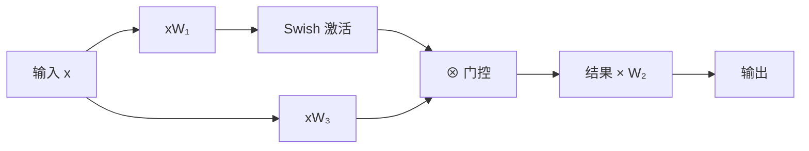

# 3.8 激活函数：从 Softmax 到 SwiGLU

��活函数为神经网络引入非线性，是深度学习的核心组件。本节从分类任务中广泛使用的 Softmax 出发，讨论各种激活函数的数学性质，并重点介绍现代大语言模型中流行的 SwiGLU 激活。

想象一下夜店门口的保安（bouncer）：并不是所有人都能进入，保安根据一定标准决定谁能通过、谁被拦下。激活函数在神经网络中扮演的正是这个角色——它审视每一个传入的信号，决定哪些信号可以继续向前传递、哪些应当被压制甚至归零。没有这道"门禁"，无论网络堆叠多少层，整个计算都不过是线性变换的反复叠加，表达能力极为有限。

## 3.8.1 Softmax：概率输出

### 定义与性质

Softmax 将任意实数向量转换为概率分布：

$$\text{softmax}(\mathbf{z})_i = \frac{\exp(z_i)}{\sum_{j=1}^K \exp(z_j)}$$

其中 $\mathbf{z} \in \mathbb{R}^K$ 是输入向量（通常是模型输出的 logits），$K$ 是类别数。

性质：

1. **非负性**：$\text{softmax}(\mathbf{z})_i > 0$
2. **归一化**：$\sum_i \text{softmax}(\mathbf{z})_i = 1$
3. **单调性**：$z_i$ 越大，$\text{softmax}(\mathbf{z})_i$ 越大
4. **平移不变性**：$\text{softmax}(\mathbf{z} + c) = \text{softmax}(\mathbf{z})$

### 温度参数

带温度参数 $\tau$ 的 Softmax：

$$\text{softmax}(\mathbf{z} / \tau)_i = \frac{\exp(z_i / \tau)}{\sum_j \exp(z_j / \tau)}$$

- $\tau \to 0$：输出趋近于 one-hot（argmax）
- $\tau \to \infty$：输出趋近于均匀分布
- $\tau = 1$：标准 Softmax

温度参数在生成任务中用于控制输出的"随机性"：低温产生更确定的输出，高温产生更多样的输出。

假设你正在点外卖，面前有三家店的评分分别是 4.9、4.5、3.8。如果你是个"低温"的人——追求确定性——你几乎永远选评分最高的那家；但如果你是个"高温"的人——喜欢探索——你会觉得三家差距不大，随心情而定。温度参数就是调节这种"选择锐度"的旋钮。

### 梯度

Softmax 的 Jacobian 矩阵：

$$\frac{\partial \text{softmax}(\mathbf{z})_i}{\partial z_j} = \text{softmax}(\mathbf{z})_i (\delta_{ij} - \text{softmax}(\mathbf{z})_j)$$

其中 $\delta_{ij}$ 是 Kronecker delta，当 $i = j$ 时为 1，否则为 0。换句话说，当 $i = j$ 时梯度为 $p_i(1 - p_i)$（类似 Bernoulli 方差），当 $i \neq j$ 时梯度为 $-p_i p_j$，即提高某一类的概率必然降低其他类的概率。

与交叉熵损失结合时，梯度形式简洁：

$$\frac{\partial \mathcal{L}}{\partial z_i} = \text{softmax}(\mathbf{z})_i - y_i$$

其中 $y_i$ 是 one-hot 标签的第 $i$ 个分量（正确类别为 1，其余为 0）。这意味着梯度等于“预测概率”与“真实标签”的差值——形式极为简洁，这是 softmax 与交叉熵的绝妙配合。

## 3.8.2 经典激活函数

### Sigmoid

$$\sigma(z) = \frac{1}{1 + e^{-z}}$$

性质：
- 输出范围 $(0, 1)$
- 导数：$\sigma'(z) = \sigma(z)(1 - \sigma(z))$
- 当 $|z|$ 大时，梯度趋近于 0（**梯度饱和**）

Sigmoid 曾是神经网络的默认激活，但因梯度饱和问题已很少在隐藏层使用。现在主要用于：
- 二分类输出层
- 门控机制（LSTM、GLU）

你可能遇到过这种情况：音量旋钮拧到极端位置时，无论怎么微调都听不出差别——要么静音要么震耳欲聋。Sigmoid 在输入值极大或极小时就类似这样，梯度几乎为零，参数"卡死"在那个位置动弹不得，训练信号无法回传。这就是梯度饱和的直观含义。

### Tanh

$$\tanh(z) = \frac{e^z - e^{-z}}{e^z + e^{-z}} = 2\sigma(2z) - 1$$

性质：
- 输出范围 $(-1, 1)$
- 零中心（zero-centered）
- 同样存在梯度饱和

Tanh 比 Sigmoid 稍好，因为输出零中心，但梯度饱和问题仍然存在。

### ReLU

$$\text{ReLU}(z) = \max(0, z)$$

性质：
- 正区间梯度恒为 1，无梯度饱和
- 负区间梯度为 0（**dying ReLU**）
- 计算极其简单

ReLU 在 2012 年 AlexNet 中大放异彩，成为深度学习的默认激活。但在 Transformer 中，ReLU 逐渐被 GELU 和 SwiGLU 取代。

回到保安的比喻：ReLU 是个极其果断的保安——信号为正就放行（而且不打折扣），信号为负则一律拒之门外。这种非黑即白的方式计算快速、梯度健康，但偶尔过于粗暴：一旦某个神经元的输入长期为负，它就"死亡"了（dying ReLU），再也无法被训练激活，就像一个永远被打入冷宫的候选者。

### Leaky ReLU 与 PReLU

$$\text{LeakyReLU}(z) = \max(\alpha z, z), \quad \alpha \ll 1$$

Leaky ReLU 在负区间保留小梯度（如 $\alpha = 0.01$），缓解 dying ReLU 问题。

PReLU（Parametric ReLU）让 $\alpha$ 成为可学习参数。

## 3.8.3 GELU：高斯误差线性单元

**GELU**（Gaussian Error Linear Unit）由 Hendrycks 和 Gimpel（2016）提出，是 BERT、GPT-2 等模型的默认激活。

### 定义

$$\text{GELU}(z) = z \cdot \Phi(z) = z \cdot P(Z \leq z), \quad Z \sim \mathcal{N}(0, 1)$$

其中 $\Phi(z)$ 是标准正态分布的累积分布函数（CDF），表示随机变量 $Z \sim \mathcal{N}(0, 1)$ 小于等于 $z$ 的概率。

本质上，GELU 以概率 $\Phi(z)$ 保留输入 $z$，以概率 $1 - \Phi(z)$ 将其置零。当 $z$ 很大时（$\Phi(z) \approx 1$），几乎全部保留；当 $z$ 很小时（$\Phi(z) \approx 0$），几乎全部置零。这比 ReLU 的硬阈值更平滑。

换个角度看，GELU 像是一位更通情达理的保安：对于明显合格的人（大正值），直接放行；对于明显不合格的人（大负值），直接拒绝；而对于处在"灰色地带"的人（接近零的值），它会以一定概率通融。这种柔性决策避免了 ReLU 那种"一刀切"带来的信息丢失。

### 近似公式

精确计算 $\Phi(z)$ 需要调用误差函数（erf），计算较慢。常用近似：

$$\text{GELU}(z) \approx 0.5z \left(1 + \tanh\left[\sqrt{2/\pi}(z + 0.044715z^3)\right]\right)$$

其中 $\sqrt{2/\pi} \approx 0.7979$，$0.044715$ 是拟合系数。该近似避免了直接计算误差函数 erf 的开销，在实践中广泛使用。

或更简单的 sigmoid 近似：

$$\text{GELU}(z) \approx z \cdot \sigma(1.702z)$$

### GELU vs ReLU

| 特性 | ReLU | GELU |
|------|------|------|
| 平滑性 | 不平滑（z=0 处） | 处处光滑 |
| 负值处理 | 完全置零 | 部分保留 |
| 梯度 | 0 或 1 | 连续变化 |
| 计算量 | 极低 | 中等 |

实验表明，GELU 在 Transformer 中略优于 ReLU，特别是在预训练语言模型中。

## 3.8.4 Swish 与 SiLU

**Swish** 由 Google 在 2017 年通过自动搜索发现：

$$\text{Swish}(z) = z \cdot \sigma(z)$$

与 GELU 非常相似，但用 sigmoid 替代正态 CDF。Swish 也称为 **SiLU**（Sigmoid Linear Unit）。

### 性质

- 非单调：在 $z \approx -1.28$ 处有最小值
- 平滑：处处可微
- 无上界：正区间近似恒等
- 下界约 $-0.28$

### Swish vs GELU

两者形状几乎相同，性能差异可忽略。选择通常取决于框架支持和历史原因：

- GPT-2、BERT：GELU
- LLaMA、Qwen：SiLU（Swish）

## 3.8.5 GLU 门控机制

**门控线性单元**（Gated Linear Unit, GLU）将激活与门控结合：

$$\text{GLU}(\mathbf{x}) = \mathbf{x}_1 \otimes \sigma(\mathbf{x}_2)$$

其中输入被分成两部分，一部分作为内容，一部分经过 sigmoid 后作为"门"。

### 变体

不同的门激活函数产生不同变体：

| 名称 | 公式 |
|------|------|
| GLU | $\mathbf{x}_1 \otimes \sigma(\mathbf{x}_2)$ |
| ReGLU | $\mathbf{x}_1 \otimes \text{ReLU}(\mathbf{x}_2)$ |
| GEGLU | $\mathbf{x}_1 \otimes \text{GELU}(\mathbf{x}_2)$ |
| SwiGLU | $\mathbf{x}_1 \otimes \text{Swish}(\mathbf{x}_2)$ |

### SwiGLU 在 FFN 中的应用

标准 FFN：

$$\text{FFN}(\mathbf{x}) = \text{ReLU}(\mathbf{x}\mathbf{W}_1 + \mathbf{b}_1)\mathbf{W}_2 + \mathbf{b}_2$$

SwiGLU FFN：

$$\text{FFN}(\mathbf{x}) = (\text{Swish}(\mathbf{x}\mathbf{W}_1) \otimes \mathbf{x}\mathbf{W}_3)\mathbf{W}_2$$

其中：
- $\mathbf{W}_1 \in \mathbb{R}^{d \times d_{\text{ff}}}$ 是门控投影矩阵，$\mathbf{W}_3 \in \mathbb{R}^{d \times d_{\text{ff}}}$ 是内容投影矩阵，$\mathbf{W}_2 \in \mathbb{R}^{d_{\text{ff}} \times d}$ 是输出投影矩阵
- $\text{Swish}(z) = z \cdot \sigma(z)$，$\otimes$ 表示逐元素乘法

用大白话讲，与标准 FFN 的两个矩阵不同，SwiGLU 使用三个矩阵——$\mathbf{W}_1$ 产生门控信号，$\mathbf{W}_3$ 产生候选特征，两者逐元素相乘后经 $\mathbf{W}_2$ 投影回原始维度。

注意 SwiGLU 需要三个权重矩阵（$\mathbf{W}_1, \mathbf{W}_2, \mathbf{W}_3$），而标准 FFN 只需要两个。为保持参数量相当，通常将隐藏维度从 $4d$ 调整为 $\frac{8}{3}d$。

### 为什么 SwiGLU 有效

门控机制允许网络**动态选择**哪些特征通过：

- 当门接近 1 时，内容完全通过
- 当门接近 0 时，内容被抑制

这种选择性激活提供了更灵活的计算路径。不妨设想一个厨房的场景：你在同时处理切菜和炒锅两件事。GLU 的做法是——一只手（内容通路）持续切菜产出食材，另一只手（门控通路）根据锅内情况决定"这批食材现在下锅还是先放一边"。网络由此获得了一种动态调度能力：对不同输入，不同的特征维度被选择性地放大或抑制。

实验表明，SwiGLU 在相同参数量下持续优于 ReLU 和 GELU，已成为大语言模型的标准选择。

## 3.8.6 激活函数的数值稳定性

### 溢出问题

Softmax 中的指数运算可能导致数值溢出。解决方案是减去最大值：

$$\text{softmax}(\mathbf{z})_i = \frac{\exp(z_i - \max_j z_j)}{\sum_j \exp(z_j - \max_j z_j)}$$

### 下溢问题

当 $z_i - \max_j z_j$ 非常负时，$\exp(\cdot)$ 可能下溢到 0。Log-Softmax 直接计算对数：

$$\log \text{softmax}(\mathbf{z})_i = z_i - \log \sum_j \exp(z_j)$$

使用 log-sum-exp 技巧：

$$\log \sum_j \exp(z_j) = m + \log \sum_j \exp(z_j - m), \quad m = \max_j z_j$$

其中 $m = \max_j z_j$ 是 logit 中的最大值。说白了，先提取最大值，再计算剩余部分的对数求和，避免了指数上溢导致的 $\infty$ 和下溢导致的 $\log 0$ 问题。

### 混合精度训练

在 FP16/BF16 训练中，激活函数的输入和输出可能超出表示范围。常见做法：

- Softmax 在 FP32 下计算（或使用 Flash Attention 融合实现）
- SiLU/GELU 可以在 FP16 下安全计算

## 3.8.7 激活的稀疏性

### ReLU 的稀疏性

ReLU 将负值置零，产生稀疏的激活。研究发现，训练良好的 ReLU 网络中，约 50-80% 的激活为零。

稀疏性有助于：
- 减少内存占用（可用稀疏表示）
- 提高可解释性（激活的神经元可以被分析）
- 正则化效果（减少过拟合）

### GELU/SiLU 的"软稀疏性"

GELU 和 SiLU 不会产生严格的零，但负值被强烈抑制。可以将接近零的激活视为"软稀疏"。

### MoE 的关系

FFN 的稀疏激活启发了混合专家（MoE）架构：既然大部分神经元在给定输入上不活跃，为何不动态选择一小部分"专家"来处理？MoE 将稀疏性从隐式（ReLU 的零激活）变为显式（门控路由）。

## 3.8.8 选择指南

### 输出层

- 多分类：Softmax
- 二分类：Sigmoid
- 回归：无激活（恒等函数）
- 多标签分类：Sigmoid（每个标签独立）

### 隐藏层（Transformer）

- 现代大模型：SwiGLU（LLaMA、Qwen）或 GELU（BERT、GPT-2）
- 考虑计算效率：ReLU 最快
- 考虑性能：SwiGLU 通常最优

### 门控机制

- LSTM/GRU：Sigmoid（门）+ Tanh（内容）
- GLU 变体：根据任务选择（SwiGLU 是安全选择）

激活函数的选择看似细节，但在大规模训练中，微小的性能差异会被放大。SwiGLU 相比 ReLU 的提升虽然不大（可能 1-2%），但在百亿参数、万亿 token 的训练中，这个提升意义重大。举个例子，假设你跑马拉松，每公里快 2 秒似乎微不足道，但 42 公里累积下来就是一分半钟的差距——足以改变名次。大模型训练的逻辑与此类似：微小的激活函数改进被海量数据和参数放大，最终体现为显著的性能差异。
