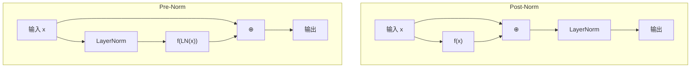

# 3.9 正则化与残差连接

深度网络的训练面临两大挑战：梯度消失/爆炸和过拟合。本节讨论 Transformer 中用于应对这些挑战的关键技术：层归一化（Layer Normalization）、残差连接（Residual Connection）以及它们的变体。

假设你要从北京开车到上海，路上有可能堵车、迷路、爆胎。深度网络的训练过程也类似这样一段长途旅程——梯度信号要从输出层一路回传到输入层。层归一化相当于沿途的服务区，让你定期休息调整状态；而残差连接则是高速公路的旁路（bypass）——即使主路拥堵，信息仍可以走捷径畅通无阻地到达目的地。

## 3.9.1 层归一化（Layer Normalization）

### 批归一化的局限

**批归一化**（Batch Normalization, BN）在 CNN 中取得巨大成功，它对每个特征在 batch 维度上归一化：

$$\text{BN}(\mathbf{x})_i = \gamma_i \frac{x_i - \mu_B}{\sqrt{\sigma_B^2 + \epsilon}} + \beta_i$$

其中 $\mu_B, \sigma_B^2$ 是当前 batch 内的均值和方差，$\gamma_i, \beta_i$ 是可学习的缩放和偏移参数，$\epsilon$ 是防止除零的小常数。

BN 在序列模型中效果不佳，原因：

1. **变长序列**：不同样本长度不同，batch 统计量意义不明
2. **小 batch**：大模型训练时 batch 往往很小，统计量不稳定
3. **推理时的不一致**：需要维护运行时均值/方差，与训练时行为不完全一致

### 层归一化的定义

**层归一化**（Layer Normalization, LN）对每个样本在特征维度上独立归一化：

$$\text{LN}(\mathbf{x}) = \gamma \odot \frac{\mathbf{x} - \mu}{\sqrt{\sigma^2 + \epsilon}} + \beta$$

其中：
- $\mu = \frac{1}{d} \sum_{i=1}^d x_i$（特征维度的均值）
- $\sigma^2 = \frac{1}{d} \sum_{i=1}^d (x_i - \mu)^2$（特征维度的方差）
- $\gamma, \beta \in \mathbb{R}^d$ 是可学习的缩放和偏移参数
- $\epsilon$ 是防止除零的小常数（如 $10^{-5}$）

### 层归一化的作用

1. **稳定训练**：将激活分布标准化，减少内部协变量偏移
2. **加速收敛**：标准化的输入使优化更容易
3. **梯度流**：反向传播时梯度更稳定

举个例子，假设你在烘焙咖啡豆，每一批豆子的含水量、大小都不同。如果不做任何预处理，同一套烘焙参数很难适配所有批次。层归一化做的事情类似于先把每批豆子"标定"到统一的基线（均值为零、方差为一），然后用可学习的参数 $\gamma, \beta$ 微调到最佳状态。这样，不管输入数据怎么变化，后续层都能在稳定的分布上工作。

### 实现

```python
class LayerNorm(nn.Module):
    def __init__(self, dim, eps=1e-5):
        super().__init__()
        self.gamma = nn.Parameter(torch.ones(dim))
        self.beta = nn.Parameter(torch.zeros(dim))
        self.eps = eps
    
    def forward(self, x):
        mean = x.mean(dim=-1, keepdim=True)
        var = x.var(dim=-1, keepdim=True, unbiased=False)
        return self.gamma * (x - mean) / torch.sqrt(var + self.eps) + self.beta
```

## 3.9.2 RMSNorm：简化的归一化

**RMSNorm**（Root Mean Square Layer Normalization）是层归一化的简化版本，去掉了中心化（减去均值）步骤：

$$\text{RMSNorm}(\mathbf{x}) = \gamma \odot \frac{\mathbf{x}}{\text{RMS}(\mathbf{x})}, \quad \text{RMS}(\mathbf{x}) = \sqrt{\frac{1}{d} \sum_{i=1}^d x_i^2 + \epsilon}$$

### 与 LayerNorm 的比较

| 特性 | LayerNorm | RMSNorm |
|------|-----------|---------|
| 中心化 | 有（减均值） | 无 |
| 参数 | $\gamma, \beta$ | 只有 $\gamma$ |
| 计算量 | 两次求和（均值、方差） | 一次求和（平方和） |
| 性能 | 略好 | 相当 |

RMSNorm 计算更快（约 10-15% 加速），性能几乎无损。LLaMA、Qwen 等现代大模型普遍采用 RMSNorm。

### 为什么去掉中心化

研究发现，LayerNorm 的主要作用来自缩放（除以标准差），而非中心化（减去均值）。在残差网络中，激活的均值往往接近零（特别是使用 Pre-Norm 时），中心化的作用有限。

## 3.9.3 残差连接


### 深度网络的训练困难

深度网络难以训练的一个原因是**梯度消失/爆炸**。考虑 $L$ 层网络：

$$\mathbf{h}^{(L)} = f_L(f_{L-1}(\ldots f_1(\mathbf{x})))$$

梯度需要通过 $L$ 层反向传播：

$$\frac{\partial \mathbf{h}^{(L)}}{\partial \mathbf{x}} = \prod_{l=1}^L \frac{\partial f_l}{\partial \mathbf{h}^{(l-1)}}$$

如果每层的 Jacobian 范数小于 1，梯度指数衰减；大于 1，梯度指数增长。

### 残差连接的定义

**残差连接**（Residual Connection）或**跳跃连接**（Skip Connection）让信息可以"绕过"某些层：

$$\mathbf{h}^{(l)} = \mathbf{h}^{(l-1)} + f_l(\mathbf{h}^{(l-1)})$$

梯度变为：

$$\frac{\partial \mathbf{h}^{(L)}}{\partial \mathbf{h}^{(l)}} = \prod_{k=l+1}^L \left(\mathbf{I} + \frac{\partial f_k}{\partial \mathbf{h}^{(k-1)}}\right)$$

关键观察：即使 $\frac{\partial f_k}{\partial \mathbf{h}^{(k-1)}} \approx \mathbf{0}$，梯度仍可通过恒等映射 $\mathbf{I}$ 流动。残差连接提供了一条"梯度高速公路"。

这就像城市里的高架快速路：地面主路可能因为红绿灯、拥堵而让车流几乎停滞（梯度消失），但高架路不受地面交通影响，车辆可以直达目的地。残差连接中的“$+ \mathbf{h}^{(l-1)}$”就是这条高架路——哪怕某一层的变换 $f_l$ 完全失效了，信息仍然能通过恒等映射畅行无阻。这就是为什么没有残差连接的网络很难超过 20 层，而有了它之后 100 层乃至更深都能稳定训练。

### ResNet 的启示

残差连接由 He 等人（2015）在 ResNet 中提出，使得训练 100+ 层的 CNN 成为可能。核心洞察：

学习**残差** $f_l(\mathbf{x}) = \mathbf{h}^* - \mathbf{x}$ 比直接学习 $\mathbf{h}^*$ 更容易。如果恒等映射是最优解，网络只需学习 $f_l \equiv \mathbf{0}$，这比学习恒等映射本身容易。

想象一下你在练习射箭：与其让你从零开始学习"如何射中靶心"这个绝对目标，不如先让你站在靶心正前方（恒等映射），然后只学习"要偏移多少"（残差）。后者显然简单得多——而且如果不需要偏移，答案就是零，网络只需投降即可。

## 3.9.4 Pre-Norm vs Post-Norm



层归一化与残差连接的组合有两种放置方式：

### Post-Norm（原始 Transformer）

$$\mathbf{y} = \text{LN}(\mathbf{x} + f(\mathbf{x}))$$

归一化在残差相加之后。原始 Transformer 论文使用此方式。

### Pre-Norm（现代大模型）

$$\mathbf{y} = \mathbf{x} + f(\text{LN}(\mathbf{x}))$$

归一化在子层计算之前。GPT-2 及之后的模型普遍采用。

### 梯度流分析

**Post-Norm** 的残差分支是 $\text{LN}(\mathbf{x} + f(\mathbf{x})) - \mathbf{x}$，这依赖于 $\mathbf{x}$ 和 $f(\mathbf{x})$ 的具体值，梯度计算复杂。

**Pre-Norm** 的残差分支直接是 $f(\text{LN}(\mathbf{x}))$，与 $\mathbf{x}$ 独立。梯度可以更直接地通过恒等路径流动。

### 实践比较

| 特性 | Post-Norm | Pre-Norm |
|------|-----------|----------|
| 训练稳定性 | 较低 | 高 |
| 最终性能 | 略高 | 略低 |
| 深度扩展 | 困难（需要仔细初始化） | 容易 |
| 学习率敏感性 | 高 | 低 |

对于超深网络（100+ 层），Pre-Norm 几乎是必需的。对于中等深度且精心调参，Post-Norm 可能略优。

### 最终层的归一化

Pre-Norm 架构需要在输出层之前额外加一个 LayerNorm：

```python
# Pre-Norm Transformer
for block in self.blocks:
    x = x + block.attn(block.ln1(x))
    x = x + block.ffn(block.ln2(x))
x = self.ln_final(x)  # Important!
logits = self.lm_head(x)
```

没有这个最终的归一化，输出分布可能不稳定。

## 3.9.5 初始化策略

### 标准初始化

权重通常用小的随机值初始化：

**Xavier/Glorot 初始化**：

$$W_{ij} \sim \text{Uniform}\left(-\sqrt{\frac{6}{n_{\text{in}} + n_{\text{out}}}}, \sqrt{\frac{6}{n_{\text{in}} + n_{\text{out}}}}\right)$$

其中 $n_{\text{in}}$ 和 $n_{\text{out}}$ 分别是该层的输入和输出神经元数量。一句话概括：Xavier 初始化保证了前向传播和反向传播时信号的方差不会逐层放大或缩小，适用于 sigmoid/tanh 等对称激活函数。

或正态版本：$W_{ij} \sim \mathcal{N}(0, \frac{2}{n_{\text{in}} + n_{\text{out}}})$

**Kaiming/He 初始化**（适用于 ReLU）：

$$W_{ij} \sim \mathcal{N}\left(0, \sqrt{\frac{2}{n_{\text{in}}}}\right)$$

其中 $n_{\text{in}}$ 是输入维度。通俗地说，Kaiming 初始化针对 ReLU 将半数神经元置零的特点，将方差额外乘以 2 进行补偿，确保梯度流稳定。

### 残差分支的缩放初始化

为了让深层网络在初始化时更接近恒等映射，GPT-2 等模型对残差分支的最后一层权重额外缩放：

$$W_{\text{output}} \sim \mathcal{N}\left(0, \frac{0.02}{\sqrt{2N}}\right)$$

其中 $N$ 是残差层数。这使得残差分支初始输出接近零，整个网络接近恒等映射。

### 偏置初始化

偏置通常初始化为零。某些场景下非零初始化有帮助，如 LSTM 的遗忘门偏置初始化为正值（鼓励"记住"）。

## 3.9.6 Dropout

**Dropout** 在训练时随机将神经元置零，是经典的正则化技术：

$$\text{Dropout}(\mathbf{x}, p) = \begin{cases} \frac{\mathbf{x}}{1-p} \odot \mathbf{m}, & \text{训练时} \\ \mathbf{x}, & \text{推理时} \end{cases}$$

其中 $p$ 是丢弃概率，$\mathbf{m}$ 是 Bernoulli 掩码（$m_i \sim \text{Bernoulli}(1-p)$，即每个元素以概率 $1-p$ 为 1、概率 $p$ 为 0）。除以 $(1-p)$ 是为了保持期望值不变，使得训练和推理时的输出量级一致。

这就像足球队的训练策略：教练每次随机让几名主力休息，迫使其他球员承担更多职责。长此以往，球队不再过度依赖某几个“明星球员”，整体战力更均衡、更鲁棒。Dropout 的原理与此相同：随机屏蔽部分神经元，迫使网络学习更分散、更鲁棒的特征表示，而不是过度依赖某几个特定神经元。

### Transformer 中的 Dropout

原始 Transformer 在多处使用 Dropout：

1. **嵌入层之后**
2. **注意力权重**（对 softmax 输出）
3. **残差连接之前**
4. **FFN 中间层**

### 现代大模型的趋势

有趣的是，现代大语言模型（GPT-3、LLaMA 等）**不使用 Dropout**。原因：

1. **数据量足够大**：过拟合风险低
2. **计算效率**：Dropout 引入额外计算和内存开销
3. **确定性训练**：便于复现和调试

取而代之，大模型依赖其他正则化手段：大规模数据、权重衰减、早停等。

## 3.9.7 权重衰减（Weight Decay）

**权重衰减**（Weight Decay）或 **L2 正则化** 在损失函数中加入权重的 $L^2$ 范数：

$$\mathcal{L}_{\text{total}} = \mathcal{L} + \frac{\lambda}{2} \|\mathbf{w}\|_2^2$$

其中 $\mathcal{L}$ 是原始损失，$\lambda$ 是正则化系数（控制权重衰减强度），$\|\mathbf{w}\|_2^2 = \sum_i w_i^2$ 是权重的 $L^2$ 范数平方。这个公式告诉我们：正则化项惩罚过大的权重，鼓励模型学习更平滑、更简单的函数，从而减少过拟合。

梯度更新变为：

$$\mathbf{w} \leftarrow \mathbf{w} - \eta \nabla \mathcal{L} - \eta \lambda \mathbf{w}$$

其中 $\eta$ 是学习率。$-\eta \lambda \mathbf{w}$ 项在每次更新时将权重按比例缩小，这就是“权重衰减”名称的由来。

### AdamW 中的解耦权重衰减

Adam 优化器中，直接在损失中加 L2 正则与在权重更新中加衰减项**不等价**。AdamW 采用解耦的权重衰减：

$$\mathbf{w} \leftarrow \mathbf{w} - \eta \cdot \text{Adam}(\nabla \mathcal{L}) - \eta \lambda \mathbf{w}$$

这在实践中效果更好，是大模型训练的标准选择。

### 哪些参数需要权重衰减

通常只对权重矩阵应用衰减，不对偏置和 LayerNorm 参数衰减：

```python
decay_params = [p for n, p in model.named_parameters() 
                if 'weight' in n and 'norm' not in n]
no_decay_params = [p for n, p in model.named_parameters() 
                   if 'bias' in n or 'norm' in n]
```

## 3.9.8 梯度裁剪

**梯度裁剪**（Gradient Clipping）限制梯度的范数，防止梯度爆炸：

**按范数裁剪**（常用）：

$$\mathbf{g} \leftarrow \mathbf{g} \cdot \min\left(1, \frac{C}{\|\mathbf{g}\|}\right)$$

其中 $\mathbf{g}$ 是梯度向量，$C$ 是裁剪阈值，$\|\mathbf{g}\|$ 是梯度的范数。拆开来看，当梯度范数未超过阈值 $C$ 时保持不变；一旦超过，将梯度按比例缩小到范数恰好为 $C$，方向保持不变。

**按值裁剪**：

$$g_i \leftarrow \text{clip}(g_i, -C, C)$$

### 大模型训练中的梯度裁剪

大模型训练普遍使用梯度裁剪，典型阈值 $C = 1.0$。这可以：

1. 防止异常 batch 导致训练崩溃
2. 提高训练稳定性
3. 允许使用更大的学习率
