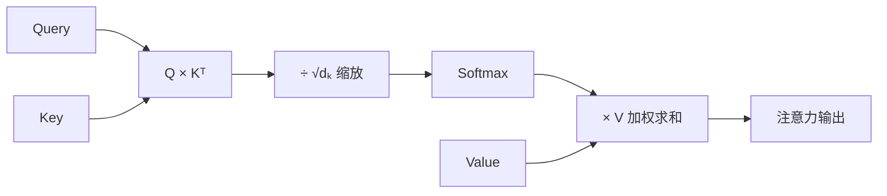
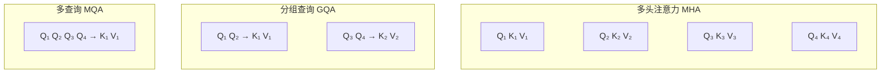

# 3.10 注意力机制

注意力机制是 Transformer 的核心创新，它允许序列中的每个位置直接"关注"其他所有位置，无需像 RNN 那样逐步传递信息。想象一个交响乐团的指挥：他可以同时关注小提琴、大提琴、长笛的演奏，并根据当前乐段决定哪个声部需要突出。注意力机制做的事情类似：对序列中的每个位置，决定该“关注”哪些其他位置。本节深入讨论自注意力（Self-Attention）、交叉注意力（Cross-Attention）、多头注意力（Multi-Head Attention）以及现代大模型中广泛使用的分组查询注意力（GQA）。

## 3.10.1 缩放点积注意力



### 基本公式

给定 Query $\mathbf{Q}$、Key $\mathbf{K}$、Value $\mathbf{V}$，缩放点积注意力（Scaled Dot-Product Attention）定义为：

$$\text{Attention}(\mathbf{Q}, \mathbf{K}, \mathbf{V}) = \text{softmax}\left(\frac{\mathbf{Q}\mathbf{K}^\top}{\sqrt{d_k}}\right) \mathbf{V}$$

设 $\mathbf{Q} \in \mathbb{R}^{n \times d_k}$，$\mathbf{K} \in \mathbb{R}^{m \times d_k}$，$\mathbf{V} \in \mathbb{R}^{m \times d_v}$：

1. **相似度计算**：$\mathbf{Q}\mathbf{K}^\top \in \mathbb{R}^{n \times m}$，第 $(i, j)$ 元素是 $\mathbf{q}_i$ 与 $\mathbf{k}_j$ 的点积
2. **缩放**：除以 $\sqrt{d_k}$，防止点积过大导致 softmax 饱和
3. **归一化**：对每行应用 softmax，得到注意力权重
4. **加权求和**：用注意力权重对 Value 加权

### 为什么需要缩放

假设 $\mathbf{q}, \mathbf{k}$ 的分量独立同分布，均值为 0，方差为 1。则：

$$\mathbb{E}[\mathbf{q}^\top \mathbf{k}] = 0, \quad \text{Var}[\mathbf{q}^\top \mathbf{k}] = d_k$$

其中 $\mathbb{E}[\cdot]$ 表示期望，$\text{Var}[\cdot]$ 表示方差。拆开来看，点积是 $d_k$ 个独立随机变量乘积之和，其方差与 $d_k$ 成正比。因此除以 $\sqrt{d_k}$ 可将方差标准化为 1，避免 softmax 饱和。

这就像考试评分：如果一场考试满分是 10 分，同学间的分差很容易区分（你 8 分他 6 分，差异明显）；但如果满分是 10000 分，你 8000 分他 6000 分，虽然绝对差异很大，softmax 会把这个差异放大到极端——结果变成“只看第一名”。除以 $\sqrt{d_k}$ 相当于把分数“压缩”回合理范围，让 softmax 能产生有意义的权重分配。

### 注意力的直觉

可以将注意力理解为**软检索**：就像在图书馆查资料，Query 是你的查询问题，Key 是每本书的目录标题，Value 是书的内容。你将问题与所有标题一一对比，与问题相关度高的书你会重点翻阅，不相关的则略过。

- Query 是"查询条件"
- Key 是"索引"
- Value 是"内容"

Query 与 Key 匹配程度决定了检索到多少 Value。高匹配度的 Key 对应的 Value 被强调，低匹配度的被忽略。

## 3.10.2 自注意力（Self-Attention）

### 定义

自注意力中，$\mathbf{Q}, \mathbf{K}, \mathbf{V}$ 都来自同一输入序列 $\mathbf{X} \in \mathbb{R}^{n \times d}$：

$$\mathbf{Q} = \mathbf{X}\mathbf{W}_Q, \quad \mathbf{K} = \mathbf{X}\mathbf{W}_K, \quad \mathbf{V} = \mathbf{X}\mathbf{W}_V$$

其中 $\mathbf{W}_Q, \mathbf{W}_K \in \mathbb{R}^{d \times d_k}$，$\mathbf{W}_V \in \mathbb{R}^{d \times d_v}$。

自注意力让序列中的每个位置可以"看到"其他所有位置，捕获任意距离的依赖关系。

### 与全连接层的比较

自注意力可以视为**数据依赖的全连接层**：

- 全连接层：$\mathbf{y} = \mathbf{W}\mathbf{x} + \mathbf{b}$，权重 $\mathbf{W}$ 是固定的
- 自注意力：$\mathbf{y} = \mathbf{A}(\mathbf{X})\mathbf{X}\mathbf{W}_V$，"权重" $\mathbf{A}(\mathbf{X})$ 取决于输入

这种数据依赖性使注意力能够动态地调整信息聚合方式。

### 因果掩码（Causal Mask）

在自回归语言模型中，位置 $i$ 只能看到位置 $1, \ldots, i-1$，不能看到未来。通过掩码实现：

$$\text{CausalAttention}(\mathbf{Q}, \mathbf{K}, \mathbf{V}) = \text{softmax}\left(\frac{\mathbf{Q}\mathbf{K}^\top}{\sqrt{d_k}} + \mathbf{M}\right) \mathbf{V}$$

其中掩码矩阵 $\mathbf{M}$ 是上三角为 $-\infty$、其余为 0 的矩阵：

$$M_{ij} = \begin{cases} 0, & i \geq j \\ -\infty, & i < j \end{cases}$$

$-\infty$ 经过 softmax 后变为 0，实现"屏蔽"效果。

## 3.10.3 交叉注意力（Cross-Attention）

### 定义

交叉注意力中，Query 来自一个序列，Key 和 Value 来自另一个序列：

$$\mathbf{Q} = \mathbf{X}_{\text{dec}}\mathbf{W}_Q, \quad \mathbf{K} = \mathbf{X}_{\text{enc}}\mathbf{W}_K, \quad \mathbf{V} = \mathbf{X}_{\text{enc}}\mathbf{W}_V$$

这是 Encoder-Decoder 架构中解码器"关注"编码器输出的机制。

### 应用场景

- **机器翻译**：解码器（目标语言）关注编码器（源语言）
- **图像描述生成**：文本解码器关注图像编码器
- **多模态模型**：语言模型关注视觉特征

## 3.10.4 多头注意力（Multi-Head Attention）

### 动机

单一注意力可能只关注一种类型的关系。多头注意力让模型可以同时关注不同位置的不同表示子空间。

假设你是一名记者，在采访一场新闻发布会。你可能同时需要关注多个维度：谁在说话（身份关系）、说的内容与之前哪句话矛盾（逻辑关系）、哪些关键词反复出现（统计关系）。单头注意力就像只派了一名记者，只能盯住一个维度；多头注意力相当于同时派出 $h$ 名记者，每人负责一个角度，最后汇总成一篇全面报道。

### 定义

设头数为 $h$，每头的维度为 $d_k = d_v = d / h$。多头注意力：

$$\text{MultiHead}(\mathbf{Q}, \mathbf{K}, \mathbf{V}) = \text{Concat}(\text{head}_1, \ldots, \text{head}_h)\mathbf{W}_O$$

其中：

$$\text{head}_i = \text{Attention}(\mathbf{Q}\mathbf{W}_Q^i, \mathbf{K}\mathbf{W}_K^i, \mathbf{V}\mathbf{W}_V^i)$$

其中：
- $h$ 是注意力头的数量
- $\mathbf{W}_Q^i, \mathbf{W}_K^i \in \mathbb{R}^{d \times d_k}$，$\mathbf{W}_V^i \in \mathbb{R}^{d \times d_v}$ 是第 $i$ 个头的投影矩阵，其中 $d_k = d_v = d / h$
- $\mathbf{W}_O \in \mathbb{R}^{hd_v \times d}$ 是输出投影矩阵，将拼接后的多头结果映射回 $d$ 维
- $\text{Concat}$ 将所有头的输出在特征维拼接

换句话说，每个头在独立的低维子空间中学习不同类型的依赖关系，拼接后通过 $\mathbf{W}_O$ 整合所有头的信息。多头不增加参数量，只是将计算分散到多个子空间。

### 参数量

单头注意力参数：$3 \times d \times d + d \times d = 4d^2$（Q, K, V 投影 + 输出投影）

多头注意力参数：相同，因为 $h \times (3 \times d \times d/h) + d \times d = 4d^2$

多头不增加参数量，只是将计算分散到多个子空间，但分工带来的表达能力提升显著。

### 不同头学到什么

研究发现，不同的注意力头倾向于学习不同的模式：

- 某些头关注局部上下文（相邻词）
- 某些头关注语法结构（如主语-动词关系）
- 某些头关注特定的语义关系

这种分工使多头注意力比单头更强大。

## 3.10.5 分组查询注意力（GQA）



### KV Cache 的内存瓶颈

推理时，自回归生成需要缓存每一层每个位置的 Key 和 Value。对于 $L$ 层、$n$ 个头、序列长度 $T$、头维度 $d_h$ 的模型：

$$\text{KV Cache 大小} = 2 \times L \times n \times T \times d_h$$

其中：
- $2$ 对应 Key 和 Value 两个矩阵
- $L$ 是 Transformer 层数
- $n$ 是注意力头数
- $T$ 是序列长度
- $d_h$ 是每个头的维度

这意味着 KV Cache 的大小与序列长度 $T$ 和注意力头数 $n$ 均成线性关系。对于超大模型，KV Cache 可轻松超过模型权重本身的显存占用。

对于 70B 参数的模型（$L=80, n=64, d_h=128$），处理 4096 长度的序列，KV Cache 约需 40GB，常常超过模型权重本身。

换个角度理解：假设你在做会议纪要，每次有人发言时，你不仅要记录当前发言内容，还要保留所有历史发言的笔记以便随时回查。随着会议越开越长，你的笔记本越堆越厚——这就是 KV Cache 的内存压力。而 GQA 的策略相当于让几个记录员共用一本笔记——大家看的参考资料相同，只是各自提问的角度不同。

### 多查询注意力（MQA）

**多查询注意力**（Multi-Query Attention）共享 Key 和 Value：所有查询头共享一组 K/V。

$$\text{head}_i = \text{Attention}(\mathbf{Q}\mathbf{W}_Q^i, \mathbf{K}\mathbf{W}_K, \mathbf{V}\mathbf{W}_V)$$

KV Cache 减少为原来的 $1/n$，但性能略有下降。

### 分组查询注意力（GQA）

**GQA**（Grouped-Query Attention）是 MQA 的折中：将 $n$ 个查询头分成 $g$ 组，每组共享一组 K/V。

$$\text{head}_i = \text{Attention}(\mathbf{Q}\mathbf{W}_Q^i, \mathbf{K}\mathbf{W}_K^{g(i)}, \mathbf{V}\mathbf{W}_V^{g(i)})$$

其中 $g(i) = \lfloor i \cdot g / n \rfloor$ 是头 $i$ 所属的组索引，$g$ 是 KV 头的组数，$n$ 是 Query 头的总数。用大白话讲，每 $n/g$ 个 Query 头共享同一组 Key/Value，在保持接近 MHA 性能的同时，将 KV Cache 减少为原来的 $g/n$。

| 方法 | KV 头数 | KV Cache 占用 | 性能 |
|------|---------|---------------|------|
| MHA | $n$ | 1x | 最高 |
| GQA | $g$ | $g/n$ | 接近 MHA |
| MQA | 1 | $1/n$ | 略低 |

LLaMA 2 70B 使用 GQA（$n=64$, $g=8$），KV Cache 减少到 1/8，性能几乎无损。

## 3.10.6 高效注意力实现

### Flash Attention

标准注意力需要 $O(n^2)$ 内存存储注意力矩阵。**Flash Attention** 通过分块计算和在线 softmax 将内存降到 $O(n)$：

1. 将 Q, K, V 分成小块
2. 在 SRAM（高速缓存）中计算每块的注意力
3. 增量更新 softmax 的归一化项
4. 不显式存储完整的注意力矩阵

Flash Attention 2 进一步优化了并行性和内存访问模式，是大模型训练的标准组件。

### 稀疏注意力

长序列的 $O(n^2)$ 复杂度是瓶颈。稀疏注意力只计算部分位置对：

**滑动窗口注意力**：每个位置只关注周围 $w$ 个位置，复杂度 $O(nw)$。Mistral 使用此方法。

**块稀疏注意力**：将序列分块，只在块内和部分块间计算注意力。

**动态稀疏**：根据内容动态决定关注哪些位置。

## 3.10.7 注意力的可视化与解释

### 注意力权重的可视化

注意力权重矩阵 $\mathbf{A} \in \mathbb{R}^{n \times n}$ 可以可视化为热图。$A_{ij}$ 表示位置 $i$ 对位置 $j$ 的关注程度。

典型模式：
- **对角线**：关注自身和相邻位置
- **垂直条纹**：某些位置（如句首、特殊 token）被广泛关注
- **稀疏激活**：只有少数位置被关注

### 注意力是否等于解释

注意力权重常被用于"解释"模型决策，但需谨慎：

1. 注意力只是中间计算，不直接决定输出
2. 多层多头注意力的组合行为复杂
3. 高注意力权重不一定意味着"重要"

研究表明，注意力权重与梯度归因（gradient attribution）的相关性不高。注意力可作为参考，但不应过度解读。

## 3.10.8 PyTorch 实现

```python
import torch
import torch.nn as nn
import torch.nn.functional as F

class MultiHeadAttention(nn.Module):
    def __init__(self, d_model, n_heads, dropout=0.1):
        super().__init__()
        assert d_model % n_heads == 0
        
        self.d_model = d_model
        self.n_heads = n_heads
        self.d_k = d_model // n_heads
        
        self.W_q = nn.Linear(d_model, d_model, bias=False)
        self.W_k = nn.Linear(d_model, d_model, bias=False)
        self.W_v = nn.Linear(d_model, d_model, bias=False)
        self.W_o = nn.Linear(d_model, d_model, bias=False)
        
        self.dropout = nn.Dropout(dropout)
    
    def forward(self, x, mask=None):
        B, T, C = x.shape
        
        # Linear projections
        q = self.W_q(x).view(B, T, self.n_heads, self.d_k).transpose(1, 2)
        k = self.W_k(x).view(B, T, self.n_heads, self.d_k).transpose(1, 2)
        v = self.W_v(x).view(B, T, self.n_heads, self.d_k).transpose(1, 2)
        
        # Attention scores
        scores = torch.matmul(q, k.transpose(-2, -1)) / (self.d_k ** 0.5)
        
        # Apply mask
        if mask is not None:
            scores = scores.masked_fill(mask, float('-inf'))
        
        # Softmax and dropout
        attn = F.softmax(scores, dim=-1)
        attn = self.dropout(attn)
        
        # Weighted sum
        out = torch.matmul(attn, v)
        
        # Reshape and output projection
        out = out.transpose(1, 2).contiguous().view(B, T, C)
        out = self.W_o(out)
        
        return out
```

这个实现展示了多头注意力的核心逻辑。实际生产中会使用 Flash Attention 等优化实现。

值得留意的是代码中的 `transpose(1, 2)` 操作：它将形状从 `(batch, seq, heads, dim)` 变为 `(batch, heads, seq, dim)`，这样每个注意力头可以独立地计算自己的 Q×K 点积。这就好比把一个大教室分成多个小组讨论室——每组在自己的空间里独立讨论，最后再汇总成果。
