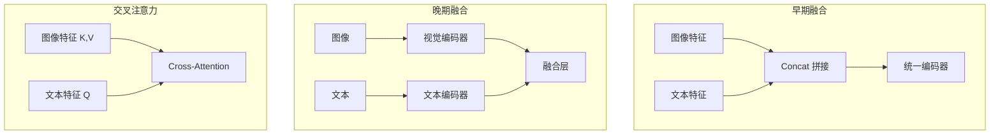
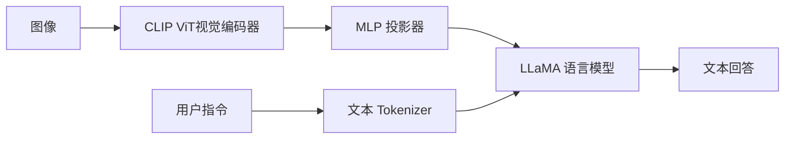

# 3.12 多模态与全模态模型

人类的认知不局限于单一模态：我们同时处理视觉、听觉、语言等多种信息。**多模态模型**（Multimodal Model）旨在让机器也能联合处理多种模态的数据。本节讨论多模态模型的基本架构，以及向**全模态**（Omni-modal）统一架构演进的趋势。

这就像一个侦探在破案：单独看监控录像（视觉）只能看到人的动作，单独听电话录音（音频）只能知道说了什么，单独看账本记录（文本）只能了解资金流向。任何单一证据都无法还原全貌，但当侦探将所有线索交叉比对时，真相就浮出水面。多模态模型的目标正是如此：让模型能够综合不同渠道的信息，形成比任何单一模态更完整的理解。

## 3.12.1 多模态学习的范式

### 模态的定义

**模态**（Modality）指信息的不同形式：

- **文本**：离散的符号序列
- **图像**：二维像素阵列
- **音频**：一维波形信号
- **视频**：时序图像序列
- **3D**：点云、网格、体素

不同模态有不同的结构、统计特性和处理方式。

### 多模态任务类型

**理解任务**（多模态输入 → 单模态输出）：
- 视觉问答（VQA）：图像 + 问题 → 答案
- 图像描述（Image Captioning）：图像 → 文本
- 视频分类：视频 → 类别

**生成任务**（单/多模态输入 → 单/多模态输出）：
- 文生图（Text-to-Image）：文本 → 图像
- 图像编辑：图像 + 指令 → 图像
- 语音合成（TTS）：文本 → 音频

**跨模态检索**：
- 以文搜图、以图搜文

## 3.12.2 多模态融合策略



### 早期融合

将不同模态的特征在输入层拼接：

$$\mathbf{x}_{\text{fused}} = \text{Concat}(\mathbf{x}_{\text{text}}, \mathbf{x}_{\text{image}})$$

其中 $\mathbf{x}_{\text{text}}$ 和 $\mathbf{x}_{\text{image}}$ 分别为文本和图像的特征向量，$\text{Concat}$ 表示沿特征维度拼接。然后用统一的编码器处理。

**优点**：模型可以学习细粒度的跨模态交互。

**缺点**：需要对齐不同模态的维度和语义。

这就像侦探一开始就把所有线索摆在同一张桌子上交叉比对——能发现微妙的关联，但前提是你得先把各种不同格式的证据（照片、录音、文件）统一整理成可比较的形式。

### 晚期融合

分别用专用编码器处理各模态，最后融合：

$$\mathbf{h}_{\text{text}} = f_{\text{text}}(\mathbf{x}_{\text{text}})$$
$$\mathbf{h}_{\text{image}} = f_{\text{image}}(\mathbf{x}_{\text{image}})$$
$$\mathbf{h}_{\text{fused}} = g(\mathbf{h}_{\text{text}}, \mathbf{h}_{\text{image}})$$

其中 $f_{\text{text}}$、$f_{\text{image}}$ 分别为文本和图像的专用编码器，$\mathbf{h}$ 为对应的高层特征表示，$g$ 为融合函数（如拼接后接全连接层、加权求和等）。

**优点**：可以利用预训练的单模态编码器。

**缺点**：跨模态交互受限于融合层。

如果说早期融合是把线索摆在一起交叉比对，晚期融合就是让不同的专家先各自分析自己领域的证据，形成独立报告，然后在最后的案情分析会上汇总。这样每个专家可以充分发挥专业优势，但缺点是中间过程中的交叉发现可能被遗漏。

### 交叉注意力融合

用注意力机制让一个模态"关注"另一个模态：

$$\mathbf{h}_{\text{text}}' = \text{CrossAttn}(\mathbf{h}_{\text{text}}, \mathbf{h}_{\text{image}})$$

文本作为 Query，图像作为 Key/Value。这是现代多模态模型的主流方法。

## 3.12.3 视觉-语言模型架构

### 双塔架构（CLIP 式）

CLIP 已在前文讨论。其核心是两个独立的编码器，通过对比学习对齐到共享空间。

**适用**：跨模态检索、零样本分类

**局限**：只能计算整体相似度，无法细粒度交互

### 编码器-解码器架构

视觉编码器提取特征，语言解码器生成文本：

```
图像 → Vision Encoder → 图像特征 → Language Decoder → 文本
```

代表模型：BLIP、GIT

### LLM + 视觉适配器

在预训练语言模型基础上添加视觉能力：

```
图像 → Vision Encoder → Projector → LLM → 输出
```

Projector（适配器）将视觉特征映射到语言模型的输入空间。

代表模型：LLaVA、InternVL、Qwen-VL

### 视觉 Token 化

将图像转换为离散 token，与文本 token 统一处理：

```
图像 → Vision Tokenizer → 视觉 tokens
文本 → Text Tokenizer → 文本 tokens
[视觉 tokens, 文本 tokens] → Unified Model → 输出
```

代表模型：Fuyu、Chameleon

## 3.12.4 LLaVA 架构详解



**LLaVA**（Large Language and Vision Assistant）是代表性的视觉-语言模型。

### 组件

1. **视觉编码器**：CLIP ViT-L/14，输出 $14 \times 14 = 196$ 个 patch 特征
2. **投影器**：两层 MLP，将视觉特征投影到语言模型维度
3. **语言模型**：LLaMA/Vicuna，处理视觉和文本 token 的混合序列

### 输入格式

```
<image> 用户问题 ASSISTANT: 模型回答
```

其中 `<image>` 占位符被替换为 196 个视觉 token。

### 训练阶段

**阶段 1：特征对齐**

冻结视觉编码器和语言模型，只训练投影器。使用图像-描述对数据。

**阶段 2：指令微调**

解冻语言模型，在视觉指令数据上微调。投影器可选择冻结或微调。

### 分辨率处理

高分辨率图像产生更多视觉 token。常见策略：

- **固定分辨率**：将图像 resize 到固定尺寸（如 336×336）
- **动态分辨率**：保持宽高比，用多个 crop 覆盖
- **任意分辨率**：使用 2D 位置编码支持任意尺寸

## 3.12.5 全模态模型

### 从多模态到全模态

传统多模态模型通常专注于两种模态（如视觉-语言）。**全模态模型**（Omni-modal Model）旨在用统一架构处理**任意**模态的**任意**组合。

回到侦探的比喻：早期的多模态模型像是只擅长"看监控+读文件"的专项侦探，而全模态模型则是一个能同时处理视频、音频、文件、物证等任何类型证据的全能型探员。不管线索以什么形式呈现，他都能理解并综合利用。

### 统一表示

全模态模型的核心挑战是找到不同模态的**统一表示**：

**连续表示**：将所有模态编码为连续向量，在共享空间中交互。

**离散表示**：将所有模态 tokenize 为离散 token，用统一的语言模型处理。

### 代表模型

**GPT-4o**：OpenAI 的全模态模型，原生支持文本、图像、音频的输入输出。

**Gemini**：Google 的全模态模型，训练时就包含多种模态。

**Unified-IO**：将多种任务统一为 seq2seq 格式。

### 架构趋势

1. **更统一的 tokenizer**：将图像、音频等都转为 token 序列
2. **更灵活的条件生成**：任意模态组合作为条件
3. **端到端训练**：减少模块化设计，联合优化

## 3.12.6 视觉 Tokenizer

### 为什么需要视觉 tokenizer

语言模型处理离散 token。如果能将图像转为离散 token，就可以：
- 用统一的架构处理图文
- 利用语言模型的强大生成能力
- 支持图像生成任务

这个思路可以类比为翻译工作：假设你有一套非常强大的中文处理系统，现在想处理英文。一种方法是重头建一套英文系统；另一种更巧妙的方法是先把英文翻译成中文，用现有系统处理，再把结果转回英文。视觉 tokenizer 的角色就是这个"翻译员"——它把图像这种"外语"转换成语言模型能理解的"母语"（离散 token）。

### VQ-VAE

**向量量化变分自编码器**（VQ-VAE）是经典的视觉 tokenizer：

1. 编码器将图像压缩为低分辨率特征图
2. 每个特征向量量化到最近的 codebook 向量
3. 解码器从量化后的特征重建图像

codebook 中的索引就是"视觉 token"。

### 多尺度 tokenizer

高分辨率图像需要大量 token，增加计算负担。多尺度方法：

- **分层 tokenizer**：先粗粒度 token，再细粒度 token
- **可变长度 tokenizer**：根据图像复杂度动态调整 token 数量

## 3.12.7 多模态生成

### 自回归图像生成

将图像 token 序列视为"语言"，用自回归方式生成：

$$P(\text{image}) = \prod_i P(t_i | t_{<i})$$

其中 $t_i$ 表示图像的第 $i$ 个离散 token，$t_{<i}$ 表示前 $i-1$ 个已生成的 token。即将图像 token 序列的联合概率分解为逐 token 的条件概率之积，与语言模型生成文本的方式完全一致。

代表模型：DALL-E（第一版）、Parti

### 扩散模型

**扩散模型**（Diffusion Model）通过逐步去噪生成图像。与语言模型的 cross-attention 结合实现文本条件控制。

代表模型：Stable Diffusion、DALL-E 2/3、Midjourney

扩散模型将在后续章节详细讨论。

### 混合架构

结合语言模型的规划能力和扩散模型的生成质量：

1. 语言模型生成"布局"或"草图"
2. 扩散模型基于布局生成高质量图像

## 3.12.8 训练数据

### 数据规模

多模态模型需要大规模的配对数据：

| 数据集 | 规模 | 模态 |
|--------|------|------|
| LAION-5B | 50 亿图文对 | 图像-文本 |
| WebVid | 1000 万视频 | 视频-文本 |
| Common Voice | 数千小时 | 音频-文本 |

### 数据质量

网络爬取的数据质量参差不齐。常见问题：
- 图文不匹配
- 描述过于简略（alt-text）
- 重复和低质量图像

**数据过滤**和**合成数据**是提升质量的常用手段。

### 指令数据

视觉指令数据（如 LLaVA-Instruct）对模型的指令遵循能力至关重要。构建方法：

- 人工标注（昂贵但高质量）
- GPT-4 辅助生成（可扩展但需过滤）
- 从现有数据集改造

## 3.12.9 评估

### 理解能力评估

- **VQAv2**：视觉问答
- **GQA**：组合推理
- **TextVQA**：包含文字的图像理解
- **MMBench**：多维度能力评估

### 生成能力评估

- **FID**：生成图像与真实图像分布的距离
- **CLIP Score**：生成图像与文本描述的匹配度
- **人工评估**：主观质量判断

### 开放挑战

多模态评估仍是开放问题：
- 细粒度理解（空间关系、计数）
- 复杂推理（多步骤、常识）
- 鲁棒性（对抗攻击、分布偏移）
