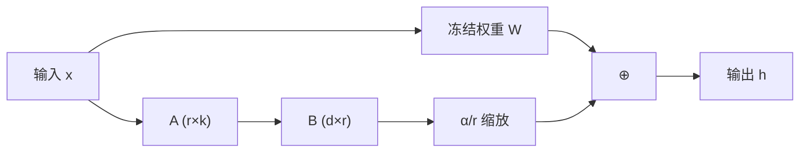

# 3.13 轻量训练技术

大语言模型的训练和微调需要海量的计算资源。以 LLaMA 2 70B 为例，全量微调需要约 560GB 显存（FP16），远超单卡甚至单机的能力。**轻量训练技术**旨在降低训练的资源需求，使得在有限硬件上微调大模型成为可能。本节讨论 LoRA、量化训练、梯度检查点等核心技术。

假设你拿到了一本 500 页的教科书，现在需要针对某门考试做适应性调整。全量微调相当于重新抄写整本书并在每一页都做修改——工程浩大且浪费。而轻量训练技术的思路是：保持原书不动，只在关键位置贴上便利贴（post-it notes）。原来的知识完整保留，只通过少量的标注就能让它适应新任务。

## 3.13.1 参数高效微调（PEFT）

### 全量微调的问题

全量微调（Full Fine-tuning）更新模型的所有参数。问题：

1. **显存占用**：需要存储模型参数、梯度、优化器状态
2. **存储成本**：每个下游任务保存一份完整模型
3. **过拟合风险**：小数据集上微调大模型容易过拟合

### PEFT 的思路

**参数高效微调**（Parameter-Efficient Fine-Tuning, PEFT）只更新少量参数，冻结大部分预训练权重。

$$\theta_{\text{new}} = \theta_{\text{pretrain}} + \Delta\theta$$

其中 $|\Delta\theta| \ll |\theta_{\text{pretrain}}|$。

### PEFT 方法分类

| 方法 | 思路 | 代表 |
|------|------|------|
| Adapter | 插入小型模块 | Adapter、AdapterFusion |
| Soft Prompt | 学习连续提示 | Prefix-Tuning、P-Tuning |
| 低秩分解 | 将更新分解为低秩矩阵 | LoRA、DoRA |

## 3.13.2 LoRA：低秩适配



**LoRA**（Low-Rank Adaptation）是目前最流行的 PEFT 方法。

### 核心思想

预训练权重 $\mathbf{W} \in \mathbb{R}^{d \times k}$ 在微调时的更新量 $\Delta\mathbf{W}$ 通常是**低秩**的。LoRA 将更新分解为两个低秩矩阵的乘积：

$$\Delta\mathbf{W} = \mathbf{B}\mathbf{A}, \quad \mathbf{B} \in \mathbb{R}^{d \times r}, \mathbf{A} \in \mathbb{R}^{r \times k}$$

其中 $r \ll \min(d, k)$ 是秩。

回到便利贴的类比：原始权重 $\mathbf{W}$ 是那本 500 页的教科书本身，$\Delta\mathbf{W} = \mathbf{BA}$ 是你贴的便利贴。关键洞察在于：微调带来的变化通常并不复杂——它们可以用很少几维（秩 $r$）来描述。就像你备考时的笔记不需要重写整本书，只需几张便利贴标注重点和补充即可。

### 前向传播

$$\mathbf{h} = (\mathbf{W} + \Delta\mathbf{W})\mathbf{x} = \mathbf{W}\mathbf{x} + \mathbf{B}\mathbf{A}\mathbf{x}$$

预训练权重 $\mathbf{W}$ 冻结，只训练 $\mathbf{A}$ 和 $\mathbf{B}$。

### 参数量

原始参数量：$d \times k$

LoRA 参数量：$r \times (d + k)$

当 $r = 8$，$d = k = 4096$ 时，LoRA 参数量约为原始的 $\frac{8 \times 8192}{4096 \times 4096} \approx 0.4\%$。

### 初始化

- $\mathbf{A}$：随机初始化（如高斯分布）
- $\mathbf{B}$：零初始化

这确保训练开始时 $\Delta\mathbf{W} = \mathbf{B}\mathbf{A} = \mathbf{0}$，模型行为与预训练时一致。

### 缩放因子

LoRA 引入缩放因子 $\alpha$：

$$\mathbf{h} = \mathbf{W}\mathbf{x} + \frac{\alpha}{r} \mathbf{B}\mathbf{A}\mathbf{x}$$

$\alpha$ 是超参数（常设为 $r$ 或 $2r$），控制 LoRA 更新的强度。$\alpha/r$ 的形式使得调整 $r$ 时不需要重新调整学习率。

### 应用位置

LoRA 通常应用于注意力层的投影矩阵：

- $\mathbf{W}_Q$, $\mathbf{W}_K$, $\mathbf{W}_V$：Query、Key、Value 投影
- $\mathbf{W}_O$：输出投影

FFN 层也可以应用 LoRA，但实践中收益不如注意力层明显。

### 合并与部署

推理时，可以将 LoRA 权重合并到原始权重：

$$\mathbf{W}' = \mathbf{W} + \mathbf{B}\mathbf{A}$$

合并后，推理没有额外开销，且模型大小不变。这就像备考结束后，你可以把便利贴上的笔记正式抄写到书里——之后翻阅时就不需要两边对照了，读起来和原生的书一样流畅。

## 3.13.3 LoRA 变体

### LoRA+

LoRA+ 发现 $\mathbf{A}$ 和 $\mathbf{B}$ 应该使用不同的学习率。$\mathbf{B}$ 的学习率应该是 $\mathbf{A}$ 的 10-100 倍。

### DoRA

**DoRA**（Weight-Decomposed Low-Rank Adaptation）将权重分解为幅度（magnitude）和方向（direction）：

$$\mathbf{W} = m \cdot \frac{\mathbf{V}}{\|\mathbf{V}\|_c}$$

其中 $m$ 是幅度标量，控制权重的“大小”；$\mathbf{V}$ 是方向矩阵，控制权重的“方向”；$\|\mathbf{V}\|_c$ 表示按列计算的范数，用于归一化。LoRA 只应用于方向部分，幅度单独学习。

DoRA 在某些任务上优于标准 LoRA。

### QLoRA

**QLoRA** 结合量化和 LoRA：

1. 将预训练权重量化到 4-bit
2. 在量化模型上应用 LoRA
3. LoRA 参数保持 FP16/BF16

QLoRA 可以在单张 24GB 显卡上微调 65B 模型，是资源受限场景的利器。延续便利贴的比喻：QLoRA 相当于先把那本 500 页的教科书压缩成口袋本（量化到 4-bit），然后在口袋本上贴便利贴（LoRA）。书变小了，便利贴还是那些便利贴，你的书包（显存）压力大幅减轻。

### rsLoRA

**rsLoRA** 修改了缩放因子为 $\alpha / \sqrt{r}$，在大 $r$ 时更稳定。

## 3.13.4 量化训练

### 量化的基本概念

**量化**（Quantization）将浮点数表示为低位整数，减少内存和计算量。

**FP16/BF16**：16 位浮点，相比 FP32 内存减半，大多数硬件支持。

**INT8**：8 位整数，内存减少 4 倍，需要量化-反量化操作。

**INT4/NF4**：4 位表示，进一步压缩，精度损失更大。

### 量化感知训练（QAT）

**量化感知训练**（Quantization-Aware Training）在训练中模拟量化效果：

$$\hat{\mathbf{W}} = Q(D(\mathbf{W}))$$

其中 $\mathbf{W}$ 为全精度权重，$D$ 是反量化函数（将低精度整数还原为浮点数），$Q$ 是量化函数（将浮点数映射为低精度整数）。前向用量化权重 $\hat{\mathbf{W}}$ 计算，反向用直通估计（Straight-Through Estimator）更新全精度权重 $\mathbf{W}$。

### 混合精度训练

**混合精度训练**在 FP16 和 FP32 之间切换：

- 前向和反向计算用 FP16
- 权重更新用 FP32（维护 master weights）
- 损失缩放（Loss Scaling）防止梯度下溢

PyTorch 的 `autocast` 和 `GradScaler` 提供了开箱即用的支持。

### BF16 vs FP16

| 特性 | FP16 | BF16 |
|------|------|------|
| 指数位 | 5 | 8 |
| 尾数位 | 10 | 7 |
| 数值范围 | 较小 | 与 FP32 相同 |
| 精度 | 较高 | 较低 |
| 溢出风险 | 高 | 低 |

BF16 因数值范围与 FP32 相同，训练更稳定，已成为大模型训练的首选。

### INT8 训练

**INT8 训练**进一步降低内存：

1. 权重量化到 INT8
2. 激活也量化到 INT8
3. 使用 INT8 矩阵乘法加速

挑战：INT8 的精度对训练敏感，需要仔细校准。当前主要用于推理，训练支持逐步完善。

## 3.13.5 梯度检查点

### 显存瓶颈

训练时需要存储中间激活值用于反向传播。对于 $L$ 层、序列长度 $n$、隐藏维度 $d$ 的 Transformer：

$$\text{激活显存} \approx L \times n \times d \times \text{sizeof(dtype)}$$

其中 $L$ 为模型层数，$n$ 为序列长度，$d$ 为隐藏维度，$\text{sizeof(dtype)}$ 为每个元素占用的字节数（如 FP16 为 2 字节）。对于 70B 模型、4096 序列长度、FP16，激活显存可达数十 GB。

### 检查点策略

**梯度检查点**（Gradient Checkpointing）或**激活重计算**（Activation Recomputation）用时间换空间：

1. 前向时只保存部分层的激活（检查点）
2. 反向时从最近的检查点重新计算中间激活
3. 减少显存占用，增加计算量（约 30%）

这个思路类似于旅行时的行李策略：与其所有物品都随身携带（占满显存），不如只带必需品，其他东西需要时再现场购买（重新计算）。代价是花点时间买东西，但背包轻了很多。

### 实现

```python
def checkpoint_forward(module, x):
    if torch.is_grad_enabled():
        return torch.utils.checkpoint.checkpoint(module, x, use_reentrant=False)
    else:
        return module(x)
```

常见策略：每 $k$ 层设置一个检查点。$k$ 越大，显存越省，重计算越多。

## 3.13.6 分布式训练策略

### 数据并行（DP）

每个 GPU 持有完整模型副本，处理不同的数据批次。梯度在所有 GPU 间同步。

**优点**：实现简单，扩展性好。

**缺点**：每个 GPU 需要完整模型，受限于单卡显存。

### 模型并行

**张量并行**（Tensor Parallelism）：将每层的计算分布到多个 GPU。例如，将 $4096 \times 4096$ 的矩阵乘法分到 4 个 GPU，每个处理 $4096 \times 1024$。

**流水线并行**（Pipeline Parallelism）：将模型按层切分到不同 GPU，数据像流水线一样流过。

### ZeRO 优化

**ZeRO**（Zero Redundancy Optimizer）消除数据并行中的冗余存储：

- **ZeRO-1**：优化器状态分片
- **ZeRO-2**：优化器状态 + 梯度分片
- **ZeRO-3**：优化器状态 + 梯度 + 参数分片

ZeRO-3 使得用数据并行的方式训练超大模型成为可能。

### FSDP

PyTorch 的 **Fully Sharded Data Parallel**（FSDP）实现了类似 ZeRO 的功能：

```python
from torch.distributed.fsdp import FullyShardedDataParallel as FSDP

model = FSDP(model, sharding_strategy=ShardingStrategy.FULL_SHARD)
```

## 3.13.7 内存优化技术

### 优化器状态压缩

Adam 优化器需要存储一阶矩和二阶矩，显存为参数的 2 倍。优化方法：

- **8-bit Adam**：用 INT8 存储优化器状态
- **Adafactor**：用低秩近似减少内存
- **LION**：不需要二阶矩的优化器

### 激活压缩

中间激活可以压缩存储：

- 量化激活到低精度
- 使用可逆层（不需要存储激活）
- 在 CPU 和 GPU 间卸载

### CPU Offload

将部分数据卸载到 CPU 内存：

- 优化器状态 offload（最常见）
- 参数 offload（会显著降速）
- 激活 offload

DeepSpeed 的 ZeRO-Offload 和 ZeRO-Infinity 系统化地实现了这些技术。

## 3.13.8 实践建议

### 微调配置选择

| 显存 | 模型规模 | 推荐配置 |
|------|----------|----------|
| 24GB | 7B | LoRA + 4-bit 量化（QLoRA） |
| 48GB | 7B | LoRA + FP16 |
| 80GB | 13B | LoRA + FP16 或 全量 + 梯度检查点 |
| 8×80GB | 70B | LoRA + FSDP 或 全量 + ZeRO-3 |

### LoRA 超参数

典型设置：
- $r = 8$-$64$（越大容量越大，越容易过拟合）
- $\alpha = r$ 或 $2r$
- 目标模块：`q_proj, v_proj`（基础）或所有投影层
- 学习率：$10^{-4}$-$10^{-3}$（比全量微调高）

### 量化选择

- 训练：BF16（首选）或 FP16 + 损失缩放
- QLoRA：NF4 量化基础模型
- 推理：INT8 或 INT4，视精度要求而定
