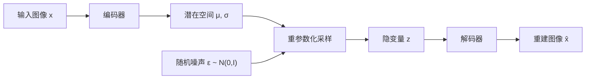
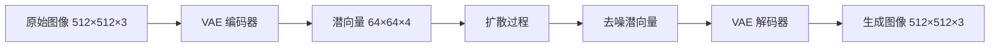

# 4.1 VAE：变分自编码器

**变分自编码器**（Variational Autoencoder, VAE）结合神经网络的表达能力与变分推断的理论框架，学习数据的低维隐表示。在现代视觉生成系统中，VAE 主要充当编码器-解码器，将高维像素空间压缩至低维潜空间，扩散模型在此潜空间中完成生成。

想象一下，你请一位经验丰富的素描画家为你画一幅肖像。画家不会把你每一根头发丝、每一颗毛孔都原封不动地复制到纸上——那是照相机干的事。画家做的是：仔细观察你的五官比例、神态气质，在脑海中提炼出最能代表你的那些"精髓特征"，然后凭借这些精髓在纸上重新创作。VAE 的工作方式与此高度类似：编码器像画家的眼睛，将一张高清照片"凝缩"为一组紧凑的隐变量（latent code）；解码器像画家的手，从这组隐变量出发，重建出原始图像。这个过程的关键在于：隐变量不能是任意乱码，它必须遵循一种"标准画风"——也就是先验分布——使得我们可以在这套画风的空间里自由采样，生成全新的、从未见过的面孔。

## 4.1.1 自编码器回顾

### 基础自编码器

**自编码器**（Autoencoder, AE）由编码器 $f_\phi$ 和解码器 $g_\theta$ 组成：

$$\mathbf{z} = f_\phi(\mathbf{x}), \quad \hat{\mathbf{x}} = g_\theta(\mathbf{z})$$

训练目标是重建损失：

$$\mathcal{L}_{\text{AE}} = \|\mathbf{x} - \hat{\mathbf{x}}\|^2$$

编码器将高维输入 $\mathbf{x} \in \mathbb{R}^D$ 压缩为低维隐向量 $\mathbf{z} \in \mathbb{R}^d$（$d \ll D$），解码器从隐向量重建原始输入。

回到素描画家的场景：自编码器就像一位只学过"压缩"和"还原"的画家——给他看一张照片，他能记下几个关键数值，再凭这些数值画回来。问题是，他记录的那些数值只对见过的照片有效，你随便给他编一组数值，他画出来的东西可能不像任何人脸，甚至完全不可辨认。

### 自编码器的局限

自编码器学到的隐空间是**不规则的**：

1. 隐空间可能有"空洞"——某些 $\mathbf{z}$ 不对应任何有意义的图像
2. 相邻的隐向量可能对应非常不同的图像
3. 无法从隐空间中采样生成新数据

这就好比一张残缺的地图：有些位置标注了城市，有些位置一片空白，而且相邻标注之间毫无规律可言。你无法靠"在地图上随便指一个点"来发现新城市。自编码器是确定性的映射，不是生成模型。

## 4.1.2 变分推断基础

### 隐变量模型

假设数据 $\mathbf{x}$ 由隐变量 $\mathbf{z}$ 生成：

$$p(\mathbf{x}) = \int p(\mathbf{x} | \mathbf{z}) p(\mathbf{z}) d\mathbf{z}$$

��标是最大化数据的对数似然 $\log p(\mathbf{x})$。但直接计算这个积分通常是不可行的（intractable）——因为需要对所有可能的 $\mathbf{z}$ 穷举积分，维度一高就完全不现实。

假设你正在经营一家肖像画工作室，想要统计"所有顾客满意度的总期望"。理想做法是：遍历每一种可能的画风 $\mathbf{z}$，计算该画风下画出好作品的概率，再求和。但画风有无穷多种组合，逐一遍历根本不可行。变分推断的策略是：找一个近似分布来"猜测"哪些画风最可能产生好结果，然后只在这些画风上重点计算。

### 变分下界（ELBO）

引入近似后验 $q_\phi(\mathbf{z} | \mathbf{x})$ 来近似真实后验 $p(\mathbf{z} | \mathbf{x})$。通过 Jensen 不等式：

$$\log p(\mathbf{x}) \geq \mathbb{E}_{q_\phi(\mathbf{z}|\mathbf{x})}[\log p_\theta(\mathbf{x} | \mathbf{z})] - D_{\text{KL}}(q_\phi(\mathbf{z}|\mathbf{x}) \| p(\mathbf{z}))$$

其中：
- $q_\phi(\mathbf{z}|\mathbf{x})$ 表示由参数 $\phi$ 的编码器网络定义的近似后验分布，将输入 $\mathbf{x}$ 映射到潜在变量 $\mathbf{z}$ 的分布
- $p_\theta(\mathbf{x}|\mathbf{z})$ 表示由参数 $\theta$ 的解码器网络定义的似然函数，从潜在变量重建输入
- $p(\mathbf{z})$ 表示潜在变量的先验分布，通常取标准正态分布 $\mathcal{N}(\mathbf{0}, \mathbf{I})$
- $D_{\text{KL}}(\cdot \| \cdot)$ 表示 Kullback-Leibler 散度，衡量两个概率分布之间的非对称距离

右边称为**证据下界**（Evidence Lower Bound, ELBO）或**变分下界**。

换句话说，直接计算 $\log p(\mathbf{x})$ 需要对所有可能的 $\mathbf{z}$ 积分，高维空间中完全不可行。ELBO 提供了一个可计算的下界：最大化 ELBO 等价于同时提升数据似然并使近似后验逼近真实后验。等号成立当且仅当 $q_\phi(\mathbf{z}|\mathbf{x}) = p(\mathbf{z}|\mathbf{x})$，即近似后验恰好等于真实后验。

### ELBO 的分解

ELBO 可以分解为两项：

$$\mathcal{L}_{\text{ELBO}} = \underbrace{\mathbb{E}_{q_\phi(\mathbf{z}|\mathbf{x})}[\log p_\theta(\mathbf{x} | \mathbf{z})]}_{\text{重建项}} - \underbrace{D_{\text{KL}}(q_\phi(\mathbf{z}|\mathbf{x}) \| p(\mathbf{z}))}_{\text{正则项}}$$

*重建项**：希望从隐变量能准确重建原始数据——画家根据精髓特征画出的肖像，应当与原照片高度相似。

**正则项（KL 散度）**：希望近似后验 $q_\phi$ 接近先验 $p(\mathbf{z})$，使隐空间结构化。换个角度看，这就像要求画家不能发明过于离谱的个人风格，而应当贴近一套"标准画风"。如果每个画家都有自己极端独特的记录方式，那么画家之间的笔记就无法通用；但若大家都遵循类似的规范，我们就可以从规范中随机取一份笔记，交给任何一位画家，都能画出像样的肖像。这正是 KL 散度所保证的——它衡量编码器输出的分布和"标准画风"之间的偏离程度。

你可能遇到过这种情况：天气预报说明天降雨概率 80%，实际上只有 30% 的日子下了雨。KL 散度就像度量这种"预报"和"现实"之间差距的标尺。在 VAE 的语境下，编码器输出的分布就是"预报"，标准正态先验就是"现实基准"。KL 散度越小，说明编码器的输出分布越规整，隐空间就越容易被采样和探索。

## 4.1.3 VAE 的实现

### 网络结构



**编码器**：输出近似后验的参数（均值和方差）

$$q_\phi(\mathbf{z}|\mathbf{x}) = \mathcal{N}(\mathbf{z}; \boldsymbol{\mu}_\phi(\mathbf{x}), \text{diag}(\boldsymbol{\sigma}_\phi^2(\mathbf{x})))$$

**解码器**：从隐变量生成数据

$$p_\theta(\mathbf{x}|\mathbf{z}) = \mathcal{N}(\mathbf{x}; \boldsymbol{\mu}_\theta(\mathbf{z}), \sigma^2 \mathbf{I})$$

或者对于图像，直接输出像素值，用 MSE 作为重建损失。

### 重参数化技巧

�� $q_\phi(\mathbf{z}|\mathbf{x})$ 采样 $\mathbf{z}$ 的操作不可微。**重参数化技巧**（Reparameterization Trick）将随机性从参数中分离：

$$\mathbf{z} = \boldsymbol{\mu}_\phi(\mathbf{x}) + \boldsymbol{\sigma}_\phi(\mathbf{x}) \odot \boldsymbol{\epsilon}, \quad \boldsymbol{\epsilon} \sim \mathcal{N}(\mathbf{0}, \mathbf{I})$$

其中：
- $\boldsymbol{\mu}_\phi(\mathbf{x})$ 为编码器输出的均值向量，决定潜在分布的中心位置
- $\boldsymbol{\sigma}_\phi(\mathbf{x})$ 为编码器输出的标准差向量，决定潜在分布的扩展范围
- $\boldsymbol{\epsilon}$ 为从标准正态分布采样的随机噪声，与模型参数无关
- $\odot$ 表示逐元素相乘（Hadamard 积）

这个公式告诉我们：采样操作本身不可微分，梯度无法穿过随机节点反向传播。重参数化技巧将 $\mathbf{z}$ 表示为确定性函数加外部噪声的形式，使梯度绕过随机性，直接对 $\boldsymbol{\mu}$ 和 $\boldsymbol{\sigma}$ 求导——这正是 VAE 能用标准反向传播训练的关键所在。

不妨设想你在射箭：$\boldsymbol{\mu}$ 是你瞄准的靶心位置，$\boldsymbol{\sigma}$ 是你手抖的幅度，$\boldsymbol{\epsilon}$ 是每次射箭时随机的风力扰动。重参数化技巧的关键在于：风力 $\boldsymbol{\epsilon}$ 是外部随机因素，与你的瞄准技术无关；而你可以通过练习来调整瞄准位置和稳定性（即优化 $\boldsymbol{\mu}$ 和 $\boldsymbol{\sigma}$）。这样一来，梯度就可以沿着"瞄准"和"稳定性"这两条路径反向传播，而不必穿过随机采样这堵不可微的墙。

### KL 散度的解析解

��先验是标准正态分布 $p(\mathbf{z}) = \mathcal{N}(\mathbf{0}, \mathbf{I})$，近似后验是对角高斯时，KL 散度有解析解：

$$D_{\text{KL}}(q_\phi \| p) = -\frac{1}{2} \sum_{j=1}^d \left(1 + \log \sigma_j^2 - \mu_j^2 - \sigma_j^2\right)$$

其中：
- $d$ 为潜在空间的维度
- $\mu_j$ 为近似后验第 $j$ 维的均值
- $\sigma_j^2$ 为近似后验第 $j$ 维的方差
- 求和遍历潜在空间的每一维，各维独立贡献（因为假设对角协方差）

拆开来看，该公式将高维分布间的 KL 散度分解为逐维度的独立惩罚之和。每一维的贡献 $-\frac{1}{2}(1 + \log\sigma_j^2 - \mu_j^2 - \sigma_j^2)$ 在 $\mu_j=0, \sigma_j=1$ 时恰好为零——KL 散度同时惩罚两种偏离：均值远离原点（分布中心偏移）和方差偏离 1（分布形状失真）。

这个公式有直观的几何含义：$\mu_j^2$ 惩罚均值偏离原点（画家的"标准审美中心"），$\sigma_j^2 - \log \sigma_j^2 - 1$ 惩罚方差偏离 1（画风的"标准离散度"）。当 $\mu_j = 0, \sigma_j = 1$ 时，每一项都恰好为零，KL 散度归零——编码器完美匹配了标准正态先验。

### 完整损失函数

$$\mathcal{L}_{\text{VAE}} = \mathbb{E}_{\boldsymbol{\epsilon} \sim \mathcal{N}(\mathbf{0}, \mathbf{I})}\left[\|\mathbf{x} - g_\theta(\boldsymbol{\mu}_\phi(\mathbf{x}) + \boldsymbol{\sigma}_\phi(\mathbf{x}) \odot \boldsymbol{\epsilon})\|^2\right] + \beta \cdot D_{\text{KL}}$$

其中：
- $g_\theta$ 为解码器网络，参数为 $\theta$
- $\|\cdot\|^2$ 为均方误差重建损失，衡量重建图像与原始图像的逐像素差异
- $\beta$ 为平衡重建质量与正则化强度的超参数（$\beta$-VAE）
- $D_{\text{KL}}$ 为上述 KL 散度解析解

本质上，这个损失函数体现了一个核心权衡：第一项（重建损失）驱动模型精确复现输入图像，第二项（KL 正则）驱动潜在空间保持规整可采样的结构。$\beta$ 控制天平的倾斜方向——过大则潜在空间规整但图像模糊，过小则图像清晰但潜在空间混乱、难以生成新样本。

举个例子，假设你同时追求两个目标：肖像画得像（重建项）和画风规范（KL 项）。$\beta$ 就像一个调节旋钮——拧大了，画风极其规范，但细节可能丢失；拧小了，细节丰富，但画风可能古怪到无法通用。实际训练中，找到合适的 $\beta$ 往往需要反复实验。

## 4.1.4 VAE 变种

### β-VAE

$\beta$-VAE 通过调节 KL 项的权重控制隐空间的"解耦"程度：

$$\mathcal{L}_{\beta\text{-VAE}} = \mathcal{L}_{\text{recon}} + \beta \cdot D_{\text{KL}}$$

 $\beta > 1$：更强的正则化，隐空间更解耦，但重建质量下降。这就像要求画家严格按照标准手册画画——风格统一、易于理解，但个性化的细节被抹去了。
- $\beta < 1$：更好的重建，但隐空间可能不够规整。画家可以尽情发挥，画出极其逼真的肖像，但每幅画的"编码方式"差异太大，旁人很难从中归纳规律。

### VQ-VAE

**向量量化 VAE**（VQ-VAE）用离散的 codebook 替代连续的高斯隐空间。

编码器输出连续向量，通过**最近邻查找**量化到 codebook 中的向量：

$$\mathbf{z}_q = \text{Quantize}(\mathbf{z}_e) = \arg\min_{\mathbf{e}_k \in \mathcal{C}} \|\mathbf{z}_e - \mathbf{e}_k\|$$

训练时使用 **Straight-Through Estimator**：前向用量化后的向量，反向梯度直接传给编码器输出。

VQ-VAE 的离散隐空间更适合与自回归模型结合，是 DALL-E（第一版）的核心组件。

这就像把画家的连续色彩感受量化成一本有限的色卡：与其记住"偏暖的淡橘色"这种模糊描述，不如直接指定"色卡第 237 号"。离散化让编码变得精确且易于组合，特别适合配合自回归语言模型来"逐词"生成图像。

### VAE-GAN

VAE 生成的图像往往模糊，因为 MSE 损失倾向于产生平均化的结果。VAE-GAN 引入判别器提供对抗损失，改善生成质量。

## 4.1.5 Latent Diffusion 中的 VAE

### 为什么需要潜空间



直接在像素空间做扩散计算量巨大。$512 \times 512 \times 3$ 的图像有约 80 万维。

假设你要在一幅巨型壁画上反复涂抹、修改——每一笔都牵动数十万个像素点，工程量可想而知。更聪明的做法是：先把壁画缩印成一张小草图，在草图上完成所有创意调整，最后再放大回壁画尺寸。这正是潜空间扩散的核心思路。

**潜空间扩散**（Latent Diffusion）先用 VAE 将图像压缩到潜空间，再在潜空间做扩散：

$$\mathbf{x} \xrightarrow{\text{Encoder}} \mathbf{z} \xrightarrow{\text{Diffusion}} \tilde{\mathbf{z}} \xrightarrow{\text{Decoder}} \tilde{\mathbf{x}}$$

### Stable Diffusion 的 VAE

Stable Diffusion 使用的 VAE 将 $512 \times 512 \times 3$ 图像编码为 $64 \times 64 \times 4$ 的潜向量，压缩比为 48 倍（空间 8 倍，通道 3→4）。

这个 VAE 是独立预训练的，使用大规模图像数据。编码器和解码器都是卷积网络，包含残差块和注意力层。

### KL 正则 vs VQ 正则

Stable Diffusion 的 VAE 使用 KL 正则化（连续潜空间）。也有工作使用 VQ-VAE（离散潜空间）。

连续潜空间更适合扩散模型，因为扩散过程假设数据是连续的。

## 4.1.6 VAE 的数学深入

### 后验坍缩

VAE 训练中常见的问题是**后验坍缩**（Posterior Collapse）：KL 项被优化到接近零，编码器输出接近先验，解码器忽略隐变量。

��因：强大的解码器可以在忽略 $\mathbf{z}$ 的情况下生成数据，而 KL 项鼓励 $q_\phi$ 接近先验。这就像一位天才画家发现：不管你给他什么"精髓描述"，他都能凭空画出不错的画——于是编码器的笔记变得毫无意义，最终退化为空白纸。

解决方案：
- KL annealing：训练初期降低 KL 权重
- Free bits：每维 KL 低于阈值时不惩罚
- 更强的编码器、更弱的解码器

### 信息瓶颈视角

VAE 可以从**信息瓶颈**（Information Bottleneck）角度理解：

$$\max_{\phi, \theta} \; I_\theta(\mathbf{x}; \mathbf{z}) \quad \text{s.t.} \quad I_\phi(\mathbf{z}; \mathbf{x}) \leq I_c$$

等价地，通过拉格朗日松弛可以写为：

$$\max_{\phi, \theta} \; \mathbb{E}_{q_\phi(\mathbf{z}|\mathbf{x})}[\log p_\theta(\mathbf{x}|\mathbf{z})] - \beta \cdot D_{\text{KL}}(q_\phi(\mathbf{z}|\mathbf{x}) \| p(\mathbf{z}))$$

其中 $I(\mathbf{x}; \mathbf{z})$ 表示输入与潜在变量之间的互信息，$I_c$ 为信息容量约束，$\beta$ 为对应的拉格朗日乘子。

>��信息论角度看，隐变量 $\mathbf{z}$ 应当捕获关于 $\mathbf{x}$ 的"必要且充分"的信息，同时通过限制互信息丢弃冗余细节。$\beta$ 越大，瓶颈越紧，隐变量越抽象；$\beta$ 越小，保留的细节越多。好的课堂笔记应当记录核心要点，而非逐字抄写老师说的每句话——保留太多细节则臃肿难用，压缩过度则关键信息遗失。VAE 的信息瓶颈正是在这两个极端之间寻找最优平衡，这也是 ELBO 中重建项与 KL 项对立统一的信息论解释。

### 与 EM 算法的联系

VAE 的训练可以视为随机版本的 EM 算法：

- E 步：用编码器近似后验 $q_\phi(\mathbf{z}|\mathbf{x})$
- M 步：用解码器优化似然 $p_\theta(\mathbf{x}|\mathbf{z})$

两步同时用梯度下降优化。

## 4.1.7 实现示例

```python
class VAE(nn.Module):
    def __init__(self, in_channels=3, latent_dim=256):
        super().__init__()
        # Encoder
        self.encoder = nn.Sequential(
            nn.Conv2d(in_channels, 64, 4, 2, 1),
            nn.ReLU(),
            nn.Conv2d(64, 128, 4, 2, 1),
            nn.ReLU(),
            nn.Conv2d(128, 256, 4, 2, 1),
            nn.ReLU(),
            nn.Flatten()
        )
        self.fc_mu = nn.Linear(256 * 8 * 8, latent_dim)
        self.fc_logvar = nn.Linear(256 * 8 * 8, latent_dim)
        
        # Decoder
        self.fc_decode = nn.Linear(latent_dim, 256 * 8 * 8)
        self.decoder = nn.Sequential(
            nn.ConvTranspose2d(256, 128, 4, 2, 1),
            nn.ReLU(),
            nn.ConvTranspose2d(128, 64, 4, 2, 1),
            nn.ReLU(),
            nn.ConvTranspose2d(64, in_channels, 4, 2, 1),
            nn.Sigmoid()
        )
    
    def encode(self, x):
        h = self.encoder(x)
        return self.fc_mu(h), self.fc_logvar(h)
    
    def reparameterize(self, mu, logvar):
        std = torch.exp(0.5 * logvar)
        eps = torch.randn_like(std)
        return mu + eps * std
    
    def decode(self, z):
        h = self.fc_decode(z).view(-1, 256, 8, 8)
        return self.decoder(h)
    
    def forward(self, x):
        mu, logvar = self.encode(x)
        z = self.reparameterize(mu, logvar)
        return self.decode(z), mu, logvar

def vae_loss(recon_x, x, mu, logvar, beta=1.0):
    recon_loss = F.mse_loss(recon_x, x, reduction='sum')
    kl_loss = -0.5 * torch.sum(1 + logvar - mu.pow(2) - logvar.exp())
    return recon_loss + beta * kl_loss
```
