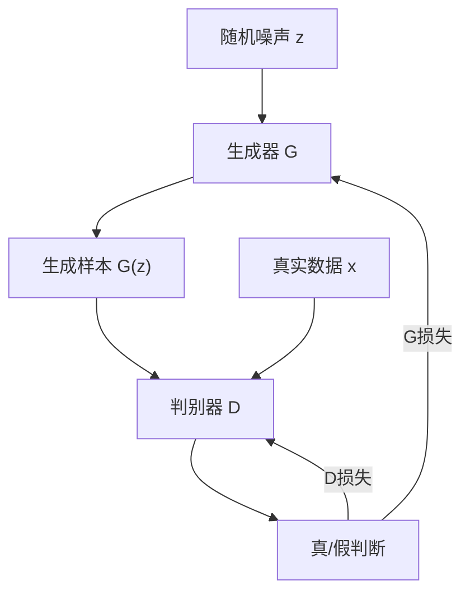

# 4.2 GAN：生成对抗网络

**生成对抗网络**（Generative Adversarial Network, GAN）由 Goodfellow 等人于 2014 年提出，开创了深度生成模型的新范式。GAN 通过生成器和判别器的对抗博弈，隐式地学习数据分布。虽然在图像生成领域已被扩散模型超越，但 GAN 的对抗训练思想仍在判别器设计、超分辨率、图像编辑等领域发挥作用。

想象一下这样一个场景：一位伪造币的造假者和一位银行的鉴定师展开了持久的较量。造假者不断改进印刷技术，试图让假币以假乱真；鉴定师则磨练眼力，努力分辨每一张钞票的真伪。随着博弈的深入，造假者的技术越来越精湛，鉴定师也越来越厉害。最终，当伪造的钞票与真铞完全无法区分时，博弈就达到了平衡。GAN 的工作原理与此如出一辙。

## 4.2.1 对抗训练框架

### 基本思想

GAN 包含两个网络：

**生成器**（Generator, $G$）：从噪声 $\mathbf{z} \sim p_z(\mathbf{z})$ 生成数据 $G(\mathbf{z})$——这就是造假者，从一堆随机的原材料中印刷出"钞票"。

**判别器**（Discriminator, $D$）：判断输入是真实数据还是生成数据——这就是鉴定师，检查每张钞票的真伪。

两者进行**极小极大博弈**（minimax game）：

$$\min_G \max_D V(D, G) = \mathbb{E}_{\mathbf{x} \sim p_{\text{data}}}[\log D(\mathbf{x})] + \mathbb{E}_{\mathbf{z} \sim p_z}[\log(1 - D(G(\mathbf{z})))]$$

其中：
- $G$ 为生成器网络，将随机噪声 $\mathbf{z}$ 映射为生成样本 $G(\mathbf{z})$
- $D$ 为判别器网络，输出输入来自真实数据的概率 $D(\mathbf{x}) \in [0, 1]$
- $p_{\text{data}}$ 为真实数据分布
- $p_z$ 为噪声先验分布，通常取标准正态 $\mathcal{N}(\mathbf{0}, \mathbf{I})$ 或均匀分布
- $\mathbb{E}_{\mathbf{x} \sim p_{\text{data}}}[\log D(\mathbf{x})]$ 为判别器对真实样本的识别能力
- $\mathbb{E}_{\mathbf{z} \sim p_z}[\log(1 - D(G(\mathbf{z})))]$ 为判别器拒绝生成样本的能力

这个极小极大目标的含义是：判别器希望 $V$ 尽可能大（精确区分真假），生成器希望 $V$ 尽可能小（骗过判别器）。第一项鼓励判别器对真实数据输出高分，第二项鼓励判别器对生成数据输出低分。当判别器无法区分二者时，$D(\mathbf{x}) = 0.5$，博弈达到纳什均衡。

### 博弈论视角

- 判别器试图最大化 $V$：正确区分真假样本——鉴定师的目标是找出每一张假币
- 生成器试图最小化 $V$：骗过判别器——造假者的目标是让假币完全通过检验

在纳什均衡点，$G$ 生成的分布等于真实数据分布，$D$ 对任何输入输出 $0.5$（无法区分）。换句话说，鉴定师已经完全无法分辨假币和真币，只能随机猜测。

### 训练过程

交替训练两个网络：

1. **训练判别器**：固定 $G$，最大化 $V$
   - 真实样本的标签为 1，生成样本的标签为 0
   - 类比鉴定师先研究一批真币和假币，磨练自己的眼力
   
2. **训练生成器**：固定 $D$，最小化 $V$
   - 希望生成样本被判别为真（标签 1）
   - 类比造假者根据鉴定师的反馈，调整印刷工艺

实践中，生成器的目标常改为最大化 $\log D(G(\mathbf{z}))$（非饱和损失），梯度更稳定。为什么要这样改？回到造假者的场景：如果造假者只关注"不被发现"，那么当假币质量很差时，"不被发现"的概率几乎为零，反馈信号极弱（梯度消失）。改成直接最大化"被认为是真币的概率"，反馈信号就始终强烈，训练更顺畅。

## 4.2.2 GAN 的数学分析

### 最优判别器

给定生成器 $G$，最优判别器为：

$$D^*_G(\mathbf{x}) = \frac{p_{\text{data}}(\mathbf{x})}{p_{\text{data}}(\mathbf{x}) + p_g(\mathbf{x})}$$

其中 $p_g$ 是生成器诱导的分布。

### 全局最优

将最优判别器代入目标函数：

$$\max_D V(D, G) = -\log 4 + 2 \cdot D_{\text{JS}}(p_{\text{data}} \| p_g)$$

其中 $D_{\text{JS}}$ 是 **JS 散度**（Jensen-Shannon Divergence）。最小化这个目标等价于最小化 $p_g$ 和 $p_{\text{data}}$ 之间的 JS 散度。

当 $p_g = p_{\text{data}}$ 时，JS 散度为 0，达到全局最优。

### 训练不稳定性

GAN 训练的主要挑战是**不稳定性**：

1. **模式坍缩**（Mode Collapse）：生成器只生成少数几种样本。假设造假者发现某一种版本的假币特别容易通过鉴定，他可能就只反复生产这一种，而放弃了其他面额的尝试——这就是模式坍缩。
2. **训练震荡**：判别器和生成器的损失剧烈波动，像两个棋手轮流暗算却谁也占不到便宜。
3. **梯度消失**：当判别器过强时，生成器梯度趋近于零——鉴定师太厉害，造假者根本无从下手改进。

## 4.2.3 重要 GAN 变种

### DCGAN

**深度卷积 GAN**（Deep Convolutional GAN, 2015）建立了稳定训练的架构规范：

- 用卷积替代池化
- 生成器用转置卷积上采样
- 使用 Batch Normalization
- 生成器用 ReLU，输出层用 Tanh
- 判别器用 LeakyReLU

这些设计成为后续 GAN 的基础。

### WGAN

**Wasserstein GAN**（2017）用 Wasserstein 距离替代 JS 散度：

$$W(p_r, p_g) = \inf_{\gamma \in \Pi(p_r, p_g)} \mathbb{E}_{(\mathbf{x}, \mathbf{y}) \sim \gamma}[\|\mathbf{x} - \mathbf{y}\|]$$

其中：
- $p_r$ 为真实数据分布，$p_g$ 为生成器诱导的分布
- $\Pi(p_r, p_g)$ 为边缘分布分别为 $p_r$ 和 $p_g$ 的所有联合分布（传输计划）的集合
- $\gamma(\mathbf{x}, \mathbf{y})$ 表示将 $\mathbf{x}$ 处的质量搬运到 $\mathbf{y}$ 处的方案
- $\|\mathbf{x} - \mathbf{y}\|$ 为搬运距离（成本）
- $\inf$ 表示在所有可行搬运方案中取最优（总成本最小）

Wasserstein 距离有一个直观的解释：想象一堆泥土堆在地上，你要把它掐成另一个形状，Wasserstein 距离就是这个"捏泥工程"所需的最小总搬运量（土方量 × 搬运距离）。与 JS 散度相比，它的优势在于：即使两个分布完全不重叠，Wasserstein 距离仍然能提供有意义的梯度。回想一下模式坍缩的困境——JS 散度在分布不重叠时直接返回常数，造假者收不到任何有用反馈；Wasserstein 距离则始终告诉他"你还差多远"。

实践中通过 Lipschitz 约束的对偶形式实现：

$$\max_{\|D\|_L \leq 1} \mathbb{E}_{\mathbf{x} \sim p_r}[D(\mathbf{x})] - \mathbb{E}_{\mathbf{x} \sim p_g}[D(\mathbf{x})]$$

其中：
- $\|D\|_L \leq 1$ 表示判别器（此处称为“critic”）必须满足 1-Lipschitz 约束，即函数变化率不超过 1
- $\mathbb{E}_{\mathbf{x} \sim p_r}[D(\mathbf{x})]$ 为 critic 对真实样本的平均评分
- $\mathbb{E}_{\mathbf{x} \sim p_g}[D(\mathbf{x})]$ 为 critic 对生成样本的平均评分
- 两者之差即为 Wasserstein 距离的 Kantorovich-Rubinstein 对偶形式

说白了，WGAN 将判别器重新定义为“评分员”（critic），不再输出概率，而是对真假样本打分。Lipschitz 约束保证评分函数足够“平滑”，不会在某些区域急剧变化。关键优势在于：即使 $p_r$ 和 $p_g$ 的支撑完全不重叠，梯度仍然有意义，从根本上解决了原始 GAN 的梯度消失问题。

WGAN 提供了有意义的损失度量，训练更稳定。

### WGAN-GP

**WGAN with Gradient Penalty** 用梯度惩罚替代权重裁剪来强制 Lipschitz 约束：

$$\mathcal{L} = \mathbb{E}[D(G(\mathbf{z}))] - \mathbb{E}[D(\mathbf{x})] + \lambda \mathbb{E}[(\|\nabla_{\hat{\mathbf{x}}} D(\hat{\mathbf{x}})\|_2 - 1)^2]$$

其中：
- 前两项为 WGAN 的 critic 损失（注意符号：此处从 critic 角度写，目标是最小化，因此生成样本分数在前）
- $\hat{\mathbf{x}} = t \cdot \mathbf{x} + (1-t) \cdot G(\mathbf{z})$，$t \sim U(0,1)$，为真实样本与生成样本之间的随机插值
- $\|\nabla_{\hat{\mathbf{x}}} D(\hat{\mathbf{x}})\|_2$ 为 critic 在插值点处的梯度范数
- $\lambda$ 为梯度惩罚系数，通常取 10
- 第三项惩罚梯度范数偏离 1 的程度，以此近似强制 1-Lipschitz 约束

为什么不直接裁剪权重？因为粗暴裁剪会严重限制 critic 的表达能力。梯度惩罚是一种“软”约束：不强制处处满足 Lipschitz 条件，而是在数据流形的关键区域（插值路径）上惩罚违反者。实践表明这比权重裁剪更稳定、性能更好。

### StyleGAN

**StyleGAN**（2019）是高质量图像生成的里程碑：

- **映射网络**：将噪声 $\mathbf{z}$ 映射到中间潜空间 $\mathbf{w}$
- **自适应实例归一化**（AdaIN）：通过 $\mathbf{w}$ 控制每层的风格
- **渐进式训练**：从低分辨率逐步增加
- **噪声注入**：每层注入随机噪声，控制细节

StyleGAN2、StyleGAN3 进一步改进了伪影问题和等变性。

### BigGAN

**BigGAN**（2019）通过扩大规模实现高保真生成：

- 批次大小达 2048
- 类别条件嵌入
- 截断技巧（truncation trick）控制多样性-质量权衡

## 4.2.4 条件 GAN

### 原理

条件 GAN（cGAN）在生成和判别时都加入条件 $\mathbf{c}$：

$$\min_G \max_D \mathbb{E}_{\mathbf{x}, \mathbf{c}}[\log D(\mathbf{x}, \mathbf{c})] + \mathbb{E}_{\mathbf{z}, \mathbf{c}}[\log(1 - D(G(\mathbf{z}, \mathbf{c}), \mathbf{c}))]$$

条件可以是类别标签、文本描述、图像等。

### Pix2Pix

**Pix2Pix**（2017）用于图像到图像的翻译：

- 输入条件图像，输出目标图像
- U-Net 生成器保留输入的空间信息
- PatchGAN 判别器：在局部 patch 上判断真假

应用：边缘→照片、白天→夜晚、草图→渲染图。

### CycleGAN

**CycleGAN**（2017）实现无配对的图像翻译：

两个生成器 $G: X \to Y$，$F: Y \to X$

**循环一致性损失**：

$$\mathcal{L}_{\text{cyc}} = \|F(G(\mathbf{x})) - \mathbf{x}\|_1 + \|G(F(\mathbf{y})) - \mathbf{y}\|_1$$

无需配对数据即可学习域之间的映射。

## 4.2.5 GAN 在现代生成中的角色

### 被扩散模型超越

2022 年后，扩散模型在图像生成质量和多样性上全面超越 GAN。原因：

1. 扩散模型训练更稳定，无需对抗训练
2. 扩散模型的多样性更好，不易模式坍缩
3. 扩散模型与文本条件的结合更自然

### 仍有价值的应用

GAN 在某些场景仍有优势：

**速度**：GAN 生成只需一次前向传播，扩散模型需要多步迭代

**判别器的使用**：
- 图像质量评估
- 对抗训练用于其他模型
- GAN loss 作为辅助损失

**特定任务**：
- 超分辨率（ESRGAN）
- 图像修复
- 风格迁移

### 与扩散模型的结合

一些工作将 GAN 与扩散模型结合：

- **GAN 加速扩散采样**：用 GAN 替代部分扩散步骤
- **扩散 GAN**：在扩散框架中引入对抗损失
- **判别器引导**：用预训练判别器指导扩散生成

## 4.2.6 评估指标

### Inception Score (IS)

$$\text{IS} = \exp\left(\mathbb{E}_{\mathbf{x}}[D_{\text{KL}}(p(y|\mathbf{x}) \| p(y))]\right)$$

用 Inception 网络评估生成图像的质量和多样性，分数越高越好。其含义是：如果每张生成图都能被分类器明确识别（质量好），而且所有生成图涵盖丰富类别（多样性好），IS 分数就会很高。反之，图片模糊或只生成单一类别，分数就会很低。

### Fréchet Inception Distance (FID)

$$\text{FID} = \|\boldsymbol{\mu}_r - \boldsymbol{\mu}_g\|^2 + \text{Tr}(\boldsymbol{\Sigma}_r + \boldsymbol{\Sigma}_g - 2(\boldsymbol{\Sigma}_r \boldsymbol{\Sigma}_g)^{1/2})$$

其中：
- $\boldsymbol{\mu}_r, \boldsymbol{\Sigma}_r$ 为真实图像在 Inception 特征空间中的均值和协方差矩阵
- $\boldsymbol{\mu}_g, \boldsymbol{\Sigma}_g$ 为生成图像在同一特征空间中的均值和协方差矩阵
- $\text{Tr}(\cdot)$ 为矩阵的迹（对角元素之和）
- 第一项衡量分布中心的偏移，第二项衡量分布形状的差异

比较真实图像和生成图像在 Inception 特征空间的分布距离。分数越低越好。举个例子：如果把真实图像的特征分布看作一张城市地图的地标分布，FID 就是衡量生成图像的地标分布与真实地标之间的"偏移度"：平均位置偏了多少，离散程度差了多少。

FID 是目前最常用的生成质量指标，但也有局限（如对训练集过拟合不敏感）。

### 人工评估

- **质量评分**：人类评估生成图像的真实感
- **A/B 测试**：比较不同模型的生成结果
- **图灵测试**：判断图像是真是假

人工评估成本高但更可靠，常用于最终验证。
