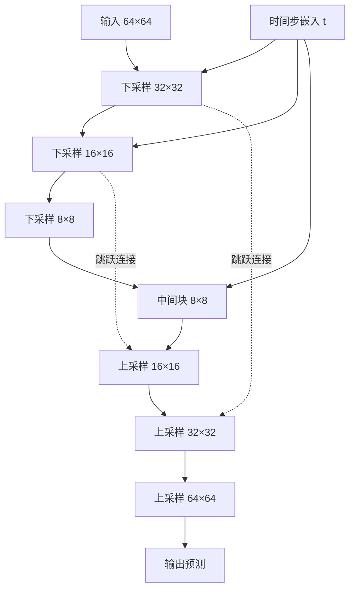
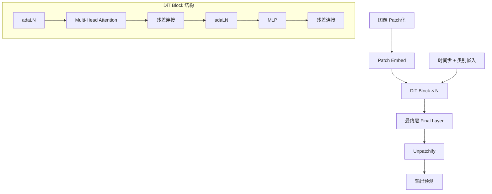

# 4.4 扩散模型结构

扩散模型需要一个能处理带噪图像并预测噪声（或速度、原图）的神经网络。本节介绍两种主流架构：**U-Net**——经典的卷积结构，以及 **DiT**（Diffusion Transformer）——基于 Transformer 的新兴架构。

如果说上一节讨论的是照片修复的"工作流程"（从噪声到清晰的步骤），那么本节讨论的就是修复师手中的"工具"——他用什么样的放大镜、什么样的画笔、怎样组织自己的工作台。不同的工具选择直接影响修复的质量和效率。

## 4.4.1 U-Net 架构

### 起源

**U-Net** 最初由 Ronneberger 等人于 2015 年为医学图像分割设计。其对称的编码器-解码器结构和跳跃连接使其非常适合扩散模型的去噪任务。

假设你要修复一幅巨型壁画。聪明的做法不是眨着每个像素干活，而是先退后几步看整体布局（下采样），确定大块区域的颜色和结构，然后再走近处理细节（上采样）。而且你希望在处理细节时还能参考刚才看到的整体信息——这就是跳跃连接的作用。U-Net 的设计完美地复现了这个"先看全局、再精修细节、始终保持全局视野"的工作流程。

### 基本结构

U-Net 的结构呈 U 形：



```
输入 → [下采样] → [中间块] → [上采样] → 输出
         ↓                           ↑
         └──────── 跳跃连接 ─────────┘
```

**编码器（下采样路径）**：
- 多个下采样块，每块包含卷积层、归一化、激活
- 分辨率逐步降低（如 64→32→16→8）
- 通道数逐步增加（如 64→128→256→512）

**解码器（上采样路径）**：
- 多个上采样块，每块包含转置卷积或插值上采样
- 分辨率逐步恢复
- 通道数逐步减少

**跳跃连接**：
- 编码器的特征图与解码器对应层拼接
- 保留高分辨率的细节信息

### 时间步嵌入

扩散模型需要知道当前的时间步 $t$。U-Net 通过**时间嵌入**注入这一信息。

为什么时间步如此重要？回想照片修复的场景：修复一张只略微褪色的照片（小 $t$）和修复一张几乎变成纯噪声的照片（大 $t$），需要的策略截然不同。前者需要精细调整，后者需要大胆重建。时间嵌入让网络知道"当前照片褪色到了什么程度"，从而采取合适的修复策略。

**正弦嵌入**（类似 Transformer 位置编码）：

$$\text{emb}(t)_{2i} = \sin(t / 10000^{2i/d})$$
$$\text{emb}(t)_{2i+1} = \cos(t / 10000^{2i/d})$$

其中 $t$ 为时间步，$i$ 为维度索引，$d$ 为嵌入向量的总维度。不同频率的正弦/余弦分量让网络能区分不同的时间步，类似于数字的二进制编码——低位变化快，高位变化慢。

时间嵌入通过 MLP 投影后，加到每个残差块中：

```python
class ResBlock(nn.Module):
    def forward(self, x, t_emb):
        h = self.norm1(x)
        h = self.act(h)
        h = self.conv1(h)
        h = h + self.t_proj(t_emb)[:, :, None, None]  # Add time embedding
        h = self.norm2(h)
        h = self.act(h)
        h = self.conv2(h)
        return x + h
```

### 注意力层

在低分辨率层（如 16×16、8×8）加入自注意力层，捕获全局依赖：

$$\text{Attention}(\mathbf{Q}, \mathbf{K}, \mathbf{V}) = \text{softmax}\left(\frac{\mathbf{Q}\mathbf{K}^\top}{\sqrt{d}}\right)\mathbf{V}$$

其中：
- $\mathbf{Q}, \mathbf{K}, \mathbf{V}$ 分别为查询、键、值矩阵，由输入特征经线性变换得到
- $d$ 为每个注意力头的维度，$\sqrt{d}$ 为缩放因子，防止点积过大导致 softmax 饱和
- 在扩散模型中，自注意力让不同空间位置的特征相互交互，捕获远距离依赖关系

对于图像，将空间维度展平为序列维度。

### Stable Diffusion 的 U-Net

Stable Diffusion 在 latent space（64×64×4）上操作，U-Net 结构：

- **输入**：64×64×4 潜向量 + 时间嵌入 + 文本嵌入
- **下采样**：64→32→16→8
- **中间块**：包含 ResBlock 和 Attention
- **上采样**：8→16→32→64
- **输出**：64×64×4 噪声预测

文本条件通过**交叉注意力**注入：Query 来自图像特征，Key/Value 来自文本编码器（CLIP）的输出。

## 4.4.2 DiT：Diffusion Transformer

### 动机

U-Net 的设计来自图像分割，并非专门为扩散模型设计。随着 Transformer 在各领域的成功，自然的问题是：能否用纯 Transformer 替代 U-Net？

这就像从传统的专用工具升级到通用多功能工具。U-Net 是一把为图像处理量身定做的手术刀，而 Transformer 更像一把万能的瑞士军刀——不限场景，越大越强。

**DiT**（Diffusion Transformers, 2023）给出了肯定答案，并在 ImageNet 上达到了新的 SOTA。

### 图像 Patch 化

DiT 将图像分割为不重叠的 patch，每个 patch 线性投影为 token：

$$\mathbf{z}_i = \text{Linear}(\text{Patch}_i)$$

这个过程就像把一张大图切成很多小方块，每个方块变成一个"单词"，Transformer 就可以像处理文本一样处理图像了。对于 256×256 图像、16×16 patch，得到 $(256/16)^2 = 256$ 个 token。

如果在 latent space 操作（32×32×4），2×2 patch 得到 256 个 token。

### 条件注入方式

DiT 探索了多种条件（时间步 $t$、类别 $c$）注入方式：

**In-context conditioning**：将条件作为额外 token 拼接到序列中

**Cross-attention**：类似 U-Net，通过交叉注意力注入

**Adaptive Layer Norm（adaLN）**：用条件调制 LayerNorm 的参数

$$\text{adaLN}(\mathbf{h}, \mathbf{c}) = \gamma(\mathbf{c}) \odot \frac{\mathbf{h} - \mu}{\sigma} + \beta(\mathbf{c})$$

其中：
- $\mathbf{h}$ 为待归一化的隐藏特征
- $\mu, \sigma$ 为 $\mathbf{h}$ 的均值和标准差（标准 LayerNorm 计算）
- $\gamma(\mathbf{c}), \beta(\mathbf{c})$ 为由条件向量 $\mathbf{c}$（时间步 + 类别嵌入）生成的缩放和偏移参数
- $\odot$ 为逐元素相乘

背后的含义是：普通 LayerNorm 的缩放/偏移是固定的可学习参数，而 adaLN 将它们变为条件的函数。同一个 Transformer 层因此能根据不同的时间步和类别调整行为——小 $t$ 时做精细调整，大 $t$ 时做大幅度重建。

**adaLN-Zero**：初始化 $\gamma = 1, \beta = 0$，使网络初始行为接近恒等映射。这是 DiT 的默认选择。

### DiT 架构细节



```
Patch Embed → [DiT Block × N] → Final Layer → Unpatchify → 输出
```

每个 DiT Block：
1. adaLN → Multi-Head Attention → 残差连接
2. adaLN → MLP → 残差连接

最终层输出与输入相同维度的预测（噪声或速度）。

### 规模效应

DiT 展现了清晰的**规模效应**（scaling）：

| 模型 | 参数量 | FID（ImageNet 256×256）|
|------|--------|------------------------|
| DiT-S | 33M | 68.4 |
| DiT-B | 130M | 43.5 |
| DiT-L | 458M | 23.3 |
| DiT-XL | 675M | 9.62 |

更大的模型、更多的计算持续带来性能提升。这与大语言模型的 scaling law 一致。

举个例子：从DiT-S 到 DiT-XL，参数量增长约 20 倍，FID 从 68.4 降到 9.62——这就像从一位学徒级修复师升级为国宝级大师，只要给得起工资（算力），作品质量就能持续提升。这种可预测的扩展性是 DiT 相对于 U-Net 的重要优势。

## 4.4.3 U-Net vs DiT

| 特性 | U-Net | DiT |
|------|-------|-----|
| 归纳偏置 | 强（卷积的局部性、平移等变性） | 弱 |
| 多尺度处理 | 内置（下/上采样） | 需要显式设计 |
| 长程依赖 | 需要注意力辅助 | 天然支持 |
| 参数效率 | 中等 | 较低（需要更多参数） |
| 扩展性 | 有限 | 好（遵循 Transformer scaling） |

### 选择建议

不同场景下的架构选择，就像根据预算和需求挑选工具：

- **资源受限**：U-Net 更轻量，类似选一把轻便的工具刀
- **追求极致性能**：DiT 更有潜力，类似投资一套顶级专业设备
- **已有 U-Net 预训练**：继续使用 U-Net（如 Stable Diffusion）——不必推倒重来
- **新项目**：DiT 是更现代的选择，尤其当你有足够的算力预算时

## 4.4.4 多尺度架构

### U-ViT

**U-ViT** 将 U-Net 的多尺度结构与 ViT 结合：

- 编码器使用 ViT blocks，同时下采样
- 解码器使用 ViT blocks，同时上采样
- 跳跃连接连接相同分辨率的层

### Hourglass Diffusion

**Hourglass** 架构在不同分辨率上使用不同配置的 Transformer：

- 低分辨率：大模型，处理全局结构
- 高分辨率：小模型，处理局部细节

这平衡了计算效率和生成质量。

## 4.4.5 高效架构

### 深度可分离卷积

在 U-Net 中用**深度可分离卷积**替代标准卷积，减少参数量和计算量。

### 稀疏注意力

在 Transformer 架构中使用**窗口注意力**或**稀疏注意力**，降低高分辨率时的计算成本。

### 混合架构

结合卷积和 Transformer 的优势：

- 高分辨率层使用卷积（高效、强归纳偏置）
- 低分辨率层使用 Transformer（全局建模）

## 4.4.6 文本条件的注入

### CLIP 文本编码器

Stable Diffusion 使用 CLIP 的文本编码器将 prompt 编码为向量序列。

你可能会问：为什么不能直接把文本字符串输入模型？这就像你用中文告诉一位只懂数字的修复师"请修复这张照片"——他听不懂。需要一位翻译将文本指令转换成修复师能理解的"数字语言"（向量表示）。CLIP 编码器就扮演了这个翻译角色。

### 交叉注意力

在 U-Net/DiT 的每个注意力层中加入交叉注意力：

```python
# Self-attention
h = self.self_attn(h)

# Cross-attention with text
h = self.cross_attn(q=h, kv=text_embeddings)
```

Query 来自图像特征，Key/Value 来自文本嵌入。

### T5 编码器

更大的文本编码器（如 T5-XXL）可以提供更丰富的语义信息，被 Imagen、SDXL 等使用。

### 双编码器

SDXL 同时使用两个文本编码器：
- CLIP ViT-L：提供对比学习的语义
- OpenCLIP ViT-G：提供更大容量的表示

两者的输出拼接后用于交叉注意力。

## 4.4.7 代码示例

简化的 DiT Block 实现：

```python
class DiTBlock(nn.Module):
    def __init__(self, dim, n_heads):
        super().__init__()
        self.norm1 = nn.LayerNorm(dim, elementwise_affine=False)
        self.attn = nn.MultiheadAttention(dim, n_heads, batch_first=True)
        self.norm2 = nn.LayerNorm(dim, elementwise_affine=False)
        self.mlp = MLP(dim, dim * 4)
        
        # adaLN parameters
        self.adaLN_modulation = nn.Sequential(
            nn.SiLU(),
            nn.Linear(dim, 6 * dim)
        )
    
    def forward(self, x, c):
        # c: conditioning (time + class embedding)
        shift_msa, scale_msa, gate_msa, shift_mlp, scale_mlp, gate_mlp = \
            self.adaLN_modulation(c).chunk(6, dim=-1)
        
        # Attention block
        h = self.norm1(x)
        h = h * (1 + scale_msa.unsqueeze(1)) + shift_msa.unsqueeze(1)
        h = self.attn(h, h, h)[0]
        x = x + gate_msa.unsqueeze(1) * h
        
        # MLP block
        h = self.norm2(x)
        h = h * (1 + scale_mlp.unsqueeze(1)) + shift_mlp.unsqueeze(1)
        h = self.mlp(h)
        x = x + gate_mlp.unsqueeze(1) * h
        
        return x
```

这展示了 adaLN-Zero 的核心机制：用条件向量调制每个归一化层的缩放、偏移和门控。这种设计的巧妙之处在于：初始化时所有门控值为零，意味着网络一开始就是一个恒等映射（输入等于输出），然后在训练中逐渐学会如何利用条件信息。这就像一位新修复师上岗，最安全的策略是先"什么都不做"，然后逐渐学会什么时候该动手、动多少。
