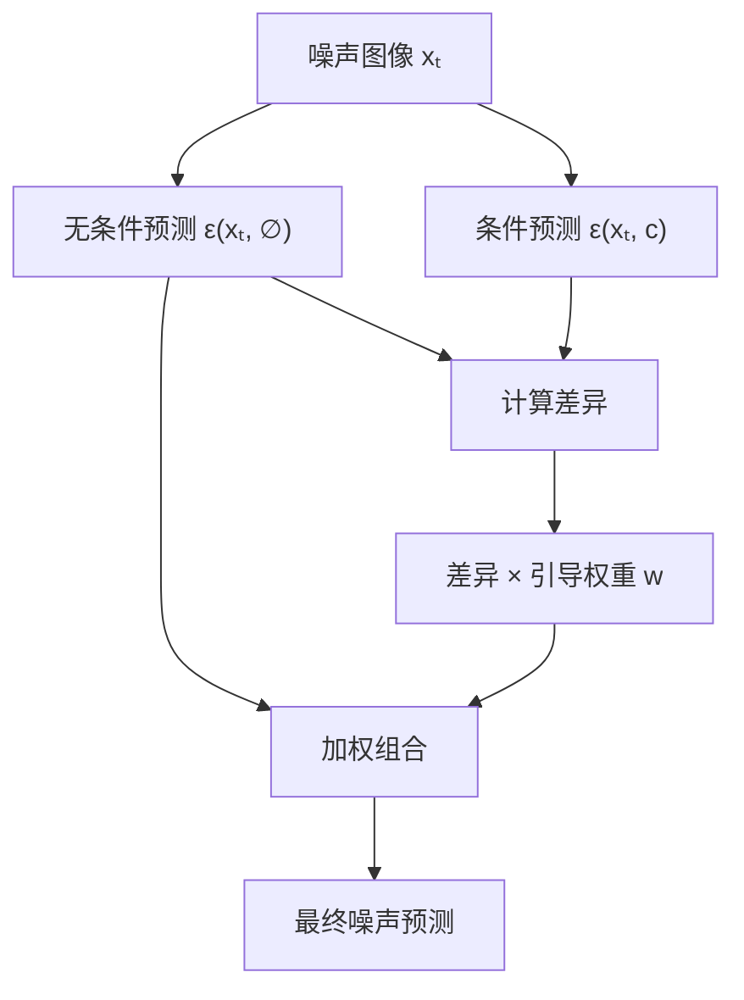
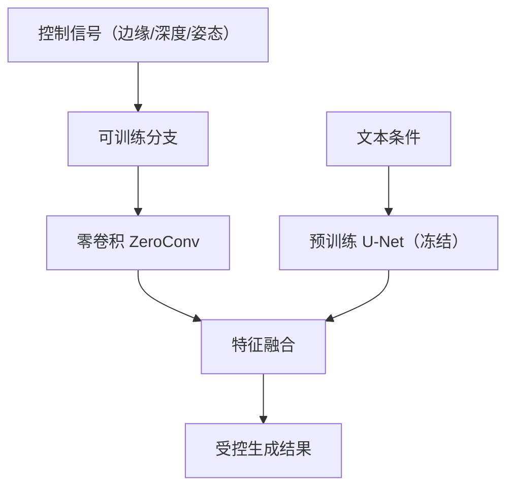

# 4.5 常用技术

扩散模型的基础架构确定后，如何让生成结果更好地符合用户意图？如何实现更精细的控制？本节讨论两项关键技术：**分类器自由引导**（Classifier-Free Guidance, CFG）用于增强条件效果，**ControlNet** 用于引入额外的空间控制信号。

前面几节我们讨论了照片修复的原理和工具。但在实际工作中，客户往往不只是说"请修复这张照片"，而是有具体要求："请把背景调成暖色调"、"保留人物姿势但换一套衣服"、"只修复左上角被水泡过的部分"。本节讨论的技术，正是让模型能够听懂并执行这类精细指令的关键。

## 4.5.1 分类器引导（Classifier Guidance）

### 条件生成的困境

条件扩散模型 $p_\theta(\mathbf{x}_0 | c)$ 的目标是生成符合条件 $c$ 的样本。直接训练条件模型时，常面临一个问题：生成结果虽然合理，但与条件的相关性不够强。模型倾向于生成"安全"的、模糊的输出，而非条件所期望的特定样本。

假设你去餐厅点菜，告诉庖师"我要麻辣口味"。如果庖师只是模糊地听了一下，可能端上来一盘微微有点辣的家常菜——安全但不过瘾。而分类器引导的作用，就是在旁边安排一位美食评委，每做一步都提醒庖师："再麻一点！再辣一点！"——把生成结果往条件要求的方向使劲推。

从贝叶斯角度看，条件分布可以分解为：

$$p(\mathbf{x}_0 | c) \propto p(\mathbf{x}_0) \cdot p(c | \mathbf{x}_0)$$

其中 $p(\mathbf{x}_0)$ 是无条件先验，$p(c | \mathbf{x}_0)$ 是似然（分类器概率）。

### 分类器引导的原理

Dhariwal 和 Nichol（2021）提出**分类器引导**：在采样过程中，用预训练分类器的梯度修正噪声预测。

设 $p_\phi(c | \mathbf{x}_t)$ 是在噪声数据 $\mathbf{x}_t$ 上训练的分类器。带引导的得分函数为：

$$\nabla_{\mathbf{x}_t} \log p(\mathbf{x}_t | c) = \nabla_{\mathbf{x}_t} \log p(\mathbf{x}_t) + \gamma \nabla_{\mathbf{x}_t} \log p_\phi(c | \mathbf{x}_t)$$

其中：
- $\nabla_{\mathbf{x}_t} \log p(\mathbf{x}_t)$ 为无条件得分函数，由扩散模型提供
- $\nabla_{\mathbf{x}_t} \log p_\phi(c | \mathbf{x}_t)$ 为分类器在噪声数据上的梯度，指向更符合条件 $c$ 的方向
- $\gamma > 0$ 为引导强度，控制条件信号的放大程度

这实质上是贝叶斯规则在得分函数层面的体现。无条件得分确保生成结果“像真实图像”，分类器梯度将结果推向“更符合条件”的方向。$\gamma$ 越大，条件性越强，但可能牺牲图像的自然性和多样性。

### 实现细节

在 DDPM 框架下，修正后的噪声预测为：

$$\tilde{\boldsymbol{\epsilon}}_\theta(\mathbf{x}_t, t, c) = \boldsymbol{\epsilon}_\theta(\mathbf{x}_t, t) - \sqrt{1 - \bar{\alpha}_t} \cdot \gamma \nabla_{\mathbf{x}_t} \log p_\phi(c | \mathbf{x}_t)$$

分类器引导的问题：

1. **需要额外分类器**：必须在噪声数据上训练分类器，增加复杂度
2. **分类器质量**：分类器的性能直接影响引导效果
3. **梯度计算开销**：每步采样需要计算分类器梯度

## 4.5.2 分类器自由引导（CFG）

### 核心思想

Ho 和 Salimans（2022）提出**分类器自由引导**（Classifier-Free Guidance, CFG），无需额外分类器即可实现引导效果。

关键洞察：条件模型和无条件模型的输出差异本身就蕴含了条件信息。将这个差异放大，就能增强条件效果。

换个角度看，这就像你有两份菜：一份是"随便烧"的家常菜，一份是"麻辣口味"的菜。两者的差别就是"麻辣"的那部分。CFG 做的是：把这个差别放大 $w$ 倍，加到随便菜上，就得到了更加麻辣的结果。

形式上，CFG 的得分函数为：

$$\tilde{\boldsymbol{\epsilon}}_\theta(\mathbf{x}_t, t, c) = \boldsymbol{\epsilon}_\theta(\mathbf{x}_t, t, \varnothing) + w \cdot (\boldsymbol{\epsilon}_\theta(\mathbf{x}_t, t, c) - \boldsymbol{\epsilon}_\theta(\mathbf{x}_t, t, \varnothing))$$

其中：
- $\boldsymbol{\epsilon}_\theta(\mathbf{x}_t, t, c)$ 为以条件 $c$（如文本提示）为输入的噪声预测
- $\boldsymbol{\epsilon}_\theta(\mathbf{x}_t, t, \varnothing)$ 为以空条件为输入的噪声预测（无条件生成）
- $w$ 为引导权重（guidance scale），控制条件信号的放大倍数
- $\varnothing$ 表示空条件（如空字符串或特殊 token）

这意味着：CFG 将“有条件”与“无条件”的差异进行外推放大。这个差异代表了“条件 $c$ 到底贡献了什么”，乘以 $w$ 就是把这个贡献放大 $w$ 倍。$w=1$ 是正常条件生成，$w>1$ 则是“过度引导”——让结果牢牢地服从条件要求。

整理后：

$$\tilde{\boldsymbol{\epsilon}}_\theta = (1 - w) \cdot \boldsymbol{\epsilon}_\theta(\mathbf{x}_t, t, \varnothing) + w \cdot \boldsymbol{\epsilon}_\theta(\mathbf{x}_t, t, c)$$

- $w = 1$：退化为标准条件生成
- $w > 1$：增强条件效果（过度引导，overshooting）
- $w = 0$：无条件生成

### 训练策略

CFG 的巧妙之处在于：用同一个模型实现条件和无条件生成。训练时，以一定概率（通常 10-20%）将条件 $c$ 替换为空条件 $\varnothing$：

$$c_{\text{train}} = \begin{cases} \varnothing & \text{with probability } p_{\text{uncond}} \\ c & \text{otherwise} \end{cases}$$

对于文本条件，空条件通常是空字符串 "" 或特殊 token。对于类别条件，空条件可以是专门的"无类别"embedding。

### 效果与权衡

CFG 的效果显著：

- **多样性-保真度权衡**：$w$ 越大，生成结果与条件越相关，但多样性下降。这就像调辣度——越辣越“纯粹”，但可选的口味谱也越窄。
- **典型取值**：文生图任务中，$w = 7.5$ 是常见选择
- **计算开销**：每步需要两次前向传播（条件和无条件）——相当于每步都要同时做两盘菜，然后取差值

CFG 已成为条件扩散模型的标准配置，Stable Diffusion、DALL-E 2、Imagen 等主流模型都依赖 CFG。

### 负向提示词

CFG 框架自然支持**负向提示词**（Negative Prompt）。将公式中的空条件替换为负向条件 $c_{\text{neg}}$：

$$\tilde{\boldsymbol{\epsilon}}_\theta = \boldsymbol{\epsilon}_\theta(\mathbf{x}_t, t, c_{\text{neg}}) + w \cdot (\boldsymbol{\epsilon}_\theta(\mathbf{x}_t, t, c) - \boldsymbol{\epsilon}_\theta(\mathbf{x}_t, t, c_{\text{neg}}))$$

负向提示词指定不希望出现的内容（如 "blurry, low quality, distorted"），模型会主动避开这些特征。

想象一下你告诉庖师："我要麻辣口味，但绝对不要放香菜"。正向提示词告诉模型想要什么，负向提示词告诉模型绝对不要什么。两者配合使用，可以更精确地控制生成结果。在实践中，很多用户发现合理的负向提示词对图像质量的提升甚至超过了调节 $w$ 值。

## 4.5.3 ControlNet

### 精细控制的需求

CFG 增强了文本条件的效果，但文本描述的精度有限。"一个人站在左边"——具体站在哪里？姿势如何？背景细节？这些需要更精细的空间控制信号。

你可能遇到过这种情况：只用语言描述你想要的图片，永远都与心中所想有偏差。就像你只用文字指导装修工人："沙发放在窗户旁边"——到底是窗户左边还是右边？离窗多远？此时你希望能直接画一张平面图给他看。ControlNet 就是这张"平面图"。

**ControlNet**（Zhang et al., 2023）引入额外的控制条件——边缘图、深度图、人体姿态、语义分割等——实现像素级的空间控制。

### 架构设计

ControlNet 的核心思想是**零卷积**（Zero Convolution）和**锁定副本**（Locked Copy）。

**锁定副本**：将预训练 U-Net 编码器完整复制一份，作为 ControlNet 的主干。复制的权重在训练中冻结，保留原模型的生成能力。

**可训练分支**：ControlNet 新增一个可训练的分支，处理控制信号 $c_f$（如 Canny 边缘图）。

**零卷积连接**：用权重初始化为零的 $1 \times 1$ 卷积连接 ControlNet 和原模型。训练初期，零卷积输出为零，不影响原模型；随着训练进行，零卷积学习到如何融合控制信号。

举个例子：这就像给一位经验丰富的画家配一位新助手。一开始助手"什么都不做"（零卷积输出为零），不会干扰画家的工作。随着助手逐渐学习，他开始能够根据参考图（控制信号）提供越来越有用的建议，而画家原本的才华完全保留。

形式上，设原 U-Net 某层输出为 $\mathbf{y}$，ControlNet 对应层输出为 $\mathbf{y}_c$。融合方式为：

$$\mathbf{y}_{\text{out}} = \mathbf{y} + \text{ZeroConv}(\mathbf{y}_c)$$

### 控制信号类型

ControlNet 支持多种控制信号：

**边缘检测**：
- Canny 边缘：低级边缘特征
- HED 边缘：更柔和的边缘
- 适合：保持物体轮廓

**深度信息**：
- MiDaS 深度估计
- 适合：控制前后景关系、3D 结构

**人体姿态**：
- OpenPose 关键点
- 适合：控制人物姿势、动作

**语义分割**：
- 像素级类别标注
- 适合：控制场景布局

**法线图**：
- 表面朝向信息
- 适合：精细的 3D 细节

### 训练与推理

**训练**：
1. 冻结原 U-Net 参数
2. 训练 ControlNet 分支和零卷积
3. 损失函数与标准扩散模型相同

**推理**：
1. 用控制信号提取器（如 Canny 检测器）处理参考图
2. 控制信号输入 ControlNet
3. 与文本条件结合，进行正常采样

**多 ControlNet 组合**：多个 ControlNet 可以同时使用，如边缘 + 深度 + 姿态。各 ControlNet 的输出加权融合：

$$\mathbf{y}_{\text{out}} = \mathbf{y} + \sum_i w_i \cdot \text{ZeroConv}_i(\mathbf{y}_{c_i})$$

### 与其他方法的比较

**T2I-Adapter**：更轻量的替代方案，只添加小型适配器模块，但控制精度略低。

**IP-Adapter**：针对图像提示（Image Prompt）设计，通过交叉注意力融合参考图像特征，适合风格迁移、角色一致性。

**InstantID / PhotoMaker**：专注于人脸/人物一致性，融合人脸识别特征。

## 4.5.4 其他实用技术

### 图像到图像（Image-to-Image）

**SDEdit**：从噪声图像开始，而非纯噪声。给参考图像添加一定程度噪声，再去噪。噪声越多，生成结果与参考图差异越大。

假设你想把一张素描草图变成逼真的照片。SDEdit 的做法是：先给草图加一些噪声（让它变得模糊），然后用扩散模型去噪。去噪过程中，模型会保留草图的大致结构，同时填充真实感的细节。加的噪声越少，结果越接近原草图；加的越多，模型发挥的空间越大，可能走得更远。

形式上，从 $t = t_{\text{start}}$ 而非 $t = T$ 开始采样：

$$\mathbf{x}_{t_{\text{start}}} = \sqrt{\bar{\alpha}_{t_{\text{start}}}} \mathbf{x}_{\text{ref}} + \sqrt{1 - \bar{\alpha}_{t_{\text{start}}}} \boldsymbol{\epsilon}$$

### 图像修复（Inpainting）

对于 Inpainting 任务，需要保持非遮罩区域不变。常见策略：

**替换策略**：每步去噪后，将非遮罩区域替换为原图加噪版本：

$$\mathbf{x}_{t-1} = \mathbf{m} \odot \mathbf{x}_{t-1}^{\text{pred}} + (1 - \mathbf{m}) \odot \mathbf{x}_{t-1}^{\text{ref}}$$

其中 $\mathbf{m}$ 是遮罩（1 表示需要生成的区域）。

**专用 Inpainting 模型**：将遮罩和原图作为额外输入通道，模型直接学习 Inpainting 任务。

### 图像超分辨率（Super-Resolution）

级联扩散模型：先生成低分辨率图像，再逐级上采样。每一级都是条件扩散模型，以低分辨率图像为条件。

Stable Diffusion 的做法：在潜空间工作本身就是一种压缩，解码器负责上采样到像素空间。

### 多步精炼（Refinement）

SDXL 引入了**精炼器**（Refiner）模型：基础模型生成后，精炼器在低噪声阶段进一步优化细节。这就像写作时先写完草稿，再请一位编辑专门打磨用词和细节——两个阶段各司其职，最终作品比一次性完成的更加精细。
