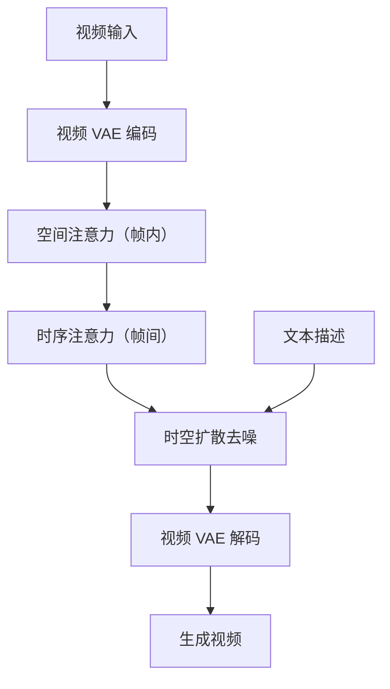

# 4.6 视频生成技术

视频是图像在时间维度的扩展。从技术角度看，视频生成需要解决图像生成的所有问题，外加**时序一致性**这一核心挑战。本节讨论将扩散模型扩展到视频域的主要方法。

想象你小时候玩过的翻页动画（flipbook）：在一叠纸的每一页画一个略有不同的图案，快速翻动时就能看到流畅的动画。视频生成的核心挑战与此完全一致：每一页（帧）都必须足够精美，而且相邻页之间必须平滑过渡——哪怕只有一页画得走样，观众都会立刻察觉。

## 4.6.1 视频生成的挑战

### 维度爆炸

一段 4 秒、24fps、512×512 分辨率的视频包含 96 帧，数据量是单张图像的 96 倍。直接在像素空间建模视频，计算和内存开销难以承受。

假设你要画一本 96 页的翻页动画，每页都是一张 512×512 的精细插图——工作量是画单张插图的 96 倍。而且你不能随便画，每一页都必须与前后页保持连贯。这就是视频生成面临的双重压力。

### 时序一致性

视频中的物体需要在帧间保持一致：
- **几何一致性**：同一物体的形状、大小不应剧烈跳变
- **纹理一致性**：颜色、纹理应平滑过渡
- **运动连贯性**：运动轨迹应符合物理规律
- **语义一致性**：物体不应凭空出现或消失

回到翻页动画的比喻：如果一个小人在第 10 页穿蓝色衬衫，第 11 页突然变成红色，观众会很困惑。如果小人在第 20 页向右走，第 21 页却突然出现在画面左侧，流畅感就会被破坏。图像模型逐帧独立生成，无法保证这些一致性——就像让 96 个不同的画家各自画一页，结果自然不连贯。

### 运动建模

静态图像描述"是什么"，视频还需描述"怎么动"。运动有不同粒度：
- **相机运动**：平移、旋转、缩放
- **物体运动**：刚体运动、非刚体变形
- **场景动态**：光影变化、流体运动

## 4.6.2 从图像到视频的扩展

### 时序层插入



最直接的方法是在预训练图像模型中插入处理时序的模块。

这就像你已经有一位擅长画单幅插图的画家，现在要让他画翻页动画。不需要重新培训一位动画师，只需给这位画家配一个"时间感知"模块——让他在画每一页时能参考前后页的内容。

**时序注意力**（Temporal Attention）：在原有空间注意力之后，添加沿时间维度的注意力层。设视频特征为 $\mathbf{X} \in \mathbb{R}^{T \times H \times W \times C}$：

1. 空间注意力：在每帧内独立计算，$T$ 帧共享参数
2. 时序注意力：对每个空间位置 $(h, w)$，在 $T$ 帧之间计算注意力

时序注意力允许模型学习帧间依赖，但计算复杂度为 $O(T^2)$。

**3D 卷积**：将 2D 卷积核扩展为 3D，直接在时空上卷积。1×3×3 卷积处理空间，3×1×1 卷积处理时序。

### 因果时序建模

视频生成通常是自回归的：先生成第 1 帧，基于第 1 帧生成第 2 帧，依此类推。这要求时序注意力是**因果的**（Causal）：第 $t$ 帧只能看到前 $t-1$ 帧。

这就像画翻页动画时的自然顺序：你画第 5 页时，可以参考前 4 页的内容，但看不到后面还没画的页。因果掩码确保了这种单向的信息流。

因果掩码（Causal Mask）：

$$\text{Mask}_{i,j} = \begin{cases} 0 & \text{if } i \geq j \\ -\infty & \text{if } i < j \end{cases}$$

其中 $i$ 为当前帧索引，$j$ 为被注意帧索引。$-\infty$ 经 softmax 后变为零权重，即完全屏蔽未来帧的信息。

从实际意义来看，因果掩码确保生成过程的时序因果性——第 $i$ 帧只能参考已经生成的帧（$j \leq i$），不能“偷看”未来还未生成的帧。这与自回归语言模型中的因果注意力完全类似。

### 潜空间视频模型

与图像类似，现代视频模型在潜空间工作。视频 VAE 将视频编码为时空潜变量：

$$\mathbf{z} = \text{Encoder}(\mathbf{x}) \in \mathbb{R}^{t \times h \times w \times c}$$

其中时序压缩率通常为 4-8（96 帧 → 12-24 帧潜变量），空间压缩率为 8（512 → 64）。总压缩率可达 256-512 倍。

举个例子：原本需要画 96 页的精细插图，现在只需在一本小本子上画 12-24 页的草图，最后用解码器放大成正式版。这大幅降低了生成视频的计算成本。

## 4.6.3 代表性模型

### Video Diffusion Models (VDM)

Ho et al.（2022）提出的 VDM 是早期代表作。关键设计：

1. **联合图像-视频训练**：同时用图像和视频训练，图像视为单帧视频
2. **时空分解**：空间层在帧内处理，时序层在帧间传递信息
3. **自回归生成长视频**：条件于前 $k$ 帧，生成后续帧

### Stable Video Diffusion (SVD)

Stability AI 的 SVD 基于 Stable Diffusion 扩展：

1. **图像到视频**：以单张图像为条件，生成短视频
2. **微调策略**：先在大规模视频数据上微调图像模型，再精调时序层
3. **运动强度控制**：通过运动桶（Motion Bucket）控制生成视频的运动幅度

### Sora

OpenAI 的 Sora（2024）代表了视频生成的前沿。公开信息显示其关键技术包括：

1. **时空 Patch**：将视频视为时空 patch 序列，用 Transformer 统一处理
2. **可变分辨率/时长**：支持不同宽高比、不同时长的视频
3. **大规模训练**：海量视频-文本数据，大模型规模

### CogVideoX / HunyuanVideo

国内开源的视频生成模型，采用类似架构：

- DiT 作为主干
- 3D VAE 压缩时空
- 多模态条件（文本、图像）

## 4.6.4 关键技术细节

### 运动模块设计

**AnimateDiff**：仅训练时序层，保持空间层冻结。可以将任何微调过的图像模型变成视频模型，继承其风格和能力。

这是一个非常巧妙的思路：假设你有一位擅长画水彩风景的画家，你不需要重新教他画画，只需给他加一个"时间节奏感"的培训，他就能把原来的水彩风景画变成水彩风景动画。画风不变，但多了时间维度的表现力。

时序层的典型设计：
```
Input: [B, T, H, W, C]
Reshape: [B*H*W, T, C]  # 每个空间位置独立
Temporal Self-Attention
Reshape: [B, T, H, W, C]
```

### 长视频生成

短视频模型（通常 16-64 帧）如何生成长视频？

这就像翻页动画的纸张数量有限——你只能一次画 16-64 页，但想讲一个更长的故事。解决方法有几种：

**滑动窗口**：用重叠窗口逐段生成，重叠部分融合：
- 生成帧 1-16
- 基于帧 9-16，生成帧 9-24
- 重叠区域（9-16）加权平均

**自回归扩展**：条件于已生成的帧，逐步扩展。需要处理误差累积问题——就像传话游戏一样，每传一次都可能引入微小的失真，传得越远误差越大。

**层次化生成**：先生成稀疏关键帧，再插值填充中间帧。这就像先画动画的关键姿势（关键帧），再填充过渡动作（中间帧）——专业动画师的标准工作流程。

### 运动控制

除了文本描述，视频生成还需要运动控制：

**轨迹控制**：指定物体的运动路径（如鼠标轨迹）

**相机控制**：指定相机运动（平移、旋转、缩放）

**姿态控制**：输入关键帧的人体姿态序列

**光流条件**：用光流图描述运动场

### 时序一致性增强

**共享噪声**：相邻帧使用相关的初始噪声，而非独立采样。这就像画翻页动画时，相邻页的底稿应当相似，而不是每页都从空白纸开始。

**时序超分辨率**：先生成低帧率视频，再用专门模型插帧——类似先画关键帧再填补过渡的思路。

**后处理**：用光流估计检测不一致区域，重新生成

## 4.6.5 视频生成的评估

### 定量指标

**FVD（Fréchet Video Distance）**：视频版的 FID，用预训练视频分类器提取特征

**CLIPSIM**：文本-视频相似度，衡量生成结果与文本描述的一致性

**运动质量**：光流平滑度、运动强度分布

### 定性评估

视频生成的评估更依赖人工评价：
- 视觉质量
- 时序一致性
- 运动自然度
- 文本相关性

## 4.6.6 图像与视频的统一

### 任意模态生成

视频生成模型可以统一处理多种任务：
- 文本→视频
- 图像→视频
- 视频→视频（风格转换、超分辨率）
- 视频补全（首尾帧→完整视频）

### 世界模型

视频生成的终极目标是**世界模型**：学习现实世界的物理规律和因果关系。Sora 展示的物理模拟能力（物体碰撞、流体运动）暗示了这一方向的可能性。

不妨设想这样一幅图景：未来的视频模型不仅能画出漂亮的翻页动画，还能理解画中世界的规则——球照样会弹起，水倒了会流淌，布料会随风飘动。从"会画画"到"懂物理"，是视频生成领域的重大跳跃。

世界模型的应用：
- 自动驾驶模拟
- 机器人策略学习
- 物理推理

### 与大语言模型的融合

视频生成正在与大语言模型融合：
- 用 LLM 理解复杂文本指令
- 用 LLM 规划视频内容（分镜）
- 用视频模型作为 LLM 的"想象力"模块
