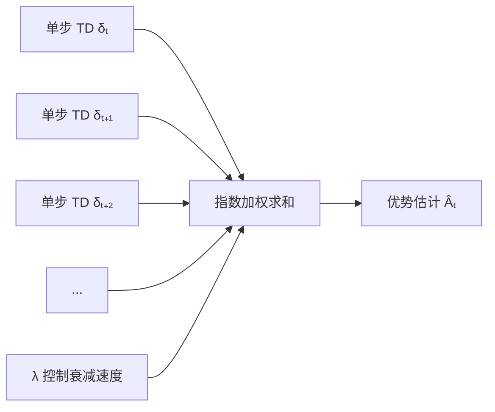

# 5.2 广义优势估计

**广义优势估计**（Generalized Advantage Estimation, GAE）是 Schulman et al.（2016）提出的方差缩减技术，在偏差和方差之间取得灵活的平衡。GAE 已成为现代策略梯度算法（如 PPO）的标准组件，对 RLHF 的稳定训练至关重要。

## 5.2.1 优势估计的偏差-方差权衡

### 不同的优势估计器

给定轨迹 $(s_0, a_0, r_0, s_1, a_1, r_1, \ldots)$，可以用不同方式估计优势 $A(s_t, a_t)$：

**1-步估计**（TD 误差）：

$$\hat{A}_t^{(1)} = r_t + \gamma V(s_{t+1}) - V(s_t) = \delta_t$$

- 偏差：高（依赖 $V$ 的准确性）
- 方差：低（只涉及一步奖励）

**$n$-步估计**：

$$\hat{A}_t^{(n)} = r_t + \gamma r_{t+1} + \cdots + \gamma^{n-1} r_{t+n-1} + \gamma^n V(s_{t+n}) - V(s_t)$$

$$= \sum_{k=0}^{n-1} \gamma^k r_{t+k} + \gamma^n V(s_{t+n}) - V(s_t)$$

- 偏差：随 $n$ 增大而降低
- 方差：随 $n$ 增大而升高

**蒙特卡洛估计**（$n \to \infty$）：

$$\hat{A}_t^{(\infty)} = \sum_{k=0}^{\infty} \gamma^k r_{t+k} - V(s_t)$$

- 偏差：零（使用真实累积奖励）
- 方差：最高

想象一下你在评价一部电影。1-步估计就像只看了开头第一场戏就打分——速度快但可能不准（也许开场很闷但后面精彩绝伦）。蒙特卡洛估计是看完整部电影再打分——绝对公正但你得花两个多小时。$n$-步估计则是看了前 $n$ 场戏加上"根据经验猜测剩余剧情"来打分。看得越多，猜测成分越少，但你花的时间也越多、受个别烂场次干扰的风险也越大。

### 偏差来源

$n$-步估计的偏差源于 bootstrap——用学到的 $V(s_{t+n})$ 替代真实的未来累积奖励。如果 $V$ 是完美的，则无偏差；如果 $V$ 有误差，误差会传播到优势估计中。

这就像影评中的"口碑预测"：你只看了前半部分，剩下的参考别人的评价来脑补。如果那些评价很靠谱（$V$ 准确），你的预判就八九不离十；如果评价来自不靠谱的水军（$V$ 有误差），你的整体判断就会被带偏。

## 5.2.2 GAE 的推导

### 核心思想



GAE 的想法是：既然不同步数的估计各有优劣，不如将它们加权平均，用一个参数 $\lambda$ 控制平均方式。

举个例子。假设你要给一部电影打分，手头有这些信息：只看第一场戏的印象（1-步）、看了前三场的感觉（3-步）、看完全片的体会（MC）。它们各有偏颇——前者太仓促，后者受个别差场次干扰太大。GAE 的做法是：把这些不同粒度的评价按重要性加权平均，离当前越近的评价权重越大（因为更"新鲜"），越远的权重衰减得越快。参数 $\lambda$ 控制衰减速度——$\lambda$ 大意味着你更信任"看完全片"的长程判断，$\lambda$ 小意味着你更信任"刚看完第一幕"的即时印象。

定义 $n$-步优势估计可以写成 TD 误差的累加形式：

$$\hat{A}_t^{(n)} = \delta_t + \gamma \delta_{t+1} + \cdots + \gamma^{n-1} \delta_{t+n-1} = \sum_{k=0}^{n-1} \gamma^k \delta_{t+k}$$

这个恒等式很重要——它说明 $n$-步优势就是前 $n$ 个（折扣）TD 误差之和。

### GAE 定义

**GAE** 是所有 $n$-步估计的指数加权平均：

$$\hat{A}_t^{\text{GAE}(\gamma, \lambda)} = (1 - \lambda) \sum_{n=1}^{\infty} \lambda^{n-1} \hat{A}_t^{(n)}$$

其中 $\lambda \in [0, 1]$ 是衰减参数。

利用上面的恒等式，可以将 GAE 化简为更优雅的形式：

$$\hat{A}_t^{\text{GAE}(\gamma, \lambda)} = \sum_{k=0}^{\infty} (\gamma \lambda)^k \delta_{t+k}$$

其中：
- $\delta_{t+k} = r_{t+k} + \gamma V(s_{t+k+1}) - V(s_{t+k})$ 为第 $t+k$ 步的 TD 误差
- $\gamma \in [0,1)$ 为折扣因子
- $\lambda \in [0,1]$ 为 GAE 的衰减参数，控制偏差-方差权衡
- $(\gamma\lambda)^k$ 为第 $k$ 步 TD 误差的权重，随 $k$ 指数衰减

一句话概括：GAE 将所有未来的 TD 误差按指数衰减求和，$\gamma\lambda$ 的乘积决定了“有效视野”——越远的 TD 误差影响越小。这在偏差和方差之间取得了优雅的平衡：既不像 TD(0) 那样只看眼前一步（高偏差），也不像 MC 那样考虑全部未来（高方差）。

这就是 GAE 的计算公式：TD 误差的**指数加权和**，衰减因子为 $\gamma \lambda$。

回到电影评价的场景：每场戏结束后你有一个"这场戏比预期好/差多少"的即时感受（TD 误差 $\delta_t$）。GAE 就是把所有这些即时感受汇总起来，但越久远的场次影响力越小——第一场的感受权重为 1，第二场的权重为 $\gamma\lambda$，第三场为 $(\gamma\lambda)^2$，依此类推。最终你得到的是一个既考虑了即时体验又兼顾了长期印象的综合评价。

### 推导过程

$$\hat{A}_t^{\text{GAE}} = (1 - \lambda) (\hat{A}_t^{(1)} + \lambda \hat{A}_t^{(2)} + \lambda^2 \hat{A}_t^{(3)} + \cdots)$$

$$= (1 - \lambda) (\delta_t + \lambda(\delta_t + \gamma \delta_{t+1}) + \lambda^2 (\delta_t + \gamma \delta_{t+1} + \gamma^2 \delta_{t+2}) + \cdots)$$

整理 $\delta_t$ 的系数：$(1-\lambda)(1 + \lambda + \lambda^2 + \cdots) = 1$

整理 $\delta_{t+1}$ 的系数：$(1-\lambda) \gamma (\lambda + \lambda^2 + \cdots) = \gamma \lambda$

整理 $\delta_{t+k}$ 的系数：$(\gamma \lambda)^k$

因此：

$$\hat{A}_t^{\text{GAE}} = \sum_{k=0}^{\infty} (\gamma \lambda)^k \delta_{t+k}$$

### 特殊情况

- **$\lambda = 0$**：$\hat{A}_t = \delta_t$（1-步 TD，高偏差低方差）
- **$\lambda = 1$**：$\hat{A}_t = \sum_{k=0}^{\infty} \gamma^k \delta_{t+k} = \sum_{k=0}^{\infty} \gamma^k r_{t+k} - V(s_t)$（MC，零偏差高方差）

$\lambda$ 在两个极端之间平滑插值。

不妨设想两种极端的影评风格：一种是"只看预告片就下结论"的急性子（$\lambda=0$），快但不准；另一种是"必须看完导演剪辑版加全部花絮才肯动笔"的完美主义者（$\lambda=1$），准但太慢太受随机波动影响。$\lambda=0.95$ 就像一个经验丰富的影评人——主要靠完整观影体验，但也不会被某一场突然的烂戏彻底左右判断。

## 5.2.3 GAE 的计算

### 递归计算

在有限长度轨迹上，GAE 可以从后向前递归计算：

$$\hat{A}_T = 0$$
$$\hat{A}_t = \delta_t + \gamma \lambda \hat{A}_{t+1}$$

其中 $\delta_t = r_t + \gamma V(s_{t+1}) - V(s_t)$。

这个递归关系直观易懂：当前的优势等于当前的 TD 误差，加上未来优势的折扣（衰减因子 $\gamma \lambda$）。就像从电影结尾往前回溯——最后一场戏的评价是独立的，倒数第二场的综合评价等于"本场的即时感受"加上"后续评价的打折传递"。

### 实现代码（PyTorch 风格）

```python
def compute_gae(rewards, values, gamma, lam):
    """
    rewards: [T]，每一步的奖励
    values: [T+1]，状态价值（包含最后一个状态）
    gamma: 折扣因子
    lam: GAE 的 lambda 参数
    """
    T = len(rewards)
    advantages = torch.zeros(T)
    gae = 0
    
    for t in reversed(range(T)):
        delta = rewards[t] + gamma * values[t + 1] - values[t]
        gae = delta + gamma * lam * gae
        advantages[t] = gae
    
    return advantages
```

### 向量化计算

实际实现中，通常对整个 batch 的轨迹并行计算，避免 Python 循环。

## 5.2.4 $\lambda$ 的选择

### 经验法则

- **典型值**：$\lambda = 0.95$ 是常见选择
- **更高的 $\lambda$**（如 0.99）：更接近 MC，方差大但偏差小，适合奖励稀疏或价值函数不准确的情况
- **更低的 $\lambda$**（如 0.9）：更依赖价值函数，需要准确的 Critic

### 与任务特性的关系

- **稠密奖励**：可以用较小的 $\lambda$，每一步都有信号
- **稀疏奖励**：需要较大的 $\lambda$，让末尾奖励传播到前面
- **长序列**：$\lambda$ 太大会导致方差爆炸，需要权衡

假设你在追一部连续剧（稠密奖励），每集结束都知道这集好不好，那你不需要等看完全季才下判断，小 $\lambda$ 就够了。但如果你在看一部悬疑片，只有最后大结局才揭示谁是凶手（稀疏奖励），那你必须把结局的信息一路传回前面每一集的评价里——这时候就需要大 $\lambda$。

### 与 $\gamma$ 的关系

$\gamma$ 和 $\lambda$ 的乘积 $\gamma \lambda$ 决定了"有效视野"。设 $\gamma = 0.99$，$\lambda = 0.95$：

$$\gamma \lambda = 0.9405$$

约 17 步后衰减到一半（$0.9405^{17} \approx 0.5$）。

## 5.2.5 GAE 与回报估计

### GAE 到价值目标

PPO 不仅用 GAE 估计优势，还用它构造价值函数的训练目标。定义**回报估计**：

$$\hat{R}_t = \hat{A}_t^{\text{GAE}} + V(s_t)$$

Critic 的损失函数：

$$L_{\text{critic}} = \frac{1}{2} \mathbb{E}_t \left[ (\hat{R}_t - V_\phi(s_t))^2 \right]$$

这相当于用 GAE 隐含的回报作为 TD($\lambda$) 的目标。

### 价值函数裁剪

PPO 还对价值函数更新进行裁剪（可选），防止价值估计变化太大：

$$V_{\text{clip}} = V_{\text{old}} + \text{clip}(V_\phi(s) - V_{\text{old}}, -\epsilon_v, \epsilon_v)$$

$$L_{\text{critic}} = \max((V_\phi(s) - \hat{R})^2, (V_{\text{clip}} - \hat{R})^2)$$

换个角度理解：价值函数裁剪就像给影评人设了一个"改分上限"——你看完新一集后想大幅修改之前的评分，但系统只允许你每次最多改动 $\epsilon_v$ 分。这防止了因为某一集特别惊艳或特别拉胯就把整体评价推翻。

## 5.2.6 GAE 在 LLM 中的应用

### RLHF 中的优势计算

在 RLHF 中，奖励通常只在序列末尾给出（奖励模型对完整回复打分）。设序列长度为 $T$：

$$r_t = \begin{cases} R(x, y) & t = T \\ 0 & t < T \end{cases}$$

加上 KL 惩罚后：

$$r_t = \begin{cases} R(x, y) - \beta D_{\text{KL}}(\pi_\theta \| \pi_{\text{ref}}) & t = T \\ 0 & t < T \end{cases}$$

或者将 KL 惩罚分摊到每一步：

$$r_t = -\beta \log \frac{\pi_\theta(a_t|s_t)}{\pi_{\text{ref}}(a_t|s_t)} + \begin{cases} R(x, y) & t = T \\ 0 & t < T \end{cases}$$

其中：
- $\pi_\theta$ 为当前训练中的策略（语言模型）
- $\pi_{\text{ref}}$ 为参考策略（通常为 SFT 后的初始模型）
- $-\beta \log \frac{\pi_\theta}{\pi_{\text{ref}}}$ 为逐 token 的 KL 惩罚，阻止策略偏离参考模型太远
- $R(x, y)$ 为奖励模型对完整回复的打分
- $\beta$ 控制 KL 惩罚强度

从实际意义来看，逐 token 分摊 KL 惩罚的好处是：每个位置都有非零奖励信号，使得 Critic 更容易学习价值函数，GAE 的优势估计也更稳定。相比于只在末尾给出奖励，这种方式大幅缓解了信用分配问题。

你可能会问：既然只有最后才有奖励，为什么还要在每个 token 位置都算优势？这就好比一篇论文的审稿意见是在读完全文后给出的，但每一段的写作质量都影响了最终评分。GAE 的作用就是把这个"通篇读完后的总体评价"合理地分摊回每一段——哪些段落拉高了分数，哪些拖了后腿。

### 计算效率

LLM 的序列较长（可能数百甚至数千 token），GAE 的递归计算是顺序的，可能成为瓶颈。实践中：

1. 预先计算所有位置的 $V(s_t)$（一次前向传播）
2. 反向递归计算 GAE（CPU 上即可，不涉及梯度）
3. 用计算好的优势进行策略更新

### 与 GRPO 的对比

GRPO（Group Relative Policy Optimization）绕过了 Critic 和 GAE：直接在一组采样回复中比较，用相对排名作为优势估计。这避免了价值函数的训练，但需要更多的采样。

## 5.2.7 理论分析

### 方差分析

Schulman et al. 证明了 GAE 在一定假设下是最优的线性组合。设 TD 误差的方差为 $\text{Var}(\delta_t) = \sigma^2$（假设各步独立），则：

$$\text{Var}(\hat{A}_t^{\text{GAE}}) = \frac{\sigma^2}{1 - (\gamma \lambda)^2}$$

方差随 $\gamma \lambda$ 增大而增大，与直觉一致。

### 偏差分析

设价值函数误差为 $\epsilon_V = V(s) - V^\pi(s)$，GAE 的偏差为：

$$\text{Bias}(\hat{A}_t^{\text{GAE}}) = O\left(\frac{\gamma(1-\lambda)}{1 - \gamma \lambda} \epsilon_V\right)$$

$\lambda$ 越大，偏差越小（更少依赖有偏的价值估计）。
