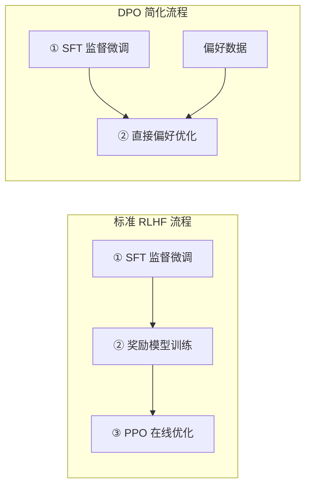

# 5.4 Off-Policy 优化

**Off-policy** 算法可以使用非当前策略采集的数据进行学习，大幅提高样本效率。本节讨论 Off-policy 的核心方法：从经典的 Q-Learning 到 LLM 对齐中的 DPO，再到游戏 AI 中的 AlphaZero，以及知识蒸馏技术。

想象一下你在学开车。On-policy 意味着你只能从自己的驾驶经历中学习——亲自上路、亲自犯错、亲自总结。Off-policy 则像拿到了一大堆别人的行车记录仪视频：老司机的流畅操作、新手的常见失误、甚至交通事故的回放，都可以成为你学习的素材。你不需要亲自经历每一种路况，就能从他人的经验中汲取教训。这极大地提高了学习效率，但也带来一个根本性问题：别人的驾驶习惯和你不同，他们面对的路况分布也和你实际遇到的不一样——这就是 off-policy 方法必须面对的"分布偏移"挑战。

## 5.4.1 Q-Learning 与深度 Q 网络

### 表格 Q-Learning

Q-Learning 的更新规则：

$$Q(s, a) \leftarrow Q(s, a) + \alpha \left[ r + \gamma \max_{a'} Q(s', a') - Q(s, a) \right]$$

**Off-policy 的本质**：TD 目标 $r + \gamma \max_{a'} Q(s', a')$ 使用的是最优动作的价值，与实际采取的动作 $a$ 无关。因此，无论数据来自什么策略（随机探索、专家演示、历史数据），都可以用于更新。

回到开车的场景：假设你看了一段视频，里面一个新手在十字路口犹犹豫豫地选了右转。虽然他的选择未必最优，但你依然可以从中学到有用信息——"这个路口如果左转会更快"。Q-Learning 的巧妙之处在于：不管视频里的司机做了什么选择，你都在更新"最优选择应该是什么"的认知。

### DQN 回顾

DQN 用神经网络 $Q_\theta(s, a)$ 近似 $Q$ 函数，关键技术：

1. **经验回放**：存储历史数据，随机采样训练
2. **目标网络**：$y = r + \gamma \max_{a'} Q_{\theta^-}(s', a')$，$\theta^-$ 定期从 $\theta$ 复制

损失函数：

$$L(\theta) = \mathbb{E}_{(s,a,r,s') \sim D} \left[ (y - Q_\theta(s, a))^2 \right]$$

### 重要性采样视角

Off-policy 学习可以用重要性采样理解。设数据来自行为策略 $\mu(a|s)$，目标策略为 $\pi(a|s)$：

$$\mathbb{E}_\mu [f(s, a)] = \mathbb{E}_\pi \left[ \frac{\mu(a|s)}{\pi(a|s)} f(s, a) \right]$$

Q-Learning 的巧妙之处在于：它不需要显式的重要性权重，因为 TD 目标只依赖 $\max_{a'} Q(s', a')$，而非实际动作的概率。

## 5.4.2 DPO：直接偏好优化

### RLHF 的复杂性

标准 RLHF 流程包含三个阶段：

1. **SFT**：监督微调
2. **奖励模型训练**：学习人类偏好
3. **RL 优化**：用 PPO 最大化奖励

其中第三步需要在线采样、训练 Critic、多次迭代，实现复杂。

### DPO 的思想

**DPO**（Direct Preference Optimization，Rafailov et al., 2023）提出：能否跳过奖励模型，直接用偏好数据优化策略？

假设你在训练一个客服机器人。传统 RLHF 的做法是：先让一群人比较不同回复的好坏（收集偏好数据），训练一个"评分专家"（奖励模型），然后让机器人不断对话、请评分专家打分、调整策略。DPO 说：何必绕这么大一圈？既然人类已经告诉你"这个回复比那个好"，直接用这些比较结果训练就行了。

关键洞察：最优策略和奖励函数之间存在解析关系。在 KL 约束下：

$$\pi^*(a|s) \propto \pi_{\text{ref}}(a|s) \exp\left(\frac{1}{\beta} r(s, a)\right)$$

反解奖励：

$$r(s, a) = \beta \log \frac{\pi^*(a|s)}{\pi_{\text{ref}}(a|s)} + \beta \log Z(s)$$

其中 $Z(s)$ 是配分函数，不影响偏好比较。

### Bradley-Terry 模型

人类偏好可以用 **Bradley-Terry 模型**描述：

$$P(y_w \succ y_l | x) = \sigma(r(x, y_w) - r(x, y_l))$$

其中 $y_w$ 是被偏好的回复，$y_l$ 是较差的回复，$\sigma$ 是 sigmoid 函数。

举个例子。这就像体育比赛中的 Elo 评分系统：两个选手对战，赢的那个分高、输的那个分低。Bradley-Terry 模型把"A 比 B 好"这种主观判断，转化成了"A 的隐式评分比 B 高多少"的数学问题。

### DPO 损失函数

将奖励的表达式代入 Bradley-Terry 模型，配分函数抵消，得到 **DPO 损失**：

$$L_{\text{DPO}}(\pi_\theta; \pi_{\text{ref}}) = -\mathbb{E}_{(x, y_w, y_l) \sim D} \left[ \log \sigma \left( \beta \log \frac{\pi_\theta(y_w|x)}{\pi_{\text{ref}}(y_w|x)} - \beta \log \frac{\pi_\theta(y_l|x)}{\pi_{\text{ref}}(y_l|x)} \right) \right]$$

其中：
- $(x, y_w, y_l)$ 为偏好数据三元组：提示 $x$、被偏好回复 $y_w$、较差回复 $y_l$
- $\pi_\theta$ 为当前训练的策略
- $\pi_{\text{ref}}$ 为参考策略（通常为 SFT 模型）
- $\beta$ 控制 KL 惩罚强度（与 RLHF 中的 $\beta$ 对应）
- $\sigma$ 为 sigmoid 函数
- $\log \frac{\pi_\theta(y|x)}{\pi_{\text{ref}}(y|x)}$ 可理解为“隐式奖励”，衡量 $\pi_\theta$ 相对于 $\pi_{\text{ref}}$ 对回复 $y$ 的偏好程度

翻译成人话就是：DPO 损失函数要求模型对被偏好回复 $y_w$ 的“隐式奖励”高于较差回复 $y_l$。当两者差距越大，sigmoid 越接近 1，损失越小。本质上，DPO 把“策略优化 + 奖励建模”压缩成了一个单步的二分类问题。

$$L_{\text{DPO}} = -\mathbb{E} \left[ \log \sigma \left( \beta (\hat{r}_\theta(y_w) - \hat{r}_\theta(y_l)) \right) \right]$$

其中 $\hat{r}_\theta(y) = \log \frac{\pi_\theta(y|x)}{\pi_{\text{ref}}(y|x)}$ 是隐式奖励。

### DPO 的优势

1. **无需奖励模型**：直接用偏好数据训练
2. **无需在线采样**：完全 off-policy，只需偏好数据集
3. **无需 Critic**：不需要价值网络
4. **实现简单**：与 SFT 类似的训练流程

### DPO 的局限

1. **数据分布偏移**：训练数据来自 $\pi_{\text{ref}}$，而非 $\pi_\theta$
2. **无法迭代改进**：不能用新策略生成更好的数据
3. **对比较噪声敏感**：偏好标注的噪声直接影响学习

这里的数据分布偏移问题，就像你只看了某位特定司机的行车记录来学开车。这位司机走的都是市区道路，但你实际要开的是山路。他的经验对市区有用，对山路就未必了——而你的策略越优化越偏离他的风格时，他的经验就越不可靠。

### DPO 变体

**IPO**（Identity Preference Optimization）：用不同的损失函数，更鲁棒。

**KTO**（Kahneman-Tversky Optimization）：只需要"好/差"的单边标注，不需要成对比较。

**ORPO**（Odds Ratio Preference Optimization）：用 odds ratio 替代 log probability ratio。

## 5.4.3 AlphaZero 与 AlphaGo

### AlphaGo 的架构

AlphaGo（2016）结合了深度学习和蒙特卡洛树搜索（MCTS）：

1. **策略网络** $p_\theta(a|s)$：预测下一步落子概率
2. **价值网络** $v_\phi(s)$：预测胜率
3. **MCTS**：用网络引导搜索，提升决策质量

训练流程：

1. 用人类棋谱监督学习初始化
2. 自我对弈生成数据
3. 用自我对弈数据更新网络

### AlphaZero 的简化

AlphaZero（2017）进一步简化，**从零开始学习**（tabula rasa）：

1. **无需人类棋谱**：只用自我对弈
2. **统一的网络**：策略和价值共享主干
3. **通用性**：同一算法适用于围棋、国际象棋、日本将棋

### MCTS 与策略改进

MCTS 的作用是**策略改进**（Policy Improvement）。设当前策略网络为 $p_\theta$，MCTS 搜索后得到改进的策略 $\pi_{\text{MCTS}}$：

$$\pi_{\text{MCTS}}(a|s) \propto N(s, a)^{1/\tau}$$

其中：
- $N(s, a)$ 为 MCTS 搜索中动作 $a$ 被访问的次数（访问次数越多说明搜索认为该动作越值得探索）
- $\tau$ 为温度参数，控制策略的确定性（$\tau \to 0$ 时退化为贪婪选择）

这里的关键洞察是：MCTS 通过大量模拟将策略网络的“直觉”转化为更精确的决策。访问次数反映了搜索的“投票结果”——被多次访问的动作，是经过反复探索后仍被认为有价值的动作。策略网络通过模仿这个改进后的策略来提升自身。

策略网络的训练目标是模仿 MCTS 策略：

$$L_p = -\sum_a \pi_{\text{MCTS}}(a|s) \log p_\theta(a|s)$$

价值网络的目标是预测游戏结果 $z \in \{-1, +1\}$：

$$L_v = (v_\phi(s) - z)^2$$

### Off-Policy 的体现

AlphaZero 的数据来自**历史版本**的策略，而非当前策略：

1. 用当前策略自我对弈，生成游戏数据
2. 数据存入回放缓冲区
3. 从缓冲区采样训练
4. 更新后的策略继续对弈

缓冲区中可能包含数万局游戏、数百万个状态，来自不同历史版本的策略。这是典型的 off-policy 学习。

### 与 LLM 的联系

AlphaZero 的思想已被应用于 LLM 推理：

- **AlphaCode**：用大规模采样和筛选解决编程问题
- **Process Reward Model**：对推理过程的每一步打分
- **MCTS 解码**：用树搜索探索不同的推理路径

## 5.4.4 软蒸馏与数据蒸馏

### 知识蒸馏

**知识蒸馏**（Knowledge Distillation, Hinton et al., 2015）将大模型（教师）的知识迁移到小模型（学生）：

$$L_{\text{KD}} = \text{KL}(p_{\text{teacher}}(\cdot|x) \| p_{\text{student}}(\cdot|x))$$

或者用温度 softmax：

$$L_{\text{KD}} = -\sum_y p_{\text{teacher}}(y|x; \tau) \log p_{\text{student}}(y|x; \tau)$$

高温度使分布更"软"，保留更多信息。

想象一位资深厨师（教师模型）教学徒（学生模型）做菜。硬蒸馏就是只把最终成品摆出来让学徒模仿——"这道菜就该长这样"。软蒸馏则更像师傅边做边解释——"这里火候七成热，这个调料可加可不加但我偏好加一点"——把决策过程中的不确定性和细微偏好都传递给学徒。

### 软蒸馏 vs 硬蒸馏

**硬蒸馏**：学生模仿教师的最终输出（argmax）

$$L_{\text{hard}} = -\log p_{\text{student}}(y_{\text{teacher}}|x)$$

**软蒸馏**：学生模仿教师的完整分布

$$L_{\text{soft}} = \text{KL}(p_{\text{teacher}} \| p_{\text{student}})$$

软蒸馏保留了教师的"不确定性"信息，通常效果更好。

### 数据蒸馏

**数据蒸馏**是一种特殊的蒸馏方式：用教师生成大量数据，学生在这些数据上训练。

流程：
1. 教师模型生成回复 $y \sim p_{\text{teacher}}(\cdot|x)$
2. （可选）筛选高质量回复
3. 学生在 $(x, y)$ 对上做 SFT

这实际上是 off-policy 学习：学生用教师策略的数据训练。

### 在 LLM 中的应用

**Self-Instruct / Alpaca**：用 GPT-4 生成指令-回复对，训练小模型。

**On-Policy 蒸馏**：让学生自己生成回复，教师打分或改写，迭代训练。

**Rejection Sampling**：学生生成多个回复，用教师（或奖励模型）选择最好的，作为 SFT 数据。

### 与 RL 的关系

蒸馏可以视为一种简化的 RL：

- **奖励**：与教师分布的匹配程度
- **策略**：学生模型
- **优化**：最大化期望"奖励"

DPO 也可以理解为一种蒸馏：从偏好数据中蒸馏人类的隐式奖励函数。

## 5.4.5 Off-Policy 的挑战

### 分布偏移

Off-policy 方法面临**分布偏移**（Distribution Shift）：训练分布与目标分布不同。

在 Q-Learning 中，这导致对未见过的 $(s, a)$ 的 $Q$ 值估计不准确。

在 DPO 中，偏好数据来自 $\pi_{\text{ref}}$，而优化的是 $\pi_\theta$，两者差异越大，估计越不可靠。

你可能遇到过这种情况：你根据北京的交通规则学了开车，然后去英国自驾——靠左行驶、环岛优先权不同、路标含义有别。你过去的经验（训练数据）来自一个分布（北京路况），但你要应对的是另一个分布（英国路况）。差异越大，过去的经验就越不可靠。这就是分布偏移的本质。

### 外推误差

当策略访问训练数据未覆盖的区域时，价值估计可能出现严重偏差——称为**外推误差**（Extrapolation Error）。

缓解方法：
- **保守 Q 学习**（CQL）：惩罚 OOD 状态-动作的 $Q$ 值
- **KL 约束**：限制 $\pi_\theta$ 与 $\pi_{\text{ref}}$ 的差异
- **Behavior Cloning 正则化**：加入模仿学习损失

### 重要性权重方差

如果使用重要性采样修正分布偏移，权重 $\frac{\pi_\theta(a|s)}{\pi_b(a|s)}$ 可能方差很大，导致训练不稳定。

缓解方法：
- **权重裁剪**：$\min(\rho, c)$ 或 $\text{clip}(\rho, 1-\epsilon, 1+\epsilon)$
- **V-trace**：递归地裁剪权重
- **PPO**：用裁剪目标函数，隐式控制重要性权重
