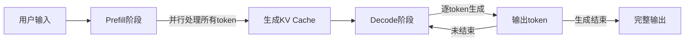
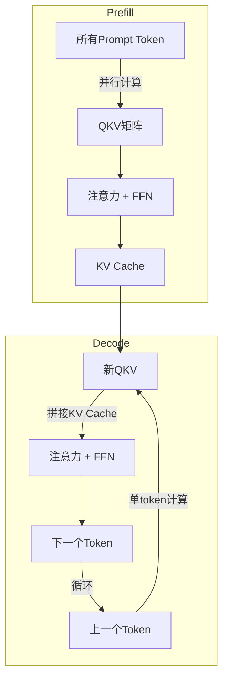
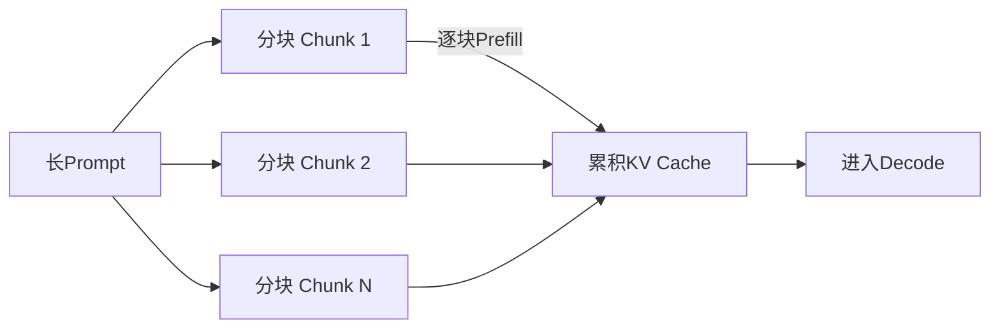
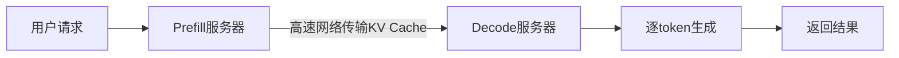

# 6.1 Prefill 与 Decode

LLM 的自回归生成可以分解为两个阶段：**Prefill**（预填充）处理输入 prompt，**Decode**（解码）逐个生成输出 token。这两个阶段的计算特性截然不同，理解它们是优化推理的基础。

想象你去一家餐厅点餐。服务员先花一段时间「通读」你写好的整张菜单（Prefill），然后逐道菜确认口味、一道一道地下单到厨房（Decode）。第一步可以一目十行地并行处理，第二步却必须等上一道菜确认后才能问下一道——这正是大模型推理中两个阶段的核心差异。

## 6.1.1 自回归生成的基本流程

### Transformer 推理

给定输入序列 $x_1, x_2, \ldots, x_n$，Transformer 的推理过程是：

1. **Embedding**：将 token 转换为向量
2. **逐层计算**：通过 $L$ 层 Transformer block
3. **输出**：最后一层的隐藏状态通过 LM head 得到 logits

对于自回归语言模型，关键在于：生成第 $t+1$ 个 token 时，需要访问前 $t$ 个 token 的信息。这通过**因果注意力**（Causal Attention）实现——每个位置只能看到自己和之前的位置。

举个例子：你在写一封邮件，写到第 5 个字的时候，你的大脑会参考前 4 个字来决定第 5 个字该用什么。你不能「偷看」后面还没写的内容——这就是因果注意力的直觉。

### 朴素实现的问题

最朴素的实现：每生成一个新 token，重新计算整个序列的注意力。

这就像每次续写一段文字时，都要从头到尾把整篇文章重新默读一遍——文章越长，每写一个字的代价就越大。

设序列长度为 $n$，生成 $m$ 个 token，总计算量为：

$$\sum_{t=n}^{n+m-1} O(t^2 \cdot d) = O((n+m)^2 \cdot m \cdot d)$$

其中：
- $n$ 表示输入 prompt 的长度（token 数）
- $m$ 表示待生成的输出 token 数
- $d$ 表示模型隐藏层维度
- $t$ 表示当前已有的序列长度，从 $n$ 增长到 $n+m-1$

说白了，每生成一个新 token 都要对已有的全部 $t$ 个 token 做一次 $O(t^2 \cdot d)$ 的注意力计算，而 $t$ 随生成过程持续增长，后续 token 的成本急剧攀升。想象你写一篇 1000 字的作文，每写一个字都要重读前面全部内容——写到第 500 字时，每个字的思考成本已是第 10 字时的 2500 倍。对于长 prompt 或长输出，这个开销显然不可接受。

## 6.1.2 Prefill 阶段

### 定义

**Prefill**（预填充）阶段处理用户输入的 prompt。所有 prompt token 已知，可以一次性并行处理。

设 prompt 长度为 $n$，Prefill 需要：

1. 计算所有 $n$ 个 token 的 embedding
2. 逐层计算注意力和 FFN
3. 为 Decode 阶段准备 KV Cache

### 计算特点

**并行性好**：所有 token 可同时计算，类似训练的前向传播。回到餐厅场景——服务员看菜单时，所有菜名同时映入眼帘，无需逐字阅读。

**计算密集**：瓶颈在矩阵乘法（Q、K、V 投影与注意力计算），GPU 利用率高。

**一次性开销**：每个请求只做一次 Prefill，如同考试时的审题——审题只需一次，之后全力作答。

### 计算量分析

Prefill 的主要计算：

**注意力计算**：

$$\text{Attention}(\mathbf{Q}, \mathbf{K}, \mathbf{V}) = \text{softmax}\left(\frac{\mathbf{Q}\mathbf{K}^\top}{\sqrt{d_k}}\right)\mathbf{V}$$

其中：
- $\mathbf{Q}, \mathbf{K}, \mathbf{V} \in \mathbb{R}^{n \times d}$ 分别为查询、键、值矩阵，由输入通过线性变换得到
- $d_k$ 为每个注意力头的维度，缩放因子 $\sqrt{d_k}$ 防止点积过大导致 softmax 饱和
- $n$ 为序列长度，$d$ 为隐藏层维度

各步骤的计算量：
- $\mathbf{Q}, \mathbf{K}, \mathbf{V}$ 的线性投影：$O(n \cdot d^2)$（$n$ 个 token 各做一次 $d \to d$ 的矩阵乘法）
- $\mathbf{Q}\mathbf{K}^\top$：$O(n^2 \cdot d)$（$n \times n$ 个点积，每个涉及 $d$ 维向量）
- $\text{softmax} \cdot \mathbf{V}$：$O(n^2 \cdot d)$（加权求和）

**FFN 计算**：

$$\text{FFN}(\mathbf{x}) = \text{GELU}(\mathbf{x}\mathbf{W}_1)\mathbf{W}_2$$

其中：
- $\mathbf{x} \in \mathbb{R}^{n \times d}$ 为输入
- $\mathbf{W}_1 \in \mathbb{R}^{d \times d_{ff}}$、$\mathbf{W}_2 \in \mathbb{R}^{d_{ff} \times d}$ 为 FFN 的两层权重
- $d_{ff}$ 为 FFN 中间维度，通常取 $4d$

FFN 每层计算量为 $O(n \cdot d \cdot d_{ff})$。

综合以上，Prefill 阶段**每层**总计算量：

$$O(L \cdot (n^2 \cdot d + n \cdot d^2))$$

其中 $L$ 为 Transformer 层数。当 prompt 较短时，$n \cdot d^2$（线性投影）主导计算量；当 $n > d$ 时，$n^2 \cdot d$（注意力计算）成为瓶颈——这正是长 prompt 处理速度下降的根本原因。

### TTFT 优化

**TTFT**（Time to First Token）是用户感知的首要延迟，主要由 Prefill 决定。优化方向：

1. **Flash Attention**：减少显存访问，加速注意力计算
2. **Tensor 并行**：多卡分担计算
3. **量化**：减少计算精度
4. **Prefix Caching**：缓存公共前缀的 KV

## 6.1.3 Decode 阶段

### 定义

**Decode**（解码）阶段逐个生成输出 token。每一步：

1. 将上一步生成的 token 输入模型
2. 计算该 token 的隐藏状态
3. 通过 LM head 得到下一个 token 的概率分布
4. 采样得到下一个 token
5. 重复直到生成结束符或达到最大长度

### 计算特点

**串行依赖**：每个 token 依赖前一个，无法并行生成（不考虑投机解码）。这就像多米诺骨牌——必须等前一块倒下，后一块才会跟着倒。

**内存密集**：每步只处理一个 token，计算量小，但需要加载全部模型参数。想象一下：你只想查字典里的一个字，但每次都要把整本字典从书架上搬下来翻一遍。

**重复开销**：生成 $m$ 个 token 需要 $m$ 次前向传播。

### 算术强度分析

**算术强度**（Arithmetic Intensity）= 计算量 / 数据传输量

设模型参数量为 $P$，每步 Decode：

- 计算量：$O(d^2 \cdot L)$（一个 token 经过 $L$ 层，每层主要做 $d \times d$ 的矩阵乘法）
- 数据传输量：$O(P)$（需要从显存加载全部模型参数）

其中：
- $d$ 表示隐藏层维度
- $L$ 表示 Transformer 层数
- $P$ 表示模型总参数量（约 $12 \cdot L \cdot d^2$ 量级）

算术强度 = $O(d^2 \cdot L) / O(P) \approx O(1)$，远低于 GPU 的算术强度阈值，GPU 大部分时间在等数据从显存搬到计算单元——这就是 Decode 阶段**内存带宽受限**（Memory-bound）的本质。打个比方：GPU 像一位算力惊人的数学天才，但每次做题前都要等快递把 140GB 的「参数教材」送到手边，带宽通道再宽也需要时间，结果天才大部分时间不是在计算而是在等快递。

### 量化示例

以 LLaMA-70B 为例：

- 参数量：70B
- FP16 显存：140GB
- A100 显存带宽：2TB/s
- 加载模型一次：140GB / 2TB/s = 70ms

这意味着每个 token 至少需要 70ms（不计算开销），即最多 ~14 tokens/s。

实际上通过 KV Cache 和批处理可以改善，但内存带宽仍是核心瓶颈。

## 6.1.4 Prefill 与 Decode 的对比

| 维度 | Prefill | Decode |
|------|---------|--------|
| 处理内容 | Prompt（已知） | 输出（逐个生成） |
| 并行性 | 高（所有 token 并行） | 低（串行依赖） |
| 计算特点 | Compute-bound | Memory-bound |
| 主要瓶颈 | 注意力的 $O(n^2)$ | 内存带宽 |
| 批处理效果 | 好 | 有限 |

### 系统设计启示

这种差异对系统设计有深刻影响：

**分离调度**：Prefill 与 Decode 可分开调度甚至部署到不同硬件，如同物流公司将分拣中心与末端配送设在不同地点，各取所长。

**批处理策略**：Prefill 受益于大批量；Decode 则依赖 Continuous Batching 等专用优化。

**资源分配**：Prefill 需要算力，Decode 需要带宽，二者的资源画像截然不同。

## 6.1.5 Chunked Prefill

### 长 Prompt 的问题

当 prompt 很长（如 100K token）时，Prefill 的 $O(n^2)$ 注意力计算和显存占用成为瓶颈——10 万个 token 意味着注意力矩阵达 $10^{10}$ 量级元素，光存储这张关系表就可能撑爆显存。具体表现为：

1. **显存溢出**：$n \times n$ 的注意力矩阵可能超出显存容量
2. **延迟尖峰**：长 Prefill 阻塞其他请求，如同高速入口处的超长货车挡住后面所有车辆
3. **批处理困难**：不同长度的 prompt 难以高效组批

### Chunked Prefill

**Chunked Prefill** 将长 prompt 分块处理，如同把厚书分成章节逐章消化，而非一口气读完：

1. 将 prompt 分成大小为 $C$ 的 chunk
2. 逐 chunk 进行 Prefill，累积 KV Cache
3. 最后一个 chunk 后进入 Decode

其中 $C$ 为分块大小（chunk size），通常取几千（如 $C = 2048$），远小于完整 prompt 长度 $n$。

优势：
- 显存占用可控——注意力矩阵从 $O(n^2)$ 降为 $O(C^2)$，峰值显存由 chunk 大小而非总 prompt 长度决定
- 长 prompt 不会阻塞其他请求
- 可以与 Decode 请求混合调度

代价：
- 总计算量略增（chunk 边界的处理）
- 实现复杂度增加

## 6.1.6 Prefill-Decode 分离架构

### 动机

Prefill 和 Decode 对硬件的需求不同：

- Prefill：高算力，适合 GPU
- Decode：高带宽，适合多卡并行或定制硬件

将两者分离可以独立优化和扩展。

### 分离部署

**物理分离**：
- Prefill 服务器：高算力 GPU（如 H100）
- Decode 服务器：多卡并行或专用硬件
- 通过网络传递 KV Cache

**逻辑分离**：
- 同一 GPU 上，Prefill 和 Decode 请求分开调度
- Prefill 使用大 batch，Decode 使用 Continuous Batching

### Disaggregated Serving

**Disaggregated Serving** 是一种极端的分离架构：

1. Prefill 节点专门处理 prompt
2. KV Cache 通过高速网络（如 NVLink、InfiniBand）传递
3. Decode 节点专门生成输出

该架构在大规模部署中可显著提高资源利用率，代价是系统复杂度的上升。
