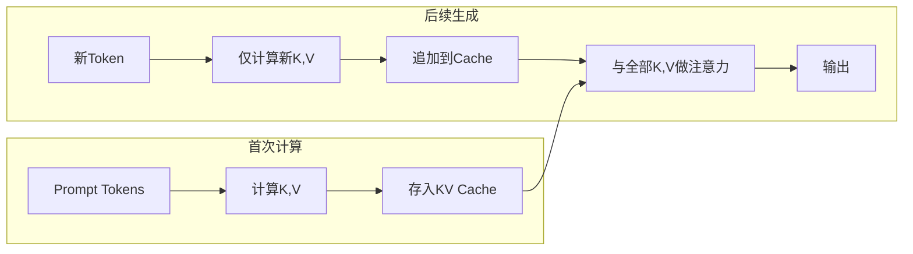
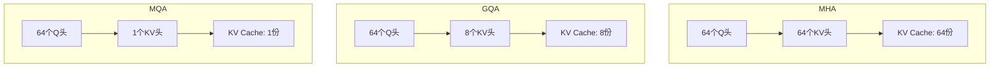

# 6.2 KV Cache

**KV Cache** 是 LLM 推理中最基础也最重要的优化技术。它通过缓存历史 token 的 Key 和 Value，避免 Decode 阶段的重复计算，将生成每个 token 的复杂度从 $O(n)$ 降为 $O(1)$（相对于序列长度）。

想象你是一家餐厅的服务员，每次顾客加点一道菜，你都得重新走一遍所有桌子，把之前每位客人点了什么重新问一遍——这显然荒谬。聪明的做法是拿一本「点单本」（KV Cache），把之前的订单都记在上面，新加的菜直接追加到末尾就行。这就是 KV Cache 的精髓。

## 6.2.1 为什么需要 KV Cache

### 注意力计算回顾

自注意力的计算：

$$\text{Attention}(\mathbf{Q}, \mathbf{K}, \mathbf{V}) = \text{softmax}\left(\frac{\mathbf{Q}\mathbf{K}^\top}{\sqrt{d_k}}\right)\mathbf{V}$$

对于因果语言模型，位置 $t$ 的输出只依赖位置 $1, 2, \ldots, t$ 的信息。

### 朴素实现的冗余

考虑生成第 $t+1$ 个 token。朴素实现需要：

1. 计算位置 $1$ 到 $t+1$ 的 $\mathbf{Q}, \mathbf{K}, \mathbf{V}$
2. 计算完整的注意力矩阵 $(t+1) \times (t+1)$
3. 得到位置 $t+1$ 的输出

但位置 $1$ 到 $t$ 的 $\mathbf{K}, \mathbf{V}$ 在生成前 $t$ 个 token 时已经计算过。重复计算是巨大的浪费。

回到点单本的场景：顾客加的第 6 道菜不会改变前 5 道菜的内容。既然前 5 道菜的「订单信息」不变，为什么要重新记录呢？直接查点单本即可。

### KV Cache 的思想

**KV Cache** 的核心思想：缓存所有历史位置的 $\mathbf{K}, \mathbf{V}$，每步只计算新 token 的 $\mathbf{Q}, \mathbf{K}, \mathbf{V}$。

生成第 $t+1$ 个 token 时：

1. 只计算位置 $t+1$ 的 $\mathbf{q}_{t+1}, \mathbf{k}_{t+1}, \mathbf{v}_{t+1}$
2. 将 $\mathbf{k}_{t+1}, \mathbf{v}_{t+1}$ 追加到 Cache
3. 用 $\mathbf{q}_{t+1}$ 与缓存的 $\mathbf{K}_{1:t+1}, \mathbf{V}_{1:t+1}$ 计算注意力



## 6.2.2 KV Cache 的实现

### 数据结构

对于每一层，维护两个张量：

$$\mathbf{K}_{\text{cache}} \in \mathbb{R}^{B \times H \times L_{\max} \times d_k}$$
$$\mathbf{V}_{\text{cache}} \in \mathbb{R}^{B \times H \times L_{\max} \times d_v}$$

其中：
- $B$：批大小
- $H$：注意力头数
- $L_{\max}$：最大序列长度
- $d_k, d_v$：Key/Value 维度

### Prefill 阶段

Prefill 时，一次性计算所有 prompt token 的 $\mathbf{K}, \mathbf{V}$ 并存入 Cache：

```python
# 计算 Q, K, V
Q = x @ W_Q  # [B, n, d]
K = x @ W_K  # [B, n, d]
V = x @ W_V  # [B, n, d]

# 存入 Cache
kv_cache.K[:, :, :n, :] = K
kv_cache.V[:, :, :n, :] = V

# 计算注意力
attn_output = attention(Q, K, V)
```

### Decode 阶段

Decode 时，每步只计算一个 token：

```python
# 计算新 token 的 Q, K, V
q = x_new @ W_Q  # [B, 1, d]
k = x_new @ W_K  # [B, 1, d]
v = x_new @ W_V  # [B, 1, d]

# 追加到 Cache
kv_cache.K[:, :, t, :] = k
kv_cache.V[:, :, t, :] = v

# 用完整的 K, V 计算注意力
K_full = kv_cache.K[:, :, :t+1, :]  # [B, H, t+1, d]
V_full = kv_cache.V[:, :, :t+1, :]  # [B, H, t+1, d]
attn_output = attention(q, K_full, V_full)  # [B, 1, d]
```

### 计算量对比

| 阶段 | 无 KV Cache | 有 KV Cache |
|------|------------|-------------|
| Prefill（$n$ tokens） | $O(n^2 \cdot d)$ | $O(n^2 \cdot d)$ |
| Decode（每个 token） | $O(t^2 \cdot d)$ | $O(t \cdot d)$ |
| Decode（$m$ tokens 总计） | $O(m \cdot n^2 \cdot d)$ | $O(m \cdot n \cdot d)$ |

其中：
- $n$ 为 prompt 长度，$m$ 为生成长度，$d$ 为隐藏层维度
- $t$ 为 Decode 时当前序列长度（逐步增长）
- 无 KV Cache 时，生成每个 token 需要重新计算完整 $t \times t$ 注意力矩阵（$O(t^2 \cdot d)$）
- 有 KV Cache 时，只需计算新 token 与缓存的 $t$ 个 K/V 的点积（$O(t \cdot d)$）

这个公式告诉我们：KV Cache 将 Decode 的复杂度从二次降为线性。没有 KV Cache 时，生成第 1000 个 token 的成本是第 10 个 token 的一万倍；有了 KV Cache 只是 100 倍——这就是「查点单本」与「重新问一遍」的差距。

## 6.2.3 显存占用分析

### KV Cache 大小

设模型有 $L$ 层，隐藏维度 $d$，序列长度 $n$，批大小 $B$。

每层 KV Cache：$2 \times n \times d$ 个元素（K 和 V 各一份）

总 KV Cache：

$$\text{KV Cache} = 2 \times L \times B \times n \times d \times \text{sizeof(dtype)}$$

其中：
- $L$ 为 Transformer 层数
- $B$ 为批大小（并发请求数）
- $n$ 为序列长度（token 数）
- $d$ 为隐藏层维度
- $\text{sizeof(dtype)}$ 为每个元素的字节数（FP16 为 2，FP32 为 4）
- 因子 2 表示 K 和 V 各占一份

换句话说，KV Cache 的显存占用与序列长度线性增长——每生成一个新 token 就多存一组 K 和 V 向量，序列足够长时，缓存本身的显存占用可能超过模型参数。

以 LLaMA-70B 为例（$L=80$，$d=8192$，$n=4096$，$B=1$，FP16）：

$$2 \times 80 \times 1 \times 4096 \times 8192 \times 2 \text{ bytes} = 10.7 \text{ GB}$$

**单个请求的 KV Cache 就占用 10.7GB**！这是 LLM 推理显存紧张的主要原因。

作为参照，一张普通照片约 5MB，10.7GB 的 KV Cache 相当于约 2000 张照片。每来一个用户就占据这么多显存，GPU 显存永远紧张也就不足为奇了。

### 与模型参数的对比

LLaMA-70B 参数量：140GB（FP16）

KV Cache（4K 上下文）：10.7GB / 请求

批大小 8 时，KV Cache 总计 85.6GB，已接近模型参数量——服务 8 个并发用户时，「点单本」占用的空间几乎和「菜谱」本身一样大。

### GQA 对 KV Cache 的影响

**GQA**（Grouped Query Attention）让多个 Query 头共享一组 KV 头，从而缩小 KV Cache。打个比方，原来 64 个参会者每人各做笔记（MHA），现在 8 个小组各共享一份笔记（GQA），笔记本总量缩减为原来的 1/8。

设 Query 头数为 $H_Q$，KV 头数为 $H_{KV}$：

$$\text{KV Cache} = 2 \times L \times B \times n \times H_{KV} \times d_k \times \text{sizeof(dtype)}$$

其中：
- $H_Q$ 为 Query 注意力头数
- $H_{KV}$ 为 KV 注意力头数，GQA 中 $H_{KV} < H_Q$
- $d_k = d / H_Q$ 为每个注意力头的维度
- 总隐藏维度 $d = H_Q \times d_k$

GQA 的缩减比为 $H_{KV} / H_Q$。LLaMA-2 70B 使用 GQA（$H_Q=64$，$H_{KV}=8$），KV Cache 缩小为 MHA 的 $8/64 = 1/8$。

## 6.2.4 KV Cache 优化技术

### 量化

将 KV Cache 从 FP16 量化到 INT8 或 INT4：

- INT8：显存减半
- INT4：显存减少 75%

量化可能影响生成质量，需要在精度和效率之间权衡。

### 压缩

**Key/Value 压缩**：用低秩分解或学习到的压缩函数减少 KV 维度。

**稀疏化**：只保留重要位置的 KV（如 H2O、StreamingLLM）。

### Sliding Window

**滑动窗口注意力**：只保留最近 $W$ 个位置的 KV Cache。

$$\mathbf{K}_{\text{cache}} = \mathbf{K}_{t-W+1:t}$$

其中 $W$ 为窗口大小（token 数），$t$ 为当前位置。只保留最近 $W$ 个位置的 K/V，显存占用从 $O(n)$ 降为 $O(W)$，与序列总长无关。

这就像手机聊天记录的「只显示最近 N 条」功能——不再保存所有历史消息，只留最近的对话上下文。Mistral 等模型原生支持滑动窗口，适合长序列场景。

### Prefix Caching

对于共享前缀的多个请求（如 few-shot 或系统提示），可以缓存前缀的 KV：

1. 首次计算公共前缀的 KV
2. 后续请求直接复用，跳过前缀的 Prefill

这在多轮对话和批量处理中非常有效。



## 6.2.5 Multi-Query 与 Grouped-Query Attention

### MHA 的冗余

标准 **MHA**（Multi-Head Attention）每个头有独立的 $\mathbf{W}_K, \mathbf{W}_V$，产生独立的 KV Cache。

但研究表明，不同头的 KV 具有较高相似性，存在显著冗余。

### MQA

**MQA**（Multi-Query Attention）所有 Query 头共享一组 KV：

$$H_{KV} = 1$$

KV Cache 大小降为 MHA 的 $1/H$，显著减少显存。

代价：生成质量可能略有下降。

### GQA

**GQA**（Grouped-Query Attention）是 MHA 和 MQA 的折中：

$$1 < H_{KV} < H_Q$$

将 Query 头分组，每组共享一组 KV。

例如 $H_Q = 64$，$H_{KV} = 8$：每 8 个 Query 头共享一组 KV。

GQA 在质量和效率之间取得了很好的平衡，被 LLaMA-2、Mistral 等主流模型采用。

### 转换

已有的 MHA 模型可以转换为 GQA/MQA：

1. 对每组 Query 头，将对应的 $\mathbf{W}_K, \mathbf{W}_V$ 取平均
2. 在小数据集上微调恢复质量

## 6.2.6 KV Cache 的内存管理

### 预分配 vs 动态分配

**预分配**：按最大长度 $L_{\max}$ 预分配 KV Cache。

- 优点：简单，无碎片
- 缺点：浪费（大多数请求不会达到最大长度）

**动态分配**：按实际长度分配。

- 优点：节省显存
- 缺点：内存碎片，分配开销

### 碎片问题

动态分配会导致内存碎片：

```
|--KV1--|    |--KV2--|      |--KV3--|
        ^空隙^        ^空隙^
```

短请求结束释放后，留下的空隙往往无法容纳新的长请求——就像停车场里小车离开后，留下的空位太小，大巴士停不进去；显存明明有剩余却无法使用。

### Paged Attention

**Paged Attention**（下一节详述）借鉴操作系统的分页内存管理，将 KV Cache 分成固定大小的"页"，动态分配和回收。这是解决 KV Cache 内存管理的核心技术。
