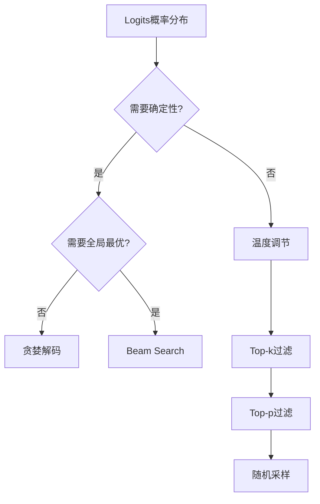
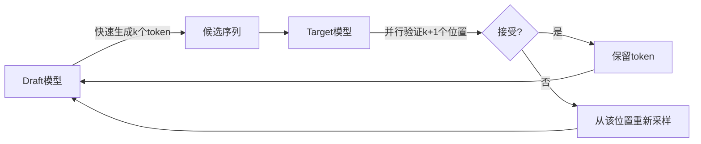

# 6.3 解码策略

模型输出的是下一个 token 的概率分布，如何从分布中选择 token？不同的**解码策略**（Decoding Strategy）会产生截然不同的输出。本节讨论常用的解码方法：贪婪采样、Beam Search、随机采样及其变体，以及新兴的 MTP 解码。

假设你站在一个十字路口，导航告诉你前方有三条路，各自的“到达概率”不同。你是每次都走概率最高的那条（贪婪），还是同时派出几个分身探路（Beam Search），或者按概率随机赌一把（采样）？这就是解码策略要回答的问题。



## 6.3.1 贪婪解码

### 定义

**贪婪解码**（Greedy Decoding）每一步选择概率最高的 token：

$$x_{t+1} = \arg\max_{x} P(x | x_{1:t})$$

其中 $x_{1:t}$ 表示已生成的前 $t$ 个 token，$P(x | x_{1:t})$ 是模型输出的下一个 token 的条件概率分布。$\arg\max$ 表示选择概率最高的那个 token。

### 特点

**优点**：
- 实现简单，计算高效
- 确定性输出，可复现

**缺点**：
- 局部最优不等于全局最优
- 输出单调，缺乏多样性
- 容易陷入重复

### 重复问题

贪婪解码有个致命弱点——它倾向于生成重复内容。这就像一个只会走「最短路」的人，一旦走进了死胡同，就会反复在同一个圈里转：

```
The cat sat on the mat. The cat sat on the mat. The cat sat on the mat...
```

一旦进入重复模式，每步的 argmax 都指向相同的 token 序列。

### 适用场景

- 确定性任务（如代码生成的简单补全）
- 调试和测试
- 作为其他方法的基线

## 6.3.2 Beam Search

### 动机

贪婪解码的问题在于：每步的局部最优选择可能导致全局次优。想象你下棋，每步只看当前最有利的一步而不考虑后续局面，很可能走入陷阱。能否同时考虑多条路径，选择整体概率最高的？

### 算法

**Beam Search** 维护 $k$ 条候选序列（beam），每步扩展所有候选，保留概率最高的 $k$ 条。这就像你同时派出 $k$ 个侦察兵分头探路，每到一个岩口就淘汰方向最差的几个，只留下前景最好的 $k$ 路继续前进：

1. 初始化：$k$ 条相同的空序列
2. 对每条序列，计算所有可能的下一 token，得到 $k \times V$ 个候选
3. 按序列概率排序，保留 top-$k$
4. 重复直到所有序列结束

### 序列概率

为了比较不同长度的序列，通常用**长度归一化**的对数概率：

$$\text{score}(x_{1:t}) = \frac{1}{t^\alpha} \sum_{i=1}^t \log P(x_i | x_{1:i-1})$$

其中：
- $x_{1:t}$ 为候选序列，长度为 $t$
- $\log P(x_i | x_{1:i-1})$ 为每个 token 的对数概率，累加得到序列对数概率
- $\alpha \in [0.6, 1.0]$ 为长度惩罚参数：$\alpha = 0$ 表示不做长度归一化，$\alpha = 1$ 表示完全归一化

背后的含义是：若不做长度归一化，Beam Search 会偏好短序列（短序列累积对数概率更大），除以 $t^\alpha$ 正是为了抵消这种偏差。

### 计算开销

Beam Search 的开销是贪婪解码的 $k$ 倍：

- 维护 $k$ 个 KV Cache
- 每步 $k$ 次前向传播（可以批处理）
- 显存占用增加 $k$ 倍

### 适用场景

- 机器翻译等有标准答案的任务
- 需要高质量单一输出的场景
- 不适合开放式生成（输出较为死板）

## 6.3.3 随机采样

### 温度采样

**温度采样**（Temperature Sampling）从经过温度调节的分布中随机采样：

$$P_\tau(x) = \frac{\exp(z_x / \tau)}{\sum_{x'} \exp(z_{x'} / \tau)}$$

其中：
- $z_x$ 为模型输出的原始 logit（未经 softmax 的分数）
- $\tau > 0$ 为温度参数，控制分布的“尖锐程度”
- 分母是对所有候选 token 的指数求和，保证概率和为 1

你可以把温度理解为一个「冒险旋钮」：

- $\tau = 1$：原始分布（正常发挥）
- $\tau < 1$：分布更尖锐，倾向高概率 token（保守稳健）
- $\tau > 1$：分布更平坦，增加随机性（大胆冒险）
- $\tau \to 0$：退化为贪婪解码（完全不冒险）

### Top-k 采样

**Top-k 采样**只从概率最高的 $k$ 个 token 中采样：

1. 选出 top-$k$ 个 token
2. 重新归一化它们的概率
3. 从归一化后的分布采样

$$P_{k}(x) = \begin{cases} P(x) / \sum_{x' \in \text{top-}k} P(x') & \text{if } x \in \text{top-}k \\ 0 & \text{otherwise} \end{cases}$$

其中：
- $k$ 为保留的候选 token 数量
- 分母 $\sum_{x' \in \text{top-}k} P(x')$ 保证筛选后的概率重新归一化为 1
- 未进入 top-$k$ 的 token 概率置为 0，不可能被采样到

Top-k 避免采样到概率极低的 token，同时保持多样性——就像点菜时只看「热卖榜」前 $k$ 名，而不会随机点一道从来没听说过的菜。

### Top-p（Nucleus）采样

**Top-p 采样**选择累积概率达到 $p$ 的最小 token 集合：

1. 按概率降序排列 token
2. 选择前 $m$ 个，使得 $\sum_{i=1}^m P(x_i) \geq p$
3. 从这 $m$ 个 token 中采样

Top-p 相比 Top-k 更灵活：分布集中时候选集小，分布分散时候选集大。比如模型对下一个词很确定时（「中华人民共和___」），候选集可能只有 1 个词；而不确定性高时（「今天天气真___」），候选集可能有几十个词。这种自适应性正是 Top-p 的精妙之处。

### 组合使用

实践中常组合使用多种策略：

```python
logits = model(input_ids)
logits = logits / temperature  # 温度调节
logits = top_k_filter(logits, k=50)  # Top-k 过滤
logits = top_p_filter(logits, p=0.95)  # Top-p 过滤
probs = softmax(logits)
next_token = sample(probs)
```

### 典型参数

| 场景 | Temperature | Top-k | Top-p |
|------|-------------|-------|-------|
| 代码生成 | 0.2-0.4 | 10-40 | 0.9 |
| 创意写作 | 0.7-1.0 | 40-100 | 0.95 |
| 对话 | 0.5-0.7 | 40-50 | 0.9-0.95 |

## 6.3.4 采样控制技术

### 重复惩罚

**重复惩罚**（Repetition Penalty）降低已出现 token 的概率：

$$P'(x) = P(x) / \theta^{\mathbb{1}[x \in x_{1:t}]}$$

其中：
- $\theta > 1$ 为惩罚系数，典型值为 1.1–1.3
- $\mathbb{1}[x \in x_{1:t}]$ 为指示函数：若 token $x$ 已在已生成序列中出现过则为 1，否则为 0
- 已出现的 token 概率被除以 $\theta$，从而降低其再次被采样的可能性

本质上，$\theta$ 越大对重复的惩罚越重，但过大会导致生成内容不连贯。

变体：
- **频率惩罚**：按出现次数惩罚
- **存在惩罚**：只要出现就惩罚（不累加）

### 长度控制

**最小/最大长度**：强制生成至少/最多 $L$ 个 token。

**长度惩罚**：在 Beam Search 中调整长度归一化参数 $\alpha$。

**EOS 概率调节**：在期望长度附近提高/降低 EOS 的概率。

### 词汇约束

**Constrained Decoding**：强制输出包含或排除特定 token。

应用：
- JSON 格式输出
- 关键词必须出现
- 敏感词过滤

## 6.3.5 投机解码

### 动机

Decode 阶段是内存带宽瓶颈，每步只生成一个 token 效率低。能否“猜测”多个 token，然后一次性验证？

这就像写作文时的「草稿—审阅」模式：与其一个字一个字地斟酌，不如先快速写出一段草稿，然后让更有经验的人一次性审核——能用的留下，不行的划掉重写。

### 算法

**投机解码**（Speculative Decoding）正是这个思路——用小模型（draft model，相当于写草稿的实习生）猜测多个 token，用大模型（相当于主编）验证：

1. Draft 模型自回归生成 $k$ 个 token：$\tilde{x}_1, \ldots, \tilde{x}_k$
2. Target 模型并行计算这 $k+1$ 个位置的概率
3. 从左到右验证：如果 draft 的 token 被 target 接受，保留；否则从 target 分布重新采样
4. 重复



### 接受条件

为了保证输出分布与纯 target 模型相同，使用**拒绝采样**：

$$P(\text{accept } \tilde{x}_t) = \min\left(1, \frac{P_{\text{target}}(\tilde{x}_t)}{P_{\text{draft}}(\tilde{x}_t)}\right)$$

其中：
- $P_{\text{target}}(\tilde{x}_t)$ 为大模型（target）对该 token 的概率
- $P_{\text{draft}}(\tilde{x}_t)$ 为小模型（draft）对该 token 的概率
- 当 $P_{\text{target}} \geq P_{\text{draft}}$ 时，接受概率为 1（大模型“更认可”此 token）
- 当 $P_{\text{target}} < P_{\text{draft}}$ 时，以比例概率接受，保证最终分布与纯 target 模型一致

若拒绝，从调整后的分布采样：

$$P'(x) \propto \max(0, P_{\text{target}}(x) - P_{\text{draft}}(x))$$

这里的精妙之处在于：即使 draft 模型质量较差，经过拒绝采样后的最终输出分布仍严格等价于纯 target 模型生成。draft 只是加速手段，不影响输出质量。

### 加速比

加速比取决于 draft 模型的接受率 $\alpha$：

$$\text{Speedup} \approx \frac{1}{1 - \alpha}$$

其中 $\alpha$ 为 draft 模型的平均接受率（被 target 模型接受的 token 比例）。例如 $\alpha = 0.8$ 意味着 80% 的“草稿”被“主编”采纳，理论加速比 $1/(1-0.8) = 5\times$。实际受 draft 模型开销影响，通常 2–3x。

### 变体

**Self-Speculative Decoding**：用模型自身的早期层作为 draft。

**Medusa**：给 target 模型添加多个预测头，同时预测多个 token。

**Lookahead Decoding**：用 n-gram 缓存加速。

## 6.3.6 MTP 解码

### Multi-Token Prediction

**MTP**（Multi-Token Prediction）模型训练时预测未来多个 token：

$$\mathcal{L} = -\sum_{t=1}^T \sum_{k=1}^K \log P(x_{t+k} | x_{1:t})$$

其中：
- $T$ 为训练序列总长度
- $K$ 为同时预测的未来 token 数（如 $K = 4$）
- $P(x_{t+k} | x_{1:t})$ 为在位置 $t$ 预测未来第 $k$ 个 token 的概率

用大白话讲，与标准语言模型只预测下一个 token（$K=1$）不同，MTP 要求模型同时对未来 $K$ 个位置都做出准确预测，从而在推理时一步生成多个 token。

### MTP 解码流程

1. 模型输出 $K$ 个位置的分布
2. 取 top 预测，验证一致性
3. 接受连续一致的前 $m$ 个 token
4. 从位置 $m+1$ 继续

### 与投机解码的关系

MTP 解码可以视为**自投机**：模型自己既是 draft 也是 target。

优势：
- 无需额外 draft 模型
- 训练时已学习多 token 预测

挑战：
- 训练成本增加
- 多头预测的一致性

## 6.3.7 解码策略选择

### 决策树

```
需要确定性输出？
├── 是 → 贪婪解码或 Beam Search
└── 否 → 需要多样性？
    ├── 是 → 高温度 + Top-p
    └── 否 → 低温度 + Top-k
```

### 任务匹配

| 任务类型 | 推荐策略 |
|----------|----------|
| 翻译、摘要 | Beam Search |
| 代码生成 | 贪婪或低温度采样 |
| 创意写作 | 高温度 + Top-p |
| 对话 | 中等温度 + Top-p |
| 多样化生成 | 高温度 + 重复惩罚 |

### 评估权衡

- **质量 vs 多样性**：低温度/贪婪提高质量，高温度增加多样性
- **速度 vs 质量**：贪婪最快，Beam Search 最慢
- **一致性 vs 创造性**：重复惩罚增加变化，但可能降低连贯性
