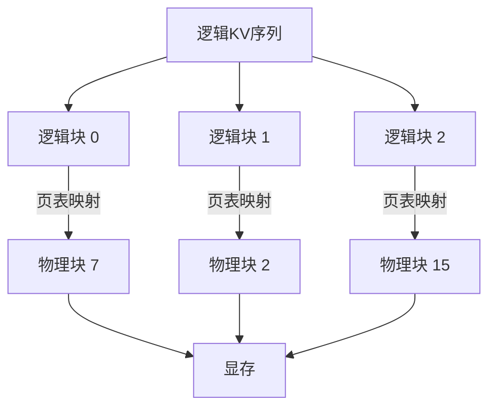
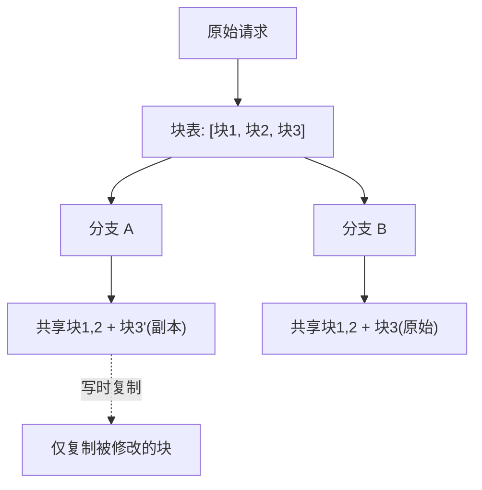

# 6.4 Paged Attention

**Paged Attention** 是 vLLM 提出的核心技术，借鉴操作系统的虚拟内存管理，将 KV Cache 分成固定大小的“页”进行管理。这一技术解决了 KV Cache 的内存碎片问题，大幅提升了显存利用率和系统吞吐量。

想象一座图书馆的书架管理。传统方式是给每本书预留一整排书架，即使只用了一半位置，剩下的也不允许其他书放入。Paged Attention 则把书架分成固定大小的格子，每本书可分散存放在不同格子里，用一张索引卡记录「哪一章在哪个格子」——空间利用率大幅提升，不再有空置浪费。

## 6.4.1 KV Cache 管理的挑战

### 传统方法的问题

回顾传统的 KV Cache 管理：

**预分配**：按最大序列长度 $L_{\max}$ 为每个请求预分配 KV Cache。

问题：
- 大多数请求远不及 $L_{\max}$，造成严重浪费
- 设 $L_{\max} = 2048$，平均实际长度 512，浪费率 75%

这就像酒店给每位客人都预留一整层楼，即使大多数人只用了一个房间。

**动态分配**：按实际长度分配连续内存。

问题：
- 不同请求长度不同，释放后留下碎片
- 碎片导致无法容纳新请求，即使总空闲内存足够

### 碎片示例

```text
时刻 T1: |---Req1(1024)---|---Req2(512)---|---Req3(1024)---|---Free---|
时刻 T2: |---Req1(1024)---|-----Free-----|---Req3(1024)---|---Free---|
                          ^Req2 结束
时刻 T3: 新请求 Req4 需要 1024，但最大连续空闲只有 512，无法分配
```

即使总空闲内存足够（512 + 剩余 Free），也因碎片无法使用——好比停车场里很多空位全是零散的半个车位，大车根本停不进去。

### 显存利用率

研究表明，传统方法的有效显存利用率仅 20–40%，大量显存被预分配而未使用，或因碎片而无法利用。

## 6.4.2 Paged Attention 原理

### 核心思想

**Paged Attention** 将 KV Cache 划分为固定大小的**块**（block / page），类似操作系统的分页内存：

1. 物理内存（显存）被划分为等大小的物理页
2. 每个请求的 KV Cache 由多个页组成，不必连续
3. 用页表（page table）记录虚拟页到物理页的映射

回到图书馆的例子：物理页就是书架上的格子，页表就是索引卡。一本书的各章节无需放在连续格子里，只要索引卡记录清楚「第 3 章在 A 区第 7 格，第 4 章在 C 区第 2 格」，就能随时找到。



### 块的定义

一个**块**（block）包含固定数量 $B$ 个 token 的 KV 向量：

$$\text{Block size} = B \times H \times d_k \times 2 \text{ (K 和 V)}$$

其中：
- $B$ 为块内 token 数（典型值 16），即每个物理页存储 $B$ 个连续 token 的 KV
- $H$ 为注意力头数
- $d_k$ 为每个头的维度
- 因子 2 表示 K 和 V 各占一份

典型的 $B = 16$。例如 LLaMA-7B（$H=32$，$d_k=128$，FP16），每块占用 $16 \times 32 \times 128 \times 2 \times 2 = 262{,}144 \text{ bytes} = 256$ KB。

### 地址映射

每个请求维护一个**块表**（block table）：

```text
请求 1 的块表: [物理块 7, 物理块 2, 物理块 15, ...]
请求 2 的块表: [物理块 3, 物理块 9, ...]
```

访问第 $t$ 个 token 的 KV：
1. 计算逻辑块号：$b = \lfloor t / B \rfloor$
2. 查块表得物理块号
3. 计算块内偏移：$o = t \mod B$

### 动态增长

请求生成新 token 时：
1. 若当前块未满，直接写入
2. 若当前块已满，分配新的物理块，加入块表

无需预分配，内存精确使用——就像在笔记本上写字，写满一页再翻下一页，而非一开始就准备 100 页空白纸。

## 6.4.3 实现细节

### 物理内存管理

维护一个**空闲块列表**（free block list）：

- 初始：所有物理块都在空闲列表
- 分配：从空闲列表取出块
- 释放：请求结束后，归还块到空闲列表

与操作系统的页框分配完全类似。

### 注意力计算

Paged Attention 的注意力计算需要处理非连续的 KV：

```python
def paged_attention(query, key_cache, value_cache, block_tables, context_lens):
    # query: [batch, 1, heads, head_dim]
    # key_cache: [num_blocks, block_size, heads, head_dim]
    # block_tables: [batch, max_blocks]
    
    outputs = []
    for i in range(batch):
        # 收集该请求的所有 KV 块
        blocks = block_tables[i, :num_blocks_for_request_i]
        keys = key_cache[blocks].reshape(-1, heads, head_dim)  # 拼接
        values = value_cache[blocks].reshape(-1, heads, head_dim)
        
        # 标准注意力计算
        attn = softmax(query[i] @ keys.T / sqrt(d)) @ values
        outputs.append(attn)
    return stack(outputs)
```

实际实现使用 CUDA kernel 优化，避免显式拼接。

### vLLM 的 Paged Attention Kernel

vLLM 实现了高效的 Paged Attention CUDA kernel：

1. **分块加载**：按块加载 KV，无需连续内存
2. **融合计算**：注意力计算和 KV 读取融合
3. **向量化**：利用 GPU 的向量指令

相比朴素实现有显著加速。

## 6.4.4 Copy-on-Write 与并行采样

### 并行采样的挑战

Beam Search 或并行采样需要从同一前缀生成多个分支。传统方法：

1. 复制整个 KV Cache（显存翻倍）
2. 或重新 Prefill（计算翻倍）

### Copy-on-Write

**Copy-on-Write**（CoW）借鉴自操作系统，理解起来很直觉——假设你和室友合看一套笔记，只要两人都只是「读」，共享一份就够了；只有当其中一人要「写」（修改）时，才需要复印被修改的那一页：

1. 分支时，新请求共享原请求的块（只复制块表）
2. 当某个分支写入已共享的块时，才真正复制该块

示例：
```text
原请求: [块1, 块2, 块3]
分支后:
  请求A: [块1, 块2, 块3] (共享)
  请求B: [块1, 块2, 块3] (共享)
  
请求A 生成新 token，写入块3:
  请求A: [块1, 块2, 块3'] (块3' 是块3 的副本)
  请求B: [块1, 块2, 块3]  (保持原块3)
```



### 引用计数

每个物理块维护**引用计数**：

- 分配时：引用计数 = 1
- 共享时：引用计数 += 1
- 释放时：引用计数 -= 1；若为 0，归还空闲列表

CoW 使 Beam Search 的显存开销从 $O(k \cdot n)$ 降为 $O(n + k \cdot \Delta)$。

其中：
- $k$ 为 Beam 宽度（分支数）
- $n$ 为共享前缀的序列长度
- $\Delta$ 为每个分支在共享前缀之后新增的平均 token 数

从实际意义来看，共享前缀只存一份，只有真正“分叉”的新增块才需复制，显存节省显著。

## 6.4.5 Prefix Caching

### 共享前缀

多个请求可能有相同的前缀：

- 系统提示（System Prompt）
- Few-shot 示例
- 多轮对话的历史

为每个请求独立存储前缀是浪费。

### 基于 Paged Attention 的 Prefix Caching

利用 Paged Attention 的分页特性：

1. 计算前缀的哈希值
2. 若缓存命中，新请求直接引用已有的块
3. 新请求只需分配后续 token 的块

```text
前缀 "You are a helpful assistant..." 的块: [块10, 块11, 块12]

请求 A: [块10, 块11, 块12, 块20, 块21] (共享前缀，独有后缀)
请求 B: [块10, 块11, 块12, 块30]       (共享前缀，独有后缀)
```

### 自动 Prefix Caching

vLLM 支持自动检测可共享的前缀：

1. 对 KV 块计算内容哈希
2. 维护哈希到物理块的映射
3. 新请求的 Prefill 可以跳过已缓存的部分

这对有大量相似请求的场景（如 chatbot）非常有效。

## 6.4.6 性能分析

### 显存利用率提升

Paged Attention 将显存利用率从 20–40% 提升到接近 100%（仅最后一个未填满的块有浪费）——从「给每本书预留整排书架」变成了「按需分配格子」。

设块大小 $B = 16$，最坏情况每个请求浪费 15 个 token 的空间，浪费率：

$$\text{浪费} < \frac{B - 1}{\text{平均序列长度}}$$

其中 $B$ 为块大小（token 数）。最坏情况下每个请求的最后一个块浪费 $B-1$ 个位置。

对于平均长度 512 的请求，浪费 < 3%——相比传统预分配方法 20–40% 的浪费率，提升巨大。

### 吞吐量提升

更高的显存利用率 → 更大的批处理 → 更高的吞吐量。

vLLM 论文报告，相比 HuggingFace Transformers：

- 吞吐量提升 2-4x
- 可同时服务的请求数增加 10-20x

### 延迟影响

Paged Attention 引入了页表查询和非连续内存访问的开销，但：

1. 精心优化的 kernel 使开销很小
2. 更高的批处理效率弥补了开销

整体延迟与传统方法相当或更好。

## 6.4.7 与其他技术的结合

### 与 Continuous Batching

Paged Attention 天然支持 Continuous Batching：

- 新请求加入：分配新块
- 请求结束：释放块
- 无需等待批内所有请求结束

### 与量化

KV Cache 量化（INT8/INT4）与 Paged Attention 正交：

- 块内数据按量化格式存储
- 页表管理方式不变

两者结合可以进一步降低显存占用。

### 与模型并行

在 Tensor Parallel 下，每个 GPU 管理自己的 KV Cache 部分。Paged Attention 的分页策略可以独立应用于每个 GPU。

在 Pipeline Parallel 下，KV Cache 可以在 stage 之间传递，Paged Attention 的块可以高效序列化/反序列化。
