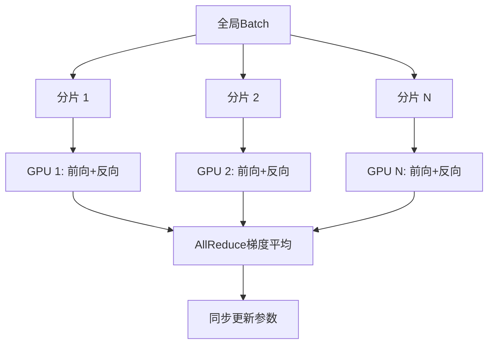
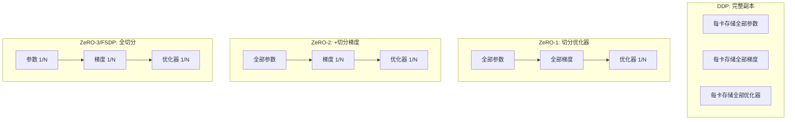

# 7.3 数据并行

**数据并行**（Data Parallelism）是最基础的分布式训练策略：将数据批次切分到多个设备，每个设备持有完整的模型副本。本节介绍从简单的 DP 到现代的 DDP 和 FSDP 的演进。

想象一个大厨房里有 8 个厨师，每人手上都有一本完全相同的菜谱（模型副本）。老板把当天 800 份订单平均分给 8 人，每人负责 100 份。大家同时开工，完成后交流心得（梯度平均），统一调整菜谱（参数更新）。

## 7.3.1 数据并行基础

### 原理

假设有 $N$ 个 GPU，全局批大小为 $B$：

1. 将 batch 均分为 $N$ 份，每份大小 $b = B/N$
2. 每个 GPU 用自己的数据计算前向、反向
3. 所有 GPU 的梯度求平均（AllReduce）
4. 各自用平均梯度更新参数



### 数学表示

设第 $i$ 个 GPU 计算的梯度为 $\mathbf{g}_i$，全局梯度：

$$\mathbf{g} = \frac{1}{N} \sum_{i=1}^N \mathbf{g}_i$$

其中：
- $N$ 为 GPU 数量
- $\mathbf{g}_i$ 为第 $i$ 个 GPU 上计算的局部梯度（基于 $b = B/N$ 个样本）
- $\mathbf{g}$ 为全局平均梯度，数学上等价于在全局 batch $B$ 上计算的梯度

换句话说，每个厨师独立评判自己负责的 100 份菜，然后取平均意见——结果与一个厨师尝遍 800 份的效果等价。

### 简单 DP（PyTorch DataParallel）

PyTorch 的 `torch.nn.DataParallel`（DP）是最简单的实现：

```python
model = nn.DataParallel(model)
```

问题：
- **单进程多线程**：受 Python GIL 限制
- **GPU 0 瓶颈**：梯度聚合和参数广播都在 GPU 0
- **效率低**：实际训练很少使用

## 7.3.2 DDP：分布式数据并行

### 多进程架构

**DDP**（DistributedDataParallel）采用多进程架构：

- 每个 GPU 一个进程
- 进程间通过 NCCL 通信
- 无 GIL 限制

```python
# 初始化进程组
torch.distributed.init_process_group(backend='nccl')

# 包装模型
model = torch.nn.parallel.DistributedDataParallel(
    model.to(rank),
    device_ids=[rank]
)
```

### Gradient Bucketing

DDP 的关键优化是**梯度分桶**（Gradient Bucketing）：

1. 将参数按一定大小分成多个"桶"
2. 反向传播时，一个桶的梯度全部计算完成后，立即开始 AllReduce
3. 通信与计算重叠

```
时间线：
反向传播: [Layer N] [Layer N-1] [Layer N-2] ...
AllReduce:          [Bucket 1]  [Bucket 2]  ...
```

### Ring-AllReduce

DDP 默认使用 **Ring-AllReduce** 算法：

1. 将 $N$ 个 GPU 组成逻辑环
2. 每个 GPU 将数据分成 $N$ 份
3. 第一轮：每个 GPU 向下一个发送一份，同时接收上一个的一份，并累加
4. 经过 $N-1$ 轮，每个 GPU 持有一份完整的部分和
5. 再经过 $N-1$ 轮广播，所有 GPU 持有完整结果

通信量：$2 \cdot (N-1) / N \cdot |\mathbf{g}|$

其中：
- $|\mathbf{g}|$ 为梯度向量的总字节数（即模型参数量 $P$ $\times$ 每参数字节数）
- 因子 $(N-1)/N$ 说明每个 GPU 传输的数据量接近于一份完整梯度，与 GPU 数量 $N$ 几乎无关
- 因子 2 来自 Ring-AllReduce 的两个阶段：Reduce-Scatter（$N-1$ 轮求和）和 AllGather（$N-1$ 轮广播）

这意味着 Ring-AllReduce 的通信量与 GPU 数量几乎无关（当 $N$ 较大时 $(N-1)/N \approx 1$），这是它适合大规模分布式训练的关键原因。

## 7.3.3 DDP 的显存分析

### 显存组成

每个 GPU 需要存储：

| 组件 | 大小（FP16/FP32） |
|------|-------------------|
| 模型参数 | $2P$ / $4P$ |
| 梯度 | $2P$ / $4P$ |
| 优化器状态（Adam） | $8P$（FP32） |
| 激活值 | 与 batch 和模型相关 |

其中：
- $P$ 为模型参数量
- $2P$：FP16 存储（每参数 2 字节），$4P$：FP32 存储（每参数 4 字节）
- Adam 优化器状态包含 FP32 参数副本（$4P$）、一阶矩 $m$（$4P$）、二阶矩 $v$（约 $4P$），共 $\sim 12P$（当使用混合精度时约简为 $8P$ 字节）

总计：混合精度 + Adam 时每卡约需 $16P$ 字节（不含激活值）。比如 7B 模型，$16 \times 7 \times 10^9 \approx 112$ GB——这解释了为什么 80GB 的 A100 可能都放不下一个 7B 模型的训练状态。

### 显存冗余

**DDP 的问题**：每个 GPU 存储完整的模型、梯度、优化器状态——$N$ 倍冗余。如同 8 个厨师每人都备了一套完整厨具、一本完整笔记、一套完整报表，明明共享一套就够了。

对于 70B 模型，单卡需要 ~1TB 显存，即使有 8 卡也放不下。

## 7.3.4 FSDP：全切片数据并行

### ZeRO 优化

**ZeRO**（Zero Redundancy Optimizer，DeepSpeed）提出了三级显存优化：

| 级别 | 切分内容 | 单卡显存 |
|------|----------|----------|
| ZeRO-1 | 优化器状态 | $4P + 2P + 8P/N$ |
| ZeRO-2 | + 梯度 | $4P + 2P/N + 8P/N$ |
| ZeRO-3 | + 参数 | $4P/N + 2P/N + 8P/N$ |

其中：
- $P$ 为模型参数量
- $N$ 为 GPU 数量
- $4P$ 为 FP32 参数副本（混合精度训练时的主副本），$2P$ 为 FP16 梯度，$8P$ 为 Adam 优化器状态（包含一阶矩 $4P$ + 二阶矩 $4P$）
- ZeRO-1 只切分优化器状态：$8P/N$；参数和梯度仍为完整副本
- ZeRO-2 额外切分梯度：$2P/N$
- ZeRO-3 全部切分：单卡显存降为 $14P/N$，约为原始 DDP 的 $1/N$

用大白话讲：DDP 中每个 GPU 存储完整的参数、梯度、优化器状态（约 $16P$ 字节），$N$ 卡就有 $N$ 倍冗余。ZeRO 通过逐步切分这些状态来消除冗余，代价是计算时需通信收集完整数据。

ZeRO-3 将所有内容切片，单卡显存降为 $1/N$。



### FSDP 原理

**FSDP**（Fully Sharded Data Parallel）是 PyTorch 对 ZeRO-3 的实现。

回到厨房场景：现在 8 个厨师不再每人备齐全套厨具，而是每人只保管八分之一的工具。需要用某把刀时向保管者借一下（AllGather），用完立即归还。每人工作台空间小得多，但也需要更频繁的交流。

**切片存储**：每个 GPU 只存储 $1/N$ 的参数、梯度、优化器状态。

**计算时重建**：需要某层参数时，通过 AllGather 收集完整参数。

**计算后丢弃**：计算完成后，丢弃非本地的参数分片。

### FSDP 训练流程

```
前向传播:
  for layer in layers:
    AllGather(layer.params)      # 收集完整参数
    output = layer(input)        # 前向计算
    discard(non_local_params)    # 丢弃非本地参数

反向传播:
  for layer in reversed(layers):
    AllGather(layer.params)      # 收集完整参数
    backward(layer)              # 反向计算
    ReduceScatter(layer.grads)   # 聚合并切片梯度
    discard(non_local_params)    # 丢弃非本地参数
```

### 通信开销

FSDP 的通信量增加了（毕竟借工具需要时间）：

- 前向：每层 AllGather
- 反向：每层 AllGather + ReduceScatter

总通信量约为 DDP 的 1.5 倍，但换来了显著的显存节省。这是经典的空间换通信权衡——每个厨师的工作台整洁了，但借还工具的次数多了。

### 使用示例

```python
from torch.distributed.fsdp import FullyShardedDataParallel as FSDP
from torch.distributed.fsdp import ShardingStrategy

model = FSDP(
    model,
    sharding_strategy=ShardingStrategy.FULL_SHARD,  # ZeRO-3
    # sharding_strategy=ShardingStrategy.SHARD_GRAD_OP,  # ZeRO-2
    mixed_precision=MixedPrecision(...),
    auto_wrap_policy=...,
)
```

## 7.3.5 FSDP 高级配置

### 分片策略

| 策略 | 等价 | 显存 | 通信 |
|------|------|------|------|
| FULL_SHARD | ZeRO-3 | 最低 | 最高 |
| SHARD_GRAD_OP | ZeRO-2 | 中等 | 中等 |
| NO_SHARD | DDP | 最高 | 最低 |

### 自动包装

`auto_wrap_policy` 决定如何划分 FSDP 单元：

```python
from torch.distributed.fsdp.wrap import transformer_auto_wrap_policy

# Transformer 层级包装
auto_wrap_policy = functools.partial(
    transformer_auto_wrap_policy,
    transformer_layer_cls={TransformerBlock}
)
```

每个 TransformerBlock 作为一个 FSDP 单元，粒度适中。

### 混合精度

```python
from torch.distributed.fsdp import MixedPrecision

mixed_precision_policy = MixedPrecision(
    param_dtype=torch.bfloat16,    # 参数类型
    reduce_dtype=torch.bfloat16,   # 通信类型
    buffer_dtype=torch.bfloat16,   # buffer 类型
)
```

### CPU Offload

将不活跃的参数/梯度卸载到 CPU：

```python
from torch.distributed.fsdp import CPUOffload

model = FSDP(
    model,
    cpu_offload=CPUOffload(offload_params=True)
)
```

进一步降低显存，但增加 CPU-GPU 传输开销。

## 7.3.6 DDP vs FSDP 选择

| 维度 | DDP | FSDP |
|------|-----|------|
| 显存效率 | 低（冗余存储） | 高（切片存储） |
| 通信量 | 低 | 高 |
| 实现复杂度 | 简单 | 较复杂 |
| 适用规模 | 小模型 | 大模型 |

**选择建议**：

- 模型能放入单卡 → DDP
- 模型放不下单卡 → FSDP
- 追求最高吞吐 → 结合 TP/PP

## 7.3.7 梯度累积

### 大 Batch 训练

大模型训练通常需要大 batch（数千甚至数万），但显存限制了单步 batch 大小。

**梯度累积**（Gradient Accumulation）解决这个问题：

```python
accumulation_steps = 8
optimizer.zero_grad()

for i, batch in enumerate(dataloader):
    loss = model(batch) / accumulation_steps
    loss.backward()  # 梯度累加
    
    if (i + 1) % accumulation_steps == 0:
        optimizer.step()
        optimizer.zero_grad()
```

等效 batch 大小 = 实际 batch × 累积步数 × GPU 数。

### 与 DDP/FSDP 结合

梯度累积与数据并行正交。累积期间不需要通信，只在 `optimizer.step()` 前同步梯度。

```python
# FSDP 中使用 no_sync 跳过中间同步
with model.no_sync():
    for micro_batch in micro_batches[:-1]:
        loss = model(micro_batch)
        loss.backward()

# 最后一个 micro_batch 正常同步
loss = model(micro_batches[-1])
loss.backward()
optimizer.step()
```
