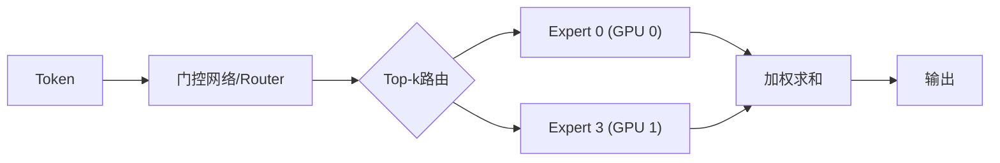
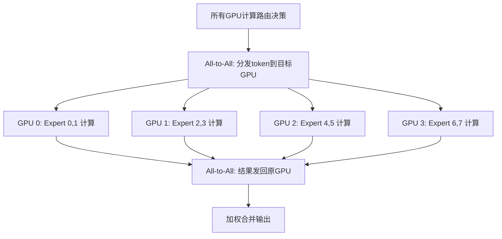

# 7.6 专家并行

**专家并行**（Expert Parallelism, EP）是 MoE（Mixture of Experts）模型的专用并行策略。MoE 模型通过稀疏激活扩大参数规模，EP 将不同专家分布到不同设备，配合 All-to-All 通信实现高效训练。

想象一家大医院的门诊：有 64 个专科医生（专家），每个患者（token）根据症状被分诊到 2 个科室。并不是每个患者都要看所有科，而是根据病情精准分流——这就是 MoE 的「稀疏激活」思想。专家并行则是把这些医生分布在不同的诊所大楼（GPU）里。

## 7.6.1 MoE 模型回顾

### MoE 结构

MoE 层将 FFN 替换为多个"专家"FFN，每个 token 只路由到 top-$k$ 个专家：

$$\text{MoE}(\mathbf{x}) = \sum_{i \in \text{top-}k} g_i(\mathbf{x}) \cdot E_i(\mathbf{x})$$

其中：
- $\mathbf{x}$ 为单个 token 的隐藏向量
- $g_i(\mathbf{x})$ 为门控网络（Router）对专家 $i$ 的权重，满足 $\sum_{i \in \text{top-}k} g_i = 1$
- $E_i(\mathbf{x})$ 为第 $i$ 个专家网络（通常是一个 FFN）的输出
- top-$k$ 表示只激活门控权重最高的 $k$ 个专家（典型 $k=2$）



### 稀疏激活的优势

- **参数量大**：总参数 = 专家数 × 单专家参数
- **计算量小**：每个 token 只激活 top-$k$ 专家
- **条件计算**：不同输入使用不同专家

例如：64 个专家，top-2 路由，参数量 64×，计算量 2×。这就像医院虽然有 64 个医生，但每个患者只需要看 2 个科——服务能力巨大，但每次实际动用的资源很少。

## 7.6.2 专家并行的必要性

### 单卡装不下

Mixtral 8×7B：8 个专家，每个 7B 参数。

- 单专家显存：14GB（FP16）
- 8 个专家：112GB——超过单卡

### TP 的局限

TP 可以切分单个专家，但：

1. 通信发生在每个专家内部
2. 专家数越多，通信开销越大
3. 每次 All-to-All 后还需 AllReduce

EP 是更自然的选择：每个 GPU 负责若干完整的专家，如同每树诊所大楼各自安排几个科室，患者按分诊结果到对应大楼就诊。

## 7.6.3 EP 的工作原理

### 专家分配

设有 $E$ 个专家，$N$ 个 GPU，每个 GPU 持有 $E/N$ 个专家。

```
GPU 0: Expert 0, Expert 1
GPU 1: Expert 2, Expert 3
GPU 2: Expert 4, Expert 5
GPU 3: Expert 6, Expert 7
```

### All-to-All 通信

MoE 前向传播的流程就像医院的分诊系统：

1. **门控计算**：所有 GPU 计算路由决策（分诊台确定应该去哪个科）
2. **All-to-All（dispatch）**：将 token 发送到目标专家所在的 GPU（患者转移到对应科室）
3. **专家计算**：各 GPU 计算本地专家（医生诊疗）
4. **All-to-All（combine）**：将结果发回原 GPU（诊疗报告送回分诊台）
5. **加权求和**：按门控权重合并

```
Token 分发：
GPU 0: [t0, t1, t2, t3] ──All2All──> GPU 0: [t0_e0, t2_e1]
                                     GPU 1: [t1_e2, t3_e3]
                                     GPU 2: [t0_e4, t1_e5]
                                     GPU 3: [t2_e6, t3_e7]
```



### All-to-All 通信量

每个 token 发送到 top-$k$ 个专家，通信量：

$$\text{通信量} = 2 \times B \times S \times k \times d / N$$

其中：
- $B$ 为批大小，$S$ 为序列长度
- $k$ 为每个 token 激活的专家数（top-$k$）
- $d$ 为隐藏层维度
- $N$ 为 EP 度数（GPU 数）
- 因子 2 来自 dispatch 和 combine 两次 All-to-All

拆开来看：每个 token 需发送到 $k$ 个专家，然后结果发回。通信量与 $k$ 和 $d$ 成正比，被 $N$ 个 GPU 均摊。当专家数很多时（如 64 个），All-to-All 通信可能成为瓶颈。

## 7.6.4 负载均衡

### 负载不均问题

如果所有 token 都路由到少数专家：

1. 这些专家所在的 GPU 过载——就像所有患者都挤到同一个科室
2. 其他 GPU 空闲——其他科室门可罗雀
3. 训练效率低下

### 辅助损失

**负载均衡损失**（Load Balancing Loss）鼓励均匀路由：

$$L_{\text{balance}} = \alpha \cdot N \cdot \sum_{i=1}^N f_i \cdot P_i$$

其中：
- $N$ 为专家数量
- $f_i$ 为实际路由到专家 $i$ 的 token 比例（$\sum_i f_i = k$，因为每个 token 路由到 $k$ 个专家）
- $P_i$ 为门控网络分配给专家 $i$ 的平均概率
- $\alpha$ 为辅助损失权重（典型值 0.01）
- 前缀因子 $N$ 用于归一化

直觉上，当所有专家负载均匀时 $f_i = k/N$，$P_i = 1/N$，损失取最小值。若某个专家同时拥有高 $f_i$ 和高 $P_i$（又忙又被指名），损失增大，梯度优化会引导 Router 分散路由——如同医院设置分流奖励，避免某个科室挤爆。

### Capacity Factor

**容量因子**（Capacity Factor）限制每个专家处理的 token 数：

$$\text{Capacity} = \frac{B \times S}{E} \times \text{CF}$$

其中：
- $B \times S$ 为总 token 数
- $E$ 为专家数
- $B \times S / E$ 为理想均匀分配时每个专家的 token 数
- CF（Capacity Factor）为容量余量系数

超过容量的 token 被丢弃或使用备选专家。CF 太小会导致大量 token 丢弃，CF 太大则浪费计算和显存。典型值 1.25 表示留 25% 余量。

### Expert Choice 路由

**Expert Choice**（Zhou et al., 2022）反转路由逻辑：

- 传统：每个 token 选择专家
- Expert Choice：每个专家选择 token

每个专家选择固定数量的 token，天然负载均衡。

## 7.6.5 EP 与其他并行的组合

### EP + TP

当单个专家太大时，结合 EP 和 TP：

- EP：不同专家在不同 GPU 组
- TP：每个专家内部切分

通信：EP 的 All-to-All + TP 的 AllReduce

### EP + DP

数据并行时，每个 DP rank 持有完整的专家副本。

**专家复制**（Expert Replication）：

- 高频专家复制多份，分布在多个 GPU
- 低频专家可能只有一份

这增加了显存，但减少了通信。

### EP + PP

流水线并行中，MoE 层可能分布在不同 stage：

- 某些 stage 有 MoE，需要 EP 通信
- 某些 stage 只有普通 Transformer 层

调度需要协调 PP 的流水线和 EP 的 All-to-All。

## 7.6.6 通信优化

### 重叠计算与通信

All-to-All 通信可以与计算重叠：

1. 分块发送/接收
2. 已到达的 token 立即计算
3. 计算结果立即发回

```
All2All chunk 1 → Compute chunk 1 → All2All chunk 1 back
    All2All chunk 2 → Compute chunk 2 → ...
```

### 拓扑感知路由

网络拓扑影响 All-to-All 效率：

- 同一交换机下的 GPU 通信更快
- 可以将常一起路由的专家放在临近 GPU

### 专家 Offload

低频专家可以 offload 到 CPU/磁盘：

1. 当 token 路由到 offload 专家时，按需加载
2. 计算完成后卸载
3. 适合推理场景

## 7.6.7 框架支持

### DeepSpeed MoE

DeepSpeed 提供了完整的 MoE 支持：

```python
from deepspeed.moe.layer import MoE

moe_layer = MoE(
    hidden_size=hidden_size,
    expert=expert_module,
    num_experts=64,
    ep_size=8,  # EP 并行度
    k=2,        # top-k
    capacity_factor=1.25,
    use_residual=True,
)
```

### Megatron-DeepSpeed

结合 Megatron 的 TP/PP 和 DeepSpeed 的 EP：

```
3D + Expert 并行:
  TP = 8 (单机内)
  PP = 4 (跨机)
  EP = 8 (专家分布)
  DP = 4 (数据复制)
  总计: 8 × 4 × 4 = 128 GPU (EP 与 DP 共享维度)
```

### Tutel

微软的 **Tutel** 专门优化 MoE 通信：

- 自适应路由算法
- 动态容量调整
- All-to-All 优化

## 7.6.8 实践建议

### EP 度数选择

| 专家数 | 推荐 EP |
|--------|---------|
| 8 | 2-8 |
| 64 | 8-64 |
| 128 | 16-128 |

原则：EP ≤ 专家数，且与网络拓扑匹配。

### 负载均衡参数

| 参数 | 典型值 | 说明 |
|------|--------|------|
| 辅助损失权重 | 0.01 | 太大影响主任务 |
| Capacity Factor | 1.25 | 留一定余量 |
| top-k | 2 | 平衡效率和效果 |

### 监控指标

- **路由熵**：衡量路由的均匀程度
- **专家利用率**：各专家处理的 token 比例
- **Token 丢弃率**：因容量不足丢弃的 token
- **All-to-All 时间**：通信开销
