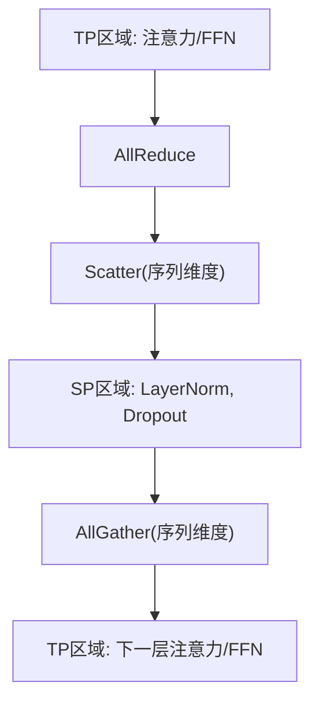
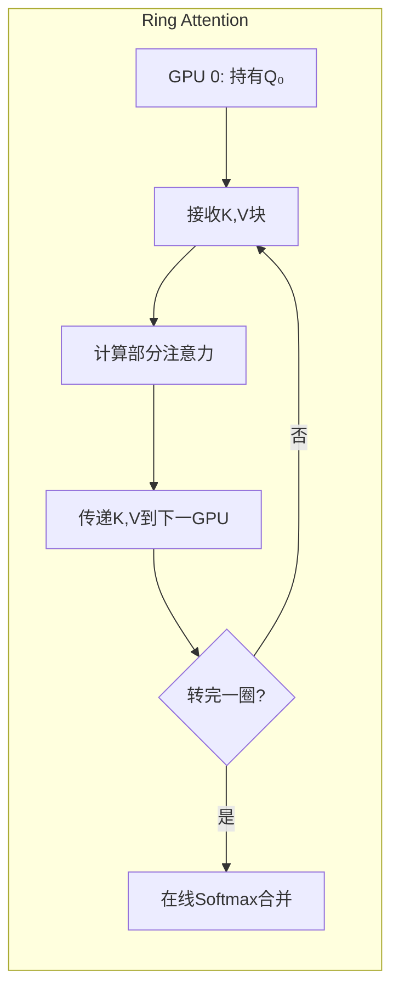
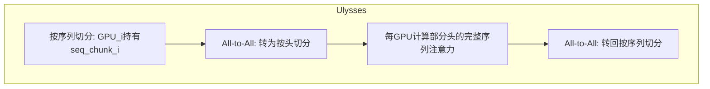

# 7.7 序列并行与上下文并行

当序列长度达到数万甚至数百万 token 时，激活值的显存占用成为瓶颈。**序列并行**（Sequence Parallelism, SP）和**上下文并行**（Context Parallelism, CP）通过切分序列维度来解决这一问题。

假设你要读一本超长的小说（128K token），一个人的桌子上根本放不下整本书的笔记。前面的并行方法是把「笔记内容」切分（TP 切隐藏维度），但笔记的「页数」（序列长度）没变。序列并行和上下文并行则是把这本小说的不同章节分给不同的人读，每个人只负责一部分页码的笔记。

## 7.7.1 长序列的挑战

### 激活值显存

Transformer 的激活值显存与序列长度成正比（甚至平方关系）：

| 组件 | 显存复杂度 |
|------|------------|
| 输入 embedding | $O(S \cdot d)$ |
| 注意力 $\mathbf{Q}, \mathbf{K}, \mathbf{V}$ | $O(S \cdot d)$ |
| 注意力分数 $\mathbf{S}$ | $O(S^2)$（无 Flash Attention） |
| FFN 中间激活 | $O(S \cdot d_{ff})$ |

对于 $S = 128K$，$d = 8192$，单层激活可达数十 GB。

### TP 无法解决

TP 切分的是隐藏维度 $d$，不影响序列维度 $S$。每个 GPU 仍需存储完整序列的激活。

用读书的比喻来说：TP 相当于每个人读完整本书但只做部分类型的笔记，序列维度（书的页数）没有减少。我们需要新的并行维度——切分序列本身，让每个人只负责一部分页码。

## 7.7.2 Megatron 序列并行

### 基本思想

Megatron 的 **SP** 与 TP 配合工作，切分 TP 中**不需要通信**的部分：

- LayerNorm、Dropout 等算子是 element-wise 的
- 它们不需要跨设备通信
- 可以沿序列维度切分

### 工作方式

考虑 TP + SP 的组合：

1. **注意力和 FFN**：使用 TP，需要 AllReduce
2. **LayerNorm、Dropout**：使用 SP，沿序列切分
3. **TP → SP 转换**：AllReduce 后 scatter 到序列维度
4. **SP → TP 转换**：AllGather 恢复完整序列

```
[TP 区域: 注意力/FFN] 
    → AllReduce 
    → Scatter (序列维度)
[SP 区域: LayerNorm, Dropout]
    → AllGather (序列维度)
[TP 区域: 下一层注意力/FFN]
```



### 显存节省

SP 将 LayerNorm 和 Dropout 的激活均摊到 TP 组：

- 无 SP：每个 GPU 存储 $O(S \cdot d)$ 激活
- 有 SP：每个 GPU 存储 $O(S/T \cdot d)$ 激活

配合 TP=$T$，这部分激活减少 $T$ 倍。

### 局限性

Megatron SP 只能切分 element-wise 操作，无法切分注意力计算本身。当 $S^2$ 的注意力成为瓶颈时，需要更强的并行策略。

## 7.7.3 上下文并行（Context Parallelism）

### 动机

长上下文模型（如 128K、1M token）的核心瓶颈是注意力的 $O(S^2)$ 复杂度。

**上下文并行**（CP）直接切分序列，让注意力计算也能并行：

$$\mathbf{Q} = [\mathbf{Q}_1 | \mathbf{Q}_2 | \ldots | \mathbf{Q}_C]$$
$$\mathbf{K} = [\mathbf{K}_1 | \mathbf{K}_2 | \ldots | \mathbf{K}_C]$$
$$\mathbf{V} = [\mathbf{V}_1 | \mathbf{V}_2 | \ldots | \mathbf{V}_C]$$

其中 $C$ 是 CP 度数。

### 挑战

注意力计算需要**全局信息**：

$$\text{Attention}(\mathbf{Q}_i, \mathbf{K}, \mathbf{V}) = \text{softmax}\left(\frac{\mathbf{Q}_i \mathbf{K}^\top}{\sqrt{d_k}}\right) \mathbf{V}$$

其中：
- $\mathbf{Q}_i$ 为第 $i$ 个 GPU 持有的查询块（序列的一部分）
- $\mathbf{K}, \mathbf{V}$ 为完整的键和值矩阵（分布在所有 GPU 上）
- $d_k$ 为每个注意力头的维度

核心困难在于：$\mathbf{Q}_i$ 需要与**所有** $\mathbf{K}, \mathbf{V}$ 交互，而不仅仅是本地那一块——就像读小说时第 50 章可能需要参考前 49 章任何地方的线索，不能完全独立地读某一章。这就是为什么需要 Ring Attention 或 Ulysses 等复杂通信策略。

## 7.7.4 Ring Attention

### 基本思想

**Ring Attention**（Liu et al., 2023）通过环形通信解决 CP 的挑战。想象一个读书会，每个人持有小说的一章，大家围成一圈。每个人保留自己的章节（Q），但把笔记（K、V）按顺时针传给下一个人，同时从上一个人那里收到新的笔记。每收到一份笔记就更新自己的理解，转一圈后每个人就看过了所有章节的笔记：

1. 将 GPU 组成逻辑环
2. 每个 GPU 持有一块 $\mathbf{Q}$
3. $\mathbf{K}, \mathbf{V}$ 块在环中循环传递
4. 每个 GPU 累积计算部分注意力

### 算法流程

设 CP 度数为 $C$，GPU $i$ 持有 $\mathbf{Q}_i$，初始持有 $\mathbf{K}_i, \mathbf{V}_i$。

```python
for step in range(C):
    # 当前 GPU 持有 K_j, V_j (j = (i + step) % C)
    # 计算 Q_i 与 K_j, V_j 的部分注意力
    partial_out, partial_lse = attention(Q_i, K_j, V_j)
    
    # 累积结果（在线 softmax）
    out, lse = merge_attention(out, lse, partial_out, partial_lse)
    
    # 环形传递 K, V
    K_j = ring_send_recv(K_j, direction='next')
    V_j = ring_send_recv(V_j, direction='next')
```



### 在线合并

不同块的注意力结果需要正确合并。利用在线 softmax 的 log-sum-exp（LSE）：

$$\text{out} = \frac{e^{\text{lse}_1} \cdot \text{out}_1 + e^{\text{lse}_2} \cdot \text{out}_2}{e^{\text{lse}_1} + e^{\text{lse}_2}}$$

其中：
- $\text{out}_1, \text{out}_2$ 为两个块的局部注意力输出
- $\text{lse}_1, \text{lse}_2$ 为对应块的 log-sum-exp 值（$\text{lse} = \log \sum_j e^{s_j}$，其中 $s_j$ 为注意力分数）
- 分母 $e^{\text{lse}_1} + e^{\text{lse}_2}$ 保证合并后的注意力权重仍然正确归一化

这个公式告诉我们：可以将两个局部 softmax 的结果正确合并为一个全局 softmax 的结果。这与 Flash Attention 中的在线 Softmax 原理完全一致——都是通过维护 LSE 统计量来避免存储完整的注意力矩阵。

这保证了数值正确性。

### 通信与计算重叠

Ring Attention 的精髓在于通信与计算的重叠——当你在读当前收到的笔记时，下一份笔记已在传递路上：

- 当前块的注意力计算
- 下一块 K、V 的发送/接收

通信被计算完全掩盖（理想情况下）。

## 7.7.5 Ulysses

### DeepSpeed Ulysses

**Ulysses**（DeepSpeed, 2024）是另一种 CP 实现，使用 All-to-All 而非环形通信。

### 工作方式

1. **All-to-All 分发**：将按序列切分的 Q、K、V 变换为按头切分
2. **本地注意力**：每个 GPU 计算部分头的完整序列注意力
3. **All-to-All 聚合**：将结果变换回按序列切分

```
输入: 每个 GPU 持有序列的一部分，所有头
      GPU_i: [seq_chunk_i, all_heads]

All-to-All 转置:
      GPU_i: [all_seq, head_chunk_i]

本地注意力计算:
      GPU_i: Attention on head_chunk_i with full sequence

All-to-All 转回:
      GPU_i: [seq_chunk_i, all_heads]
```



### 与 Ring Attention 的对比

| 维度 | Ring Attention | Ulysses |
|------|----------------|---------|
| 通信模式 | P2P 环形 | All-to-All |
| 通信轮次 | $C$ 轮 | 2 轮 |
| 计算-通信重叠 | 天然支持 | 需要额外优化 |
| 适用拓扑 | 环形连接 | 全连接 |

Ring Attention 在环形拓扑（如 NVLink 环）下更优；Ulysses 在全连接拓扑下更高效。

## 7.7.6 实践配置

### 与其他并行的组合

典型的长序列训练配置：

```
TP = 8 (机内)
SP = 8 (与 TP 相同)
CP = 4 (跨机)
DP = 8 (跨机)
PP = 1 (通常不与 CP 组合)

总 GPU = 8 × 4 × 8 = 256
```

### 框架支持

**Megatron-LM**：原生支持 SP 和 CP

```python
# Context Parallel 配置
context_parallel_size = 4
```

**DeepSpeed Ulysses**：

```python
from deepspeed.sequence.layer import DistributedAttention

attention = DistributedAttention(local_attention, sp_group)
```

### 序列长度选择

| 序列长度 | 推荐配置 |
|----------|----------|
| 4K-8K | TP + SP |
| 32K-128K | TP + SP + CP |
| 128K-1M | TP + SP + CP (高度数) |

## 7.7.7 变长序列处理

### 问题

CP 假设序列长度固定且能整除 CP 度数。实际中序列长度各异。

### 解决方案

**序列打包**（Sequence Packing）：

1. 将多个短序列拼接成一个长序列
2. 用注意力掩码区分不同序列
3. 拼接后的长度统一，适合 CP

```
Original: [seq1 (100)] [seq2 (200)] [seq3 (50)]
Packed:   [seq1 | seq2 | seq3 | padding] (length = 4K)
Mask:     Prevent cross-sequence attention
```

### 动态序列并行

一些研究探索动态调整 CP：

- 短序列：不使用 CP
- 长序列：启用 CP

但实现复杂，需要运行时决策。
