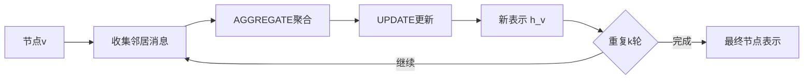

# 图神经网络

## 图结构数据的普遍性

在科学研究与工程实践中，大量数据天然地以图结构呈现。分子可以表示为原子节点与化学键边的组合，蛋白质相互作用网络刻画了生物功能模块，晶体材料的原子排列形成周期性图结构，社交网络反映人际关系的拓扑特征。这些图结构数据具有以下共同特点：节点数目可变、边的连接模式不规则、全局结构包含丰富的语义信息。

想象一下你小区的社交网络：每个人是一个节点，两个人之间的友谊是一条边。有的人朋友多，有的人朋友少；有的人圈子重叠，有的人各自独立——这种不规则的连接模式正是图结构的特征。传统的深度学习工具就像拿着一把直尺去量一棵树的枝条走向——工具不对。

传统的深度学习方法（如CNN、RNN）针对欧几里得空间中的规则数据（图像、序列）设计，无法直接处理图结构。将图数据强行转换为向量会丢失拓扑信息，而枚举所有节点对的方法在计算上不可行。图神经网络（Graph Neural Network, GNN）的提出正是为了在保持图结构的前提下进行表示学习。

## 消息传递范式

现代图神经网络的核心思想是消息传递（Message Passing），通过迭代地聚合邻居信息来更新节点表示。最直观的理解方式是邻里传言：小区里每个人先向自己的邻居收集消息，汇总之后更新自己对世界的认知。第一轮，你只知道紧邻的情况；第二轮，你通过邻居的邻居获取了更远的信息；几轮之后，整个小区的动态你都心中有数了。



形式化地说，设图 $G = (V, E)$ 包含节点集 $V$ 和边集 $E$，节点 $v$ 的特征为 $\mathbf{h}_v$，边 $(u, v)$ 的特征为 $\mathbf{e}_{uv}$。消息传递的一般形式为：

$$\mathbf{m}_v^{(l)} = \text{AGGREGATE}^{(l)}\left(\left\{\mathbf{h}_u^{(l-1)} : u \in \mathcal{N}(v)\right\}\right)$$

$$\mathbf{h}_v^{(l)} = \text{UPDATE}^{(l)}\left(\mathbf{h}_v^{(l-1)}, \mathbf{m}_v^{(l)}\right)$$

其中 $\mathcal{N}(v)$ 表示节点 $v$ 的邻居集合，$l$ 表示层数。AGGREGATE函数将邻居信息汇聚成消息，UPDATE函数结合节点自身信息与消息进行更新。不同的GNN变体主要在这两个函数的设计上有所区别。

## 经典图神经网络架构

### 图卷积网络（GCN）

图卷积网络将卷积操作推广到图结构上。谱方法从图的拉普拉斯矩阵出发，在频域定义卷积；空域方法直接在节点邻域上定义聚合操作。Kipf与Welling提出的GCN采用一阶近似：

$$\mathbf{H}^{(l)} = \sigma\left(\tilde{\mathbf{D}}^{-1/2}\tilde{\mathbf{A}}\tilde{\mathbf{D}}^{-1/2}\mathbf{H}^{(l-1)}\mathbf{W}^{(l)}\right)$$

其中 $\tilde{\mathbf{A}} = \mathbf{A} + \mathbf{I}$ 是添加自环的邻接矩阵，$\tilde{\mathbf{D}}$ 是对应的度矩阵，$\mathbf{W}^{(l)}$ 是可学习权重。这一形式等价于对节点特征进行加权平均后通过线性变换：

$$\mathbf{h}_v^{(l)} = \sigma\left(\mathbf{W}^{(l)} \sum_{u \in \mathcal{N}(v) \cup \{v\}} \frac{\mathbf{h}_u^{(l-1)}}{\sqrt{d_v d_u}}\right)$$

其中 $\mathbf{h}_v^{(l)}$ 为节点 $v$ 在第 $l$ 层的表示，$d_v$、$d_u$ 分别为节点 $v$ 和 $u$ 的度（含自环），$\sigma$ 为非线性激活函数。该式等价于对节点及其邻居的特征做度归一化加权平均后，再经过线性变换与激活。

GCN的优势在于简洁高效，但其聚合权重完全由图结构决定，缺乏对不同邻居重要性的区分。回到社交网络的场景：GCN 等于让你的每个邻居说话的音量一样大，而不管对方是一位老街坊还是一个刚搬来的陌生人。显然这不够智能。

### 图注意力网络（GAT）

图注意力网络引入注意力机制，使模型能够学习邻居的重要性权重——也就是说，你会根据每个邻居的可信度来决定听谁的多一点。对于节点 $v$ 及其邻居 $u$，注意力系数计算为：

$$e_{vu} = \text{LeakyReLU}\left(\mathbf{a}^T[\mathbf{W}\mathbf{h}_v \| \mathbf{W}\mathbf{h}_u]\right)$$

$$\alpha_{vu} = \text{softmax}_u(e_{vu}) = \frac{\exp(e_{vu})}{\sum_{k \in \mathcal{N}(v)} \exp(e_{vk})}$$

其中 $\mathbf{W}$ 为共享的线性变换矩阵，$\mathbf{a}$ 为注意力向量（可学习参数），$\|$ 表示向量拼接，$e_{vu}$ 为未归一化的注意力分数，$\alpha_{vu}$ 为经 softmax 归一化后的注意力系数，反映邻居 $u$ 对节点 $v$ 的重要程度。该机制允许模型自动学习哪些邻居的信息更值得关注。

节点更新采用注意力加权聚合：

$$\mathbf{h}_v^{(l)} = \sigma\left(\sum_{u \in \mathcal{N}(v)} \alpha_{vu} \mathbf{W}\mathbf{h}_u^{(l-1)}\right)$$

每个邻居 $u$ 的特征经线性变换后，由其注意力系数 $\alpha_{vu}$ 加权求和，再经激活函数得到新表示。

多头注意力机制进一步增强了模型的表达能力：

$$\mathbf{h}_v^{(l)} = \Big\|_{k=1}^K \sigma\left(\sum_{u \in \mathcal{N}(v)} \alpha_{vu}^k \mathbf{W}^k\mathbf{h}_u^{(l-1)}\right)$$

其中 $K$ 为注意力头数，$\|$ 表示拼接操作，第 $k$ 个头使用独立的参数 $\mathbf{W}^k$ 和 $\alpha_{vu}^k$。多头机制允许模型从不同子空间同时关注不同类型的邻居关系。

### GraphSAGE

GraphSAGE（Graph Sample and Aggregate）针对大规模图的可扩展性问题，采用采样与聚合策略。在每一层，从邻居中采样固定数目的节点进行聚合，避免了全图计算。聚合函数可以是均值、最大池化或LSTM：

$$\mathbf{h}_{\mathcal{N}(v)}^{(l)} = \text{AGGREGATE}^{(l)}\left(\left\{\mathbf{h}_u^{(l-1)} : u \in \text{Sample}(\mathcal{N}(v), K)\right\}\right)$$

$$\mathbf{h}_v^{(l)} = \sigma\left(\mathbf{W}^{(l)} \cdot [\mathbf{h}_v^{(l-1)} \| \mathbf{h}_{\mathcal{N}(v)}^{(l)}]\right)$$

其中 $\text{Sample}(\mathcal{N}(v), K)$ 从邻居中随机采样 $K$ 个节点，$\|$ 为向量拼接。GraphSAGE 先聚合采样邻居的信息，再与节点自身特征拼接后经线性变换与激活。

这种归纳式（inductive）学习方法使模型能够泛化到训练时未见过的节点。假设你搬到了一个新小区，GraphSAGE 的策略是随机找几个邻居聊天，迅速了解周围环境，而不需要把整个小区所有人全部认识一遍。

## 消息传递的表达能力

### Weisfeiler-Leman测试

消息传递神经网络的表达能力与Weisfeiler-Leman（WL）图同构测试密切相关。1-WL测试通过迭代更新节点颜色来判断两个图是否同构：

$$c_v^{(l)} = \text{HASH}\left(c_v^{(l-1)}, \{\!\{c_u^{(l-1)} : u \in \mathcal{N}(v)\}\!\}\right)$$

其中 $\{\!\{\cdot\}\!\}$ 表示多重集。Xu等人证明，标准的消息传递GNN最多达到1-WL测试的判别能力。这意味着存在1-WL无法区分的非同构图，GNN同样无法区分。

### 图同构网络（GIN）

图同构网络通过设计特殊的聚合函数，达到1-WL测试的上界：

$$\mathbf{h}_v^{(l)} = \text{MLP}^{(l)}\left((1 + \epsilon^{(l)}) \cdot \mathbf{h}_v^{(l-1)} + \sum_{u \in \mathcal{N}(v)} \mathbf{h}_u^{(l-1)}\right)$$

其中 $\epsilon$ 可以是可学习参数或固定为0。GIN使用求和聚合而非均值或最大值，因为求和能够保持多重集的完整信息。举个例子：你问邻居们家里有几只猫，三家都答"两只"。如果取均值或最大值，你得到的都是 2，跟只有一家邻居养了两只猫的情况没法区分。但求和得到 6 对 2，明确区分了两种情况。

### 超越1-WL的方法

为了提升表达能力，研究者提出了多种超越1-WL的方法：

| 方法类别 | 代表工作 | 核心思想 |
|---------|---------|---------|
| 高阶WL | k-GNN | 在k元组上进行消息传递 |
| 子图方法 | ESAN, DS-GNN | 基于子图结构的编码 |
| 距离编码 | DE-GNN | 加入节点间距离信息 |
| 随机特征 | RNI | 添加随机节点标识 |

这些方法在理论表达能力上更强，但通常伴随着更高的计算复杂度。

## 图级任务与池化

许多科学应用需要获得整个图的表示，如分子性质预测、图分类等。图池化（Graph Pooling）将节点表示聚合为图表示。

### 读出函数

如果节点表示是每个人的个人档案，图级表示就像给整个小区写一份总结报告。最简单的方法是对所有节点表示进行置换不变的聚合：

$$\mathbf{h}_G = \text{READOUT}\left(\left\{\mathbf{h}_v^{(L)} : v \in V\right\}\right)$$

常用的READOUT函数包括求和、均值、最大值及其组合。Set2Set使用注意力机制进行更精细的聚合。

### 层次池化

层次池化方法逐步粗化图结构。DiffPool学习软聚类分配矩阵：

$$\mathbf{S}^{(l)} = \text{softmax}\left(\text{GNN}_{\text{pool}}^{(l)}(\mathbf{A}^{(l)}, \mathbf{H}^{(l)})\right)$$

$$\mathbf{H}^{(l+1)} = {\mathbf{S}^{(l)}}^T \mathbf{H}^{(l)}, \quad \mathbf{A}^{(l+1)} = {\mathbf{S}^{(l)}}^T \mathbf{A}^{(l)} \mathbf{S}^{(l)}$$

其中 $\mathbf{S}^{(l)} \in \mathbb{R}^{n_l \times n_{l+1}}$ 为软聚类分配矩阵，每一行表示一个节点被分配到各聚类的概率，$\mathbf{A}^{(l)}$ 和 $\mathbf{H}^{(l)}$ 分别为当前层的邻接矩阵与节点特征矩阵。通过分配矩阵的转置乘法，将原图的节点特征和邻接关系“压缩”到粗化后的图结构中，实现层次化池化。

Top-k池化则根据节点得分选择保留的节点：

$$\text{idx} = \text{top-k}(\mathbf{H}^{(l)} \mathbf{p}, k)$$

$$\mathbf{H}^{(l+1)} = \mathbf{H}^{(l)}[\text{idx}] \odot \text{sigmoid}(\mathbf{H}^{(l)}[\text{idx}] \mathbf{p})$$

其中 $\mathbf{p}$ 为可学习的投影向量，$\mathbf{H}^{(l)} \mathbf{p}$ 计算每个节点的重要性得分，top-k 选取得分最高的 $k$ 个节点，$\odot$ 为逐元素乘法，sigmoid 门控信号对保留节点的特征进行软选择。这种方法直接保留重要节点，丢弃次要节点，更加简洁高效。

## 边特征与几何信息

### 边特征的处理

在分子等应用中，边（化学键）携带重要信息如键类型、键长等。边特征可以在消息计算中使用：

$$\mathbf{m}_{vu} = \text{MSG}(\mathbf{h}_v, \mathbf{h}_u, \mathbf{e}_{vu})$$

其中 $\mathbf{e}_{vu}$ 为边 $(v,u)$ 的特征向量，MSG 函数综合两个端点的节点特征与边特征来计算消息。

MPNN框架提供了统一的边消息传递形式。GatedGCN使用门控机制融合边特征：

$$\mathbf{m}_{vu} = \eta_{vu} \odot \mathbf{W}\mathbf{h}_u, \quad \eta_{vu} = \sigma(\mathbf{e}_{vu})$$

其中 $\eta_{vu}$ 为由边特征经 sigmoid 激活得到的门控信号（取值在 0 到 1 之间），$\odot$ 为逐元素乘法。门控信号根据边的属性（如键类型、键长等）对邻居信息进行选择性通过。

### 几何图神经网络

在分子和材料模拟中，原子的三维坐标至关重要。这就像在小区里不仅要知道谁和谁是朋友，还得知道每家每户的具体坐标——住在隔壁和住在十公里外的邻居，关系强度截然不同。几何图神经网络需要满足几何对称性：

- **平移等变性**：整体平移不改变相对位置
- **旋转等变性**：输出随输入旋转而相应旋转
- **置换等变性**：节点重排序不改变结果

SchNet使用径向基函数编码原子间距离：

$$\mathbf{m}_{vu} = \mathbf{h}_u \odot \mathbf{W} \cdot \text{RBF}(\|\mathbf{r}_v - \mathbf{r}_u\|)$$

其中 $\mathbf{r}_v$、$\mathbf{r}_u$ 分别为原子 $v$ 和 $u$ 的三维坐标，$\|\mathbf{r}_v - \mathbf{r}_u\|$ 为原子间距离，RBF 为径向基函数将标量距离展开为高维特征向量，$\mathbf{W}$ 为可学习权重。该式通过距离信息调制邻居特征的传递强度，使得较远的原子贡献较少、较近的原子贡献较多。

DimeNet进一步加入角度信息，PaiNN和EGNN实现了完整的E(3)等变性。

## 科学应用实例

### 分子性质预测

分子可以自然地表示为图，原子为节点，化学键为边。GNN在药物发现中广泛应用于：

- **ADMET预测**：吸收、分布、代谢、排泄、毒性
- **分子生成**：设计满足特定性质的新分子
- **反应预测**：预测化学反应产物
- **构象生成**：预测分子三维结构

预训练策略（如对比学习、掩码预测）能够有效提升下游任务性能。

### 材料科学

晶体材料的周期性结构需要特殊处理。常见做法是在单胞内建图，并考虑周期性边界条件下的邻居。CGCNN、MEGNet、M3GNet等模型在材料性质预测、势能面拟合方面取得成功。

材料图神经网络的典型流程：

```
原子结构 → 建图（邻居搜索）→ 初始特征（元素嵌入）→ 消息传递 → 池化 → 性质预测
```

### 动力学模拟

GNN可以作为分子动力学的力场替代品。给定原子位置，预测原子受力和系统能量：

$$E = \text{GNN}_E(\{(\mathbf{r}_i, z_i)\}), \quad \mathbf{F}_i = -\frac{\partial E}{\partial \mathbf{r}_i}$$

其中 $E$ 为系统总能量，$\mathbf{r}_i$ 为原子 $i$ 的三维坐标，$z_i$ 为其原子序数（元素类型），$\mathbf{F}_i$ 为原子 $i$ 所受的力。力由能量对坐标的负梯度得到，这一物理约束保证了力场的守恒性。

NequIP、Allegro等等变GNN力场在精度和效率之间取得良好平衡，使长时间尺度的分子动力学模拟成为可能。

## 大规模图的训练策略

科学数据中常出现大规模图（百万节点以上），全图训练面临显存限制。

### Mini-batch训练

GraphSAGE风格的采样方法对每个目标节点采样固定数目的邻居，形成计算子图。ClusterGCN先将图聚类，每个batch包含若干聚类及其内部边。GraphSAINT采用更灵活的子图采样策略。

### 预计算方法

对于节点分类任务，可以预先计算消息传递的结果。SGC（Simplified GCN）移除非线性激活：

$$\mathbf{H}^{(L)} = \tilde{\mathbf{A}}^L \mathbf{X} \mathbf{W}$$

其中 $\tilde{\mathbf{A}}$ 为归一化邻接矩阵，$L$ 为传播层数，$\mathbf{X}$ 为原始节点特征，$\mathbf{W}$ 为可学习权重。由于移除了非线性激活，$\tilde{\mathbf{A}}^L \mathbf{X}$ 可以在训练前一次性预计算，之后，训练退化为简单的线性模型，极大提升效率。

### 异构图与知识图谱

科学知识通常以异构图或知识图谱形式组织，包含多种类型的节点和边。关系图卷积网络（R-GCN）为每种关系类型学习独立的权重：

$$\mathbf{h}_v^{(l)} = \sigma\left(\sum_{r \in \mathcal{R}} \sum_{u \in \mathcal{N}_r(v)} \frac{1}{|\mathcal{N}_r(v)|} \mathbf{W}_r^{(l)} \mathbf{h}_u^{(l-1)}\right)$$

其中 $\mathcal{R}$ 为关系类型集合，$\mathcal{N}_r(v)$ 为节点 $v$ 在关系 $r$ 下的邻居集，$\mathbf{W}_r^{(l)}$ 为关系 $r$ 在第 $l$ 层的独立权重矩阵。各关系的邻居特征经各自的线性变换后求和，并以邻居数 $|\mathcal{N}_r(v)|$ 归一化，从而在一个统一框架内处理多种类型的边关系。

这种方法可以整合文献、实验、数据库等多源科学知识。

图神经网络通过在图结构上进行端到端的表示学习，为科学数据分析提供了强大的工具。回头看整个发展脉络：最早的 GCN 就像让所有邻居平等发言，GAT 加入了“谁的话更值得听”的权重，GraphSAGE 解决了“小区太大无法每个人都聊”的问题，而几何 GNN 则进一步将“住在哪里”的空间信息纳入考量。从分子模拟到材料设计，从蛋白质结构预测到知识整合，GNN正在成为AI for Science的核心技术之一。随着几何深度学习、等变网络等方向的发展，图神经网络在精确建模物理对称性、处理大规模科学数据方面将发挥更大作用。
