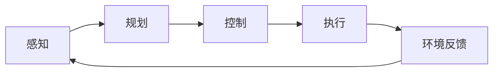

# 机器人控制



## 机械臂操作

### 运动学基础

机械臂是具身智能中研究最充分的平台。其运动学描述了关节角度与末端执行器位姿之间的映射关系。

我们可以用骑自行车来建立直觉。运动学就是研究自行车的几何结构：车把转多少度，前轮会指向哪里？脚踏板踩几圈，车会前进多少？这些只涉及几何关系，不关心力。而动力学则是理解力如何让自行车动起来：你踩踏板时用多大力，地面的摩擦力多大，上坡时重力怎么影响速度。

**正运动学**（Forward Kinematics）给定关节角度 $\mathbf{q} \in \mathbb{R}^n$，求末端位姿 $\mathbf{T} \in SE(3)$：

$$\mathbf{T} = f_{FK}(\mathbf{q}) = \mathbf{T}_1(\mathbf{q}_1) \mathbf{T}_2(\mathbf{q}_2) \cdots \mathbf{T}_n(\mathbf{q}_n)$$

其中 $\mathbf{q} = (\mathbf{q}_1, \dots, \mathbf{q}_n)^T$ 为各关节角度组成的向量，$n$ 为自由度数，$\mathbf{T}_i(\mathbf{q}_i) \in SE(3)$ 为第 $i$ 个关节的齐次变换矩阵（包含旋转与平移），$\mathbf{T} \in SE(3)$ 为末端执行器的位姿。正运动学将各关节的局部变换依次累乘，得到末端在世界坐标系中的最终位姿。举个例子：想象你的胳膊，肩关节转 30°、肘关节弯 45°、腕关节旋 10°——指尖最终到达的位置，就是这三个角度依次复合的结果。正运动学做的正是这件事。

**逆运动学**（Inverse Kinematics）是正运动学的逆问题：给定期望末端位姿，求解关节角度。对于冗余机械臂（自由度大于6），逆运动学解不唯一，通常采用基于雅可比矩阵的迭代方法：

$$\Delta \mathbf{q} = \mathbf{J}^{\dagger}(\mathbf{q}) \Delta \mathbf{x}$$

其中 $\Delta \mathbf{x}$ 为末端当前位姿与目标位姿的偏差，$\mathbf{J}^{\dagger}$ 为雅可比矩阵 $\mathbf{J}(\mathbf{q})$ 的伪逆（Moore-Penrose 伪逆），$\Delta \mathbf{q}$ 为关节角度的迭代修正量。雅可比矩阵描述了关节速度与末端速度之间的线性映射，其伪逆提供了最小范数解。奇异位形附近需要使用阻尼最小二乘或其他正则化方法。假设你想把手指尖精确地点在鼻子上（目标位姿），逆运动学要做的就是反向推算：肩、肘、腕分别该转多少度？这通常比正运动学难得多，因为可能存在多个解或无解。

**动力学**描述力/力矩与运动之间的关系：

$$\mathbf{M}(\mathbf{q})\ddot{\mathbf{q}} + \mathbf{C}(\mathbf{q}, \dot{\mathbf{q}})\dot{\mathbf{q}} + \mathbf{g}(\mathbf{q}) = \boldsymbol{\tau}$$

其中 $\mathbf{M}$ 是质量矩阵，$\mathbf{C}$ 是科里奥利/离心力矩阵，$\mathbf{g}$ 是重力项，$\boldsymbol{\tau}$ 是关节力矩。回到骑自行车的场景：$\mathbf{M}$ 就是车和人的总重量（质量越大越难加速），$\mathbf{C}$ 是拐弯时的离心力，$\mathbf{g}$ 是上坡时的重力阻力，$\boldsymbol{\tau}$ 是你脚踏的力。机械臂的动力学完全同理，只是关节更多、方程更复杂。

### 运动规划

运动规划的目标是生成从起点到目标的无碰撞轨迹。假设你骑自行车穿越一个停满车的停车场，需要找一条不碰到任何车的路线——这就是运动规划的本质。

**采样规划**方法在配置空间中随机采样并构建路径图：

- **PRM**（Probabilistic Roadmap）：预先构建可达性图，在线查询路径
- **RRT**（Rapidly-exploring Random Tree）：从起点向随机方向快速扩展
- **RRT***：RRT的渐近最优版本，收敛到最短路径

```python
def rrt(start, goal, sample_fn, steer_fn, collision_fn, max_iter=10000):
    tree = {start: None}
    for _ in range(max_iter):
        q_rand = sample_fn()
        q_nearest = nearest(tree, q_rand)
        q_new = steer_fn(q_nearest, q_rand)
        
        if not collision_fn(q_nearest, q_new):
            tree[q_new] = q_nearest
            if distance(q_new, goal) < threshold:
                return extract_path(tree, q_new)
    return None
```

**轨迹优化**方法将规划问题转化为优化问题。CHOMP、STOMP、TrajOpt等方法在初始轨迹基础上迭代优化，同时考虑平滑性与碰撞代价。

### 抓取与操作

抓取是机械臂操作的核心能力。你可能觉得“拿东西”是世界上最简单的事，但对机器人来说，这涉及视觉感知、接触力控制、手指协调等多个难题的交叉。传统方法基于几何分析计算力闭合抓取：

$$\mathbf{G} \mathbf{f} = \mathbf{w}, \quad \mathbf{f} \geq 0$$

其中 $\mathbf{G} \in \mathbb{R}^{6 \times m}$ 为抓取矩阵（将 $m$ 个接触点的力映射到物体质心上的力与力矩），$\mathbf{f} \in \mathbb{R}^m$ 为各接触点的接触力向量（非负约束保证只能推不能拉），$\mathbf{w} \in \mathbb{R}^6$ 为外部施加的力旋量。力闭合抓取要求：对于任意外力 $\mathbf{w}$，都存在非负的接触力 $\mathbf{f}$ 能够平衡它。

**数据驱动抓取**方法直接从视觉输入预测抓取位姿：

- **GraspNet**系列：预测点云上的6-DoF抓取位姿
- **接触图预测**：预测末端与物体的接触点分布
- **强化学习抓取**：通过试错学习抓取策略

**灵巧操作**涉及抓取后的物体重定位、旋转、装配等复杂任务。关键挑战包括：
- 接触状态变化的检测与处理
- 长时序任务的规划与执行
- 力控制与位置控制的切换

### 模仿学习在操作中的应用

**行为克隆**（Behavior Cloning）从专家示范中学习策略映射：

$$\pi^* = \arg\min_\pi \mathbb{E}_{(\mathbf{o}, \mathbf{a}) \sim \mathcal{D}} [\mathcal{L}(\pi(\mathbf{o}), \mathbf{a})]$$

其中 $\pi$ 为策略网络，$\mathcal{D}$ 为专家示范数据集（包含观测-动作对），$\mathcal{L}$ 为损失函数（如均方误差或交叉熵）。行为克隆直接通过监督学习拟合专家的观测到动作的映射。

**扩散策略**（Diffusion Policy）将动作生成建模为去噪扩散过程：

$$\mathbf{a}_0 = \text{denoise}(\mathbf{a}_T, \mathbf{o}), \quad \mathbf{a}_T \sim \mathcal{N}(0, \mathbf{I})$$

其中 $\mathbf{a}_T$ 为从标准正态分布采样的初始噪声，$\mathbf{o}$ 为当前观测，$\text{denoise}$ 为经 $T$ 步迭代去噪后得到的清晰动作 $\mathbf{a}_0$。扩散策略将动作生成建模为条件去噪过程，能够表示多模态动作分布。

示范数据可通过遥操作、运动捕捉、VR设备等方式采集。

**ACT**（Action Chunking with Transformers）使用Transformer架构预测动作序列：

$$\mathbf{a}_{t:t+k} = \text{Transformer}(\mathbf{o}_t, \mathbf{z})$$

其中 $\mathbf{z}$ 是从变分编码器采样的风格变量，$k$ 是动作块长度。

## 四足机器人

### 四足运动的特点

四足机器人在非结构化环境中展现出独特优势。与轮式移动机器人相比：

| 特性 | 轮式 | 四足 |
|-----|------|------|
| 平坦地面效率 | 高 | 中 |
| 崎岖地形通过性 | 低 | 高 |
| 垂直障碍跨越 | 差 | 好 |
| 机械复杂度 | 低 | 高 |
| 能量消耗 | 低 | 高 |

四足运动的核心挑战在于协调 12 个（每腿 3 自由度）或更多关节，同时保持动态平衡。想象一下同时骑四辆自行车，还得保证它们排成方阵不散架——四足控制的复杂度可见一斑。

### 步态与相位

步态定义了四条腿的协调模式。常见步态包括：

**静态步态**：任意时刻至少三条腿接地，重心始终在支撑多边形内。
- walk（行走）：按顺序逐一抬腿

**动态步态**：存在腾空相或不稳定瞬间。
- trot（对角小跑）：对角腿同步
- pace（同侧步）：同侧腿同步
- bound（跳跃）：前后腿同步
- gallop（飞奔）：四腿顺序抬起

步态可以用相位参数化。设腿 $i$ 的相位为 $\phi_i \in [0, 2\pi)$，则：

$$\phi_i(t) = \phi_i^0 + \omega t \mod 2\pi$$

其中 $\phi_i(t)$ 为腿 $i$ 在时刻 $t$ 的相位，$\phi_i^0$ 为初始相位偏移，$\omega$ 为步态角频率（所有腿共享）。不同步态通过设置不同的初始相位差来实现；例如 trot 步态中对角腿相位差为 $\pi$，意味着它们的摆动周期刚好相差半个周期。举个例子：观察一只狗小跑时，你会发现左前腿和右后腿总是同时着地，右前腿和左后腿同样如此——这就是对角 trot 步态，相位差恰好是半个周期。

### 传统控制方法

**模型预测控制**（MPC）在滚动时域内优化控制序列：

$$\min_{\mathbf{u}_{0:N-1}} \sum_{k=0}^{N} \|\mathbf{x}_k - \mathbf{x}_k^{\text{ref}}\|_Q^2 + \|\mathbf{u}_k\|_R^2$$
$$\text{s.t.} \quad \mathbf{x}_{k+1} = f(\mathbf{x}_k, \mathbf{u}_k), \quad \mathbf{u}_k \in \mathcal{U}$$

其中 $\mathbf{x}_k$ 为时步 $k$ 的系统状态，$\mathbf{x}_k^{\text{ref}}$ 为参考轨迹，$\mathbf{u}_k$ 为控制输入，$Q$ 和 $R$ 分别为状态跟踪与控制耗费的权重矩阵，$N$ 为预测时域长度，$f$ 为动力学模型，$\mathcal{U}$ 为控制约束集。MPC 在每个时步求解该有限时域优化问题，只执行第一步控制，然后滚动重复。实际实现中，通常将复杂的全身动力学简化为单刚体模型，以实现实时求解。

**全身控制**（Whole-Body Control）在操作空间定义任务，并通过优化求解关节力矩：

$$\min_{\ddot{\mathbf{q}}, \mathbf{f}, \boldsymbol{\tau}} \sum_i w_i \|\mathbf{J}_i \ddot{\mathbf{q}} + \dot{\mathbf{J}}_i \dot{\mathbf{q}} - \ddot{\mathbf{x}}_i^{\text{des}}\|^2$$
$$\text{s.t.} \quad \mathbf{M}\ddot{\mathbf{q}} + \mathbf{h} = \mathbf{S}^T \boldsymbol{\tau} + \mathbf{J}_c^T \mathbf{f}$$

其中 $\ddot{\mathbf{q}}$ 为关节加速度，$\mathbf{f}$ 为接触力，$\boldsymbol{\tau}$ 为关节力矩，$w_i$ 为第 $i$ 个任务的权重，$\mathbf{J}_i$ 为第 $i$ 个任务的雅可比矩阵，$\ddot{\mathbf{x}}_i^{\text{des}}$ 为期望的操作空间加速度。约束为全身动力学方程，其中 $\mathbf{M}$ 为质量矩阵，$\mathbf{h}$ 为科里奥利力、离心力与重力的合力项，$\mathbf{S}$ 为执行器选择矩阵，$\mathbf{J}_c$ 为接触点雅可比矩阵。全身控制在满足动力学约束的前提下，尽可能跟踪多个操作空间任务。

### 基于学习的四足控制

强化学习在四足控制中取得了显著成功。典型的状态与动作定义：

**状态空间**：
- 机身姿态（roll, pitch, yaw）
- 机身角速度
- 关节位置与速度
- 足端接触状态
- 地形估计（可选）

**动作空间**：
- 关节位置目标（PD控制器跟踪）
- 关节速度目标
- 足端位置目标（逆运动学转换）

**奖励设计**是关键。典型的奖励组成：

```python
reward = (
    w_vel * reward_velocity()      # 跟踪速度命令
    + w_alive * reward_alive()     # 存活奖励
    - w_torque * cost_torque()     # 力矩惩罚
    - w_action * cost_action_rate() # 动作平滑惩罚
    - w_collision * cost_collision() # 碰撞惩罚
    - w_orientation * cost_orientation() # 姿态惩罚
)
```

**课程学习**逐步增加任务难度：
1. 平坦地面行走
2. 添加小型障碍
3. 增加地形复杂度
4. 引入外部扰动

### 地形适应

盲足控制（Blind Locomotion）仅依赖本体感知，不使用视觉或雷达。关键技术包括：

**隐式地形估计**：从本体感知历史推断地形特征：

$$\mathbf{z}_{\text{terrain}} = \phi(\mathbf{o}_{t-H:t})$$

其中 $\mathbf{o}_{t-H:t}$ 为过去 $H$ 步的本体感知观测序列（关节位置、速度、姿态等），$\phi$ 为编码器网络，$\mathbf{z}_{\text{terrain}}$ 为推断出的地形潜在特征。机器人仅通过近期的步态历史信息（而非视觉）来隐式估计当前的地形类型。

**足端力估计**：从电机电流推断接触力，判断接触状态。

**自适应控制**：根据估计的地形在线调整步态参数。

视觉辅助的地形适应可以提前规划落足点，避开危险区域。典型流程：

```
深度图像 → 地形分割 → 可通行性分析 → 落足点规划 → 运动控制
```

## 双足机器人

### 双足行走的挑战

双足行走是动态平衡的典型例子。与四足相比，双足机器人：
- 支撑面积更小，稳定性更差
- 单腿支撑相占比更大
- 需要更精确的动量管理
- 对模型误差更敏感

人形机器人追求人类形态，以便复用人类环境与工具。这带来了额外的设计约束与控制挑战。

### 简化模型

**线性倒立摆模型**（LIPM）将复杂的全身动力学简化为质心动力学：

$$\ddot{x} = \omega^2(x - p), \quad \omega = \sqrt{\frac{g}{z_c}}$$

其中 $x$ 为质心水平位置，$p$ 为压力中心（ZMP，Zero Moment Point）位置，$z_c$ 为质心高度（假设恒定），$g$ 为重力加速度，$\omega$ 为自然频率。该模型将复杂的全身动力学简化为一个以质心高度为参数的线性倒立摆，质心的水平加速度与其对压力中心的偏移成正比。为什么用倒立摆？因为人站立时本质上就像一根倒立的棍子——重心在上，支撑点在下，随时可能倒下。行走就是在不断地"快要摔倒——迈出一步接住"的过程中前进。

**捕获点**（Capture Point）定义为：

$$x_{cp} = x + \frac{\dot{x}}{\omega}$$

其中 $x$ 为质心水平位置，$\dot{x}$ 为质心水平速度，$\omega$ 为 LIPM 自然频率。捕获点是机器人“迈一步就能停住”所需的趺足位置——只要将足放在捕获点处，倒立摆就会收敛到该点。

捕获点在支撑多边形内是保持平衡的充分条件。

**角动量线性倒立摆**（ALIP）扩展LIPM，考虑角动量变化：

$$\dot{L} = m g (x - p)$$

其中 $L$ 为系统角动量，$m$ 为质量，$g$ 为重力加速度，$x$ 为质心位置，$p$ 为压力中心。ALIP 在 LIPM 基础上纳入了角动量的变化，能够更准确地描述包含手臂摆动等情形下的双足行走动力学。

### 步态生成

**预览控制**基于LIPM，优化未来若干步的ZMP轨迹：

$$\min_{\dddot{x}_{0:N}} \sum_{k=0}^{N} \|p_k - p_k^{\text{ref}}\|^2 + R \dddot{x}_k^2$$

其中 $p_k$ 为时步 $k$ 的 ZMP 位置，$p_k^{\text{ref}}$ 为参考 ZMP 轨迹，$\dddot{x}_k$ 为质心加加速度（jerk，控制量），$R$ 为控制能耗的权重。该优化问题在跟踪参考 ZMP 的同时，抑制质心运动的急剧变化，保证行走的平稳性。

**足步规划**确定落足点位置与时间：

```
当前状态 → 参考速度 → 捕获点计算 → 落足点选择 → 轨迹生成
```

实时调整落足点是应对扰动的关键。Raibert控制器提供了直观的启发式：当身体前倾过快时，把脚往前多迈一点；当前进速度不够时，把脚往后缩一点。就像你被人从背后推了一下，本能地会快走几步来恢复平衡：

$$x_{\text{foot}} = x + \frac{\dot{x}}{2\omega} + k_v(\dot{x} - \dot{x}^{\text{des}})$$

其中 $x$ 为当前质心位置，$\dot{x}$ 为当前质心速度，$\omega$ 为 LIPM 自然频率，$\dot{x}^{\text{des}}$ 为期望速度，$k_v$ 为速度反馈增益。前两项对应捕获点的一半（在步态周期中间时刻评估），第三项根据当前速度与期望速度的偏差进行修正——走得太快就抬足往前多迈一点，太慢就往回缩一点。

通过求解Riccati方程获得最优控制律。

### 全身运动控制

给定质心轨迹与足端轨迹，全身控制求解关节运动与接触力。

**基于QP的全身控制**：

$$\min_{\ddot{\mathbf{q}}, \mathbf{f}} \sum_i w_i \|\mathbf{A}_i \begin{bmatrix} \ddot{\mathbf{q}} \\ \mathbf{f} \end{bmatrix} - \mathbf{b}_i\|^2$$

约束包括：
- 动力学一致性：$\mathbf{M}\ddot{\mathbf{q}} + \mathbf{h} = \mathbf{S}^T \boldsymbol{\tau} + \mathbf{J}_c^T \mathbf{f}$
- 摩擦锥约束：$\mathbf{f} \in \mathcal{FC}$
- 关节限位：$\mathbf{q}_{\min} \leq \mathbf{q} \leq \mathbf{q}_{\max}$
- 力矩限制：$|\boldsymbol{\tau}| \leq \boldsymbol{\tau}_{\max}$

### 基于学习的双足控制

强化学习在双足控制中面临更大挑战：

**高维状态-动作空间**：人形机器人可能有30+自由度。

**稀疏奖励**：行走成功是稀疏信号，需要精心设计辅助奖励。

**安全约束**：摔倒会损坏硬件，需要安全的探索策略。

成功的方法包括：

**分层强化学习**：高层策略输出步态参数或速度命令，低层控制器执行：

$$\mathbf{a}_{\text{high}} = \pi_{\text{high}}(\mathbf{o}), \quad \mathbf{a}_{\text{low}} = \pi_{\text{low}}(\mathbf{o}, \mathbf{a}_{\text{high}})$$

其中 $\pi_{\text{high}}$ 为高层策略，根据观测 $\mathbf{o}$ 输出步态参数或速度命令 $\mathbf{a}_{\text{high}}$；$\pi_{\text{low}}$ 为低层控制器，将高层指令转化为具体的关节动作 $\mathbf{a}_{\text{low}}$。分层设计降低了各层策略的学习难度。

**模仿学习引导**：使用运动捕捉数据初始化策略或提供参考奖励：

$$r_{\text{imitation}} = \exp(-\|\mathbf{q} - \mathbf{q}^{\text{ref}}\|^2 / \sigma^2)$$

其中 $\mathbf{q}$ 为当前关节配置，$\mathbf{q}^{\text{ref}}$ 为参考运动捕捉数据中的关节配置，$\sigma$ 为容差参数。当机器人姿态越接近参考动作，奖励越接近 1；偏离越大，奖励越接近 0。

**残差学习**：在传统控制器基础上学习残差修正：

$$\boldsymbol{\tau} = \boldsymbol{\tau}_{\text{nominal}}(\mathbf{q}, \dot{\mathbf{q}}) + \Delta\boldsymbol{\tau}_{\text{RL}}(\mathbf{o})$$

其中 $\boldsymbol{\tau}_{\text{nominal}}$ 为传统控制器计算的名义力矩（基于模型的前馈控制），$\Delta\boldsymbol{\tau}_{\text{RL}}$ 为强化学习网络输出的残差修正量。残差学习将传统控制的稳定性与学习方法的自适应能力相结合，RL 只需学习模型误差的补偿量，而非从零学习全部控制策略。

### 人形机器人的发展

近年来人形机器人领域出现了显著进展：

| 平台 | 组织 | 特点 |
|-----|------|------|
| Atlas | Boston Dynamics | 液压驱动，高动态 |
| Optimus | Tesla | 电机驱动，面向生产 |
| Digit | Agility Robotics | 轻量化，物流场景 |
| Figure 01/02 | Figure AI | 集成大模型 |
| 1X | 1X Technologies | 软体执行器 |

大模型与人形机器人的结合是当前热点。视觉-语言模型提供场景理解与任务规划能力，动作生成模型输出底层控制命令。代表性工作如Google RT-X系列、1X的NEO等，正在探索通用人形机器人的可行路径。

机器人控制从经典的模型-规划范式向数据驱动的学习范式演进。回头看整个发展脉络：最早我们用几何和物理公式精确建模（就像精确测量自行车每个零件的尺寸），后来发现让机器人自己在试错中学习往往更高效（就像孩子学骑车，不需要理解欧拉方程，摔几次就学会了）。无论是机械臂的灵巧操作、四足的敏捷运动，还是双足的动态平衡，强化学习与模仿学习都展现出强大的能力。大模型的引入进一步赋予机器人语言理解、常识推理、任务泛化的能力。随着硬件成本降低、仿真精度提升、迁移技术成熟，具身智能正在从实验室走向实际应用。
