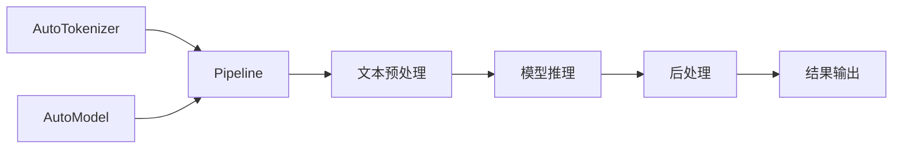

# Transformers生态

Hugging Face构建了一套完整的深度学习工具生态，以Transformers库为核心，配合PEFT、Accelerate、Diffusers等库覆盖了模型开发的各个环节。

在实际项目中，你很少需要从零开始实现一个Transformer模型。绝大多数场景下——无论是做文本分类、对话系统还是图像生成——你的第一步都是去Hugging Face Hub上找一个预训练模型，然后用这套工具链做微调、部署或推理。理解这个生态的各个组件如何协作，几乎是当下大模型开发的"入门必修课"。

## Transformers库

Transformers是当前最流行的预训练模型库，提供了数千个预训练模型的统一接口。它解决的核心痛点是：不同模型（BERT、GPT、LLaMA、Qwen……）各有各的加载方式、输入格式和推理流程，而Transformers用一套统一的`Auto`类抹平了这些差异——换模型时只需改一个名字，代码几乎不用动。

### 核心抽象

Transformers的设计围绕三个核心类：

**AutoModel系列**：自动推断模型架构

```python
from transformers import AutoModel, AutoModelForCausalLM, AutoModelForSequenceClassification

# 通用模型
model = AutoModel.from_pretrained("bert-base-uncased")

# 特定任务
model = AutoModelForCausalLM.from_pretrained("meta-llama/Llama-2-7b-hf")
model = AutoModelForSequenceClassification.from_pretrained("bert-base-uncased", num_labels=2)
```

**AutoTokenizer**：文本分词与编码

```python
from transformers import AutoTokenizer

tokenizer = AutoTokenizer.from_pretrained("meta-llama/Llama-2-7b-hf")

# 编码
inputs = tokenizer("Hello, world!", return_tensors="pt")
# {'input_ids': tensor([[1, 15043, 29892, 3186, 29991]]),
#  'attention_mask': tensor([[1, 1, 1, 1, 1]])}

# 解码
text = tokenizer.decode(inputs['input_ids'][0])

# 批量处理
batch = tokenizer(
    ["Hello", "World"],
    padding=True,
    truncation=True,
    max_length=512,
    return_tensors="pt"
)
```

**AutoConfig**：模型配置管理

```python
from transformers import AutoConfig

config = AutoConfig.from_pretrained("gpt2")
config.num_hidden_layers = 6  # 修改配置
model = AutoModel.from_config(config)
```

### Pipeline：快速推理

如果你只是想快速验证一个模型的效果，甚至不想写几行代码来处理tokenizer和模型调用，Pipeline就是为你准备的。它把“加载模型→预处理→推理→后处理”打包成一个函数调用：



```python
from transformers import pipeline

# 文本生成
generator = pipeline("text-generation", model="gpt2")
result = generator("Once upon a time", max_length=50)

# 文本分类
classifier = pipeline("sentiment-analysis")
result = classifier("I love this product!")

# 问答
qa = pipeline("question-answering")
result = qa(question="What is AI?", context="AI is artificial intelligence...")

# 支持GPU
generator = pipeline("text-generation", model="gpt2", device=0)
```

### Trainer：训练封装

手写训练循环固然灵活，但当你需要处理梯度累积、混合精度、多GPU分布式、定期保存checkpoint这些"标配"功能时，代码会迅速膨胀。Trainer类把这些工程细节封装好，让你专注于数据和模型本身：

```python
from transformers import Trainer, TrainingArguments

training_args = TrainingArguments(
    output_dir="./results",
    num_train_epochs=3,
    per_device_train_batch_size=8,
    per_device_eval_batch_size=8,
    learning_rate=2e-5,
    weight_decay=0.01,
    evaluation_strategy="epoch",
    save_strategy="epoch",
    load_best_model_at_end=True,
    fp16=True,
    gradient_accumulation_steps=4,
    logging_steps=100,
)

trainer = Trainer(
    model=model,
    args=training_args,
    train_dataset=train_dataset,
    eval_dataset=eval_dataset,
    tokenizer=tokenizer,
    data_collator=data_collator,
    compute_metrics=compute_metrics,
)

trainer.train()
trainer.save_model("./final_model")
```

### 模型量化

Transformers集成了多种量化方案：

```python
from transformers import BitsAndBytesConfig

# 4-bit量化配置
bnb_config = BitsAndBytesConfig(
    load_in_4bit=True,
    bnb_4bit_quant_type="nf4",
    bnb_4bit_compute_dtype=torch.bfloat16,
    bnb_4bit_use_double_quant=True,
)

model = AutoModelForCausalLM.from_pretrained(
    "meta-llama/Llama-2-7b-hf",
    quantization_config=bnb_config,
    device_map="auto",
)
```

## PEFT：参数高效微调

PEFT（Parameter-Efficient Fine-Tuning）库提供了多种轻量级微调方法。

想象一下这个场景：你有一个7B参数的模型，全量微调需要上百GB显存，远超单卡容量。但你的任务其实很具体——比如让模型学会用特定格式回答客服问题。PEFT的思路是：冻住绝大部分参数，只训练一小组"增量"参数，用不到原模型1%的参数量就能达到接近全量微调的效果。

### LoRA

LoRA（Low-Rank Adaptation）是最常用的参数高效微调方法：

```python
from peft import LoraConfig, get_peft_model, TaskType

lora_config = LoraConfig(
    r=16,                          # 低秩矩阵的秩
    lora_alpha=32,                 # 缩放因子
    target_modules=["q_proj", "v_proj", "k_proj", "o_proj"],
    lora_dropout=0.05,
    bias="none",
    task_type=TaskType.CAUSAL_LM,
)

model = get_peft_model(model, lora_config)
model.print_trainable_parameters()
# trainable params: 4,194,304 || all params: 6,742,609,920 || trainable%: 0.0622
```

### QLoRA

QLoRA结合量化与LoRA，进一步降低显存需求：

```python
from transformers import BitsAndBytesConfig
from peft import prepare_model_for_kbit_training

# 4-bit量化加载
bnb_config = BitsAndBytesConfig(
    load_in_4bit=True,
    bnb_4bit_quant_type="nf4",
    bnb_4bit_compute_dtype=torch.bfloat16,
)

model = AutoModelForCausalLM.from_pretrained(
    model_name,
    quantization_config=bnb_config,
)

# 准备量化模型用于训练
model = prepare_model_for_kbit_training(model)

# 添加LoRA
model = get_peft_model(model, lora_config)
```

### 其他PEFT方法

| 方法 | 原理 | 参数量 |
|-----|------|--------|
| LoRA | 低秩分解增量矩阵 | 极少 |
| Prefix Tuning | 可学习的前缀向量 | 少 |
| Prompt Tuning | 软提示嵌入 | 极少 |
| Adapter | 插入适配器层 | 中等 |
| IA3 | 学习缩放向量 | 极少 |

```python
from peft import PrefixTuningConfig, PromptTuningConfig

# Prefix Tuning
prefix_config = PrefixTuningConfig(
    task_type=TaskType.CAUSAL_LM,
    num_virtual_tokens=20,
)

# Prompt Tuning
prompt_config = PromptTuningConfig(
    task_type=TaskType.CAUSAL_LM,
    num_virtual_tokens=8,
    prompt_tuning_init="TEXT",
    prompt_tuning_init_text="Classify the sentiment:",
)
```

### 模型合并与保存

```python
# 保存LoRA权重
model.save_pretrained("./lora_weights")

# 加载LoRA权重
from peft import PeftModel
base_model = AutoModelForCausalLM.from_pretrained(base_model_name)
model = PeftModel.from_pretrained(base_model, "./lora_weights")

# 合并权重（用于推理）
merged_model = model.merge_and_unload()
merged_model.save_pretrained("./merged_model")
```

## Accelerate：分布式训练

Accelerate简化了多GPU/多节点训练的代码编写。

你可能遇到过这种情况：代码在单卡上跑得好好的，一上多卡就要改一堆——数据采样器要换成分布式的、模型要包一层DDP、梯度同步要手动处理。Accelerate的设计哲学是"你的训练代码基本不用改"：只需几行配置，它帮你处理设备分配、梯度同步、混合精度等所有分布式细节。

### 基础用法

```python
from accelerate import Accelerator

accelerator = Accelerator(
    mixed_precision='bf16',
    gradient_accumulation_steps=4,
)

# 自动处理设备分配与分布式
model, optimizer, train_dataloader = accelerator.prepare(
    model, optimizer, train_dataloader
)

for batch in train_dataloader:
    with accelerator.accumulate(model):
        outputs = model(**batch)
        loss = outputs.loss
        accelerator.backward(loss)
        optimizer.step()
        optimizer.zero_grad()
```

### 配置文件

使用`accelerate config`生成配置文件：

```yaml
# config.yaml
compute_environment: LOCAL_MACHINE
distributed_type: MULTI_GPU
num_processes: 4
mixed_precision: bf16
```

启动训练：

```bash
accelerate launch --config_file config.yaml train.py
```

### DeepSpeed集成

```python
from accelerate import Accelerator

accelerator = Accelerator()

# 在配置中指定DeepSpeed
# accelerate config 时选择DeepSpeed

# 代码无需修改，Accelerate自动处理
```

DeepSpeed配置示例（ZeRO Stage 3）：

```json
{
    "zero_optimization": {
        "stage": 3,
        "offload_optimizer": {"device": "cpu"},
        "offload_param": {"device": "cpu"}
    },
    "bf16": {"enabled": true},
    "train_micro_batch_size_per_gpu": 4
}
```

## Diffusers：扩散模型

Diffusers是视觉生成模型的标准库，提供了丰富的扩散模型实现。

假设你正在做一个AI绘画项目：需要文生图、图生图、图像修复、视频生成等多种能力。如果从论文代码出发，每种模型的实现风格、依赖库、接口设计都不一样，集成起来非常痛苦。Diffusers用统一的Pipeline抽象解决了这个问题——切换模型就像换一个名字，而底层的VAE、UNet、调度器等组件还可以灵活替换。

### Pipeline使用

```python
from diffusers import StableDiffusionPipeline, DiffusionPipeline
import torch

# 加载模型
pipe = StableDiffusionPipeline.from_pretrained(
    "runwayml/stable-diffusion-v1-5",
    torch_dtype=torch.float16,
)
pipe = pipe.to("cuda")

# 文生图
image = pipe(
    "A photo of a cat wearing sunglasses",
    num_inference_steps=50,
    guidance_scale=7.5,
).images[0]

image.save("output.png")
```

### 常用Pipeline

| Pipeline | 功能 |
|----------|------|
| StableDiffusionPipeline | 文生图 |
| StableDiffusionImg2ImgPipeline | 图生图 |
| StableDiffusionInpaintPipeline | 图像修复 |
| StableDiffusionXLPipeline | SDXL文生图 |
| StableVideoDiffusionPipeline | 图生视频 |
| FluxPipeline | Flux模型 |

### 核心组件

Diffusers将扩散模型分解为可复用的组件：

```python
from diffusers import UNet2DConditionModel, AutoencoderKL, DDPMScheduler
from transformers import CLIPTextModel, CLIPTokenizer

# 各组件独立加载
vae = AutoencoderKL.from_pretrained("model_path", subfolder="vae")
unet = UNet2DConditionModel.from_pretrained("model_path", subfolder="unet")
text_encoder = CLIPTextModel.from_pretrained("model_path", subfolder="text_encoder")
tokenizer = CLIPTokenizer.from_pretrained("model_path", subfolder="tokenizer")
scheduler = DDPMScheduler.from_pretrained("model_path", subfolder="scheduler")
```

**调度器**（Scheduler）控制扩散过程：

```python
from diffusers import DDPMScheduler, DDIMScheduler, EulerDiscreteScheduler

# 更换调度器
pipe.scheduler = EulerDiscreteScheduler.from_config(pipe.scheduler.config)
```

### ControlNet

ControlNet提供精细的图像控制：

```python
from diffusers import StableDiffusionControlNetPipeline, ControlNetModel

controlnet = ControlNetModel.from_pretrained(
    "lllyasviel/control_v11p_sd15_canny",
    torch_dtype=torch.float16
)

pipe = StableDiffusionControlNetPipeline.from_pretrained(
    "runwayml/stable-diffusion-v1-5",
    controlnet=controlnet,
    torch_dtype=torch.float16,
)

# 使用Canny边缘图控制
import cv2
canny_image = cv2.Canny(image, 100, 200)

result = pipe(
    "A beautiful landscape",
    image=canny_image,
    num_inference_steps=30,
).images[0]
```

### LoRA加载

```python
pipe = StableDiffusionXLPipeline.from_pretrained(
    "stabilityai/stable-diffusion-xl-base-1.0",
    torch_dtype=torch.float16,
)

# 加载LoRA权重
pipe.load_lora_weights("path/to/lora")

# 调整LoRA强度
pipe.fuse_lora(lora_scale=0.8)

# 多个LoRA叠加
pipe.load_lora_weights("lora1", adapter_name="style")
pipe.load_lora_weights("lora2", adapter_name="character")
pipe.set_adapters(["style", "character"], adapter_weights=[0.5, 0.5])
```

### 模型训练

Diffusers提供了训练脚本示例：

```python
from diffusers import DDPMScheduler
from diffusers.optimization import get_cosine_schedule_with_warmup

noise_scheduler = DDPMScheduler(num_train_timesteps=1000)

# 添加噪声
noise = torch.randn_like(latents)
timesteps = torch.randint(0, 1000, (batch_size,))
noisy_latents = noise_scheduler.add_noise(latents, noise, timesteps)

# 预测噪声
noise_pred = unet(noisy_latents, timesteps, encoder_hidden_states).sample

# 损失计算
loss = F.mse_loss(noise_pred, noise)
```

## 生态协同

这些库可以无缝协作：

```python
from transformers import AutoModelForCausalLM, AutoTokenizer
from peft import LoraConfig, get_peft_model
from accelerate import Accelerator

# Transformers加载模型
model = AutoModelForCausalLM.from_pretrained("model_name")
tokenizer = AutoTokenizer.from_pretrained("model_name")

# PEFT添加LoRA
lora_config = LoraConfig(r=16, lora_alpha=32, ...)
model = get_peft_model(model, lora_config)

# Accelerate处理分布式
accelerator = Accelerator()
model, optimizer, dataloader = accelerator.prepare(model, optimizer, dataloader)

# 训练
for batch in dataloader:
    loss = model(**batch).loss
    accelerator.backward(loss)
    optimizer.step()
```

Hugging Face生态通过模块化设计与统一接口，大幅降低了大模型开发的门槛。Transformers提供模型抽象，PEFT实现高效微调，Accelerate简化分布式训练，Diffusers支持视觉生成——这套工具链已经成为大模型研发的事实标准。回到实际工作流中看：一个典型的微调项目，往往是Transformers加载模型、PEFT添加LoRA适配器、Accelerate处理多卡训练，三者各司其职又无缝衔接。掌握这套生态的用法和边界，能让你在面对具体需求时快速找到最合适的工具组合。
