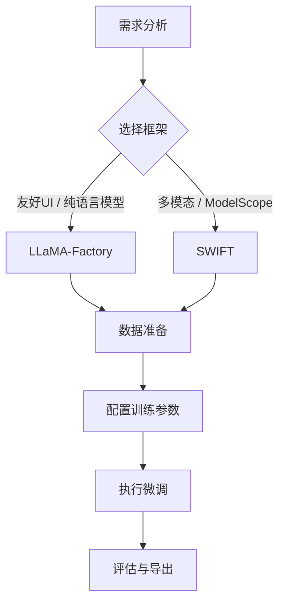

# 训练框架：LLaMA-Factory与SWIFT

大模型微调是将通用预训练模型适配到特定任务的关键环节。LLaMA-Factory和SWIFT是两个代表性的开源训练框架，它们封装了复杂的训练流程，使研究者和开发者能够便捷地进行模型微调。



你可能遇到过这种情况：想给一个开源大模型做微调，官方文档里写了一大堆Transformers、PEFT、DeepSpeed的配置代码，光是把数据格式调对就花了半天。这正是训练框架要解决的问题：把"模型加载→数据处理→训练配置→分布式执行"这条链路上的琐碎工作封装起来，让你用一行命令就能启动训练。

## LLaMA-Factory

LLaMA-Factory是一个统一的大模型微调框架，支持多种模型架构和训练方法。它的最大亮点是"低门槛"——即便你对Transformers库的底层细节不熟悉，也能通过Web UI或简单的命令行参数完成微调。

### 核心特性

- **模型支持广泛**：LLaMA、Qwen、ChatGLM、Baichuan、Mistral等主流模型
- **训练方法丰富**：全量微调、LoRA、QLoRA、RLHF、DPO等
- **界面友好**：提供Web UI和命令行两种使用方式
- **资源高效**：支持量化训练、梯度检查点等显存优化技术

### 安装与配置

```bash
git clone https://github.com/hiyouga/LLaMA-Factory.git
cd LLaMA-Factory
pip install -e ".[torch,metrics]"
```

### 数据格式

LLaMA-Factory使用Alpaca格式或ShareGPT格式的数据：

```json
// Alpaca格式
[
  {
    "instruction": "请将以下句子翻译成英文",
    "input": "今天天气很好",
    "output": "The weather is nice today."
  }
]

// ShareGPT格式
[
  {
    "conversations": [
      {"from": "human", "value": "你好"},
      {"from": "gpt", "value": "你好！有什么可以帮助你的吗？"},
      {"from": "human", "value": "介绍一下Python"},
      {"from": "gpt", "value": "Python是一种高级编程语言..."}
    ]
  }
]
```

数据集配置在`data/dataset_info.json`中注册：

```json
{
  "my_dataset": {
    "file_name": "my_data.json",
    "formatting": "alpaca",
    "columns": {
      "prompt": "instruction",
      "query": "input",
      "response": "output"
    }
  }
}
```

### 命令行训练

```bash
# LoRA微调
llamafactory-cli train \
    --model_name_or_path Qwen/Qwen2-7B \
    --stage sft \
    --finetuning_type lora \
    --lora_rank 16 \
    --lora_target q_proj,v_proj \
    --dataset my_dataset \
    --template qwen \
    --output_dir ./output \
    --per_device_train_batch_size 4 \
    --gradient_accumulation_steps 4 \
    --learning_rate 5e-5 \
    --num_train_epochs 3 \
    --bf16 True \
    --logging_steps 10 \
    --save_steps 500
```

### Web UI使用

```bash
llamafactory-cli webui
```

Web界面提供：
- 模型选择与配置
- 数据集管理
- 训练参数设置
- 实时训练监控
- 模型推理测试

### 高级功能

**多阶段训练**：

```bash
# 阶段1：SFT
llamafactory-cli train --stage sft ...

# 阶段2：Reward Model训练
llamafactory-cli train --stage rm ...

# 阶段3：PPO/DPO
llamafactory-cli train --stage ppo ...
# 或
llamafactory-cli train --stage dpo ...
```

**模型合并与导出**：

```bash
llamafactory-cli export \
    --model_name_or_path Qwen/Qwen2-7B \
    --adapter_name_or_path ./output \
    --export_dir ./merged_model \
    --export_size 2  # 分片大小(GB)
```

## SWIFT

SWIFT（Scalable lightWeight Infrastructure for Fine-Tuning）是ModelScope社区开发的轻量级微调框架，与ModelScope生态深度集成。如果你的模型主要来自ModelScope Hub，或者你需要微调多模态模型（视觉-语言、语音等），SWIFT往往是更顺畅的选择。

### 核心特性

- **ModelScope集成**：无缝对接ModelScope模型库
- **多模态支持**：语言模型、视觉-语言模型、语音模型
- **Agent训练**：支持Agent能力的微调
- **推理优化**：集成vLLM等推理加速

### 安装

```bash
pip install ms-swift
# 或完整安装
pip install "ms-swift[all]"
```

### 基础使用

```bash
# LoRA微调
swift sft \
    --model_type qwen2-7b-instruct \
    --dataset alpaca-zh \
    --train_type lora \
    --lora_rank 8 \
    --output_dir ./output \
    --num_train_epochs 3 \
    --batch_size 4 \
    --learning_rate 1e-4
```

### Python API

```python
from swift.llm import sft_main, SftArguments

args = SftArguments(
    model_type='qwen2-7b-instruct',
    dataset=['alpaca-zh'],
    train_type='lora',
    lora_rank=8,
    output_dir='./output',
)

output = sft_main(args)
```

### 数据格式

SWIFT支持多种数据格式：

```python
# 标准格式
{
    "query": "你是谁？",
    "response": "我是一个AI助手。",
    "history": [
        ["你好", "你好！"],
        ["今天天气如何？", "今天天气晴朗。"]
    ]
}

# 多模态格式
{
    "query": "描述这张图片",
    "response": "图片中是一只猫...",
    "images": ["path/to/image.jpg"]
}
```

### 支持的训练方法

| 方法 | 说明 | 显存需求 |
|-----|------|---------|
| full | 全量微调 | 高 |
| lora | LoRA微调 | 中 |
| qlora | 量化LoRA | 低 |
| adalora | 自适应LoRA | 中 |
| ia3 | IA3微调 | 低 |
| llamapro | LLaMA-Pro | 中 |

### 多模态模型微调

```bash
# Qwen-VL微调
swift sft \
    --model_type qwen-vl-chat \
    --dataset coco-mini \
    --train_type lora
```

### 推理与部署

```bash
# 交互式推理
swift infer \
    --model_type qwen2-7b-instruct \
    --adapters ./output/checkpoint-xxx

# vLLM部署
swift deploy \
    --model_type qwen2-7b-instruct \
    --adapters ./output/checkpoint-xxx \
    --infer_backend vllm
```

### Agent微调

SWIFT支持训练具有工具调用能力的Agent：

```python
# Agent数据格式
{
    "query": "北京今天的天气如何？",
    "response": "<tool_call>get_weather(city='北京')</tool_call>",
    "tools": [
        {
            "name": "get_weather",
            "description": "获取天气信息",
            "parameters": {
                "city": {"type": "string", "description": "城市名"}
            }
        }
    ]
}
```

## 两者对比

| 特性 | LLaMA-Factory | SWIFT |
|-----|---------------|-------|
| 生态 | 社区驱动 | ModelScope集成 |
| 模型支持 | 主流LLM | LLM + 多模态 |
| Web UI | 完善 | 基础 |
| Agent训练 | 有限 | 原生支持 |
| 文档 | 详细 | 较好 |
| 部署集成 | 需额外工具 | 内置vLLM |

### 选择建议

**选择LLaMA-Factory**：
- 需要友好的Web界面
- 社区活跃度优先
- 主要做纯语言模型微调

**选择SWIFT**：
- 使用ModelScope模型
- 需要多模态微调
- 需要Agent能力训练
- 希望训练-推理一体化

## 最佳实践

### 数据质量

数据质量比数量更重要。在实际项目中，不少团队花大量时间在调超参上，却忽视了数据本身的问题——重复样本、标注不一致、任务分布严重偏斜。建议：
- 清洗低质量样本
- 确保指令-回复的一致性
- 平衡不同任务类型的比例

### 超参数选择

```yaml
# LoRA微调典型配置
lora_rank: 8-64          # 秩越大，能力越强，但易过拟合
lora_alpha: 16-128       # 通常为rank的2倍
learning_rate: 1e-4~5e-5 # LoRA使用较大学习率
batch_size: 4-16         # 根据显存调整
epochs: 2-5              # 避免过拟合
```

### 显存优化

```bash
# 启用梯度检查点
--gradient_checkpointing True

# 使用BF16
--bf16 True

# 使用QLoRA
--quantization_bit 4

# 减小batch size，增大梯度累积
--per_device_train_batch_size 1
--gradient_accumulation_steps 16
```

这两个框架极大地降低了大模型微调的门槛，使得研究者可以专注于数据准备与实验设计，而非底层实现细节。根据具体需求选择合适的框架，可以显著提升开发效率。实践中不妨两个都试试——它们的安装和基本使用都很简单，跑一个小数据集的微调只需几分钟，你很快就能感受到哪个更适合自己的工作流。
