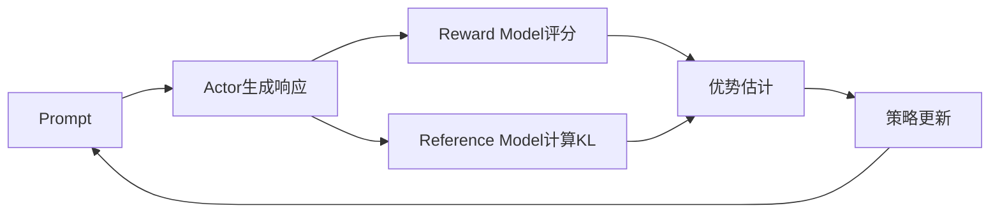

# veRL

veRL是字节跳动开源的大模型强化学习训练框架，专注于RLHF（Reinforcement Learning from Human Feedback）和基于强化学习的模型对齐训练。

为什么需要专门的RLHF框架？因为RLHF的工程复杂度远超普通的SFT微调。一次训练过程中，你需要同时维护四个模型（Actor、Critic、Reward Model、Reference Model），它们之间有复杂的数据流交互，还要在多张GPU上合理分配显存。如果手写这套流程，光是协调四个模型的显存分配就够头疼的了。veRL把这些工程细节封装好，让你专注于算法和奖励设计。

## 概述

veRL的设计目标是提供一个高效、灵活的大模型强化学习训练解决方案。与传统的RLHF实现相比，veRL强调：

- **效率**：优化的Actor-Critic架构，减少通信开销
- **灵活性**：支持多种RL算法（PPO、GRPO、ReMax等）
- **可扩展性**：支持大规模分布式训练
- **易用性**：简洁的API设计

### 核心架构

```
veRL架构
├── Actor（策略模型）
│   └── 生成响应，更新策略
├── Critic（价值模型）
│   └── 估计状态价值
├── Reward Model（奖励模型）
│   └── 评估响应质量
└── Reference Model（参考模型）
    └── 计算KL散度约束
```

## 安装

```bash
pip install verl

# 或从源码安装
git clone https://github.com/volcengine/verl.git
cd verl
pip install -e .
```

## 核心概念

### 数据流

veRL中的RLHF训练数据流：



### 角色分离

veRL采用角色分离的设计，各模型可以独立部署和扩展：

```python
from verl import DataProto

# 数据协议定义
batch = DataProto(
    prompts=prompts,          # 输入提示
    responses=responses,       # 生成的响应
    attention_mask=mask,
    rewards=rewards,           # 奖励信号
    advantages=advantages,     # 优势估计
    old_log_probs=old_logp,   # 旧策略概率
)
```

## 训练流程

### 配置示例

```yaml
# config.yaml
actor:
  model_path: "Qwen/Qwen2-7B-Instruct"
  learning_rate: 1e-6
  ppo_epochs: 4
  
critic:
  model_path: "Qwen/Qwen2-7B-Instruct"
  learning_rate: 5e-6
  
reward_model:
  model_path: "path/to/reward_model"
  
training:
  batch_size: 128
  rollout_batch_size: 256
  kl_coef: 0.1
  clip_range: 0.2
  gamma: 1.0
  gae_lambda: 0.95
```

### PPO训练

```python
from verl import PPOTrainer
from verl.utils.config import Config

config = Config.from_yaml("config.yaml")
trainer = PPOTrainer(config)

# 训练循环
for iteration in range(num_iterations):
    # 1. 采集rollout
    rollouts = trainer.collect_rollouts(prompts)
    
    # 2. 计算奖励
    rewards = trainer.compute_rewards(rollouts)
    
    # 3. 计算优势
    advantages = trainer.compute_advantages(rollouts, rewards)
    
    # 4. 更新策略
    trainer.update_policy(rollouts, advantages)
    
    # 5. 更新价值函数
    trainer.update_value_function(rollouts)
```

### GRPO训练

veRL支持Group Relative Policy Optimization（GRPO），这是一种不需要Critic模型的轻量级替代方案。在实际中这意味着什么？少维护一个模型，显存压力小很多，特别适合显存有限的场景：

```python
from verl import GRPOTrainer

trainer = GRPOTrainer(config)

# GRPO不需要Critic模型
# 通过组内相对排序估计优势
for iteration in range(num_iterations):
    # 对每个prompt生成多个响应
    rollouts = trainer.collect_group_rollouts(prompts, group_size=4)
    
    # 组内相对排序
    advantages = trainer.compute_group_advantages(rollouts)
    
    # 更新策略
    trainer.update_policy(rollouts, advantages)
```

## 分布式训练

### Ray集成

veRL使用Ray进行分布式编排：

```python
import ray
from verl.trainer.ppo_trainer import RayPPOTrainer

ray.init()

trainer = RayPPOTrainer.remote(config)

# 分布式训练
result = ray.get(trainer.train.remote())
```

### 资源配置

```yaml
# 分布式配置
distributed:
  actor_tp: 2           # Actor张量并行
  critic_tp: 2          # Critic张量并行
  num_rollout_workers: 4
  num_update_workers: 2
```

## 奖励模型

### 使用预训练奖励模型

```python
from verl.models.reward_model import RewardModel

reward_model = RewardModel.from_pretrained("path/to/rm")

def compute_rewards(responses, prompts):
    inputs = [f"{p}\n{r}" for p, r in zip(prompts, responses)]
    rewards = reward_model(inputs)
    return rewards
```

### 规则奖励

支持自定义规则奖励函数。在实际项目中，纯奖励模型往往不够用——你可能还希望模型的回答不要太长、符合特定格式、或者不包含敏感词。这时候可以用规则奖励来补充：

```python
def rule_based_reward(response: str) -> float:
    reward = 0.0
    
    # 长度惩罚
    if len(response) > 1000:
        reward -= 0.5
    
    # 格式奖励
    if response.startswith("答案："):
        reward += 0.2
    
    return reward
```

### 多奖励组合

```python
def combined_reward(response, prompt):
    rm_reward = reward_model(prompt, response)
    rule_reward = rule_based_reward(response)
    
    # 加权组合
    return 0.8 * rm_reward + 0.2 * rule_reward
```

## 高级功能

### KL约束

```python
# KL散度惩罚
kl_penalty = compute_kl_divergence(
    new_log_probs,
    old_log_probs,
    ref_log_probs
)

loss = policy_loss - config.kl_coef * kl_penalty
```

### 值函数基线

```python
# GAE优势估计
advantages = compute_gae(
    rewards=rewards,
    values=values,
    gamma=config.gamma,
    gae_lambda=config.gae_lambda
)

# 归一化
advantages = (advantages - advantages.mean()) / (advantages.std() + 1e-8)
```

### 梯度累积

```python
for micro_batch in split_batch(batch, config.gradient_accumulation):
    loss = compute_loss(micro_batch)
    loss = loss / config.gradient_accumulation
    loss.backward()

optimizer.step()
optimizer.zero_grad()
```

## 与其他框架对比

| 特性 | veRL | TRL | OpenRLHF |
|-----|------|-----|----------|
| 分布式支持 | Ray | Accelerate | Ray |
| 算法 | PPO/GRPO/ReMax | PPO/DPO | PPO/DPO |
| 显存优化 | 好 | 中等 | 好 |
| 易用性 | 中等 | 好 | 中等 |
| 大规模训练 | 好 | 一般 | 好 |

## 最佳实践

### 超参数调优

```yaml
# 推荐起始配置
ppo:
  clip_range: 0.2          # PPO裁剪范围
  kl_coef: 0.1             # KL系数，可自适应
  entropy_coef: 0.01       # 熵正则化
  
training:
  actor_lr: 1e-6           # Actor学习率（小）
  critic_lr: 5e-6          # Critic学习率（稍大）
  warmup_ratio: 0.1        # 预热比例
```

### 训练稳定性

```python
# 奖励归一化
rewards = (rewards - rewards.mean()) / (rewards.std() + 1e-8)

# 梯度裁剪
torch.nn.utils.clip_grad_norm_(model.parameters(), max_norm=1.0)

# 早停
if kl_divergence > config.max_kl:
    break
```

### 监控指标

训练过程中需要关注：
- **KL散度**：策略偏离程度
- **奖励均值/方差**：奖励信号质量
- **策略熵**：探索程度
- **优势估计方差**：训练稳定性

veRL为大模型强化学习训练提供了高效的解决方案。通过合理的架构设计和优化，它能够支持百亿参数级模型的RLHF训练。对于刚接触RLHF的团队，建议先用GRPO起步——不需要Critic模型，显存压力小，调试也更容易。等熟悉了整个流程后，再尝试完整的PPO训练也不迟。
