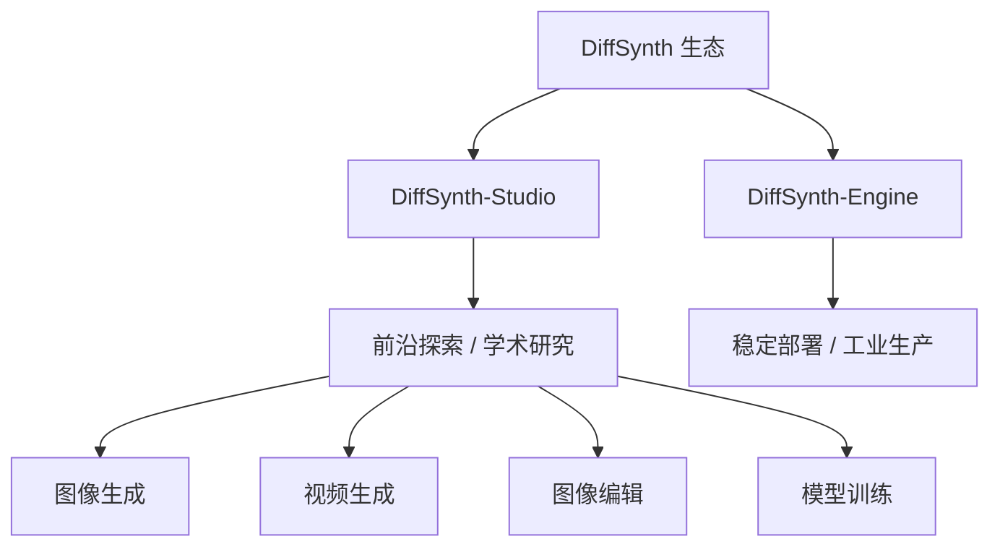
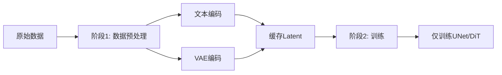

# DiffSynth-Studio：视觉生成引擎

DiffSynth-Studio是魔搭社区团队开发的开源Diffusion模型引擎，覆盖图像生成、图像编辑、视频生成等视觉合成任务。它不只是一个推理工具——从模型加载、显存调度到LoRA训练，整条链路都做了系统性封装。



DiffSynth生态分为两条线：**DiffSynth-Studio**面向学术与技术探索，快速跟进前沿模型；**DiffSynth-Engine**面向工业部署，优先保证性能和稳定性。两者共同构成魔搭社区AIGC专区的核心引擎。

## 架构设计

多数扩散模型框架把重心放在推理流程上，DiffSynth-Studio的野心更大——它把显存管理、模型结构、训练流程作为三个独立可插拔的模块来设计。

### 显存管理

扩散模型的显存问题非常突出。以Stable Diffusion XL为例，仅模型权重就占用约6.5GB，加上UNet推理时的中间激活值、VAE解码、文本编码器，轻松突破12GB。在消费级GPU上跑高分辨率生图几乎不可能——除非框架层面做精细管理。

DiffSynth-Studio 2.0引入了**Layer级别的Disk Offload**机制。传统offload把整个模型在GPU和CPU之间搬运，粒度太粗。Layer级别offload的思路是：推理到哪一层，就把那一层加载到GPU，其余层卸载到CPU甚至磁盘。这同时释放了内存和显存，使得在8GB显存的GPU上也能运行大型模型。

```python
import torch
from diffsynth import ModelManager, FluxImagePipeline

# 加载模型，启用显存优化
model_manager = ModelManager(
    torch_dtype=torch.bfloat16,
    device="cuda"
)
model_manager.load_models(
    ["models/FLUX/flux1-dev.safetensors"],
    torch_dtype=torch.bfloat16
)

pipe = FluxImagePipeline.from_model_manager(model_manager)

# 生成图像
image = pipe(
    prompt="A cat sitting on a windowsill, golden hour light, film grain",
    num_inference_steps=20,
    height=1024, width=1024
)
image.save("output.png")
```

### 支持的模型

DiffSynth-Studio覆盖了主流的扩散模型架构：

| 模型 | 类型 | 特点 | 训练支持 |
|------|------|------|---------|
| FLUX.2 | 文生图 | 高质量图像，支持4B/9B/dev多版本 | ✓ |
| Qwen-Image | 文生图/编辑 | 通义系列，支持ControlNet、EliGen | ✓ |
| Wan 2.1/2.2 | 文生视频 | 1.3B/14B，支持图生视频、视频续写 | ✓ |
| LTX-2 | 音视频生成 | 音频驱动视频、音视频联合生成 | ✓ |
| Z-Image | 文生图 | 含Turbo版本，快速生成 | ✓ |
| Stable Diffusion 3 | 文生图 | MMDiT架构 | ✓ |
| MOVA | 视频生成 | 360p/720p多分辨率 | ✓ |

这些模型不只是"能跑推理"——DiffSynth-Studio为每个模型都实现了完整的训练链路，包括全量微调和LoRA训练。

## 安装

```bash
pip install diffsynth

# 或从源码安装（推荐开发者使用）
git clone https://github.com/modelscope/DiffSynth-Studio.git
cd DiffSynth-Studio
pip install -e .
```

## 训练框架

DiffSynth-Studio的训练模块做了三项关键优化，每一项都直接影响实际可用性。

### 拆分训练（Split Training）

扩散模型训练中，文本编码器和VAE编码器不需要梯度回传——它们只负责把文本和图像转换成latent表示。传统做法是每个训练步骤都跑一遍这些编码器，白白占用显存和计算。

拆分训练把流程自动切成两个阶段：



阶段1处理所有样本的编码工作并缓存结果，阶段2只训练核心去噪网络。这不只是加速——显存峰值大幅降低，因为训练阶段不再需要同时加载编码器。训练ControlNet或其他附加模块时同样适用。

### 差分LoRA训练（Differential LoRA）

标准LoRA在基础权重旁边加一对低秩矩阵$A$和$B$，微调时只更新$A$和$B$。差分LoRA的思路不同：它不从零初始化，而是从两个已有模型的权重差异出发。

假设有一个基础模型$W_0$和一个已经微调过的模型$W_1$，两者的差$\Delta W = W_1 - W_0$可以用低秩分解近似：

$$\Delta W \approx BA$$

然后在$BA$的基础上继续训练。好处是训练起点就已经编码了$W_1$的能力，收敛更快，效果更好。这项技术最初在ArtAug项目中提出，现在已经泛化到DiffSynth-Studio中任意模型的LoRA训练。

### FP8训练

训练扩散模型时，并非所有参数都需要高精度。FP8训练把不参与梯度计算的模型（梯度关闭的部分，或只影响LoRA权重的部分）转为FP8格式，显存直接减半。LoRA权重本身依然保持BF16/FP16精度，不影响训练质量。

## 图像编辑

DiffSynth-Studio不只做生成，还支持多种编辑能力。

### Qwen-Image-Edit

基于Qwen-Image训练的编辑模型，支持指令引导的图像修改：

```python
from diffsynth import ModelManager, QwenImageEditPipeline

model_manager = ModelManager(torch_dtype=torch.bfloat16, device="cuda")
model_manager.load_models(["models/Qwen-Image-Edit/model.safetensors"])

pipe = QwenImageEditPipeline.from_model_manager(model_manager)

edited_image = pipe(
    image=original_image,
    prompt="Change the sky to sunset colors"
)
```

### In-Context Editing

一种更有趣的编辑模式：给模型三张图A、B、C，模型分析A到B的变换，然后把同样的变换应用到C生成D。比如A是一张白天的照片，B是同一场景的夜景版本，C是另一张白天照片——模型自动推断"白天→夜景"的变换并应用到C。

### 图层拆分

给定一张图像和一段文本描述，模型把图像中与描述对应的内容拆分成独立图层。这在海报设计、电商场景中很实用——从一张产品图中自动拆出主体、背景、文字等元素。

## 视频生成

DiffSynth-Studio在视频生成方面的支持最为完整，覆盖了Wan系列模型的全部能力。

### 文本到视频

```python
from diffsynth import ModelManager, WanVideoPipeline

model_manager = ModelManager(torch_dtype=torch.bfloat16, device="cuda")
model_manager.load_models([
    "models/Wan2.1/wan2.1_14b.safetensors",
])

pipe = WanVideoPipeline.from_model_manager(model_manager)

video = pipe(
    prompt="A drone flying over a mountain lake at sunrise, cinematic quality",
    num_inference_steps=50,
    num_frames=81,
    height=480, width=832,
)
```

### 图像到视频

以一张静态图作为起始帧，生成动态视频。适合从概念图生成产品展示动画。

### 音频驱动视频

Wan2.2-S2V支持音频驱动的视频生成——输入一段音频，模型生成与音频节奏和情绪匹配的视频内容。LTX-2进一步支持音视频联合生成，实现真正的多模态输出。

## ControlNet与EliGen

精确控制生成结果是实际应用中的刚需。DiffSynth-Studio为Qwen-Image实现了多种控制方案。

### ControlNet

基于轻量化的Blockwise设计，支持六种结构控制条件：

- **Canny**：边缘轮廓控制
- **Depth**：深度图控制
- **Lineart**：线稿控制
- **Softedge**：柔和边缘控制
- **Normal**：法线贴图控制
- **OpenPose**：人体姿态控制

这些控制模型采用In-Context技术路线，通过一个统一的Control-Union模型同时支持多种条件，不需要为每种条件单独加载不同的ControlNet。

### EliGen

EliGen（Element-level Image Generation）支持元素级别的精确控制。EliGen-Poster专为电商海报场景设计，支持精确的分区布局——你可以指定"左侧放产品图、右侧放文案、底部放促销信息"，模型按照分区约束生成。

## 实践示例：LoRA训练

以FLUX模型的LoRA训练为例，展示DiffSynth-Studio的训练流程：

```python
# 准备训练配置
from diffsynth import FluxLoRATrainer

trainer = FluxLoRATrainer(
    pretrained_path="models/FLUX/flux1-dev.safetensors",
    lora_rank=16,
    learning_rate=1e-4,
    train_batch_size=1,
    gradient_accumulation_steps=4,
    max_train_steps=1000,
    output_dir="output/flux_lora",
)

# 加载训练数据
trainer.load_dataset(
    dataset_path="data/my_images/",
    prompt_column="text",
    image_column="image",
    resolution=1024,
)

# 开始训练
trainer.train()
```

训练完成后，加载LoRA权重进行推理：

```python
model_manager.load_lora("output/flux_lora/lora.safetensors", lora_alpha=1.0)

image = pipe(
    prompt="A portrait in the style of my_lora_concept",
    num_inference_steps=20,
)
```

## 相关资源

- 官方仓库：https://github.com/modelscope/DiffSynth-Studio
- 部署引擎：https://github.com/modelscope/DiffSynth-Engine
- 文档中心：https://diffsynth-studio.readthedocs.io
- 魔搭AIGC专区：https://modelscope.cn/aigc/home
