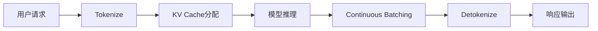

# 推理引擎：vLLM与SGLang

大模型推理的效率直接影响服务成本与用户体验。vLLM和SGLang是两个代表性的高性能推理引擎，它们通过创新的调度和内存管理技术显著提升了推理吞吐量。

为什么不能直接用Transformers库做推理？当然可以，但效率差很多。举个例子：一个7B模型用Transformers原生推理可能每秒生成20个token，而用vLLM可以轻松达到数百甚至上千token/秒的吞吐量。这个差距在生产环境中直接影响服务器成本——推理效率提升10倍，意味着服务器费用可以降到原来的十分之一。

## vLLM

vLLM是UC Berkeley开发的高吞吐量大模型推理引擎，以PagedAttention技术著称。



### 核心技术

**PagedAttention**：将KV Cache按页管理，避免预分配导致的显存浪费。

这里有个很直观的类比：传统方法就像给每个顾客预留一张最大号的桌子，即使他只点了一杯咖啡也占着十人座，大量座位被浪费了。PagedAttention的做法是"按需分配”——小单就给小桌子，大单再加桌子，而且桌子不用连在一起，通过一张"桌号表"就能找到每位顾客的座位。

传统方法需要为每个序列预分配最大长度的连续KV Cache空间，导致显存碎片化。PagedAttention将KV Cache划分为固定大小的块（如16个token），通过块表（Block Table）管理非连续的物理内存：

```text
逻辑视图：[Token 0-15] [Token 16-31] [Token 32-47] ...
              ↓            ↓            ↓
物理块：   Block 7     Block 2     Block 15    ...
```

**Continuous Batching**：动态批处理，新请求无需等待当前批次完成即可加入。

### 安装与基础使用

```bash
pip install vllm
```

**离线推理**：

```python
from vllm import LLM, SamplingParams

# 加载模型
llm = LLM(
    model="Qwen/Qwen2-7B-Instruct",
    tensor_parallel_size=2,    # 张量并行
    gpu_memory_utilization=0.9,
    dtype="bfloat16",
)

# 采样参数
sampling_params = SamplingParams(
    temperature=0.7,
    top_p=0.9,
    max_tokens=256,
)

# 批量推理
prompts = ["Hello, my name is", "The capital of France is"]
outputs = llm.generate(prompts, sampling_params)

for output in outputs:
    print(f"Prompt: {output.prompt}")
    print(f"Generated: {output.outputs[0].text}")
```

**在线服务**：

```bash
# 启动服务器
python -m vllm.entrypoints.openai.api_server \
    --model Qwen/Qwen2-7B-Instruct \
    --tensor-parallel-size 2 \
    --port 8000
```

```python
# 客户端调用（兼容OpenAI API）
from openai import OpenAI

client = OpenAI(base_url="http://localhost:8000/v1", api_key="dummy")

response = client.chat.completions.create(
    model="Qwen/Qwen2-7B-Instruct",
    messages=[{"role": "user", "content": "你好"}],
    max_tokens=100,
)
print(response.choices[0].message.content)
```

### 高级配置

```python
llm = LLM(
    model="model_path",
    
    # 并行配置
    tensor_parallel_size=4,
    pipeline_parallel_size=2,
    
    # 显存管理
    gpu_memory_utilization=0.95,
    max_model_len=8192,
    
    # 量化
    quantization="awq",  # 或 "gptq", "squeezellm"
    
    # KV Cache
    block_size=16,
    swap_space=4,  # CPU交换空间(GB)
    
    # 性能
    enforce_eager=False,  # 使用CUDA Graph
    max_num_seqs=256,     # 最大并发序列数
)
```

### 前缀缓存

对于相同前缀的请求，vLLM支持KV Cache复用：

```python
llm = LLM(model="model", enable_prefix_caching=True)

# 系统提示作为共享前缀
system_prompt = "You are a helpful assistant."
requests = [
    f"{system_prompt}\nUser: Question 1",
    f"{system_prompt}\nUser: Question 2",
]
# 第二个请求会复用系统提示的KV Cache
```

## SGLang

SGLang（Structured Generation Language）专注于结构化生成和复杂推理工作流。

假设你在做一个AI应用，需要模型输出严格的JSON格式，或者先分类再根据分类结果生成不同内容，或者一次调用里连续进行多轮对话。这些"带结构"的推理需求，是SGLang的主场。它不仅做推理加速，还提供了一套编程模型，让你用代码描述复杂的生成流程。

### 核心特性

**RadixAttention**：基于基数树（Radix Tree）的KV Cache管理，高效处理前缀共享。

**结构化生成**：原生支持JSON schema、正则表达式等约束生成。

**编程式API**：支持复杂的生成流程编排。

### 安装与使用

```bash
pip install sglang
```

**启动服务**：

```python
from sglang import RuntimeEndpoint

runtime = RuntimeEndpoint("http://localhost:30000")
```

```bash
# 命令行启动
python -m sglang.launch_server \
    --model-path Qwen/Qwen2-7B-Instruct \
    --port 30000 \
    --tp 2
```

### SGLang编程模型

SGLang提供了一套DSL用于定义复杂的生成流程：

```python
import sglang as sgl

@sgl.function
def multi_turn_qa(s, question1, question2):
    s += sgl.system("You are a helpful assistant.")
    s += sgl.user(question1)
    s += sgl.assistant(sgl.gen("answer1", max_tokens=256))
    s += sgl.user(question2)
    s += sgl.assistant(sgl.gen("answer2", max_tokens=256))

# 执行
state = multi_turn_qa.run(
    question1="What is machine learning?",
    question2="Can you give an example?"
)

print(state["answer1"])
print(state["answer2"])
```

### 结构化输出

```python
@sgl.function
def extract_info(s, text):
    s += sgl.user(f"Extract information from: {text}")
    s += sgl.assistant(
        sgl.gen(
            "result",
            max_tokens=512,
            regex=r'\{"name": "[^"]+", "age": \d+\}'  # 正则约束
        )
    )

# JSON Schema约束
from pydantic import BaseModel

class Person(BaseModel):
    name: str
    age: int
    city: str

@sgl.function
def extract_person(s, text):
    s += sgl.user(f"Extract person info: {text}")
    s += sgl.assistant(sgl.gen("person", json_schema=Person))
```

### 分支与选择

```python
@sgl.function
def routing(s, query):
    s += sgl.user(query)
    
    # 先分类
    s += sgl.assistant(
        "Category: " + sgl.gen("category", choices=["math", "coding", "general"])
    )
    
    # 根据分类生成
    if s["category"] == "math":
        s += sgl.assistant(sgl.gen("answer", max_tokens=512))
    elif s["category"] == "coding":
        s += sgl.assistant("```python\n" + sgl.gen("code", max_tokens=1024) + "\n```")
```

### 批量并行

```python
@sgl.function
def batch_qa(s, questions):
    s += sgl.system("Answer concisely.")
    
    # 并行生成多个答案
    answers = []
    for q in questions:
        s += sgl.user(q)
        s += sgl.assistant(sgl.gen("answer", max_tokens=100))
        answers.append(s["answer"])
    
    return answers
```

## 性能对比

| 特性 | vLLM | SGLang |
|------|------|--------|
| KV Cache管理 | PagedAttention | RadixAttention |
| 前缀缓存 | 支持 | 原生优化 |
| 结构化输出 | 基础支持 | 原生支持 |
| 编程模型 | 简单 | 丰富 |
| API兼容性 | OpenAI | 自定义 |
| 多轮对话优化 | 一般 | 好 |

**选择建议**：
- **vLLM**：追求极致吞吐、需要OpenAI API兼容、简单的生成任务
- **SGLang**：复杂生成流程、结构化输出需求、多轮对话密集场景

## 部署最佳实践

### 显存估算

```python
# 模型权重显存（FP16）
model_memory = num_params * 2  # bytes

# KV Cache显存（每序列）
kv_cache_per_token = 2 * num_layers * hidden_size * 2  # bytes
kv_cache_per_seq = kv_cache_per_token * max_seq_len

# 总显存需求
total = model_memory + kv_cache_per_seq * max_concurrent_seqs
```

上述估算公式的各变量含义如下：

- `num_params`：模型参数量（例如 7B 即 $7 \times 10^9$）；乘以 2 是因为 FP16 每个参数占 2 字节。
- `kv_cache_per_token`：每个 token 的 KV Cache 大小；其中“$2$”分别对应 Key 和 Value 两个缓存，`num_layers` 为 Transformer 层数，`hidden_size` 为隐藏维度，末尾的“$\times 2$”表示 FP16 每个元素 2 字节。
- `kv_cache_per_seq`：单条序列的 KV Cache 总量，等于每 token 缓存量乘以最大序列长度 `max_seq_len`。
- `total`：总显存需求 = 模型权重 + 所有并发序列的 KV Cache 之和。该估算用于判断单卡可承载的最大并发数，即 $\text{max\_seqs} = (\text{GPU\_mem} - \text{model\_memory}) / \text{kv\_cache\_per\_seq}$。

### 并发配置

```bash
# 根据显存调整并发数
# 7B模型，80GB GPU
python -m vllm.entrypoints.openai.api_server \
    --model model_path \
    --max-num-seqs 256 \
    --gpu-memory-utilization 0.95
```

### 多卡部署

```bash
# 张量并行（单请求延迟优化）
--tensor-parallel-size 4

# 数据并行（吞吐优化，需要负载均衡）
# 启动多个实例，前置负载均衡器
```

### 量化部署

```bash
# AWQ量化模型
python -m vllm.entrypoints.openai.api_server \
    --model TheBloke/Llama-2-7B-AWQ \
    --quantization awq
```

## 监控与调优

### 关键指标

- **TTFT**（Time to First Token）：首token延迟
- **TPOT**（Time per Output Token）：单token生成时间
- **吞吐量**：tokens/second
- **并发数**：同时处理的请求数
- **队列长度**：等待处理的请求数

### Prometheus监控

vLLM和SGLang都支持Prometheus指标导出：

```bash
# vLLM
--enable-metrics-endpoint

# 指标端点
curl http://localhost:8000/metrics
```

高性能推理引擎是大模型服务化的关键。vLLM和SGLang通过创新的内存管理和调度算法，将单GPU的推理吞吐量提升了数倍。在实际选型时，一个简单的判断标准是：如果你的场景主要是简单的文本生成、需要兼容OpenAI API，选vLLM；如果你需要复杂的结构化输出、多轮对话编排或者动态分支逻辑，SGLang更合适。当然，两者都在快速发展，功能边界在不断模糊，选择时不妨都先跑个benchmark看看。
