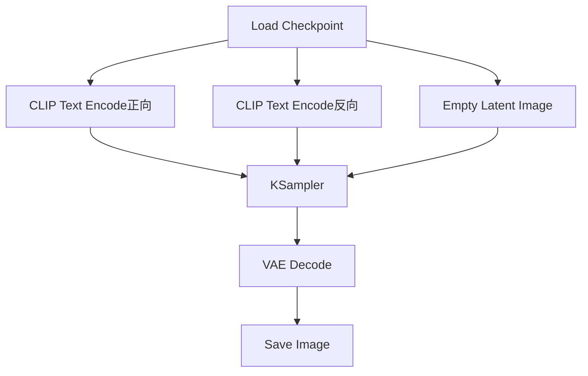

# ComfyUI

ComfyUI是一个基于节点的图像生成工作流工具，通过可视化的方式构建复杂的扩散模型生成流程。

你可能用过Stable Diffusion WebUI这样的一体化工具——填参数、点生成、看结果。但当你想做更复杂的流程时（比如先生成低分辨率图、再用ControlNet控制细节、最后再超分），WebUI就显得力不从心了。ComfyUI的节点化设计让你像搭积木一样把各种操作串起来，要多复杂有多复杂。

## 概述

ComfyUI的设计理念是将图像生成的各个环节（加载模型、编码提示词、采样、解码等）抽象为独立的节点，通过连线组合实现灵活的工作流定制。它的好处是"透明"——你能清清楚楚看到数据从哪来、经过了什么处理、到哪去，而不是一个黑箱。这对于理解和调试复杂的生成流程非常有帮助。

### 核心优势

- **可视化工作流**：清晰呈现生成过程的每个环节
- **灵活组合**：任意组合节点实现复杂流程
- **高效执行**：智能缓存，只重算变化的部分
- **社区生态**：丰富的自定义节点插件

## 安装

```bash
git clone https://github.com/comfyanonymous/ComfyUI.git
cd ComfyUI
pip install -r requirements.txt

# 启动
python main.py
# 访问 http://127.0.0.1:8188
```

### 模型放置

```
ComfyUI/
├── models/
│   ├── checkpoints/     # 主模型 (.safetensors)
│   ├── vae/            # VAE模型
│   ├── loras/          # LoRA权重
│   ├── controlnet/     # ControlNet模型
│   ├── clip/           # CLIP模型
│   └── embeddings/     # Textual Inversion
```

## 核心节点

下图展示了ComfyUI基础文生图工作流中各节点的连接关系：



### 基础文生图流程

```
[Load Checkpoint] → [CLIP Text Encode (Positive)]
        ↓                      ↓
        ↓              [CLIP Text Encode (Negative)]
        ↓                      ↓
        → [KSampler] ←←←←←←←←←←
              ↓
        [VAE Decode]
              ↓
        [Save Image]
```

**Load Checkpoint**：加载Stable Diffusion模型
- 输出：MODEL, CLIP, VAE

**CLIP Text Encode**：将文本提示词编码为条件
- 输入：CLIP, text
- 输出：CONDITIONING

**KSampler**：执行采样过程
- 输入：model, positive, negative, latent_image
- 参数：seed, steps, cfg, sampler_name, scheduler
- 输出：LATENT

**VAE Decode**：将潜空间解码为图像
- 输入：samples, vae
- 输出：IMAGE

### 常用节点

| 节点 | 功能 |
|-----|------|
| Empty Latent Image | 创建空白潜空间 |
| Load Image | 加载图片 |
| VAE Encode | 图片编码到潜空间 |
| Load LoRA | 加载LoRA权重 |
| Load ControlNet Model | 加载ControlNet |
| Apply ControlNet | 应用ControlNet控制 |
| Upscale Latent | 潜空间放大 |
| Image Scale | 图像缩放 |

## 高级工作流

### 图生图（img2img）

```
[Load Image] → [VAE Encode] → [KSampler] → [VAE Decode]
                                  ↑
                    [Load Checkpoint] + [CLIP Encode]
```

设置KSampler的denoise参数控制改变程度（0-1）。

### ControlNet控制

```
[Load ControlNet Model]
         ↓
[Apply ControlNet] ← [Canny Edge Detection] ← [Load Image]
         ↓
    [KSampler]
```

### 多LoRA叠加

```
[Load Checkpoint] → [Load LoRA (style)] → [Load LoRA (character)] → ...
```

### 高清修复

```
KSampler → VAE Decode → Upscale → VAE Encode → KSampler → VAE Decode
 (低分辨率)              (放大)                  (高清重绘)
```

## 自定义节点

ComfyUI支持通过Python扩展自定义节点：

```python
class MyCustomNode:
    @classmethod
    def INPUT_TYPES(cls):
        return {
            "required": {
                "image": ("IMAGE",),
                "strength": ("FLOAT", {"default": 1.0, "min": 0.0, "max": 2.0}),
            }
        }
    
    RETURN_TYPES = ("IMAGE",)
    FUNCTION = "process"
    CATEGORY = "custom"
    
    def process(self, image, strength):
        # 处理逻辑
        result = image * strength
        return (result,)

NODE_CLASS_MAPPINGS = {"MyCustomNode": MyCustomNode}
```

### ComfyUI Manager

推荐安装ComfyUI Manager来管理扩展：

```bash
cd ComfyUI/custom_nodes
git clone https://github.com/ltdrdata/ComfyUI-Manager.git
```

常用扩展：
- **ComfyUI-Impact-Pack**：人脸检测、分割等
- **ComfyUI-AnimateDiff**：视频生成
- **ComfyUI-VideoHelperSuite**：视频处理工具
- **ComfyUI-ControlNet-Auxiliary**：预处理器集合

## 工作流管理

### 保存与加载

工作流以JSON格式保存，可以：
- 通过UI保存/加载
- 直接编辑JSON文件
- 从PNG图片中提取（元数据）

### API调用

```python
import json
import requests

# 加载工作流
with open("workflow.json") as f:
    workflow = json.load(f)

# 修改参数
workflow["3"]["inputs"]["seed"] = 12345
workflow["6"]["inputs"]["text"] = "a beautiful sunset"

# 提交任务
response = requests.post(
    "http://127.0.0.1:8188/prompt",
    json={"prompt": workflow}
)
```

### 批量处理

```python
import websocket
import json

ws = websocket.WebSocket()
ws.connect("ws://127.0.0.1:8188/ws")

for prompt in prompts:
    workflow["6"]["inputs"]["text"] = prompt
    
    # 发送任务
    requests.post("http://127.0.0.1:8188/prompt", json={"prompt": workflow})
    
    # 等待完成
    while True:
        msg = json.loads(ws.recv())
        if msg["type"] == "executed":
            break
```

## 性能优化

### 显存管理

```bash
# 低显存模式
python main.py --lowvram

# CPU卸载
python main.py --cpu

# 指定显卡
python main.py --cuda-device 1
```

### 缓存利用

ComfyUI自动缓存中间结果。这是它相比WebUI的一大优势——当你只改了提示词而模型和参数都没变时，它不会重新加载模型，只重算变化的部分。优化工作流时：
- 不变的节点结果会被缓存
- 只有依赖变化节点的部分会重算
- 合理组织工作流可以大幅提升迭代速度

### 队列管理

```python
# 查看队列
requests.get("http://127.0.0.1:8188/queue")

# 清空队列
requests.post("http://127.0.0.1:8188/queue", json={"clear": True})
```

## 典型应用场景

- **角色一致性生成**：结合LoRA和ControlNet
- **风格迁移**：使用IP-Adapter等节点
- **视频生成**：AnimateDiff工作流
- **图像修复**：Inpainting工作流
- **超分辨率**：结合Upscale模型

ComfyUI的节点化设计使其成为探索和定制图像生成流程的强大工具。从简单的文生图到复杂的多阶段工作流，ComfyUI都能提供直观且灵活的解决方案。对于初学者，建议从社区分享的工作流开始——直接加载别人分享的JSON文件，看懂每个节点的作用，然后在其基础上修改，这比从零搭建要快得多。
