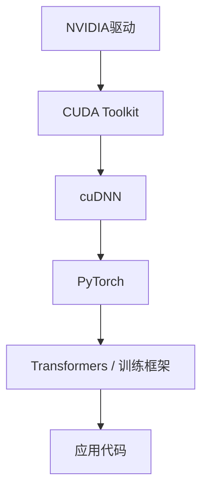

# GPU环境配置与使用

NVIDIA GPU是当前大模型训练与推理的主流硬件平台。本节介绍 GPU环境的配置方法和最佳实践。

对于刚接触大模型的开发者，环境配置往往是第一个“坎”——驱动版本、CUDA版本、PyTorch版本三者之间的兼容性问题能让人折腾大半天。本节的目标是帮你理清这些关系，少踩坑。

## 硬件选型

### 主流GPU规格

| GPU | 显存 | FP16算力 | NVLink | 适用场景 |
|-----|------|---------|--------|---------|
| RTX 4090 | 24GB | 330 TFLOPS | 无 | 开发、小模型训练 |
| A100 40GB | 40GB | 312 TFLOPS | 600GB/s | 训练、推理 |
| A100 80GB | 80GB | 312 TFLOPS | 600GB/s | 大模型训练 |
| H100 SXM | 80GB | 1979 TFLOPS | 900GB/s | 旗舰训练 |
| H200 | 141GB | 1979 TFLOPS | 900GB/s | 超大模型 |
| A10 | 24GB | 125 TFLOPS | 无 | 推理部署 |
| L40S | 48GB | 362 TFLOPS | 无 | 训练/推理 |

### 显存需求估算

```python
def estimate_memory(model_params_b, precision="fp16"):
    """估算模型显存需求（单位：GB）"""
    bytes_per_param = {"fp32": 4, "fp16": 2, "bf16": 2, "int8": 1, "int4": 0.5}
    
    # 模型权重
    model_memory = model_params_b * bytes_per_param[precision]
    
    # 训练额外开销（优化器状态、梯度等）
    training_overhead = {
        "fp32": 16,  # 权重 + 梯度 + 优化器
        "fp16": 18,  # 混合精度
        "bf16": 18,
    }
    
    return {
        "inference": model_memory,
        "training": model_params_b * training_overhead.get(precision, 18)
    }

# 示例：7B模型
print(estimate_memory(7))
# {'inference': 14.0, 'training': 126.0}
```

上述估算函数中，`model_params_b` 为模型参数量（单位：十亿 / Billion），`precision` 为精度类型。推理显存的计算为 $\text{model\_memory} = \text{params} \times \text{bytes\_per\_param}$，例如 7B 模型在 FP16 下为 $7 \times 2 = 14$ GB。训练显存还需额外包含梯度（与权重等大）及优化器状态（Adam 需保存一阶/二阶矩，各占 4 字节），因此混合精度训练每个参数约需 18 字节，即 7B 模型约需 $7 \times 18 = 126$ GB。

## 驱动与CUDA安装

GPU环境的软件依赖栈从底层到上层如下：



### 驱动安装

```bash
# Ubuntu
# 方式1：apt安装
sudo apt update
sudo apt install nvidia-driver-535

# 方式2：runfile安装
wget https://us.download.nvidia.com/XFree86/Linux-x86_64/535.154.05/NVIDIA-Linux-x86_64-535.154.05.run
chmod +x NVIDIA-Linux-x86_64-535.154.05.run
sudo ./NVIDIA-Linux-x86_64-535.154.05.run

# 验证
nvidia-smi
```

### CUDA Toolkit安装

```bash
# 下载并安装CUDA 12.1
wget https://developer.download.nvidia.com/compute/cuda/12.1.0/local_installers/cuda_12.1.0_530.30.02_linux.run
sudo sh cuda_12.1.0_530.30.02_linux.run

# 环境变量
export PATH=/usr/local/cuda-12.1/bin:$PATH
export LD_LIBRARY_PATH=/usr/local/cuda-12.1/lib64:$LD_LIBRARY_PATH

# 验证
nvcc --version
```

### cuDNN安装

```bash
# 从NVIDIA下载cuDNN
tar -xvf cudnn-linux-x86_64-8.9.7.29_cuda12-archive.tar.xz
sudo cp cudnn-*-archive/include/cudnn*.h /usr/local/cuda/include
sudo cp -P cudnn-*-archive/lib/libcudnn* /usr/local/cuda/lib64
sudo chmod a+r /usr/local/cuda/include/cudnn*.h /usr/local/cuda/lib64/libcudnn*
```

## PyTorch环境

### 安装

```bash
# 使用pip
pip install torch torchvision torchaudio --index-url https://download.pytorch.org/whl/cu121

# 使用conda
conda install pytorch torchvision torchaudio pytorch-cuda=12.1 -c pytorch -c nvidia

# 验证
python -c "import torch; print(torch.cuda.is_available())"
```

### 多GPU配置

```python
import torch

# 查看可用GPU
print(torch.cuda.device_count())  # GPU数量
print(torch.cuda.get_device_name(0))  # GPU名称

# 指定GPU
device = torch.device("cuda:0")
model = model.to(device)

# 环境变量指定可见GPU
# CUDA_VISIBLE_DEVICES=0,1,2,3 python train.py
```

## 性能优化

### 混合精度训练

```python
from torch.cuda.amp import autocast, GradScaler

scaler = GradScaler()

for batch in dataloader:
    optimizer.zero_grad()
    
    with autocast():
        output = model(batch)
        loss = criterion(output, target)
    
    scaler.scale(loss).backward()
    scaler.step(optimizer)
    scaler.update()
```

### 梯度检查点

```python
from torch.utils.checkpoint import checkpoint

class CheckpointedModel(nn.Module):
    def forward(self, x):
        # 对显存密集的层使用检查点
        x = checkpoint(self.layer1, x)
        x = checkpoint(self.layer2, x)
        return x
```

### 内存优化

```python
# 清理缓存
torch.cuda.empty_cache()

# 设置内存分配器
import os
os.environ['PYTORCH_CUDA_ALLOC_CONF'] = 'max_split_size_mb:128'

# 禁用cudnn benchmark（节省内存但可能降速）
torch.backends.cudnn.benchmark = False
```

## 监控与调试

### nvidia-smi使用

```bash
# 实时监控
watch -n 1 nvidia-smi

# 详细信息
nvidia-smi -q

# 进程列表
nvidia-smi pmon -i 0

# 指定格式输出
nvidia-smi --query-gpu=name,memory.used,memory.total,utilization.gpu --format=csv
```

### PyTorch内存分析

```python
# 内存快照
print(torch.cuda.memory_summary())

# 内存分配跟踪
torch.cuda.memory._record_memory_history()
# ... 运行代码 ...
torch.cuda.memory._dump_snapshot("memory_snapshot.pickle")
```

### CUDA错误调试

```bash
# 启用同步执行（定位错误位置）
CUDA_LAUNCH_BLOCKING=1 python train.py

# 检查内存泄漏
compute-sanitizer --tool memcheck python train.py
```

## 多卡训练

### DataParallel

```python
# 简单但效率较低
model = nn.DataParallel(model)
```

### DistributedDataParallel

```python
import torch.distributed as dist
from torch.nn.parallel import DistributedDataParallel as DDP

# 初始化
dist.init_process_group(backend='nccl')
local_rank = int(os.environ['LOCAL_RANK'])

# 设置设备
torch.cuda.set_device(local_rank)
model = model.cuda(local_rank)
model = DDP(model, device_ids=[local_rank])

# 启动
# torchrun --nproc_per_node=4 train.py
```

### NCCL配置

```bash
# 环境变量
export NCCL_DEBUG=INFO
export NCCL_IB_DISABLE=0  # 启用InfiniBand
export NCCL_NET_GDR_LEVEL=2  # GPU Direct RDMA

# 多机通信
export MASTER_ADDR=192.168.1.1
export MASTER_PORT=29500
```

## Docker环境

```dockerfile
FROM nvidia/cuda:12.1.0-cudnn8-devel-ubuntu22.04

# 安装Python
RUN apt-get update && apt-get install -y python3 python3-pip

# 安装PyTorch
RUN pip3 install torch torchvision torchaudio --index-url https://download.pytorch.org/whl/cu121

# 安装其他依赖
COPY requirements.txt .
RUN pip3 install -r requirements.txt
```

```bash
# 运行容器
docker run --gpus all -it my-image

# 指定GPU
docker run --gpus '"device=0,1"' -it my-image
```

## 常见问题

### CUDA版本不匹配

这是最常见的问题，也是新手最容易踩的坑。关键要理解：PyTorch自带的CUDA runtime和系统安装的CUDA Toolkit是两回事。`torch.version.cuda`显示的是PyTorch编译时用的版本，只要驱动版本足够新就能向下兼容。真正需要关注的是`nvidia-smi`显示的驱动CUDA版本要大于等于PyTorch要求的版本：

```bash
# 检查PyTorch CUDA版本
python -c "import torch; print(torch.version.cuda)"

# 检查系统CUDA版本
nvcc --version

# 解决：安装匹配版本的PyTorch
```

### 显存不足

这是第二常见的问题，解决思路是分层递进的——先试最简单的方法，不行再上更复杂的：

```python
# 减小batch size
# 使用梯度累积
# 使用混合精度
# 使用梯度检查点
# 使用DeepSpeed ZeRO
```

### 多卡通信失败

多卡训练时的通信问题通常与NCCL配置有关。排查时先开启详细日志，看报错出在哪一步：

```bash
# 检查NCCL
NCCL_DEBUG=INFO python -c "import torch.distributed"

# 检查网络
# 确保所有节点可以互相访问指定端口
```

NVIDIA GPU生态的成熟度使其成为大模型开发的首选平台。熟练掌握环境配置与性能优化技巧，可以充分发挥硬件性能，提升开发效率。一个实用建议：如果你经常需要配环境，考虑用Docker或conda来管理不同的CUDA版本组合——这比在系统层面反复安装卸载安全得多。
